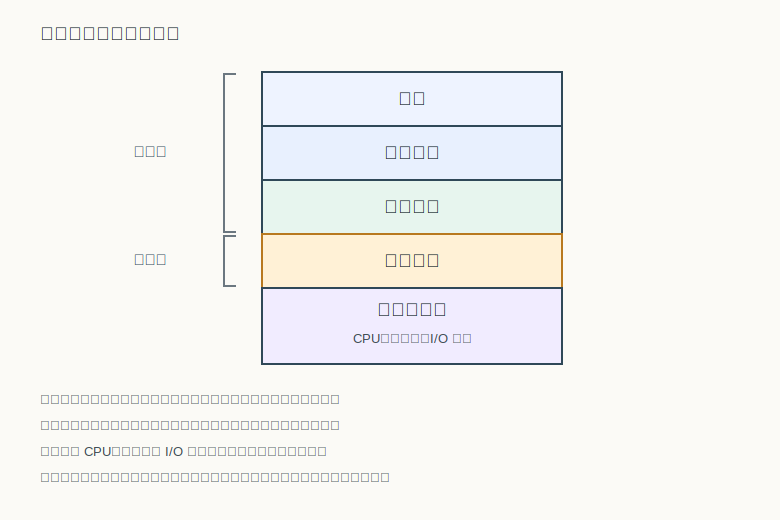
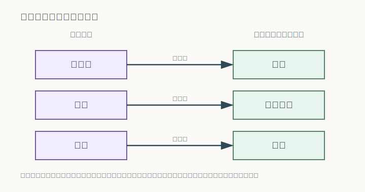

# 第 1 章：操作系统的概念与角色

## 学习目标

- 说出计算机系统的层次结构，并指出操作系统处在哪一层、为什么既面向用户又面向硬件。
- 用“扩展机”和“资源管理者”两个视角解释操作系统是什么，并把抽象、虚拟、复用、保护对应到这两条线索上。
- 从资源管理、控制执行、提供接口三个方向概括操作系统的功能，并说明它的主要目标。
- 区分并发与并行，并解释共享、异步、虚拟三个特征分别解决或带来什么问题。

## 开篇问题

在一台只有一个 CPU 的个人电脑上，你可以一边用浏览器看网页，一边放音乐，一边在编辑器里打字，它们看起来在“同时”运行。可是一个 CPU 在任一时刻只能执行一条指令流——它们怎么可能真的同时进行？与此同时，你几乎从不需要亲自去告诉磁盘“请移动到第几磁道第几扇区”，也不必关心内存条上某个电容存的是 0 还是 1。

这两件看似无关的事情，背后是同一个软件在起作用。它制造了“同时运行”的错觉，也替我们隐藏了硬件的繁琐细节。这个软件就是操作系统。本章要回答的，正是它到底处在什么位置、是什么、做什么，以及它有哪些贯穿全书的基本特征。

## 本章地图

我们先把操作系统放回计算机系统的层次结构里，弄清它“在哪里”。接着从两个互补的视角回答它“是什么”：对上，它是一台更好用的扩展机；对下，它是有限硬件资源的管理者。然后我们概括它“做什么”——功能与目标。最后引出并发、共享、异步、虚拟这四个基本特征。这四个特征只是先在这里建立直觉，它们带来的协调难题，要等到学习进程管理与并发控制时才能拿到真正的解决工具。

## 正文

### 1.1 操作系统在计算机系统中的位置

一台计算机不是只有硬件就能用的。在裸硬件之上，依次叠着操作系统、系统程序、应用程序，最上面才是使用计算机的人。每一层只依赖下一层提供的能力，而把更下层的复杂性挡在外面。

这张分层图回答了一个容易被忽略的问题：操作系统为什么“两头不靠岸”。往上看，<u>用户态</u>的应用程序运行在它之上，把它当作可以请求服务的平台；往下看，它紧贴硬件，掌握着直接操作 CPU、存储器和 I/O 设备的特权。正因为它夹在中间，应用程序才不必、也不能越过它去直接摆弄硬件。

> **思维停顿**：为什么要分层？因为分层让每一层只面对下一层的抽象接口，而不必关心更底层是怎么实现的——换了硬件，上层程序也能基本不变。

### 1.2 操作系统是什么：扩展机与资源管理者

“操作系统是什么”有两个标准答案，它们不是互相竞争，而是同一件事的两面。

第一个答案是**扩展机（extended machine）**视角。裸硬件难用且危险：寄存器、磁道扇区、设备寄存器都要求程序员精确操作。操作系统在硬件之上加了一层抽象，把难用的物理资源包装成好用的逻辑对象。

如图所示，处理器被抽象为进程，存储被抽象为虚拟存储，设备被抽象为文件。于是程序员面对的是“创建一个进程”“读一个文件”，而不是“给某号设备寄存器写一个命令字”。从这个角度看，操作系统提供的是一台比裸机更好用的<u>虚拟机器</u>。

第二个答案是**资源管理者（resource manager）**视角。处理器、内存、设备都是有限的，多个程序却都想用。操作系统的另一项职责，就是决定谁在什么时候用哪份资源、用多久，并防止一个程序破坏另一个程序，从而让有限资源被安全地复用。

> **核心判断**：操作系统定义常从“扩展机器/抽象与虚拟”和“资源管理/保护与复用”两条线展开——前者强调向上隐藏硬件细节，后者强调向下统一调度并保护资源。

### 1.3 操作系统做什么：功能与目标

把两个视角落到具体职责上，操作系统的功能可以从资源管理、控制执行、提供接口三个方向来概括。

| 功能方向 | 主要职责 | 典型体现 |
|---|---|---|
| 资源管理 | 分配与回收处理器、内存、设备等有限资源 | 处理器调度、内存分配、设备管理 |
| 控制执行 | 控制程序的执行过程与状态切换 | 创建与调度进程、处理中断和异常 |
| 提供接口 | 给用户和程序提供使用计算机的方式 | 命令接口、图形界面、系统调用接口 |

这些功能服务于一组目标。在不同教材里，这组目标常被表述为 ==方便用户、提升机器能力、提高运行效率、提供开放环境==。其中“方便用户”和“提供开放环境”更贴近扩展机视角，“提升机器能力”和“提高运行效率”更贴近资源管理者视角——可见功能与目标，还是落在前一节那两条线索上。

### 1.4 操作系统的四个基本特征

并发、共享、异步、虚拟，是操作系统最常被一起提到的四个基本特征。它们彼此关联：并发是源头，共享随之而来，异步是并发共享的表现，虚拟则是应对之道。

先看并发。在<u>单处理器</u>上，多个程序并不能在同一时刻真正一起跑，操作系统让它们快速轮流占用 CPU，于是它们在同一时间间隔内都在向前推进。这就是并发。只有当硬件提供多个处理单元时，多个程序才可能在同一时刻真正同时执行，那叫并行。

| 概念 | 关注点 | 常见误区 |
|---|---|---|
| 并发 | 同一时间间隔内多个活动都在推进 | 误以为是同一时刻真正同时执行 |
| 并行 | 同一时刻多个活动真正同时执行 | 忽略它需要多个处理单元支持 |

二者的关系可以一句话点破：==并行是并发的特例==。

并发之后是共享与异步。多个程序并发执行，就要共享同一批资源；而由于谁先谁后、何时被打断都不确定，程序的推进就带上了不确定性。

> **核心判断**：共享分为互斥访问和同时访问，异步性来自任务推进与事件发生的不确定性。

像打印机这样的资源一次只能给一个程序用，属于互斥访问；像只读的代码段或某些文件可以被多个程序同时读取，属于同时访问。无论哪种，程序都无法假设自己独占资源、也无法假设自己一口气跑完，这正是异步性的来源。

最后是虚拟。虚拟就是用某种技术，把一个物理实体变成多个逻辑上的对应物，或者反过来（例如磁盘阵列 RAID 把多块磁盘虚拟成一块更大的逻辑磁盘）。它可以体现在虚拟内存、多道程序设计、窗口技术和假脱机等场景：虚拟内存让每个进程都以为自己独占一大片内存，多道程序设计让一个 CPU 表现得像多个，窗口技术让一块屏幕表现为多个工作区。虚拟正是操作系统制造"人人都够用"错觉的手段。

## 例题讲解

**例题：** 在单 CPU 的个人电脑上同时“运行”浏览器、音乐播放器和文本编辑器。请指出这里体现了操作系统的哪些基本特征。

**解答：**

1. **并发**：三个程序在同一时间间隔内交替推进。单 CPU 在同一时刻只执行其中一个，因此这是并发而不是并行。
2. **共享**：它们共享 CPU、内存、声卡等资源。声卡这类设备往往一次只服务一个程序，属于互斥访问；内存等资源则可同时被多方使用。
3. **异步**：每个程序何时获得 CPU、何时被打断并不确定，推进速度不可预知，因此呈现异步性。
4. **虚拟**：每个程序都感觉自己独占一大片内存，这是虚拟内存；让一个 CPU“变成”多个为它们服务，则是多道程序设计带来的虚拟性。

这个例子说明：四个特征不是孤立的标签，而是从“一个 CPU 服务多个程序”这件事里自然长出来的。

## 常见误区

- **把操作系统等同于内核或图形界面。** 操作系统是管理资源、提供抽象的一整套程序；内核是它的核心部分，图形界面只是它众多用户接口中的一种，二者都不能代表操作系统的全部。
- **把并发当成并行。** 并发强调 <u>同一时间间隔内</u> 都在推进，并行强调 <u>同一时刻</u> 真正同时执行；后者需要多个处理单元，单处理器谈不上并行。
- **把“共享”理解成“随便一起用”。** 共享是受控的：互斥访问的资源必须排队，同时访问也要保证彼此不破坏对方的数据，否则并发就会带来错误。

## 本章小结

操作系统处在硬件与应用之间：对上它是一台更好用的扩展机，把处理器、存储、设备抽象成进程、虚拟存储和文件；对下它是有限资源的管理者，负责分配、调度与保护。它的功能可归纳为资源管理、控制执行和提供接口，服务于方便用户、提升机器能力、提高运行效率和提供开放环境等目标。贯穿全书的四个基本特征——并发、共享、异步、虚拟——都源自“一个系统要同时服务多个程序”这件根本的事，它们带来的协调难题，正是后续章节要逐步解决的问题。

## 关键术语

**操作系统（operating system）** 位于硬件与应用之间、管理资源并向上提供抽象的一整套程序。

**扩展机（extended machine）** 把难用的硬件资源抽象成进程、虚拟存储、文件等易用对象后形成的“更好用的机器”视角。

**资源管理者（resource manager）** 把操作系统看作对有限硬件资源进行分配、调度与保护的管理者的视角。

**并发（concurrency）** 多个活动在同一时间间隔内都在推进的性质。

**并行（parallelism）** 多个活动在同一时刻真正同时执行的性质，是并发的特例，需要多个处理单元。

**异步（asynchrony）** 由于推进速度和事件发生时刻不确定，程序执行过程表现出的不可预知性。

**虚拟（virtualization）** 用技术手段把一个物理实体变成多个逻辑对应物（或反之），如虚拟内存、多道程序设计。

## 练习与解答

1. 操作系统的“扩展机”视角和“资源管理者”视角分别强调什么？

   **解答**：扩展机视角强调向上为用户和程序隐藏硬件细节，把处理器、存储、设备抽象为进程、虚拟存储和文件等更易用的对象；资源管理者视角强调向下统一管理与调度有限的硬件资源，让它们被复用并受到保护。两者是同一系统的两个角度。

2. 并发和并行有什么区别？为什么说并行是并发的特例？

   **解答**：并发指多个活动在同一时间间隔内都在推进；并行指多个活动在同一时刻真正同时执行。单处理器只能并发，多处理单元才可能并行。并行同样满足“同一时间间隔内推进”的要求，因此是并发的更严格情形。

3. 为什么说共享性和异步性常常连在一起出现？

   **解答**：多个程序并发执行并共享同一批资源，就会在何时用、用多久上相互影响；共享分为互斥访问和同时访问，互斥访问下的排队等待，使得程序无法假设自己一口气跑完，于是表现出异步性。

4. 列举操作系统“虚拟性”的几种体现。

   **解答**：虚拟内存让每个进程感觉独占大片内存；多道程序设计让一个 CPU 表现得像多个；窗口技术让一块屏幕表现为多个工作区；假脱机把独占设备虚拟成多个可共享的逻辑设备。

## 覆盖记录

- OSPPT-CH01-COMPUTER-SYSTEM-LAYERS
- OSPPT-CH01-OS-DEFINITION-DUAL-ROLE
- OSPPT-CH01-OS-FUNCTIONS-GOALS
- OSPPT-CH01-OS-CHARACTERISTICS
