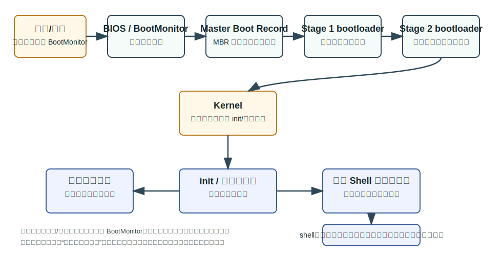
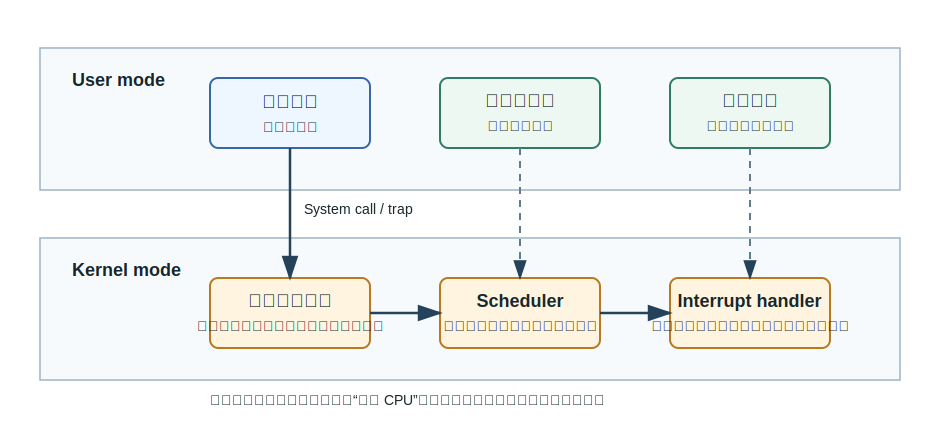
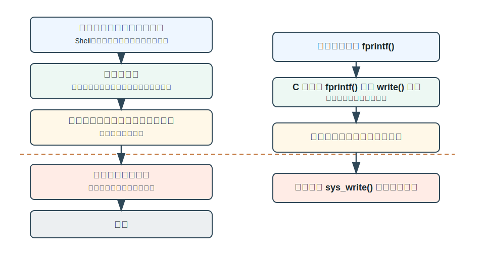
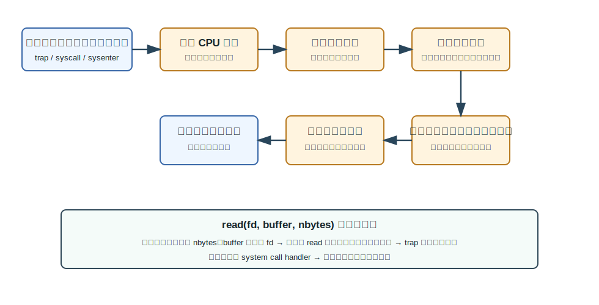
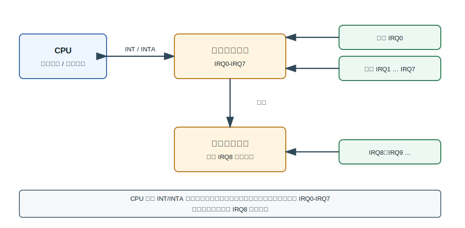
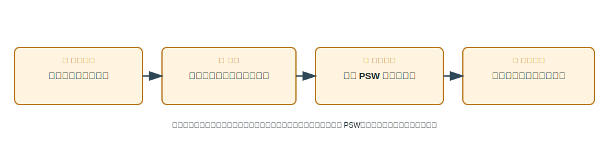
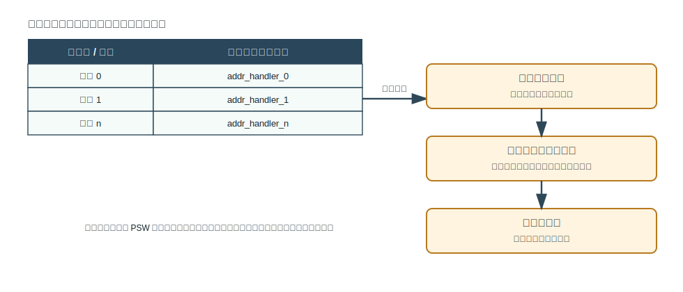
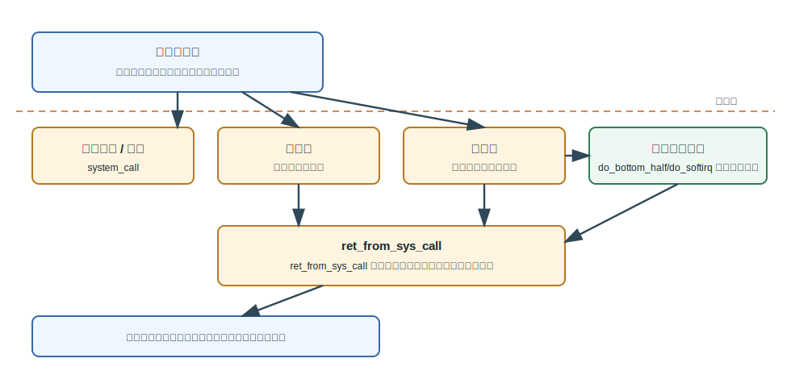
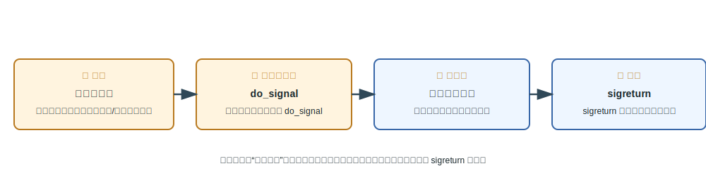

# 第 2 章：操作系统如何运行并提供系统调用

## 学习目标

- 顺着引导链说明控制权怎样从硬件固件转交到内核，再到 `init`、后台服务和用户命令。
- 区分普通函数调用、陷入、中断、系统调用和调度造成的控制转移。
- 用接口分层解释用户接口、库函数接口和系统调用接口各自面向谁。
- 按顺序复述一次系统调用从用户态进入核心态、分派到服务例程并返回的过程。
- 判断系统调用参数可以放在哪里，并说明系统调用为什么不是普通函数调用。
- 区分处理器的管理状态与用户状态，说明程序状态字记录哪些处理器工作状态。
- 说明中断源如何分类，并复述一次中断从硬件发现到软件处理的完整过程。
- 比较快中断与慢中断、串行与嵌套的多重中断处理，理解信号为什么可以看作软件中断。

## 上章回顾

上一章把操作系统放在计算机系统的层次中：它既向上提供抽象，让应用程序不用直接面对硬件细节；又向下管理资源，保证处理器、内存和设备能被复用并受到保护。本章沿着这条线继续追问：操作系统既然也是一组程序，它到底从哪里开始运行，又怎样在用户程序运行时重新获得控制权？

## 开篇问题

在 shell 里输入：

```bash
grep -n 0 test.txt
```

看起来只是启动了一个普通程序。但这个命令背后至少发生了三类事情：系统已经从开机引导到用户空间，shell 创建并执行了新程序，程序在读文件和输出结果时又不断请求内核服务。问题是：用户程序明明在 CPU 上直接执行，操作系统凭什么能在关键时刻介入？

## 本章地图

本章先讲控制权的第一段旅程：从上电复位到内核，再到 `init`、后台服务和用户 shell。随后我们缩小到用户程序运行期间，观察用户态与核心态之间的几种受控入口，并补足理解这些入口所需的处理器状态与程序状态字。接着用系统调用作为主线，把接口分层、库函数封装、陷入分派、参数传递和返回过程连成一条完整路径。最后回到 §2.2 列出的另一条入口——中断，把中断源、中断装置、向量表、优先级与信号展开成与系统调用并列的第二套控制转移机制。

## 正文

### 2.1 从开机到一个命令开始运行

计算机刚上电时，内存里还没有正在运行的操作系统；CPU 只能从硬件约定的位置开始执行最早的一小段固件代码。固件找到可启动设备后，控制权会沿着引导程序逐步转移，直到内核被装入并开始初始化系统。



这条链条的意义不只是“开机经过哪些名字”。它回答了一个更深的问题：操作系统的第一份控制权从哪里来。上电/复位后先进入固件或 BootMonitor，随后主引导记录指向一级引导程序，二级引导程序装入内核。内核启动后进入 init/用户空间，系统才有机会启动服务初始化过程、重要后台服务，以及用户 Shell 或窗口系统。

等到用户看到 shell，操作系统已经完成了许多铺垫。用户命令触发进程执行时，shell、系统调用和程序加载共同连接用户命令与内核运行。也就是说，`grep -n 0 test.txt` 不是绕过操作系统运行，而是在操作系统已经建立的进程、文件和接口环境中运行。

> **核心判断**：引导链的核心不是“先后背诵”，而是控制权从固件到内核、再到用户空间的交接。

### 2.2 操作系统怎样重新获得控制权

用户程序开始运行后，CPU 并不会每执行一条用户指令都询问操作系统。为了效率，用户代码通常采用有限直接执行：大部分普通指令直接在处理器上跑；但一旦需要访问受保护资源，或者发生外部事件，就必须通过硬件支持的受控入口进入核心态。



这张图里有三条常见路径。第一，系统调用使用户进程进入内核执行服务，例如读文件、创建进程、等待子进程退出。第二，调度器可在内核态决定进程切换，例如时间片到期或者当前进程阻塞。第三，中断处理程序可打断当前执行并进入内核，例如时钟中断或设备完成 I/O。

> **易错点**：用户代码切换入口包括 call/ret、中断/iret、trap、SysCall/SysEnter 与 SysRet/SysExit；它们不处在同一层次，只有跨越保护边界的入口才把控制交给内核服务路径。

这里要特别区分两个词：**用户态**是普通应用代码运行的受限状态，**核心态**是内核代码运行的特权状态。用户态代码可以做计算、访问自己的地址空间、调用库函数；但涉及设备、进程、文件系统和内核数据结构时，就需要通过 <u>系统调用或中断路径</u> 进入核心态。

### 2.2.1 处理器状态与程序状态字

要讲清楚“怎样进入核心态”，先要看处理器自己处在什么状态。上面把控制转移描述成用户态与核心态之间的跳转，这是软件视角看到的两端；从硬件视角看，处理器在任一时刻都带着一组工作状态，正是它决定了此刻能不能执行特权操作。也正因为如此，操作系统对处理器的管理有两条线：一条是把处理器这件资源在多个程序之间分配，另一条是决定哪个程序此刻真正占用处理器。

> **核心判断**：处理器管理同时包含处理器资源分配和运行程序调度两条线——前者关心“处理器作为资源怎么分配”，后者关心“就绪程序谁先上处理器”。

为了让这两条线安全运转，处理器把执行权限分成两档。**管理状态**（又称特权状态）下可以执行全部指令，包括开关中断、切换地址空间这类会影响整个系统的操作；**用户状态**（又称目标状态）下只能执行普通指令。二者的分界很硬：==特权指令只能在管理状态执行==。用户程序若试图在用户状态执行特权指令，硬件会拒绝并转为异常——这正是上一节“访问受保护资源就必须进入核心态”的硬件根据。

处理器把“此刻处在什么状态”的信息集中记录在一个寄存器里，即**程序状态字（PSW）**。它不是单个标志，而是一组字段的集合：

| PSW 字段 | 记录内容 |
|---|---|
| 程序计数器 | 下一条要执行的指令地址 |
| 条件码 | 上一次运算产生的比较、进位等结果 |
| 状态位 | 当前处理器状态（管理状态 / 用户状态等） |
| 中断码 | 标识当前发生的中断或异常种类 |
| 中断屏蔽位 | 控制哪些中断此刻允许响应 |

PSW 把“控制流位置 + 当前权限 + 中断响应条件”打包在一起。这一点在下面会变得关键：中断发生时，硬件保存并切换的正是现行 PSW，从而一步完成“记住断点、换上内核权限、调整中断屏蔽”。

### 2.3 服务、接口与库函数封装

操作系统提供的服务很多：创建和执行程序、输入输出、信息存取、通信、错误检测和处理；从系统效率角度看，还包括资源分配、统计和保护。读者容易混淆的是：服务本身、用户看到的接口、程序调用的库函数、真正进入内核的系统调用，并不是同一层东西。



左侧的分层说明接口面向的对象不同。用户接口位于系统程序一侧，典型形式是 shell、命令解释器、批处理脚本或图形界面。库函数接口连接应用代码与系统调用封装，它让程序员以语言库的方式写代码。系统调用接口跨越用户态与核心态，是用户程序请求内核服务的受控边界。

右侧的 `fprintf()` 例子更具体。应用程序调用 fprintf()，C 库中的 fprintf() 调用 write() 封装；当需要真正输出到文件或终端时，系统调用处理程序进入核心态，内核函数 sys_write() 执行实际服务。于是我们能看清：API 函数可以隐藏系统调用细节，但 API 函数不必每次都等同于一次系统调用。

| 接口层次 | 面向对象 | 典型形式 | 是否必然进入核心态 |
|---|---|---|---|
| 用户接口 | 终端用户或管理员 | shell、命令、图形界面 | 不一定 |
| 库函数接口 | 应用程序 | `fprintf()`、`read()` 封装、标准库 | 不一定 |
| 系统调用接口 | 用户程序到内核 | `trap`、`syscall`、`sysenter` | 是 |

### 2.4 一次系统调用内部发生了什么

系统调用把“我要内核帮我做事”变成一条受控的执行路径。它既要让用户程序表达请求，又不能让用户程序随意跳进内核任意位置；既要保存用户程序返回所需的现场，又要把请求准确分派给对应服务例程。



一次典型系统调用可以按下面的顺序读：

1. 用户程序发起陷入或访管指令，处理器切换到内核入口。
2. 保护 CPU 现场，保存返回用户程序所需的寄存器和状态。
3. 取系统功能号，判断用户程序请求的是哪一项服务。
4. 查入口地址表，入口地址表用于定位服务例程。
5. 执行相应系统调用处理子程序，服务例程在内核态执行。
6. 恢复现场并返回，处理完成后返回用户态。

`read(fd, buffer, nbytes)` 的例子把这个顺序落到了栈和寄存器上。用户程序依次压入 nbytes、buffer 地址和 fd，库过程 read 将系统调用号放入寄存器，然后 trap 进入内核空间。内核分派到 system call handler，完成读操作后返回用户空间并清理栈帧。

> **思维停顿**：入口地址表的作用像“受控分发表”：用户程序不能任意跳进内核，只能带着系统功能号走规定入口。

### 2.5 参数、返回与函数调用的边界

系统调用需要参数。参数可以由访管指令或陷入指令自带，也可以紧邻陷入指令存放；更常见的做法是通过 CPU 通用寄存器传递，或者在主存中开辟专用堆栈区域传递。参数如果是一个地址，还要特别注意它指向的是用户空间缓冲区，内核访问时需要做合法性检查。

> **易错点**：系统调用与函数调用区别在调用形式、被调用代码位置和提供者：系统调用由操作系统提供并进入内核，普通函数通常由语言或库提供并链接到应用程序。

这一区别可以从三个角度看：

| 比较维度 | 普通函数调用 | 系统调用 |
|---|---|---|
| 调用形式 | `call` / `ret` 一类普通控制转移 | `trap`、`int`、`syscall`、`sysenter` 等受控入口 |
| 被调用代码位置 | 静态或动态链接到应用程序，通常仍在用户态 | 系统调用实现在内核代码中 |
| 提供者 | 编程语言、运行时或库 | 操作系统 |

常见系统调用服务包括进程管理 `fork`、`exec`、`wait`、`exit`，文件操作 `open`、`read`、`write`、`close`、`seek`，进程通信 `pipe`，以及时间信息 `get/set time`。这些名字会在后续机制学习中反复出现；在本章，先把它们理解为用户程序跨越边界请求内核服务的具体入口。

### 2.6 中断机制：硬件与软件如何协作

§2.2 列出过三条让操作系统重新获得控制权的路径，我们已经沿系统调用走完一条；现在回到第二条——中断。中断是操作系统能在用户程序正运行时夺回处理器的根本手段，也是设备、时钟、异常等内外事件被及时响应的统一框架。

按触发来源，可以先把打断执行的事件分成两类。**外中断**来自处理器之外的设备或时钟，与当前正在执行的指令没有因果关系；**异常**（内中断）由当前指令本身引起，例如越权、缺页或除零。两者不仅来源不同，响应时机也不同。

> **易错点**：外中断与现行指令无关，通常在两条指令之间响应；异常由现行指令引起，在一个指令周期内处理。把两者混为一谈，就会在“能不能屏蔽”“在哪一步响应”这类判断上出错。

#### 中断装置：硬件先接手

事件发生后最先反应的不是操作系统代码，而是一套硬件——中断装置。在典型 PC 上，它由处理器和级联的中断控制器组成。



如图，CPU 通过 INT/INTA 与中断控制器交互：控制器用 INT 线通知有中断待处理，CPU 用 INTA 应答并取回中断号。主中断控制器连接时钟、键盘等 IRQ0-IRQ7，从中断控制器扩展 IRQ8 以后线路并级联到主控制器。这样，处理器有限的几根引脚就能管理几十个设备来源。

硬件接手后做的是固定的几步，把“发生了中断”变成“知道该跳到哪里”：



1. 中断源进入中断装置；
2. 中断控制部件写中断寄存器，记录是哪一类中断在请求；
3. 现行 PSW 保存到内存，断点与当时的处理器状态被一并留存；
4. 按中断向量找到处理入口，把控制交给对应的服务程序。

这里能看出 §2.2.1 中 PSW 的用处：第 3 步保存的正是现行 PSW，它一次带走了断点地址、权限和中断屏蔽信息。

#### 中断向量表与软件侧的善后

硬件只完成了“定位入口”，真正的处理逻辑在软件。定位入口靠的是一张表：



中断向量表保存各中断服务程序入口地址，硬件用中断号在表中索引，就跳到正确的处理程序。进入处理程序后，由于硬件通常只保存了现行 PSW 这类基本现场，软件进一步保护未由硬件保存的现场（其余通用寄存器与必要上下文），处理完成后再恢复，使被打断的程序处理后恢复正常操作。

把硬件与软件两侧合起来，一次中断或异常的完整处理是一条固定的链：

1. 发现中断源；
2. 硬件保护现场（保存现行 PSW）；
3. 按中断向量转向中断处理程序；
4. 软件进一步保护未由硬件保存的现场；
5. 执行中断处理；
6. 必要时进入调度；
7. 恢复现场并返回断点。

第 6 步“必要时进入调度”是一处伏笔：中断处理完之后，系统未必回到被打断的那个程序——这一选择权正是下一节快、慢中断要区分的地方。

### 2.7 中断优先级、多重中断与信号

并非所有中断都同等紧急，也并非处理一个中断时不会再来新的中断。这一节处理三个问题：多个中断同时到来怎么排序、处理中又来中断怎么办，以及一种“看起来像中断”的软件机制——信号。

#### 优先级与多重中断

当多个中断同时挂起，系统按优先级决定先处理谁。

> **核心判断**：中断优先级按系统错误严重程度和处理紧迫程度确定，高优先级处理过程中可屏蔽低优先级中断。

正在处理一个中断时又有新中断到来，有三种应对方式：

- **串行处理**：关中断，把当前中断处理完再看下一个；
- **嵌套处理**：允许更高优先级的中断打断当前处理；
- **即时处理**：立即响应新到的中断。

> **思维停顿**：多重中断可串行处理、嵌套处理或即时处理；嵌套处理需要允许更高优先级中断打断当前处理程序。不妨自问：嵌套若不限定“更高优先级”，会怎样？答案是可能无限自我打断。

#### 快中断与慢中断

为兼顾“响应要快”和“处理要全”，许多系统把中断分成快、慢两类，区别集中在保存多少现场、处理时是否关中断、以及处理完去哪里：

| 维度 | 慢中断 | 快中断 |
|---|---|---|
| 保存现场 | 保存全部寄存器 | 只保存内核会用到的寄存器 |
| 处理时中断 | 通常不关中断 | 关中断 |
| 处理完去向 | 可能进入调度 | 通常返回被中断进程 |

慢中断保存得多、允许被打断，适合较复杂、可被更紧急事件抢占的处理；快中断保存得少、处理时关中断，把延迟压到最低后尽快回到原进程。处理中来不及做的工作，则被推迟到“下半部分”。

#### Linux 怎样把这些拼起来

把系统调用、自陷、快慢中断、下半部分和信号放到一张图上，能看清它们如何衔接：



用户态进程可因中断或自陷进入核心态；进入后按类型走系统调用、慢中断或快中断的处理路径。为了不在关中断时做太多事，快中断排队下半部分，把可延后的工作交给 do_bottom_half/do_softirq 处理延迟工作。在准备返回用户态的关口，ret_from_sys_call 路径可能处理积累信号并调度下半部分，统一收尾这些被推迟的事务。

#### 信号：一种软件中断

最后一类“打断”不来自硬件，而来自内核对进程的通知——信号。它的形态与中断高度相似。



如图，信号可能由发送信号或中断/异常服务触发；内核并不在信号产生的瞬间打断目标进程，而是在返回用户态之前调用 do_signal 检查是否有待处理信号。若有，则执行用户空间信号处理程序，处理完通过 sigreturn 后回到断点继续执行。可以把信号理解为 ==一种软件中断==：触发者从硬件换成了内核，但同样在“返回用户态的受控关口”被检测、投递，处理后回到断点。

进程的“下半部分”与信号在学到进程与调度时，还会与进程状态、调度时机重新连起来；本章先把它们作为中断机制的自然延伸来理解。

## 例题讲解

**例题：** 执行 `grep -n 0 test.txt` 时，哪些动作更可能需要系统调用，哪些动作只是普通用户态计算？

**解答：**

1. shell 解析命令行字符串，判断程序名和参数。这主要是用户态计算，不必每一步都进入内核。
2. shell 创建新进程、装入 `grep` 程序映像。这会涉及进程管理和程序执行服务，通常需要系统调用。
3. `grep` 打开 `test.txt`、读取文件内容。这涉及文件系统和 I/O，需要通过系统调用进入内核。
4. `grep` 在已经读入的缓冲区里匹配字符 `0`。这是用户态计算。
5. `grep` 把匹配行写到终端或管道。这涉及输出设备或文件描述符，通常需要 `write` 一类系统调用。

这个例题的关键不是记住某个具体系统的实现细节，而是分清边界：<u>纯计算留在用户态</u>，受保护资源和内核管理对象要走系统调用。

## 常见误区

- 把库函数等同于系统调用。库函数可能只做格式化、缓冲或参数准备；只有需要内核服务时才通过系统调用接口跨入核心态。
- 把所有控制转移都看成同一种跳转。==call/ret 不等于 trap==；trap 的关键在于跨越用户态与核心态边界。
- 以为系统调用只是“慢一点的函数调用”。系统调用不仅有调用开销，还涉及权限切换、现场保存、入口检查、分派和内核数据结构访问。
- 以为屏蔽中断能挡住一切打断。中断屏蔽位只对可屏蔽的外中断有效；由现行指令引起的<u>异常</u>无法靠屏蔽避免，仍会在指令周期内被处理。

## 本章小结

操作系统的运行可以看成两次获得控制权：第一次发生在引导链中，控制权从固件和引导程序转交给内核；第二次反复发生在用户程序运行期间，系统调用、中断和调度让内核在受控入口处介入。要看懂这些入口，先得理解处理器自身的状态——管理状态与用户状态的分界，以及把断点、权限和中断屏蔽打包在一起的程序状态字。本章给了两条并列的入口主线：系统调用把用户态请求转化为核心态服务；中断则让内核在外部与异常事件发生时夺回处理器，沿“中断装置定位向量、软件保护现场、按优先级处理、必要时调度”的链条运转，而信号是它在软件层的延伸。理解这两条主线时，不要只背 API 或名词，而要能说清接口分层、参数位置、陷入分派、中断处理流程与返回路径。

## 关键术语

**引导链（boot chain）** 从上电复位、固件、主引导记录、引导程序到内核和 `init` 的控制转移过程。

**用户态（user mode）** 普通应用程序运行的受限处理器状态，不能直接执行特权操作或访问内核数据结构。

**核心态（kernel mode）** 内核运行的特权处理器状态，可以执行特权指令并管理受保护资源。

**系统调用（system call）** 用户程序请求操作系统内核服务的受控入口。

**陷入（trap）** 由程序主动触发的受控异常，用于从用户态进入内核处理特定请求。

**入口地址表（entry table）** 根据系统功能号定位对应内核服务例程的分发表。

**处理器状态（processor state）** 处理器当前的执行权限档位，分管理状态（特权状态）与用户状态（目标状态），特权指令只能在管理状态执行。

**程序状态字（PSW）** 集中记录处理器工作状态的寄存器，包含程序计数器、条件码、状态位、中断码和中断屏蔽位等字段。

**中断装置（interrupt hardware）** 捕获中断源、写中断寄存器、保存现行 PSW 并按中断向量定位入口的硬件部件。

**中断向量表（interrupt vector table）** 保存各中断服务程序入口地址的表，硬件用中断号在表中索引到处理程序。

**外中断与异常（external interrupt / exception）** 外中断与现行指令无关、在指令之间响应；异常由现行指令引起、在指令周期内处理。

**快中断与慢中断（fast / slow interrupt）** 两类中断处理策略：慢中断保存全部寄存器、通常不关中断；快中断只保存必要寄存器、处理时关中断。

**信号（signal）** 内核对进程的软件层通知，在返回用户态的受控关口被检测和投递，形态类似软件中断。

## 练习与解答

1. 为什么说 `fprintf()` 不一定等于一次系统调用？

   **解答**：`fprintf()` 是 C 库函数，可能先完成格式化、缓冲和封装。只有当缓冲需要写出，或者库实现决定请求内核 I/O 服务时，才会进一步调用 `write()` 等封装并进入系统调用路径。

2. 按顺序写出一次系统调用从用户程序发起到返回的关键步骤。

   **解答**：用户程序发起陷入或访管指令；内核入口保护 CPU 现场；取得系统功能号；查入口地址表；执行对应系统调用处理子程序；恢复现场并返回用户态。

3. `call/ret`、`trap`、中断三者有什么区别？

   **解答**：`call/ret` 是普通函数调用和返回，通常不改变保护级；`trap` 是程序主动触发的受控入口，用于请求内核服务；中断通常由外部事件触发，会打断当前执行并让中断处理程序在内核态运行。==call/ret 不等于 trap==，这是判断系统调用边界时最常见的分水岭。

4. 系统调用参数可以通过哪些方式传递？

   **解答**：可以由访管指令或陷入指令自带参数，可以紧邻指令存放参数，可以通过 CPU 通用寄存器传递，也可以在主存中开辟专用堆栈区域传递。

5. 程序状态字（PSW）记录哪些处理器工作状态？

   **解答**：PSW 用于记录程序计数器、条件码、状态位、中断码和中断屏蔽位等处理器工作状态；中断发生时硬件保存并切换的就是现行 PSW。

6. 快中断与慢中断在处理上有什么区别？

   **解答**：慢中断保存全部寄存器且通常不关中断，完成后可能进入调度；快中断只保存内核会用到的寄存器，处理时关中断并通常返回被中断进程。来不及做的工作推迟到下半部分处理。

7. 按顺序写出一次中断（或异常）从硬件发现到软件处理的关键步骤。

   **解答**：发现中断源；硬件保护现场（保存现行 PSW）；按中断向量转向中断处理程序；软件进一步保护未由硬件保存的现场；执行处理；必要时进入调度；恢复现场并返回断点。

## 覆盖记录

- OSPPT-CH01-BOOT-INIT-USER-PROGRAM
- OSPPT-CH01-USER-KERNEL-TRANSFER
- OSPPT-CH01-OS-SERVICES-INTERFACES
- OSPPT-CH01-SYSTEM-CALL-MECHANISM
- OSPPT-CH01-SYSCALL-PARAMS-VS-FUNCTION
- OSPPT-CH02-PROCESSOR-EXECUTION-BASICS
- OSPPT-CH02-INTERRUPT-SOURCES-AND-FLOW
- OSPPT-CH02-INTERRUPT-PRIORITY-DEFERRED-SIGNALS
