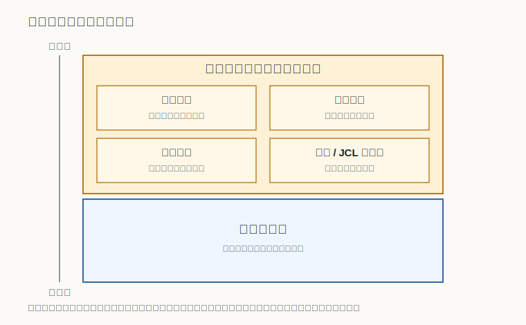
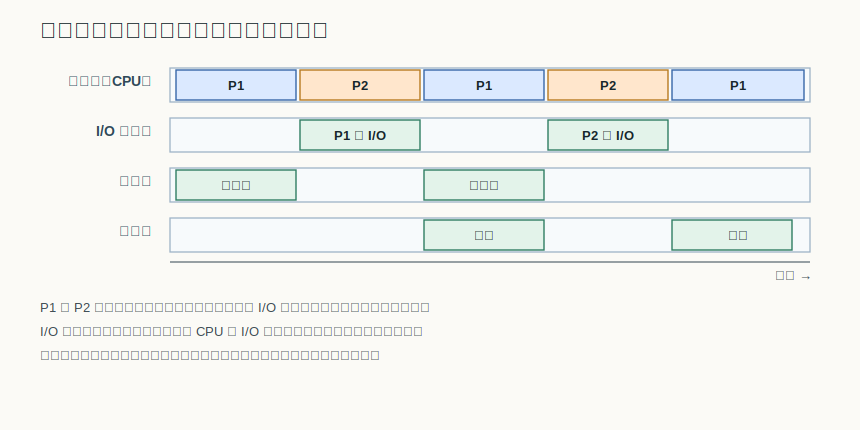
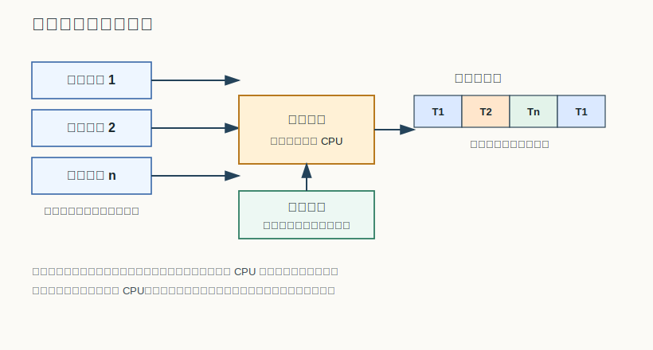

# 第 3 章：操作系统的演变与类型

## 学习目标

- 说出操作系统从手工操作、管理程序到多道程序设计的演变线索，并指出每一步各自解决了什么瓶颈。
- 用 CPU 利用率与道数的关系解释多道程序设计为什么能提高资源利用率，并说明它要付出的代价。
- 区分分时系统与实时系统的评价重点，并说明实时系统按时限严格程度的硬、软之分。
- 按使用方式把操作系统分成批处理、分时、实时等类型，并能用关键词概括网络与分布式系统的关注点。
- 用关键词识别 DOS、Windows、UNIX、Minix、Linux，并说清 POSIX、ANSI C 与自由软件谱系之间的关系。

## 上章回顾

第 1 章把操作系统看作有限硬件资源的管理者：处理器、内存、设备都很稀缺，它要决定谁在什么时候用、用多久，让资源被安全地复用。我们也提到，虚拟是它制造“人人都够用”错觉的手段，而多道程序设计正是其中一种让一个 CPU“表现得像多个”的技术。本章就把这条线索展开——这些抽象与复用的能力，并不是一开始就有的，而是被一代代真实机器的低效逼出来的。

## 开篇问题

早期的电子计算机价格高昂，一台机器抵得上一栋楼。可是真正去看它的运行记录会发现一件尴尬的事：最贵的部件——处理器——大部分时间在空转。程序要等着操作员手工换磁带、装卡片，要等着慢吞吞的输入输出设备，而这期间 CPU 无事可做。既然处理器这么贵又这么闲，能不能想办法让它一刻不停地干活，甚至同时为很多人服务？这一章讲的，就是操作系统为回答这个问题而走过的路。

## 本章地图

我们顺着时间往下走：先看机器如何从“人围着机器转”进化到由一段常驻程序自动调度作业，再看多道程序设计如何让计算与输入输出重叠，把空闲的处理器时间利用起来。接着把视角从“吞吐”转向“交互与时限”，引出分时系统与实时系统。然后我们换一个维度，按使用方式给操作系统分类。最后落到几款典型系统和它们背后的标准接口与自由软件谱系上。需要说明的是，本章关心的是这些系统“为什么长成这样”，至于处理器在多道之间到底按什么策略来回切换，要等到后面学习处理器调度时才会给出完整答案。

## 正文

### 3.1 从手工操作到管理程序：把人请出循环

最早的机器没有操作系统，使用方式是“独占”：一个用户预约一段时间，亲自上机装卸介质、按钮启动、读取结果。最早的手工操作阶段用户独占资源且人工干预多，机器大量时间浪费在等待人操作上——一次换带、一次对线，处理器就闲置几分钟甚至更久。

解决方向很直接：把重复的人工动作交给一段程序去做。于是出现了**管理程序（monitor）**，也叫监督程序。它常驻内存，自动地把一批作业一个接一个地喂给机器，不再需要人逐步干预。要让它知道每个作业该读什么、运行什么、输出到哪里，就需要一种描述作业的语言——**作业控制语言（JCL）**。简单说，JCL 以作业控制语句描述输入、执行和输出步骤，操作员只要把成批作业一次性交给机器，管理程序就能照着指令依次处理。

一个典型作业的控制结构可以粗略地看成三段：

1. 输入段：声明作业要读取的数据和使用的设备。
2. 执行段：指定要装入运行的程序及其参数。
3. 输出段：声明结果的去向，例如打印或写回磁带。

管理程序本身要占据一块固定的内存，里面装着它履行职责所必需的几个部件。

如图所示，常驻部分包含中断处理、设备驱动、作业定序和命令解释器，剩下的空间才是用户程序区，供一个个作业轮流装入运行。这张图值得记住的，不是某个部件的细节，而是一个分界的出现：从此内存被切成“长期属于系统的常驻区”和“临时属于当前作业的用户区”两部分——这正是后面进程、保护、调度等概念生长的土壤。

### 3.2 多道程序设计：让 CPU 不再空等

管理程序解决了“人慢”的问题，却没解决“设备慢”的问题。单道运行时，机器内存里只有一道程序：它一旦发起输入输出，就只能干等设备完成，处理器照样空转。

多道程序设计的想法是：在内存里同时放入<u>多道</u>程序，当一道程序因等待 I/O 而停下时，就把处理器交给另一道。它的本质，是 ==用并发换取资源利用率==——这正是第 1 章所说“虚拟”在历史上的第一次大规模兑现。

这张时间线把单道运行时被“吞掉”的并行关系显式画了出来：处理器在不同程序之间交替，输入输出则由专门的部件在一旁同时进行。读图时抓住两条线索即可——一是处理器的占用在程序之间来回切换，二是计算和输入输出在同一时间间隔内一起推进，而不是排成一队互相空等。

多道程序设计带来的好处是实打实的，但它并非没有代价。

> **核心判断**：多道程序设计提高了系统吞吐率和资源利用率，但以牺牲用户响应时间为代价。

道理在于：当多道程序争用同一个处理器，任何一道都不可能再像独占时那样“想跑就跑”，它必须排队、等待轮到自己。系统整体更忙了，单个作业从提交到完成的等待却可能更长。

#### 3.2.1 用一个公式估计处理器利用率

多道程序设计到底能把利用率提到多高，可以用一个很粗的概率模型来估计。假设每道程序独立地有一部分时间在等待 I/O，那么只有当内存里所有道都恰好在等 I/O 时，处理器才会真正空闲。

$$
CPU\ Utilization = 1 - p^n
$$

| 符号 | 含义 |
|---|---|
| `p` | 一道程序等待 I/O 的时间比例 |
| `n` | 内存中的程序道数，也就是并发执行的道数或度数 |

把这个近似读成一句话：p 表示一道程序等待 I/O 的时间比例，n 表示内存中的程序道数或度数；当各道程序相互独立时，所有程序都等待 I/O 的概率为 p^n，于是处理器至少有一道在运行的比例，也就是 CPU 利用率 = 1 - p^n。

这个式子虽然简化，却抓住了关键直觉：道数 `n` 越大，处理器空闲的概率 `p^n` 越小，利用率越高；但 `p^n` 随 `n` 的增大很快趋近于零，意味着继续增加道数的边际收益递减，而内存却是有限的。所以多道的“道数”不是越多越好，它受内存容量和管理开销的约束。

### 3.3 分时系统与实时系统：从吞吐转向时限

多道批处理把处理器喂得很饱，却没有为坐在终端前的人考虑：作业提交后只能等批次跑完才拿到结果，谈不上交互。分时系统就是为“人要即时反馈”而生的。

如图，多个用户终端联机接入系统，系统借助时钟中断把处理器时间切成一个个时间片，各终端以时间片方式分享 CPU。只要轮转得足够快，每个用户都会觉得自己独占了一台机器。这里的关键机制是<u>时钟中断</u>：它周期性地打断当前用户，逼迫系统收回处理器并交给下一个，从而保证没有人能长期霸占 CPU。

分时系统的评价重点也随之改变。它不再只盯着吞吐量，而是集中在 ==同时性、独立性、及时性和交互性== 这几条上：多个用户同时在用、彼此独立互不干扰、响应足够及时、操作可以交互进行。

如果说分时系统在意的是“人感觉快不快”，那么实时系统在意的是“能不能在规定时限内完成”。实时系统强调在预定时间限制内响应事件，它的正确性不只看算得对不对，还看来不来得及。

> **易错点**：实时系统的“实时”不等于“快”。实时系统按时间约束可分硬实时系统和软实时系统，硬实时错过截止时间会造成灾难性后果，软实时偶尔超时只是体验下降；判断标准是能否在<u>规定时限内</u>响应，而不是平均速度有多高。

### 3.4 操作系统的分类

把上面几种系统并排来看，就得到按使用方式的基本分类。下表对三类最经典的系统做一个对照。

| 类型 | 使用方式 | 关注重点 | 典型场景 |
|---|---|---|---|
| 批处理系统 | 用户脱机、成批提交作业 | 吞吐量与资源利用率 | 大批量、无人值守的计算任务 |
| 分时系统 | 多用户联机、终端交互 | 响应时间与交互性 | 多人共享的交互式主机 |
| 实时系统 | 事件驱动、带时限 | 在时限内可靠响应 | 工业控制、航空电子等 |

一句话点透三者的取向差异：==分时关注响应时间，批处理关注吞吐量==，而实时关注时限。

除了这三类，按运行平台还能区分出微机、并行、嵌入式、网络、分布式以及智能手机操作系统等。其中网络与分布式系统在课程里常被放在一起辨析，它们看似都涉及“多台机器”，关注点却不同：

| 系统 | 关注点 | 工作模式 |
|---|---|---|
| 网络操作系统 | 网络通信、资源管理与网络管理 | 客户/服务器、对等模式 |
| 分布式系统 | 分布环境下的资源管理、进程通信与任务分配 | 多结点协同、对用户呈现单一系统映像 |

### 3.5 典型操作系统与标准接口

了解了分类，再看几款绕不开的典型系统，能帮我们把抽象的“类型”落到具体的产品上。

- **DOS** 是单用户单任务的 PC 操作系统，核心功能是命令处理、文件管理和设备管理。
- **Windows** 在 DOS 之后强调图形化用户界面、多任务、虚拟内存和即插即用的设备管理。
- **UNIX** 源于 AT&T Bell Labs，强调多用户、多任务、可移植性，并带来成熟的文件系统、虚拟内存与网络通信能力。
- **Minix** 是为教学设计的类 UNIX 系统，采用微内核结构并公开源代码，影响了后来的一批系统。

把系统做得能互相替换、让程序能跨系统移植，靠的是**标准接口**。这里有两个容易混的标准：POSIX 规定操作系统对外的界面，ANSI C 规定 C 语言的标准库；前者面向系统，后者面向语言，二者共同构成可移植程序的语境（这一区别我们在练习里再仔细辨析）。

UNIX 的精神还以另一种方式延续下来，那就是**自由软件**运动。下表把这条谱系上的几个关键名字串起来。

| 实体 | 说明 |
|---|---|
| FSF | 自由软件基金会，FSF 成立于 1984 年，由 Stallman 发起，推动自由软件运动 |
| GNU | GNU 是 GNU is not UNIX 的递归缩写，目标是构建一套自由的类 UNIX 系统 |
| GPL | GPL 是自由软件许可证规则，保证源代码可以被自由地使用、修改和再发布 |
| GCC | GNU 编译器套件，是自由软件生态最基础的工具链之一 |
| Linux | Linus Torvalds 于 1991 年启动 Linux；Linux 继承 UNIX 多用户、多任务、网络与文件系统优势 |

自由软件谱系说明了一件事：操作系统的演化不只是技术路线的迭代，也是协作方式的革新——正是 GNU 工具链与 Linux 内核的结合，让一套完全自由的类 UNIX 系统成为现实。

## 例题讲解

**例题：** 某多道系统中，每道程序平均有 80% 的时间在等待 I/O。分别估计内存中放入 1 道、2 道、4 道程序时的处理器利用率，并说明继续增加道数是否值得。

**解答：**

代入 `CPU 利用率 = 1 - p^n`，其中 `p = 0.8`：

1. `n = 1`：利用率 `= 1 - 0.8 = 0.2`，即 20%。单道时处理器大部分时间在陪着一道程序等 I/O。
2. `n = 2`：利用率 `= 1 - 0.8^2 = 1 - 0.64 = 0.36`，即 36%。
3. `n = 4`：利用率 `= 1 - 0.8^4 = 1 - 0.4096 ≈ 0.59`，即约 59%。

可见道数从 1 增到 4，利用率提升明显。但 `0.8^n` 衰减越来越慢，继续往上加道数，每多一道带来的提升越来越小，而每道都要占用宝贵的内存。因此是否继续增加，要在“利用率收益”和“内存等资源开销”之间权衡，而不是一味求多。

## 常见误区

- **把多道程序设计等同于并行。** 多道是在<u>单处理器</u>上让多道程序并发推进，靠的是交替占用而非同时执行；只有多个处理单元才谈得上真正并行。
- **以为利用率公式里道数越多越好。** `1 - p^n` 随 `n` 增大趋于饱和，边际收益递减，还受内存容量限制，盲目加道数得不偿失。
- **把分时系统和实时系统混为一谈。** 分时追求的是多用户交互的响应体验，实时追求的是在硬性或软性时限内可靠响应；“实时”说的是守不守得住时限，不是平均速度快不快。
- **把 POSIX 当成一种编程语言标准。** POSIX 规范的是操作系统接口，C 语言标准库由 ANSI C 规范，二者分工不同。

## 本章小结

回到开篇那个“处理器又贵又闲”的问题：操作系统的演变，本质上是一部不断把处理器和设备喂饱、又不断照顾人的使用体验的历史。管理程序把人请出了循环，多道程序设计用并发填满了处理器的空闲，`1 - p^n` 这样的估算告诉我们利用率为何提升又为何饱和；当人要坐到终端前，分时系统用时间片换来交互，实时系统则把正确性绑定到时限上。按使用方式，这些系统被归纳为批处理、分时、实时等类型，再加上网络、分布式等平台维度；而 DOS、UNIX、Linux 这些具体系统，连同 POSIX 标准与自由软件谱系，构成了我们今天所处的操作系统世界。

## 关键术语

**多道程序设计（multiprogramming）** 在内存中同时存放多道程序，当一道等待 I/O 时把处理器交给另一道，从而提高资源利用率的技术。

**作业（job）** 用户一次提交给系统、由若干步骤组成的计算任务，在批处理语境下常用作业控制语言描述。

**管理程序（monitor）** 常驻内存、自动按次序调度作业并提供中断处理与设备驱动等基础功能的监督程序。

**分时系统（time-sharing system）** 通过时钟中断把处理器时间切成时间片、让多个联机终端轮流共享 CPU 的交互式系统。

**实时系统（real-time system）** 要求在预定时间限制内响应事件的系统，按时限严格程度分为硬实时与软实时。

**批处理系统（batch system）** 用户脱机、成批提交作业并由系统自动连续处理的系统，追求吞吐量与利用率。

**自由软件（free software）** 允许使用者自由运行、研究、修改与再发布的软件，以 FSF、GNU 工程和 GPL 许可证为代表。

## 练习与解答

1. 某多道系统中每道程序等待 I/O 的时间比例为 0.5，内存中放入 3 道程序时处理器利用率约为多少？

   **解答**：代入 `1 - p^n = 1 - 0.5^3 = 1 - 0.125 = 0.875`，约 87.5%。这说明当单道等待比例不太高时，少数几道程序就能把利用率拉得相当高。

2. 批处理系统和分时系统在“用户怎么用”和“系统在意什么”上有何不同？

   **解答**：批处理特点是用户脱机、成批处理、多道运行和作业周转时间长，系统在意的是吞吐量与资源利用率；分时系统则是多用户联机、以时间片交互，系统在意的是响应时间与交互性。一句话：前者把人挡在外面追求“喂饱机器”，后者把人请到终端前追求“伺候好人”。

3. 为什么说实时系统的“实时”不能简单理解为“运行速度快”？

   **解答**：实时系统按时间约束可分硬实时系统和软实时系统，衡量它的核心是能否在规定时限内完成响应。一个平均很快但偶尔严重超时的系统，对硬实时场景而言是不合格的；反之，只要稳定地在时限内响应，速度未必最快也算满足实时要求。

4. 网络操作系统和分布式系统都涉及多台机器，它们的关注点有什么区别？

   **解答**：网络操作系统强调网络通信、资源管理和网络管理，常见工作模式包括客户/服务器与对等模式，各结点仍是相对独立的系统；分布式系统强调分布环境下资源管理、进程通信和任务分配，力求把多台机器协同成对用户呈现单一映像的整体。

5. POSIX.1 与 ANSI C 都和“可移植”有关，它们各自规范的是什么？

   **解答**：POSIX.1 定义最小 UNIX 操作系统界面，通常以系统调用或库函数的形式出现，并通过 C 语言绑定来规范相关头文件，面向的是操作系统接口；ANSI C 标准库与 POSIX 共同构成可移植程序接口语境，但 ANSI C 面向 C 语言标准库，POSIX 面向操作系统接口。把握“一个管语言、一个管系统”这条分界，就不容易混淆。

## 覆盖记录

- OSPPT-CH01-OS-EVOLUTION-MULTIPROGRAMMING
- OSPPT-CH01-TIME-SHARING-REALTIME
- OSPPT-CH01-OS-TAXONOMY
- OSPPT-CH01-CLASSIC-OS-STANDARDS
