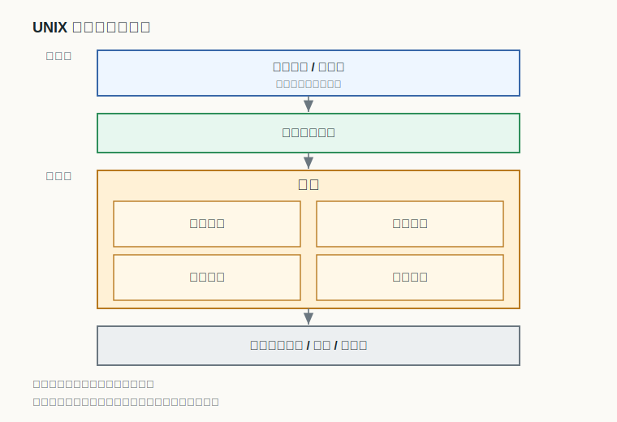
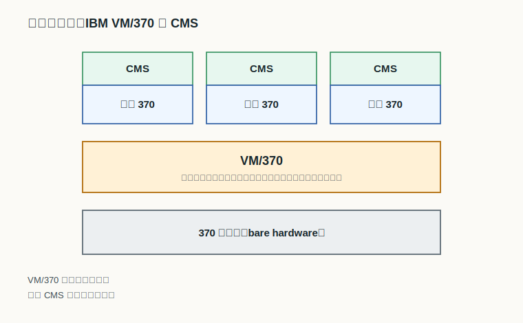
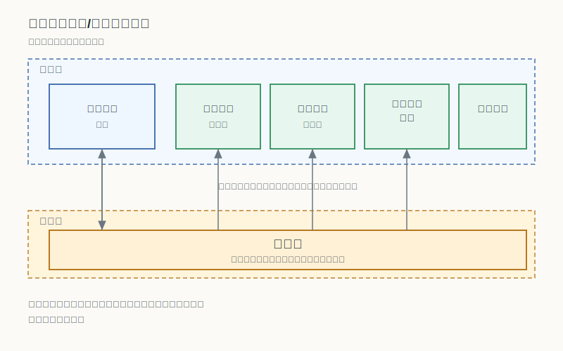
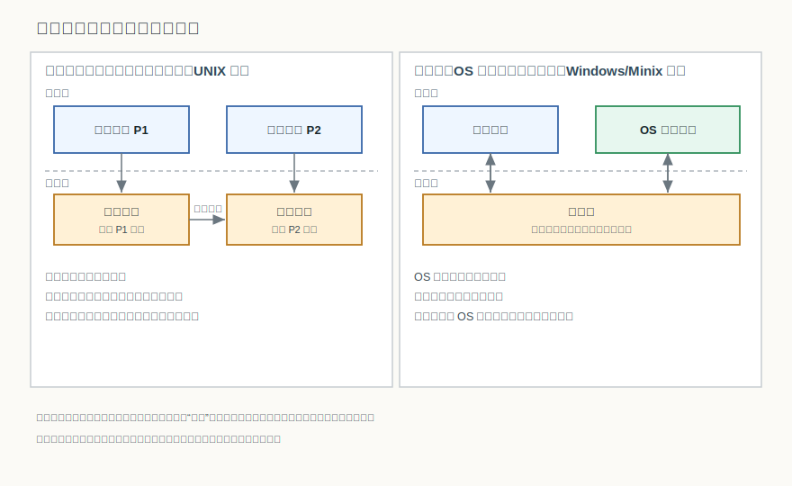

# 第 4 章：操作系统的结构与内核

## 学习目标

- 说出为什么要专门研究操作系统的结构，并指出复杂程度、生命周期与正确性这三方面的压力。
- 列出内核提供的基本功能，区分进程与线程在结构中的角色，并概括内核的运行特征。
- 比较整体式、层次式、虚拟机与微内核四种结构的核心思想与取舍，并能各举一个典型系统。
- 解释微内核“策略与机制分离”的含义，以及它为什么愿意用效率换取可靠性与可扩展性。
- 区分操作系统功能“在用户进程内执行”与“作为独立进程执行”这两种运行模型的差别。

## 上章回顾

前面三章里，我们先把操作系统看作有限硬件资源的管理者与扩展机，又弄清了它靠用户态与核心态的切换、系统调用和中断在机器上运行起来，还顺着历史看了批处理、分时、实时这些类型的来路。这一路上有一个词被反复使用却始终没有拆开——“内核”。我们说内核运行在核心态、能执行特权指令、是系统调用真正进入的地方，但内核内部到底是怎么组织的、为什么不同系统的内核长得很不一样，还从没正面回答过。本章就把这个被搁置的问题摆到台面上。

## 开篇问题

同样称作操作系统，UNIX 把文件系统、进程管理、设备驱动几乎所有功能都塞进一个庞大的内核里；而同样是类 UNIX 的 Minix，却反其道而行，把文件系统、设备驱动这些服务赶到内核之外，当成一个个普通进程来运行。奇怪的是，两者都能正常工作，也都被认真地用着。既然功能不少一样、都能跑起来，为什么它们的内部结构会差别这么大？这背后其实是一个工程问题：当一个系统大到难以驾驭时，应该把它捏成一整块，还是切成许多小块？

## 本章地图

我们先解释一件容易被跳过的事：操作系统为什么值得专门研究它的“结构”。接着把内核单独拎出来，看清它提供哪些基本功能、由哪些基本元素构成、运行时有什么与众不同的特征。然后进入本章的主体——四种经典的内核结构，从“全部挤在一起”的整体式，到“层层依赖”的层次式，再到“复制出多台机器”的虚拟机，最后到“把服务请出内核”的微内核，每一种都对应一种应对复杂度的思路。最后我们换一个角度，看操作系统的功能在运行时是寄居在用户进程里，还是独立成另一个进程。至于内核在多处理器上如何保证自身数据安全这类更深的问题，要等我们手里有了同步工具之后再回头看才会清楚，这里只先埋下伏笔。

## 正文

### 4.1 为什么要研究操作系统的结构

写一个一两百行的小程序，我们几乎不谈“结构”，因为一眼能看到头。操作系统不一样。它的代码量动辄数百万行，要同时照管处理器、内存、设备和文件，还要应付各种并发与异常；它的生命周期往往长达几十年，期间不断有人接手、修改、扩展；而它一旦出错，影响的是其上所有的应用。复杂程度高、生命周期长、正确性难以保证——正是这三重压力，逼着人们认真对待操作系统的组织方式。

换句话说，结构不是为了好看，而是为了让一个庞大的系统**可被理解、可被维护、可被验证**。本章后面要讲的几种结构，本质上都是在回答同一个问题的不同方案：如何切分功能、如何安排它们之间的依赖与调用，才能在性能、可靠性和可维护性之间取得一个还算划算的平衡。

### 4.2 内核：功能、基本元素与运行特征

在所有这些功能模块里，有一小部分最为核心、最受信任，它们运行在核心态、能够执行特权指令，构成了操作系统的**内核（kernel）**。其余代码即使属于操作系统，也未必时刻待在核心态。内核之所以特殊，是因为它握着最危险也最关键的能力——直接摆弄硬件。

那么内核到底负责哪些事？最基本的几项是：响应中断的中断处理、管理时钟的时钟管理、决定谁下一个上处理器的短程调度，以及让进程之间能够通信的进程间通信。围绕内核还有两个反复出现的基本元素：进程和线程。为了建立直觉，我们从经典模型出发：进程是系统进行资源分配的单位，线程是处理器调度的单位。更具体地说，一个进程拥有独立的地址空间、寄存器和其他资源；一个线程则是进程内的独立执行流，拥有自己的栈和寄存器，但共享进程的资源。需要说明的是，这个定义是我们为本章建立的工作定义，现代系统实际上模糊了这些界限——线程有时也拥有独立的资源，资源共享方式也因实现而异。它们各自完整的故事，要等到后面专门讨论进程与线程时才会展开。

进程将地址空间、寄存器、文件句柄和其他资源汇集在一个单一的执行上下文中。线程则是该上下文内的独立执行流，拥有自己的栈和寄存器，但共享进程的资源。在经典的多进程系统中，一个进程通常包含一个主线程；在多线程系统中，一个进程内可能有多个线程共存。这个基本的工作定义足以支撑我们理解本章的内核结构与调度机制。

> **核心判断**：内核提供中断处理、时钟管理、短程调度和进程间通信等基本功能；进程是资源分配和调度单位，线程是调度单位。现代系统模糊了这些界限，第 5 章将展开全部复杂性，但为本章目的，我们采用这个经典模型。

内核运行起来还有一组与普通程序很不一样的特征。它不是被“调用”才动，而是被事件推着走——绝大多数内核活动由中断驱动；由于同一段内核代码可能被多个执行流先后进入，==内核代码可重入== 是内核必须满足的硬性要求；为了保护那些不能被打断的关键操作，内核会让<u>部分代码</u>在屏蔽中断的状态下执行；而前面已经强调过，它可以执行用户程序无权使用的特权指令。

> **思维停顿**：既然屏蔽中断能保护关键操作，为什么不干脆让内核一直关着中断？
>
> 因为关中断意味着系统在这段时间里对外界完全“失聪”，时钟、设备都得不到及时响应。真实系统只在最短的临界片段里屏蔽中断。至于内核可不可以被抢占、在多处理器上仅靠屏蔽中断为什么还不够安全，这些问题牵涉到我们尚未建立的同步机制，留到后面再算这笔账。

### 4.3 四种经典的内核结构

理解了内核要做什么，就可以看人们是怎么组织它的。历史上形成了四种典型结构，它们对“功能如何切分、模块如何依赖”给出了很不一样的答案。下表先把四种结构的核心思想与取舍并排放在一起，作为后面各小节的地图。

| 内核结构 | 核心思想 | 主要优点 | 主要代价 |
|---|---|---|---|
| 整体式（单内核） | 所有功能模块同处一个内核，模块间直接调用关系密集 | 调用开销小、运行效率高 | 模块独立性差，牵一发而动全身；效率高但正确性和维护性较差 |
| 层次式 | 自底向上分层，每层只依赖下层；可全序结构或半序结构组织 | 结构清晰，便于设计与逐层验证 | 跨层通信要逐层传递，维护方便但效率较低 |
| 虚拟机 | 在裸硬件上虚拟出多台相同的机器，每台之上各自运行系统 | 隔离性强，可同时支持多种系统 | 多一层虚拟化，带来额外开销 |
| 微内核 | 内核只保留最基本机制，把多数服务移到用户态进程 | 模块隔离，可靠性与可扩展性好 | 服务间频繁消息传递，带来性能开销 |

#### 4.3.1 整体式结构：所有功能挤在一个内核里

最直接的做法，是把操作系统的全部功能都编进一个内核，模块之间想调谁就直接调谁。这就是**整体式结构（monolithic kernel）**，也叫单内核。经典的 UNIX 内核就是这样组织的。

读这张图抓住两条线索就够了。一是边界：用户程序并不能直接碰内核，中间隔着一道系统调用接口，正是这道系统调用接口连接用户程序与内核。二是协作：进了内核之后，文件系统、进程控制、设备驱动等内核功能相互协作，共同完成一次请求，比如读文件既要文件系统解析路径，也要设备驱动真正去驱动磁盘。直接调用让这种协作非常高效，可一旦某个模块出问题，影响会顺着密集的调用关系扩散开来。

> **常见误区**：整体式并不等于“没有模块划分”。它内部同样分文件系统、进程管理等模块，区别只在于这些模块之间<u>没有强制的隔离边界</u>，可以彼此直接调用。

#### 4.3.2 层次式结构：让每层只依赖下层

如果说整体式是“平摊在一起”，层次式结构就是“码成一摞”。它把系统自底向上分成若干层，规定每一层只使用它下面那层提供的服务，从而把杂乱的相互调用，整理成清晰的单向依赖。荷兰学者 Dijkstra 主持的 THE 系统是这一思路的代表，它一共分成 0 到 5 共六层：

| THE 的层次（自底向上） | 该层职责 |
|---|---|
| 第 5 层：操作员 | 系统的最外层，由操作员（人）使用 |
| 第 4 层：用户程序 | 运行各个用户作业 |
| 第 3 层：输入/输出管理 | 统一管理输入输出设备的访问 |
| 第 2 层：操作员—进程通信 | 维护操作员控制台与进程之间的通信 |
| 第 1 层：内存和磁鼓管理 | 管理内存与磁鼓，处理换进换出 |
| 第 0 层：处理器分配和多道程序 | 最底层，负责处理器分配与多道程序切换 |

分层不一定要这么严格。如果每一层只准调用紧邻的下一层，就是<u>全序结构</u>；如果允许跨过若干层去调用更下面的层，则是<u>半序结构</u>，约束更松。无论哪种，层次式的好处都很明确：每一层都可以在下层已被验证的基础上单独设计和检查，所以维护方便。代价同样明确——一个请求可能要逐层传递，维护方便但效率较低。

#### 4.3.3 虚拟机结构：把一台机器复制成多台

还有一种思路相当大胆：与其在硬件上搭一套操作系统，不如先用软件把硬件本身“复制”成好几台一模一样的机器，再让每台上面各跑各的系统。IBM 的 VM/370 就是这样做的。

如图，最底下是真实的 370 裸硬件，VM/370 位于裸硬件之上，向上虚拟出多台彼此独立的“虚拟 370”。每台虚拟机看起来都像一台完整的真实机器，于是多个 CMS 运行在虚拟机上，互不干扰。这种结构的魅力在于隔离与兼容：一台物理机可以同时承载多套系统，一台虚拟机崩了也波及不到别人。它付出的代价，则是多了一层虚拟化的转换开销。今天的云计算和服务器虚拟化，骨子里仍是这个思路的延续。

#### 4.3.4 微内核结构：把服务请出内核

整体式把功能尽量塞进内核，微内核走的是完全相反的方向：内核里只留下最不可或缺的机制，其余服务统统搬到用户态，当作普通进程来运行。前面开篇提到的 Minix 就是典型，它把系统自底向上整理成四层：

| Minix 的层次（自底向上） | 该层内容 |
|---|---|
| 第 1 层：内核 | 内核在最低层提供进程管理 |
| 第 2 层：任务（设备驱动） | 磁盘/终端/时钟/系统/以太网任务位于内核之上 |
| 第 3 层：服务进程 | 内存管理器、文件系统、网络服务器作为服务进程 |
| 第 4 层：用户进程 | 各类用户程序在最外层运行 |

微内核背后有一条重要的设计原则：==策略与机制分离==。简单说，内核只提供“怎么做”的底层机制（比如如何传递一条消息、如何切换进程），而“做成什么样”的策略则交给用户态的服务进程去决定。把这条原则落到结构上，就得到下面这张客户/服务器式的图。

图里上半部是用户态：设备驱动、文件服务、虚拟存储管理、安全服务在用户态，各自是一个独立的服务进程；下半部是核心态，微内核留在核心态，只负责进程切换、消息传递这类最基本的机制。用户进程要用某项服务，并不直接调用它，而是把请求作为消息交给微内核，由微内核转发给对应的服务进程。

> **核心判断**：微内核用一点效率，换来了模块隔离、可靠性与可扩展性——某个服务进程崩溃，通常不会拖垮整个系统。

把宏内核（即整体式）和微内核正面摆在一起对照，差别会更清楚：

| 对比维度 | 宏内核 | 微内核 |
|---|---|---|
| 功能放置 | 宏内核把文件系统、调度、虚拟内存、设备驱动等放在内核中 | 微内核把文件/设备/用户服务器移到用户态 |
| 服务间通信 | 内核内部直接函数调用，路径短 | 微内核通过消息传递连接用户服务与内核 |
| 出错影响 | 一个模块出错可能波及整个内核 | 服务进程崩溃一般不影响内核 |
| 运行效率 | 调用快，整体效率高 | 消息往返带来额外开销 |

### 4.4 操作系统功能的两种运行模型

最后换一个常被忽略却很要紧的角度：当操作系统真正在跑的时候，它的那段服务代码，究竟“住”在哪里？这里有两种典型的运行模型。

左边是 UNIX 采用的模型：应用进程在用户态运行，一旦它通过系统调用请求服务，相应的内核函数在核心态代表该进程执行服务——也就是说，内核代码是“借用”当前进程的身份在跑的，并没有另起一个进程。当系统从一个进程切到另一个进程时，进程切换连接不同用户进程的内核执行片段，把它们串成连续的内核活动。

右边则是 Windows、Minix 这类系统更接近的模型：OS 函数可作为独立进程，单独存在、单独被调度；微内核提供进程切换函数等基本机制；当用户进程需要某项服务时，用户进程和 OS 服务进程通过内核机制协作完成。两种模型没有绝对的优劣，区别在于服务代码是寄居在调用它的进程里，还是独立成另一个进程。

> **核心判断**：两种运行模型的本质区别，是操作系统的服务代码到底寄居在调用进程的上下文里，还是独立成一个进程——前者切换成本低、耦合紧，后者隔离性好但依赖内核来回传递请求。

## 例题讲解

**例题：** 有人说“微内核之所以叫‘微’，是因为它的功能比宏内核少”。这种说法对吗？请结合结构和运行模型加以辨析。

**解答：** 不对。微内核与宏内核提供给用户的功能并没有少，文件、设备、内存等服务一个都不缺；差别只在这些服务“放在哪里运行”。宏内核把文件系统、调度、虚拟内存、设备驱动等都放在内核中，靠直接函数调用协作；微内核则把这些服务移到用户态，内核只保留进程切换、消息传递等机制，服务之间靠消息往来。所以“微”指的是核心态里保留的机制少、内核体积小，而不是整个系统能干的事少。代价是请求要在用户态与核心态之间多绕几趟消息，效率因此打些折扣；换来的是更好的隔离性和可靠性。

## 常见误区

- **把“内核运行在核心态”理解成“用户程序用不了内核功能”。** 用户程序当然用得上，只是不能直接闯进核心态，而要经由系统调用这道受控入口请求服务。
- **把虚拟机结构和微内核混为一谈。** 虚拟机是把一台硬件复制成多台“整机”，每台上面跑完整系统；微内核是在一套系统内部，把服务从内核挪到用户态。一个在“机器”粒度上切分，一个在“服务”粒度上切分。
- **以为层次式结构一定是严格的全序。** 全序只是其中一种；允许跨层调用的半序约束更松，实际系统常在严格与灵活之间折中。
- **把整体式当成“一团没有分工的代码”。** 整体式内部照样分模块，只是模块之间缺少强制隔离、可以直接互调，因此一处缺陷容易扩散。

## 本章小结

回到开篇 UNIX 与 Minix 的对照：内核为什么会长成不同的样子，答案就藏在“如何对抗复杂度”这个问题里。因为操作系统复杂、长寿又必须正确，人们才发展出不同的组织方式——整体式追求效率而把一切直接连在一起，层次式用单向依赖换取清晰与可验证，虚拟机干脆把硬件复制成多台来获得隔离，微内核则把服务请出内核、用消息传递换取可靠与可扩展。内核本身运行在核心态、由中断驱动、代码可重入并掌握特权指令。最后我们还看到，即便功能相同，操作系统的服务代码既可以寄居在用户进程的上下文里执行，也可以独立成进程由内核居中协作——结构与运行模型，正是后面理解进程、调度与并发的地基。

## 关键术语

**内核（kernel）** 操作系统中运行在核心态、可执行特权指令的最核心部分，提供中断处理、时钟管理、短程调度和进程间通信等基本功能。

**整体式结构 / 单内核（monolithic kernel）** 把操作系统全部功能编入一个内核、模块之间直接调用的结构，效率高但隔离性与可维护性较差。

**层次式结构（layered structure）** 自底向上分层、每层只依赖下层的结构，可分全序与半序，便于设计与验证但效率较低。

**虚拟机（virtual machine）** 由虚拟机监控程序在裸硬件之上虚拟出的、行为如同真实机器的运行环境，可同时承载多套系统。

**微内核（microkernel）** 只在核心态保留最基本机制、把多数服务移到用户态进程的内核结构，遵循策略与机制分离，以效率换取可靠性与可扩展性。

## 练习与解答

1. 操作系统为什么需要专门研究其“结构”？请至少给出两点理由。

   **解答**：因为操作系统代码规模庞大、生命周期很长、且必须保证正确性。规模大使它难以一眼看懂，长寿使它要被反复维护和扩展，正确性要求高使它经不起随意改动。良好的结构能让庞大的系统可理解、可维护、可验证，并在性能、可靠性与可维护性之间取得平衡。

2. 列出内核提供的几项基本功能，并说明进程与线程在结构中分别扮演什么角色。

   **解答**：内核的基本功能包括中断处理、时钟管理、短程调度和进程间通信等。进程是系统进行资源分配和调度的单位，线程是处理器调度的单位；通常一个进程内可包含一个或多个线程。

3. 整体式结构和微内核结构在“功能放在哪里运行”上有何不同？各自的主要代价是什么？

   **解答**：整体式（宏内核）把文件系统、调度、虚拟内存、设备驱动等都放在内核中，靠直接调用协作，效率高，但模块缺少隔离、正确性和维护性较差，一处出错易波及全局；微内核把文件、设备、用户服务器等移到用户态，内核只保留消息传递等机制，隔离性和可靠性好，但服务间频繁的消息往来带来性能开销。

4. 为什么说微内核体现了“策略与机制分离”？

   **解答**：因为微内核只在核心态提供“机制”——如何切换进程、如何传递一条消息这类底层手段；而具体“按什么策略来做”——例如采用什么文件组织、什么调度或保护策略——则交给用户态的服务进程决定。机制稳定地留在内核，策略灵活地放在外层，二者解耦，系统因此更易扩展和替换。

5. UNIX 型与 Windows/Minix 型在“操作系统功能如何运行”上有何区别？

   **解答**：UNIX 型模型中，操作系统功能作为内核函数在用户进程的上下文里执行，内核代码借当前进程的身份运行，进程切换把不同进程的内核执行片段连接起来；Windows/Minix 型模型中，操作系统功能可以作为独立进程存在并被单独调度，微内核提供进程切换等机制，用户进程与服务进程通过内核机制协作。前者耦合紧、切换成本低，后者隔离性好但依赖内核居中传递请求。

## 覆盖记录

- OSPPT-CH01-KERNEL-BASICS
- OSPPT-CH01-KERNEL-ARCHITECTURES
- OSPPT-CH01-OS-RUNTIME-MODELS
