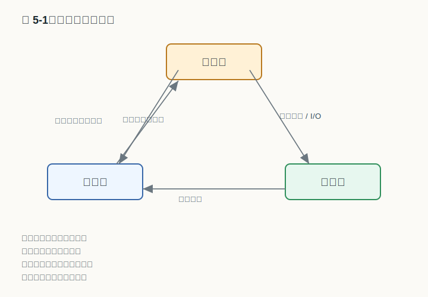
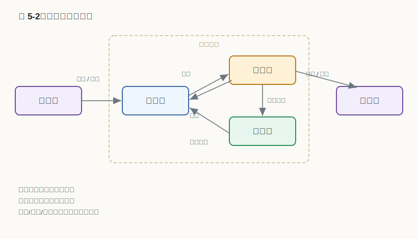
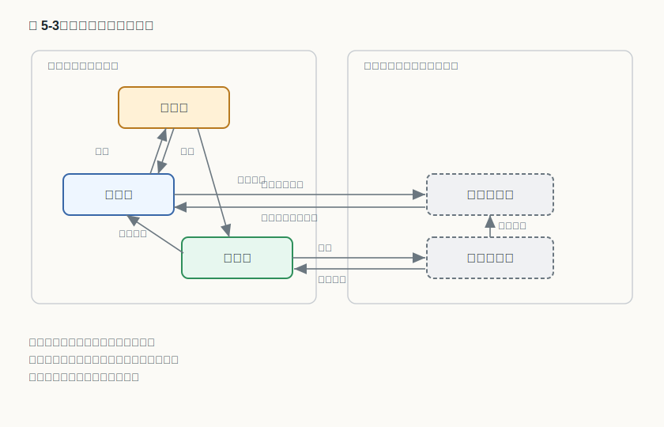
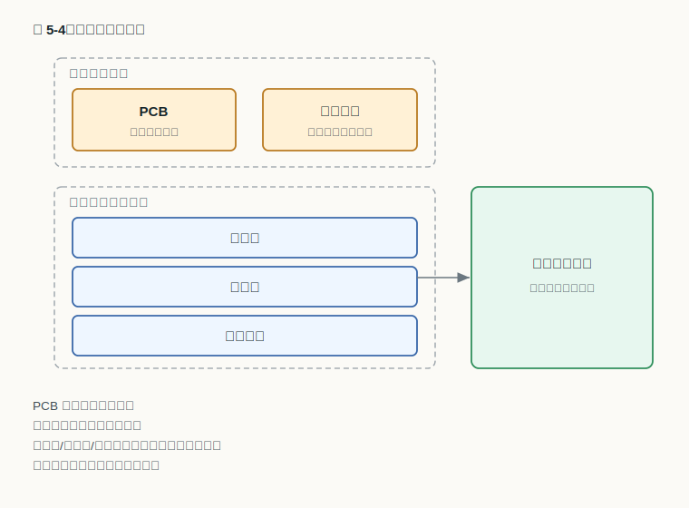
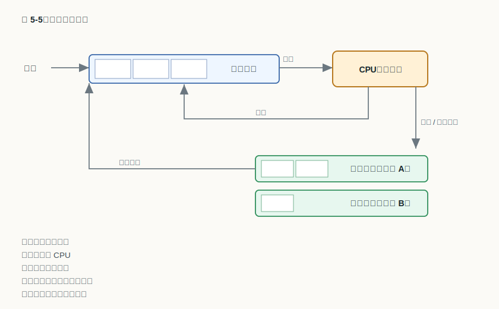
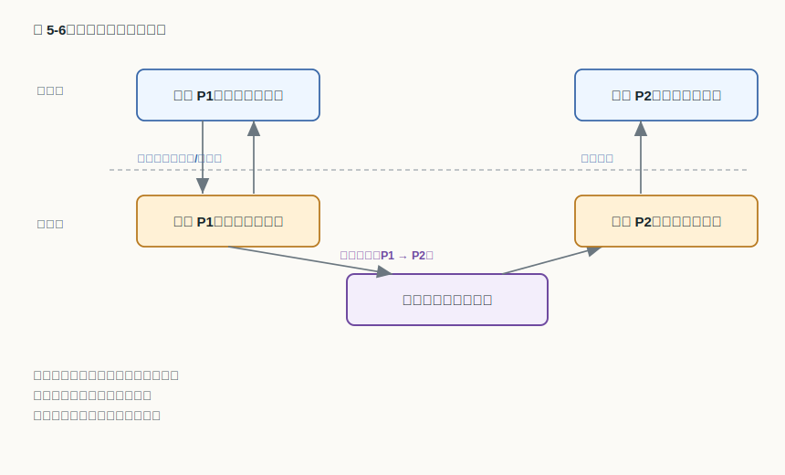
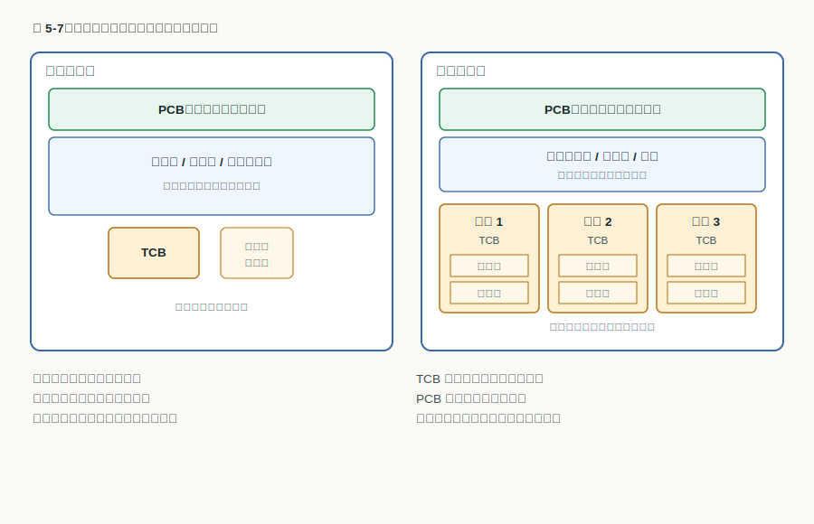

# 第 5 章：进程与线程

## 学习目标

- 说明为什么"程序"不足以刻画运行中的活动，并借"可再入程序"的例子论证为什么必须引入进程。
- 画出三态、五态与挂起状态模型，并指出每一条状态迁移分别由什么事件触发。
- 说出进程上下文与 PCB 各记录了哪些信息，并解释为什么所有 PCB 的集合就刻画了系统的当前状态。
- 区分模式切换与进程切换，并描述创建、阻塞/唤醒、撤消三类控制原语分别改变了哪些 PCB 与队列状态。
- 区分进程作为资源分配单位、线程作为调度分派单位的分工，并比较用户级、内核级与混合三种线程实现的取舍。

## 上章回顾

上一章拆开了"内核"这个一直被反复使用的词，看清了它运行在核心态、由中断驱动、代码必须可重入，并掌握着特权指令。在列举内核基本元素时，我们曾撂下一句话没有展开：进程是系统进行资源分配的单位，线程是处理器调度的单位，而它们各自完整的故事要留到后面。本章就来兑现这个承诺。讨论会频繁用到前面建立的几样工具——用户态与核心态的分界、作为受控入口的系统调用，以及把控制权交给内核的中断机制。

## 开篇问题

实验课上，三位同学在同一台服务器上同时运行同一个排序程序。磁盘上明明只躺着一份可执行文件，三次运行却各算各的数据、互不干扰；甚至有人的任务排到一半被系统暂停，过一会儿又接着往下跑。问题来了：我们到底该用什么来指称"其中某一次正在进行的排序"？如果只盯着那份程序文件，是回答不了的——它静静躺在磁盘上，既不会"被暂停"，也分不出这是第几次运行。更极端的是，许多库函数被写成**可再入程序**：它本身只含代码、不保存任何运行数据，工作区完全由调用方提供。那么同一段代码被许多调用者同时执行时，又该如何区分彼此？这一章要找的，正是那个比"程序"更合适的描述对象。

## 本章地图

我们先回答"进程是什么"，说清它为什么不能等同于程序，并用三组逐级丰富的状态模型刻画它在执行中的处境。接着回答"怎么描述一个进程"——进程的内存映像、作为档案的 PCB，以及把状态模型落实成数据结构的进程队列。然后回答"进程怎么动起来"：区分模式切换与进程切换，再看创建、阻塞、唤醒、撤消这几条进程控制原语各自做了什么。后半章转向线程：从一个 Web 服务器的难题出发，说明为什么在进程之内还要再分出线程，进程与线程如何分担"资源"与"调度"两副担子，最后比较线程的三种实现方式。至于"就绪的进程该挑哪一个上处理器"这类调度策略，本章只把舞台搭好，具体算法留给下一章；而挂起把进程换出主存后究竟存到哪里，则要等到讨论存储管理时才会完整。

## 正文

### 5.1 从程序到进程：为什么"程序"不够用

程序是一段静态的指令和数据，安安静静地存放在磁盘上。可一旦它被装入内存、获得处理器开始执行，情况就完全不同了：执行到了第几条指令、寄存器里是什么值、申请了哪些资源、和谁在等同一个事件——这些都是随时间不断变化的动态信息，程序文件本身一概不记录。开篇那三次互不干扰的排序之所以难以用"程序"指称，根子就在这里：一份程序可以对应多次、多份正在进行的执行活动，而我们需要一个能把"某一次执行"单独拎出来、连同它的全部动态状态一起管理的对象。这个对象就是**进程（process）**。

正因如此，进程有两副面孔。从概念上看，它是对一次程序执行活动的抽象；从实现上看，它又必须是一组实实在在、可供内核读写的数据。

> **核心判断**：进程既是对正在运行程序活动规律的抽象，也是刻画系统动态变化的数据结构。

可再入程序把这一点逼得格外清楚。这类程序只有代码部分，自身不保存运行数据，工作区由调用方提供，因此同一份代码可以被多个执行流安全地同时使用。也正因为代码本身不带状态，==多次运行难以用程序本身标识==——要区分"谁执行到哪儿、用的是哪块工作区"，只能依靠为每一次执行单独建立的进程。于是进程顺理成章地成为操作系统进行资源分配和运行管理的基本执行实体。

### 5.2 进程的状态模型

一个进程从诞生到结束，并不会一直占着处理器。它时而在跑，时而排队等着上场，时而又因为等待某个事件而停下。把这些处境抽象成有限的几个**状态**，再规定状态之间允许怎样迁移、由什么事件触发，就得到了进程的状态模型。我们从最基本的三态讲起，逐级补充，直到能描述被换出主存的进程。

#### 5.2.1 三态模型：运行、就绪与等待

最核心的三种状态是：**运行态**（正占用处理器执行）、**就绪态**（万事俱备，只差处理器）和**等待态**（也叫阻塞态，正等待某一事件，即便给它处理器也无法推进）。四条迁移把它们连成一个循环。

读这张图，关键是认清每条箭头由什么触发。就绪态被选中进入运行态，靠的是调度把处理器分给它；运行态落选回到就绪态，通常是因为<u>时间片用完</u>或被更紧要的进程抢占——注意它并没有"出问题"，只是暂时让位。真正让进程停下来等的是另一条路：运行态等待事件进入等待态，比如发起了一次磁盘读、要等输入到来；等到那个事件结束回到就绪态，它也不直接重返运行，而是先回到就绪队列里重新排队。

> **常见误区**：等待态和就绪态都"没在跑"，但性质不同。就绪态<u>只差处理器</u>，给了就能跑；等待态<u>在等事件</u>，给了处理器也跑不动。把二者混为一谈，是分析进程行为时最常见的错误。

#### 5.2.2 五态模型：补上诞生与消亡

三态刻画的是进程"活着时"的日常，却没说它怎么来、怎么走。把生命周期的两端补齐，就得到五态模型：在三态核心之外加上**新建态**和**终止态**。

新建态对应"进程正在被创建、还没准备好参与竞争"的瞬间：系统已经为它登记，但尚未把它放进就绪队列。等到资源就位，新建态提交后进入就绪态，它才正式加入对处理器的争夺。另一端，运行态可完成进入终止态：进程正常跑完或被要求结束后，先进入终止态做善后（回收资源、保留退出信息），再彻底消失。把两端摘掉，中间的运行/就绪/等待仍保持三态核心转换——五态只是给三态加了一个入口和一个出口，并没有改变中间的运转规则。

#### 5.2.3 挂起状态：被换出主存的进程

前面所有状态都默认进程待在主存里。可当内存紧张，或者某个进程暂时不必参与竞争时，操作系统会把它整个换出主存、腾出空间，这就是**挂起**。挂起给状态模型增加了一个全新的维度："在不在内存"。于是就绪和等待各自又分出一个"挂起"版本：挂起就绪态和挂起等待态。

挂起释放主存资源且不参与进程调度——这是它和普通就绪/等待最本质的区别：一个<u>不在内存中</u>的进程，调度器根本不会考虑把处理器分给它。被换出之前若进程在等事件，那么挂起等待态等待事件结束后进入挂起就绪态：事件可以照常发生、照常被记录，只是进程此刻不在内存，无法立即响应。等到系统决定把它换回，解除挂起后回到就绪态或等待态，重新回到内存里那套熟悉的循环。至于换出去的内容具体存到外存的什么地方、何时换回最划算，牵涉到内存与外存的协同，我们留到讨论存储管理时再细看，这里只需记住挂起的判别要点即可。

### 5.3 进程的描述：上下文、PCB 与队列

状态模型告诉我们进程有哪些处境，但操作系统终究要用**数据**把每个进程记下来、管起来。这一节看进程在内存里长什么样，内核用什么结构描述它，以及这些结构如何串成队列、把状态模型落地。

#### 5.3.1 进程的内存映像

一个进程在内存中占据的全部内容，合称它的**内存映像**。这块映像并不是铁板一块，而是按"归谁所有、谁能访问"分成了几个区域。

最关键的边界是内核与用户之间的那道线。一部分内容属于内核执行环境：PCB 描述进程控制信息，是内核管理这个进程的依据；核心堆栈属于内核执行环境，供进程陷入核心态执行内核代码时使用。另一部分则是进程自己的天地：代码段/数据段/用户堆栈属于用户私有地址空间，别的进程通常看不见也碰不到。此外还可能有一块共享地址空间可被多个进程访问，用于进程之间共享代码或数据。理解这张图，关键不在记住有几段，而在记住每一段的归属——它直接决定了后面切换、保护和通信时，谁该保存什么、谁能动什么。

进程在执行时随身携带的这套环境，统称**进程上下文**。它通常由三部分构成：用户级上下文（代码、数据、用户栈等用户空间内容）、寄存器上下文（程序计数器、PSW 和各类寄存器的当前值）以及系统级上下文（PCB、核心栈等内核侧信息）。后面讲切换时会看到，所谓"保存现场"，保存的正是上下文里那些一旦丢失就无法恢复执行的部分。

#### 5.3.2 PCB：操作系统给进程立的"档案"

在内存映像里，最特殊的是 PCB。**进程控制块（PCB，Process Control Block）** 是操作系统为每个进程建立的一份"档案"，进程存在它就存在，进程消亡它才注销。内核对进程的一切管理——调度、切换、通信、回收——靠的都是读写这份档案。PCB 里的信息大致可分为三类。

| PCB 信息类别 | 该类信息包含的内容 |
|---|---|
| 标识信息 | 标识信息包含外部标识和内部标识 |
| 现场信息 | 现场信息保存通用寄存器、PSW 和控制寄存器 |
| 控制信息 | 控制信息包含调度、组成、通信和资源清单 |

标识信息回答"它是谁"，其中外部标识便于用户引用、内部标识便于系统索引；现场信息就是上一节说的寄存器上下文，进程被切下处理器时把现场存在这里，重新上台时再据此恢复；控制信息则是内核做管理决策的依据，从调度优先级到占用的资源清单都在其中。

这三类并不是教科书的人为划分。看一个真实系统就清楚了——下表摘自 Minix 的 PCB，它的字段恰好分属三个不同的管理子系统。

| 所属管理子系统 | 在 PCB 中的典型字段 |
|---|---|
| 进程管理（现场） | 寄存器、程序计数器、PSW、栈指针属于进程现场 |
| 内存管理 | 正文段/数据段/bss 段指针属于内存管理 |
| 文件管理 | UMASK、根目录、工作目录和文件描述符属于文件管理 |

可见一份 PCB 横跨了进程、内存、文件等多个子系统，是一本名副其实的、跨子系统的运行状态账本。也正因为每个进程的全部关键状态都浓缩在它的 PCB 里，所有进程 PCB 的集合，就完整刻画了操作系统在某一时刻的当前状态——想知道系统此刻在干什么，遍历 PCB 就够了。

#### 5.3.3 进程队列：把状态模型落到数据结构

PCB 是单个进程的档案，可处于同一种状态的进程往往不止一个。操作系统的办法是把 PCB 用指针串成**队列**：所有就绪的进程挂在就绪队列上，等待同一事件的进程挂在该事件对应的等待队列上。这样一来，5.2 节那张抽象的状态图，就变成了 PCB 在各队列之间的真实流动。

顺着箭头走一遍：新进程提交进入就绪队列，排队等候；被调度选中后指派后占用 CPU，开始运行。此后有三种去向。若时间片耗尽，超时返回就绪队列，重新排队等下一轮；若它请求某项服务而需要等待，则等待事件进入对应等待队列——注意是"对应"队列，等磁盘的和等键盘的分属不同队列；待所等的事件出现后回到就绪队列，而不是直接重返处理器。可以看到，状态的每一次迁移，本质上都是某个 PCB 从一个队列被摘下、挂到另一个队列上。

### 5.4 进程的切换与控制

队列描述了进程"待在哪里"，但谁把 PCB 从一个队列挪到另一个队列、谁在进程之间倒换处理器？这要靠两件事：进程切换，以及一组改变进程状态的进程控制原语。

#### 5.4.1 模式切换与进程切换：两件不同的事

这是初学时最容易混淆的一对概念。**模式切换**指的是同一个进程在用户态与核心态之间的转换；**进程切换**指的是处理器从一个进程换到另一个进程去执行。

看图里的两条轴就清楚了：竖直方向上，模式切换发生在用户态和核心态之间，进程还是原来那个进程，只是改变了它运行的特权级别——一次系统调用或一次中断就会引发这种纵向移动。水平方向上，进程切换发生在不同进程之间，是真正换了一个执行主体上台。而做出"换不换、换谁"这个决定的，是调度进程在核心态完成切换判断——也就是说，进程切换的判断和动作都在核心态里进行。

把两条轴的关系理顺，就能看出它们的先后与因果。

> **易错点**：模式切换不等于进程切换；进程切换一定先发生模式切换，而模式切换不一定导致进程切换。

为什么"进程切换一定先发生模式切换"？因为切换进程要读写 PCB、操作队列，这些都是只有内核才能做的特权操作，必须先从用户态陷入核心态。可反过来不成立：一次普通的系统调用让进程进了核心态、办完事又原路返回用户态，全程还是同一个进程，并没有发生进程切换。<u>陷入核心态</u>只是切换进程的前提，而非结果。

#### 5.4.2 进程控制原语

真正改变进程状态的，是几段不可被中途打断的内核代码，称为**原语**。它们的共同特征是"要么做完、要么不做"，从而保证 PCB 和队列始终处于一致状态。

进程的诞生由**创建原语**完成，主要步骤是：

1. 申请一个空白 PCB。
2. 为进程映像分配所需的内存空间。
3. 分配其他必要的资源。
4. 把程序和数据装入分配好的内存。
5. 初始化 PCB（填好标识、现场和控制信息）。
6. 把新进程加入就绪队列（或直接投入运行），并通知相关模块。

当运行中的进程需要等待事件时，**阻塞原语**让它停下，事件到来后再由**唤醒原语**把它救活。这一对操作正好相反：

1. 阻塞：保存现场 → 把 PCB 状态改为等待 → 把 PCB 移入相应的等待队列 → 转去调度其他进程。
2. 唤醒：把 PCB 移出等待队列 → 把状态改为就绪 → 把 PCB 加入就绪队列。

进程的终结由**撤消原语**负责，它要把进程占用的一切干净地交还系统：

1. 根据 PID 找到对应的 PCB。
2. 回收该进程占有的内存与各类资源。
3. 若它还有子孙进程，按需一并撤消。
4. 把 PCB 归还 PCB 池，供以后的新进程复用。

把这几条原语和 5.3.3 的队列图对照着看就会发现，所谓"进程控制"，落到实处不过是按规矩修改 PCB 的状态字段、并把它在就绪队列与各等待队列之间搬来搬去。

### 5.5 线程

到这里，进程已经一肩挑起两副担子：它既是系统分配资源（内存、文件、设备）的单位，又是处理器调度的单位。多数时候这没问题，可有一类需求会让这种"捆绑"显得笨重。

#### 5.5.1 为什么还要线程：从一个 Web 服务器说起

设想一个 Web 服务器：它要一边等待新请求到来，一边读磁盘上的网页文件，还要尽量同时服务多个客户。把它实现出来有三种典型构造，差别就在"能不能并行"和"用哪种系统调用"上。

| 服务器构造方式 | 并行能力 | 系统调用方式 | 关键特点 |
|---|---|---|---|
| 单线程 | 无 | 阻塞 | 单线程通常无并行且使用阻塞系统调用 |
| 多线程 | 有 | 阻塞 | 多线程并行且使用阻塞系统调用 |
| 有限状态机 | 有 | 非阻塞 + 中断 | 有限状态机并行但使用非阻塞系统调用和中断 |

单线程写法最简单，可它一旦因为读磁盘而阻塞，整个服务器就卡住，谈不上并行。有限状态机能并行，却要把每次 I/O 拆成"发起—返回"两截、自己拿一张状态表记录每个请求进行到哪一步，代码晦涩难维护。多线程恰好取两者之长：可以照旧用直观的阻塞系统调用来写每个请求的处理逻辑，又能让多个请求并行推进——某个线程因读盘阻塞时，同进程的其他线程照样能跑。这正是引入**线程（thread）** 的动机：在一个进程内部再分出多个可独立调度的执行流。

#### 5.5.2 进程与线程的分工：资源单位与调度单位

线程的核心思想，是把原先压在进程身上的两副担子拆开。资源（地址空间、打开的文件等）仍以进程为单位拥有和保护，而"在处理器上被调度执行"这件事，则下放给线程。

对照左右两边就能看清这条分界线。进程是资源分配和保护单位，所以代表资源账本的 PCB 每进程只有一份；线程是处理器调度和分派单位，所以右边一个进程里能并存多个可被分别调度的线程。它们之间，同一进程中线程共享主存空间和资源——代码段、数据段和已打开的资源都是公用的，这也是线程间通信比进程间廉价得多的原因。但共享不等于全部合并：每个线程要有自己独立的执行控制和栈。具体地，TCB 保存每线程执行控制信息，PCB 保存每进程资源信息，二者各司其职；而且线程可有自己的用户栈和可选系统栈，以便独立地调用函数、独立地陷入内核。

> **核心判断**：进程是资源分配（和保护）的单位，线程是处理器调度（和分派）的单位；一个进程至少有一个线程，多个线程共享该进程的地址空间与资源。

既然线程接手了"被调度"这件事，那么 5.2 节那套状态模型，现在该落在谁身上？答案是线程。线程的状态模型与进程完全一致：线程也可在运行态、就绪态、等待态之间转换，而且线程状态转换与调度相关——只不过这一次，被选中、被换下、被阻塞的对象，从进程变成了进程内部的某个线程。前面画过的那张三态图照搬即可，无需另起炉灶。

### 5.6 线程的三种实现方式

线程要能被调度，就必须有人来管理它、为它做切换。按"这个人"是谁，线程有三种实现方式：放在用户空间的线程库里管、交给内核管、或者两者结合。

| 线程实现方式 | 由谁管理与调度 | 关键取舍 |
|---|---|---|
| 用户级线程 | 用户级线程主要由用户空间线程库管理 | 用户级实现切换代价小但一个线程阻塞可能阻塞整个进程 |
| 内核级线程 | 内核级线程由内核感知和调度 | 内核级实现可多处理器并行但切换涉及模式切换 |
| 混合式 | 混合式实现把多个用户线程映射到内核级实体 | 混合式实现依赖映射设计质量 |

用户级线程对内核透明：内核只看到一个进程，线程的创建和切换全在用户态由线程库完成，不必陷入内核，因此切换很快、调度策略也可由应用自定。代价是，内核既然只认进程，一旦某个线程发起阻塞系统调用，内核就会把<u>整个进程</u>挂起，连带其他本可运行的线程一起停摆；而且同一进程的多个用户级线程也无法真正分散到多个处理器上并行。内核级线程把线程登记到内核，由内核直接调度，于是能并行、单个线程阻塞也不牵连同伴，但每次切换都要经历模式切换，开销更大。混合式想兼得两者之长，把多个用户级线程映射到若干内核级线程上，效果则高度依赖这层映射设计得好不好。

> **核心判断**：用户级线程的切换不涉及模式切换、调度灵活，但不能多处理器并行，且一个线程阻塞可能阻塞整个进程；内核级线程支持多线程在多个处理器上同时执行，且一个线程阻塞不影响同进程其他线程，但切换代价较高。

## 例题讲解

**例题：** 有人说："既然进程切换前一定要先做模式切换，那每次系统调用引起模式切换时，也就发生了一次进程切换。"这种说法对吗？请说明理由。

**解答：** 不对，这恰好把两个概念的方向搞反了。模式切换是同一进程在用户态与核心态之间的纵向转换，进程切换是处理器从一个进程换到另一个进程的横向转换。二者的正确关系是：进程切换一定先发生模式切换（因为要在核心态读写 PCB、操作队列），但模式切换不一定导致进程切换。一次普通的系统调用，让进程陷入核心态执行内核服务、办完再返回用户态，全程都是同一个进程，并没有更换执行主体，自然谈不上进程切换。只有当内核在核心态里经调度决定"该换另一个进程上台"时，才会在模式切换的基础上进一步完成一次进程切换。

## 常见误区

- **把进程等同于程序。** 程序是静态的代码与数据，进程是一次执行活动连同其全部动态状态；同一程序可以同时对应多个进程。
- **把就绪态和等待态混为一谈。** 二者都没占用处理器，但就绪态只差处理器、给了就能跑，等待态在等事件、给了处理器也跑不动。
- **以为挂起就是普通的阻塞。** 挂起的要害是进程被换出主存、不参与调度，它和"在内存里等事件"的等待态分属不同维度。
- **以为用户级线程一定比内核级线程好。** 用户级线程切换快，却换不来多处理器并行，还会因一个线程的阻塞拖垮整个进程；孰优孰劣取决于应用是计算密集还是 I/O 密集、是否需要真正并行。

## 本章小结

回到开篇那三次互不干扰的排序：之所以无法用"程序"来指称它们，是因为程序是静态的，而我们要管理的是动态的执行活动——这正是进程被引入的理由。围绕进程，本章建立了一条主线：用三态、五态到挂起的状态模型刻画它的处境，用内存映像、PCB 和进程队列把它描述成可被内核读写的数据，再用模式切换、进程切换和几条控制原语让它真正动起来。后半章则把进程一肩挑的两副担子拆开：资源仍归进程，调度下放给线程，于是有了更轻、更适合并行的执行单位，以及用户级、内核级和混合三种把线程落地的方式。至于就绪队列里那么多进程和线程，到底该挑哪一个、按什么次序上处理器，本章只搭好了舞台，这出戏要由下一章的调度来唱。

## 关键术语

**进程（process）** 操作系统进行资源分配和运行管理的基本执行实体，是对一次程序执行活动及其动态状态的抽象。

**进程控制块（PCB，Process Control Block）** 操作系统为每个进程建立的描述其标识、现场与控制信息的数据结构，进程存在则它存在，是内核管理进程的依据。

**进程上下文（process context）** 进程执行时的环境，包含用户级上下文、寄存器上下文和系统级上下文三部分。

**挂起（suspend）** 把进程换出主存以释放内存的状态变化，被挂起的进程不参与处理器调度。

**模式切换（mode switch）** 同一进程在用户态与核心态之间的转换，由系统调用或中断引发。

**进程切换（process switch）** 处理器从一个进程转去执行另一个进程，由核心态下的调度完成，发生前必先经历模式切换。

**线程（thread）** 进程内部的执行流，是处理器调度和分派的单位，通常共享所属进程的地址空间和资源。

**线程控制块（TCB，Thread Control Block）** 保存单个线程执行控制信息的数据结构，与保存进程资源信息的 PCB 相区分。

## 练习与解答

1. 为什么不能用"程序"来指称一次正在进行的执行活动？请结合可再入程序说明。

   **解答**：程序是静态的代码与数据，不记录执行到哪一步、寄存器值、占用资源等动态信息，而同一程序可被多次并发执行。可再入程序更典型：它只有代码、工作区由调用方提供，多次运行难以用程序本身标识。因此必须为每一次执行单独建立进程，用它承载这些动态状态。

2. 画出进程的三态模型，并说明四条状态迁移分别由什么触发。

   **解答**：三态为运行态、就绪态、等待态。迁移为：就绪态被选中（被调度）进入运行态；运行态因时间片用完或被抢占而落选回到就绪态；运行态因等待某事件进入等待态；等待的事件结束后从等待态回到就绪态（而非直接回到运行态）。

3. 挂起状态与等待态有什么本质区别？

   **解答**：等待态的进程仍在主存中，只是在等某个事件；挂起则把进程换出主存、释放其占用的内存资源，且被挂起的进程不参与处理器调度。二者分属"在等什么"和"在不在内存"两个不同维度，挂起等待态、挂起就绪态正是二者叠加的产物。

4. 为什么说"进程切换一定先发生模式切换，但模式切换不一定导致进程切换"？

   **解答**：进程切换要读写 PCB、操作就绪/等待队列，这些是只有核心态才能执行的特权操作，所以必须先由用户态陷入核心态，即先发生模式切换。但反之不成立：一次普通系统调用使进程进入核心态、执行完毕再返回用户态，全程仍是同一进程，并未更换执行主体，因此没有发生进程切换。

5. 用户级线程和内核级线程各有什么优缺点？分别适合什么场景？

   **解答**：用户级线程由用户空间线程库管理，切换不涉及模式切换、代价小、调度灵活，但不能在多处理器上真正并行，且一个线程发起阻塞系统调用可能阻塞整个进程；内核级线程由内核感知和调度，能多处理器并行、一个线程阻塞不影响同进程其他线程，但切换要经历模式切换、代价较高。因此 I/O 密集、需要自定义调度且并行要求不高时用户级线程更划算；需要真正并行或频繁阻塞于系统调用时内核级线程更合适，混合式则试图兼顾，但效果取决于映射设计。

## 覆盖记录

- OSPPT-CH02-PROCESS-DEFINITION-STATE-MODELS
- OSPPT-CH02-PROCESS-CONTEXT-PCB-QUEUES
- OSPPT-CH02-PROCESS-SWITCH-AND-CONTROL
- OSPPT-CH02-THREAD-MODEL-AND-STRUCTURE
- OSPPT-CH02-THREAD-IMPLEMENTATIONS
