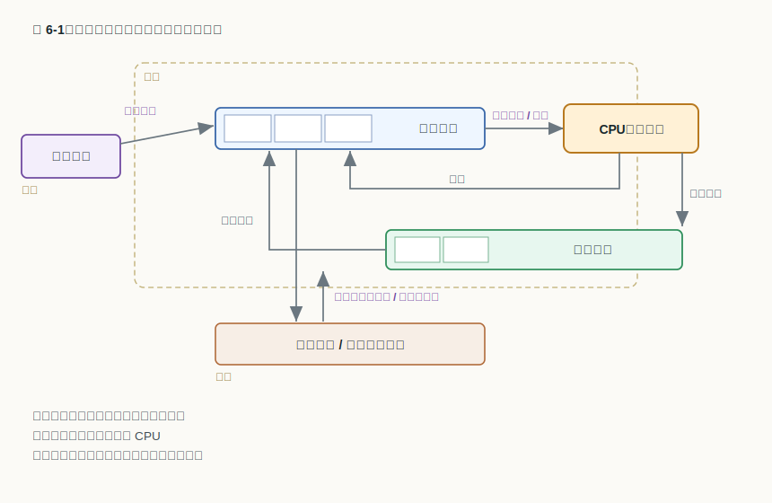
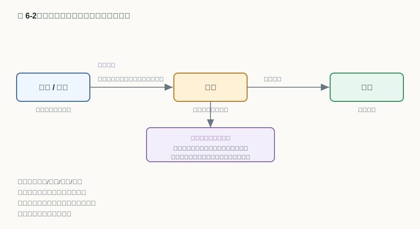
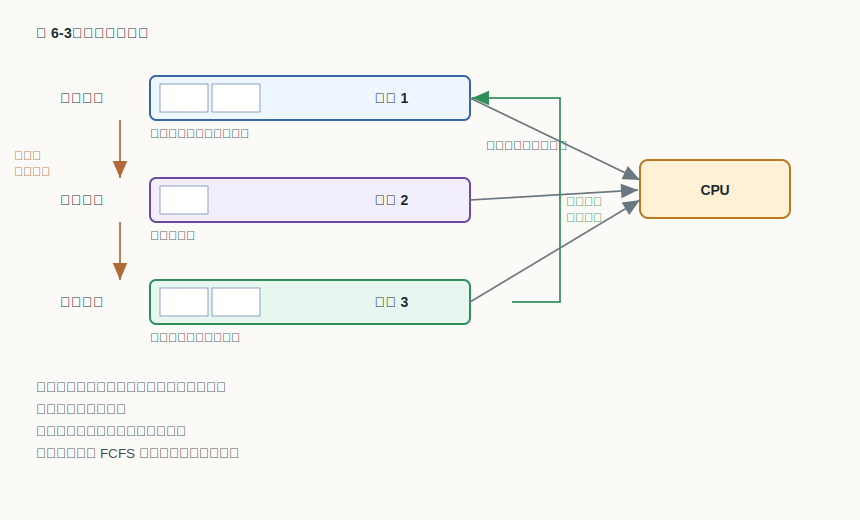

# 第 6 章：处理器调度

## 学习目标

- 区分高级、中级、低级三级调度各自决定什么、作用在哪条队列上、发生在什么时间尺度。
- 用周转时间、带权周转时间、响应时间、吞吐率等指标评价一个调度方案，并说明为什么不能只盯着 CPU 利用率。
- 比较 FCFS、SJF、SRTF、HRRF 四种作业调度算法的选择标准与典型缺陷，并能用响应比手算 HRRF 的选择。
- 说明时间片轮转中时间片大小的取舍、优先数法的动态优先级如何随运行而变，以及多级反馈队列怎样同时照顾响应与公平。
- 判断一组周期性实时任务是否可调度，并用单比率、最早限期、最少裕度三种算法判断当前时刻应选择哪个进程。

## 上章回顾

上一章把进程和线程讲完，最后把一台戏的舞台搭好却没开演：就绪队列里往往同时排着许多就绪的进程和线程，它们万事俱备、只差处理器，而处理器一次只能执行一个。是谁、按什么次序、把处理器交给其中某一个，正是上一章末尾留下的悬念。我们还会反复用到那时建立的几样工具——进程的就绪/运行/等待状态、串起这些状态的进程队列，以及把处理器从一个进程倒换到另一个进程的进程切换。本章要补上的，就是做出"换谁上台"这个决定的策略与机制：**处理器调度（processor scheduling）**。

## 开篇问题

设想三个几乎同时到达的作业，需要的处理器时间分别是 24、3、3（单位：ms）。机器只有一个，必须排出先后。如果按到达顺序老老实实地先来先做，三个作业的完成时刻是 24、27、30，平均周转时间 27ms；可如果让两个短作业先跑、长作业垫后，完成时刻变成 3、6、30，平均周转时间只有 13ms。同样的机器、同样的三个作业、谁也没少算一条指令，仅仅换了上处理器的次序，平均等待就缩短了一半还多。这立刻引出两个问题：我们凭什么说一种次序"更好"？又有哪些成熟的排序办法，能在不同目标下做出取舍？这一章就来回答它们。

## 本章地图

我们先退一步看全局：处理器调度其实不止"挑下一个进程"这一件事，它在不同时间尺度上分成高级、中级、低级三个层次，本章先用一张层次表和一张队列模型图把它们各自的职责理清，再说清楚衡量调度好坏的那把"尺子"——一组互相牵制的性能指标。随后进入两大战场。第一个是作业级的高级调度，登场的是 FCFS、SJF、SRTF 和 HRRF 这几种经典批处理算法；第二个是进程级的低级调度，时间片轮转、优先数法和多级反馈队列轮番上阵，看它们如何在响应、吞吐和公平之间周旋。最后转向实时系统：当"按时完成"本身成为硬指标时，调度要先回答"这组任务到底排不排得下"，再谈具体怎么排。至于被挂起换出的进程究竟存到外存何处、多处理器上的并行调度，牵涉存储管理与更复杂的并发，本章先聚焦单处理器的核心思想。

## 正文

### 6.1 调度的三个层次与一套尺子

谈具体算法之前，要先把"处理器调度"这个词拆清楚。它并不是单一动作，而是发生在三个不同时间尺度上的三类决策。

#### 6.1.1 三级调度：高级、中级、低级

把一个任务从"提交给系统"到"真正占用处理器"的路走一遍，会途经三道闸门，分别由三个层次的调度把守。

| 调度层次 | 职责 | 发生频率 |
|---|---|---|
| 高级调度（作业调度、长程调度） | 高级调度决定作业或进程是否进入系统 | 最低，作业进出系统时才发生 |
| 中级调度（交换调度、中程调度） | 中级调度控制挂起与解除挂起 | 居中，内存紧张时换出、宽裕时换入 |
| 低级调度（进程调度、短程调度） | 低级调度决定就绪实体占用处理器 | 最高，毫秒级，最频繁 |

三者的分工，本质上是**在管不同的"门"**：高级调度管的是系统的"大门"，决定一个作业能不能被收进来、变成进程参与竞争；中级调度管的是内存的"中门"，在内存紧张时把暂时不必参与竞争的进程挂起换出、腾出空间，宽裕时再换回；低级调度管的是处理器的"内门"，从就绪队列里挑出下一个真正上处理器的进程。越往里，决策越频繁、对效率越敏感——这也是为什么低级调度的算法必须足够快、足够简单。本章着墨最多的正是低级调度，它就是上一章末尾那个悬念的主角；高级调度则在批处理场景里仍唱主角。

这三道闸门和上一章的队列模型合在一起，就是处理器调度的全景图。

顺着图看：作业先躺在外存的后备队列里，==高级调度从后备队列选择进入就绪队列==，作业这才"成为进程"、获得在内存里竞争处理器的资格；进了内存，==低级调度从就绪队列指派 CPU==，被选中的进程开始运行，时间片用完或等待事件时再回到相应队列；当内存吃紧，==中级调度在内存队列与挂起队列间移动进程==，把一部分进程整体换出到挂起队列，缓解内存压力。可以看到，三级调度并不是三套独立机器，而是同一张队列网络上、作用在不同边上的三只手。

#### 6.1.2 批处理作业的一生

在批处理系统里，"作业"是比进程更靠外的一层概念：用户提交的是一个作业（一段要算的活儿连同它的说明），系统受理后才为它建立进程。把一个作业的完整生命周期画出来，正好能看清三级调度各自在何时出手。

==作业经历提交/收容/执行/完成==四个阶段：刚提交时进入收容（后备）状态，在外存排队；==高级调度决定后备作业进入系统==，把它收进内存、建立进程，作业由此进入执行状态；执行期间，==中级调度负责执行期间内存负载平衡==，在内存与外存之间换进换出以维持合理的负载；而处理器到底先给谁，则由==低级调度负责处理器分派==，在就绪进程之间频繁地做选择；待进程跑完，作业进入完成状态、退出系统。同一个生命周期，三级调度各管一段，互不替代。

#### 6.1.3 拿什么衡量调度的好坏

开篇那个"换个次序就快一半"的例子说明：调度有好坏之分。可"好"不是单一维度，而是一组互相牵制的指标，站在不同人的立场，看重的并不一样。

| 评价指标 | 含义 | 主要立场 |
|---|---|---|
| 资源利用率 | 处理器等资源被有效利用的比例 | 系统 |
| 响应时间 | 从提交请求到首次得到响应的时间 | 交互用户 |
| 周转时间 | 作业从提交到完成经历的总时间 | 批处理用户 |
| 吞吐率 | 单位时间内完成的作业数 | 系统 |
| 公平性 | 同类任务获得相近服务、不出现饥饿 | 所有任务 |

这些指标里，批处理最常用来排名次的是周转时间，以及它的归一化版本——带权周转时间：

$$
W = \frac{T}{T_s}
$$

| 符号 | 含义 |
|---|---|
| `T` | 周转时间，等于作业完成时刻减去提交时刻 |
| `T_s` | 服务时间，作业实际占用处理器的时间 |
| `W` | 带权周转时间，`T` 与 `T_s` 之比，<u>越接近 1 越好</u> |

带权周转时间之所以比单纯的周转时间更公道，是因为它把"等了多久"折算到了"本该算多久"上：一个只需 3ms 却等了 27ms 的短作业，带权周转高达 10，说明它被严重拖累；而一个本就要算 24ms 的长作业即便等一会儿，带权周转也接近 1。

> **常见误区**：以为把 CPU 喂到 100% 利用率就是调度得好。利用率高只说明处理器没闲着，并不保证交互响应快、周转短。一个把所有短作业都晾在后面的方案，完全可以利用率很高而体验很差。调度的好坏要在<u>多个指标之间权衡</u>，不能只看一个数。

明确了尺子，就可以分别走进作业调度和进程调度两个战场了。

### 6.2 作业调度：批处理里谁先进系统

作业调度就是 6.1 里的高级调度：从后备队列的若干作业中，挑出下一个收进内存、建立进程的作业。它的典型舞台是批处理系统，决策不那么频繁，因此可以用稍微"贵"一点的策略换取更好的整体周转。下面四种算法层层递进。

#### 6.2.1 先来先服务（FCFS）

最朴素的办法是按到达先后排队，谁先提交谁先被收容，这就是**先来先服务（FCFS，First Come First Served）**。它实现简单、绝对公平，也不会有谁被无限期搁置。代价在开篇已经见过：一旦排头是个大作业，后面所有短作业都得陪着干等。所以 FCFS ==不利于短作业==，反而在平均周转上优待了长作业。

#### 6.2.2 短作业优先（SJF）与最短剩余时间优先（SRTF）

既然短作业被长作业拖累，那就反其道而行——让估计计算时间最短的先做，这就是**短作业优先（SJF，Shortest Job First）**。开篇那个把平均周转从 27ms 压到 13ms 的次序，正是 SJF 的功劳：把小活儿快速清掉，能显著降低平均周转时间。但它有两处软肋：一是作业的运行时间事先只能<u>估计</u>、难以准确预测；二是只要短作业源源不断，排在后面的长作业就可能迟迟轮不上，出现==长作业可能饥饿==的情况。

如果允许在作业运行中途重新评估，还能更激进一步：每当有新作业到达，就比较"当前作业的剩余时间"和"新作业的全程时间"，谁短就上谁。这就是**最短剩余时间优先（SRTF，Shortest Remaining Time First）**，可以看作 SJF 的抢占式版本。它的平均周转通常比 SJF 还好，代价是==剩余运行时间最短==者随时可能换人，调度发生得更频繁、切换开销更大。

> **易错点**：SJF 让时间短者优先，效率高但运行时间难预测且长作业可能饥饿；SRTF 选剩余运行时间最短者，效率较高但调度频繁。两者都在用"更聪明的预测"换取更短的平均周转，代价则是预测难度和切换开销。

#### 6.2.3 最高响应比优先（HRRF）

SJF 偏心短作业，FCFS 偏心先到者，能不能折中？**最高响应比优先（HRRF，Highest Response Ratio First）** 给了一个漂亮的答案：给每个作业算一个"响应比"，每次挑响应比最高的。

$$
R = \frac{T_w + T_s}{T_s}
$$

| 符号 | 含义 |
|---|---|
| `R` | 响应比，等于作业响应时间与估计计算时间之比 |
| `T_w` | 作业已经等待的时间 |
| `T_s` | 作业的估计计算时间（服务时间） |

细看这个式子就懂它的巧妙：分子是"已等时间 + 服务时间"（即作业响应时间），分母是服务时间。对短作业（`T_s` 小），即便刚到、`T_w` 还很小，响应比也偏大，于是仍享有短作业优先的好处；而对长作业，随着等待时间 `T_w` 不断累积，响应比会稳步抬升，等得越久越容易被选中。换句话说，HRRF 用等待时间去补偿短作业优先带来的饥饿倾向，让长作业不至于永远翻不了身。把四种算法摆在一起对照，脉络就清楚了：

| 作业调度算法 | 选择标准 | 优点 | 主要缺点 |
|---|---|---|---|
| FCFS | 到达时间最早 | 简单、公平、无饥饿 | 长作业拖累短作业，平均周转差 |
| SJF | 估计计算时间最短 | 平均周转时间小 | 运行时间难预测，长作业可能饥饿 |
| SRTF | 剩余时间最短（可抢占） | 平均周转通常最优 | 调度频繁，切换开销大 |
| HRRF | 响应比最高 | 兼顾短作业与等待公平 | 每次都要重算响应比 |

### 6.3 进程调度：就绪队列里谁先上处理器

进程调度就是低级调度，它从内存中的就绪进程里挑下一个上处理器。和作业调度最大的不同是**频率**：它可能每隔几毫秒就要做一次决定，因此算法必须快，而且常常需要"打断正在跑的进程"——也就是抢占。

#### 6.3.1 时间片轮转

交互式系统最看重响应时间，于是有了**时间片轮转（Round Robin）**：把处理器时间切成一个个固定长度的时间片，就绪进程排成一队轮流执行，每个进程跑满一个时间片就被时钟中断打断、排到队尾，处理器交给下一个。它依赖<u>时钟中断</u>来周期性地夺回控制权，因而是天然抢占式的，也保证了每个进程都能较快地轮到一次、获得不错的响应。

关键在于时间片设多大。

> **核心判断**：时间片太长趋近 FCFS，太短则调度频繁、切换开销吃掉吞吐。

时间片若大到比绝大多数进程的运行时间还长，进程基本都能一次跑完，轮转就退化成了先来先服务；时间片若小到和一次进程切换的开销相当，处理器就有相当比例的时间耗在"换人"而非"干活"上。实际系统通常把时间片取在十几到几十毫秒，让一次切换的开销相对时间片小到可以忽略，同时又保证交互进程的响应足够灵敏。

#### 6.3.2 优先数法：让优先级随运行而变

另一类思路是给每个进程一个**优先数**，调度时挑优先级最高的。优先级可以是静态的（创建时定死），但更有用的是动态优先级——让它随进程的行为自动调整。早期 UNIX 的做法很有代表性：

$$
p\_pri = \min(127,\ p\_cpu / 16 + PUSER + p\_nice)
$$

式中 p_cpu 描述近期 CPU 使用情况并随时间衰减，p_nice 表示用户可调整参数，范围约为 -20 到 20；内核每秒重算优先数并重排队列，让长期霸占处理器的进程优先级自动下降、把机会让给别人。

| 符号 | 含义 |
|---|---|
| `p_pri` | 计算出的优先数 |
| `p_cpu` | 近期占用处理器的累计度量，会随时间衰减 |
| `p_nice` | 用户可调的友善值，越大越"谦让" |
| `PUSER` | 区分用户态的基准常数 |

这里藏着一个最容易记反的约定：==优先级数值越小，优先权越高==。所以 `p_pri` 算出来越小，越早被调度。把式子读一遍就能体会动态优先级的妙处：一个进程只要持续占用处理器，`p_cpu` 就不断累加、`p_pri` 随之变大、优先权下降；一旦它让出处理器去等待，`p_cpu` 又会随时间衰减、优先权回升。系统因此能自动压制"CPU 大户"、扶持交互型进程，而无需人工干预。

那么进程调度能不能也用上"短作业优先"的好处？问题是进程下一次要跑多久，事先并不知道。办法是**预测**：用进程过去若干次实际运行时长来估计下一次。常用的老化（aging）公式是 `T_{n+1} = a·T_n + (1−a)·t_n`，其中 `t_n` 是本次实际运行时间、`T_n` 是上次的估计值、`a` 是介于 0 和 1 之间的权重。它让估计值既参考历史、又对最近的行为更敏感，从而把批处理里的 SJF 思想近似地搬到进程调度上来。

#### 6.3.3 多级反馈队列

时间片轮转对所有进程一视同仁，优先数法又需要事先设定或预测，能不能让系统**在运行中自己摸索出谁该优先**？**多级反馈队列（MLFQ，Multi-Level Feedback Queue）** 就是这样一种"边跑边学"的综合方案，也是现代通用系统调度器的思想原型。

它设若干条优先级不同的就绪队列，规则可以概括成三条。其一，==高优先级队列时间片较短且优先占用处理器==：只要高优先级队列里有进程，就先调度它们，且给的时间片短，便于交互进程快速响应后让出。其二，==时间片用完可能降级==：一个进程如果用满了时间片还没结束（多半是计算密集型），就把它降到下一级更低优先、但时间片更长的队列，减少它被频繁打断的开销。其三，==等待过久可能自动提升以避免饥饿==：长期得不到调度的进程会被提回高优先级队列，防止低优先级进程被无限拖死。而==同队列通常按 FCFS 或时间片轮转原则调度==。这套机制不需要预知进程的行为：交互型进程往往没用完时间片就去等 I/O，自然长期待在高优先级层、响应迅速；计算密集型进程则逐步沉到低优先级层，用较长的时间片成批推进、减少切换。响应与吞吐，就这样被同一套规则自动安顿好了。

#### 6.3.4 另辟蹊径：保证调度与彩票调度

前面的算法都在"谁更优先"上做文章，还有一类算法换了个目标——**公平地兑现某种份额承诺**。**保证调度（guaranteed scheduling）** 直接给出量化承诺：若系统中有 `n` 个进程，就保证每个进程大约获得 `1/n` 的处理器时间，调度时优先照顾"实际所得离应得份额最远"的那个，把公平性变成可检验的指标。

但精确记账并不轻松。**彩票调度（lottery scheduling）** 用一种轻巧的随机化来近似它：系统给每个进程发放若干张"资源彩票"，每次调度就随机抽一张，持有中奖彩票的进程获得处理器。一个进程持有的彩票越多，被抽中的机会就越大——于是想给某进程多少份额，发给它相应比例的彩票即可。它不必维护复杂的优先级账本，却能在统计意义上逼近按比例分配，还天然不会饿死任何持票进程（只要有票，总有被抽中的可能）。

### 6.4 实时调度

前面所有算法追求的是平均意义上的"快"或"公平"。可有一类系统，关心的根本不是平均，而是**每一次都不能误期**：工业控制、航空电子、多媒体播放里，一个本该在 10ms 内算完的任务若拖到 11ms，结果可能毫无意义甚至酿成事故。这类系统的调度，目标从"尽量快"变成了"按时完成"。

#### 6.4.1 实时系统与可调度性

实时系统与前面讨论的系统有个根本不同：它强调的是时间因素本身。按对"错过期限"的容忍度，实时系统分为软实时和硬实时——软实时偶尔错过只是降低质量（如视频偶尔卡顿），硬实时则绝不允许错过（如刹车控制）。系统中的进程通常各自负责处理某种**周期事件**：每隔固定周期响应一次，并在期限内算完。

> **核心判断**：实时系统强调时间因素，常分为软实时和硬实时；进程负责处理周期事件，每隔固定周期都要在期限内完成一次。

既然每个周期任务都要"周期性地占用一段处理器时间"，那么一个最基本的问题是：这些任务加在一起，处理器到底忙不忙得过来？这就是**可调度性**判断。对 `m` 个周期事件，若第 `i` 个事件每个周期 `P_i` 需要处理时间 `C_i`，则可调度的一个基本必要条件是：

$$
\sum_{i=1}^{m} \frac{C_i}{P_i} \le 1
$$

| 符号 | 含义 |
|---|---|
| `C_i` | 第 `i` 个周期事件每次所需的处理时间 |
| `P_i` | 第 `i` 个周期事件的周期 |
| `m` | 周期事件的总数 |

每一项 `C_i / P_i` 是该任务对处理器的长期占用率，把它们相加就是总负载。<u>总负载超过 1</u> 意味着处理器连"长期平均"都追不上，必定有任务误期；只有总负载不超过 1，才谈得上"有可能排得下"。所以这是一道入场资格题：先确认排得下，再谈具体怎么排。

#### 6.4.2 实时调度算法：静态与动态

确认可调度之后，怎么决定每一刻该跑谁？实时调度算法分两大类。

> **核心判断**：单比率调度是静态算法，事件出现频率越高优先级越高；限期调度和最少裕度调度是动态算法。

**单比率调度（RMS，单调速率）** 是==静态算法==：在任务开始前就按周期定好优先级，周期越短（出现频率越高）优先级越高，运行期间不再改变，实现简单、开销小。**最早限期优先（EDF，限期调度）** 和**最少裕度优先（LLF，最少裕度调度）** 则是==动态算法==：优先级随时间变化。前者总是优先调度绝对截止时间最近的任务；后者则比较"裕度"——离截止还剩多少空闲余量，谁的裕度最小就最危急、先调度谁。裕度的定义是：

裕度 = 截止时间 − 当前时间 − 剩余估计计算时间。

动态算法对处理器的利用更充分，但每次都要重算优先级，开销比静态算法大。三者各有适用：任务集稳定、追求可预测时用 RMS，负载多变、追求高利用率时用 EDF 或 LLF。

## 例题讲解

**例题一（作业调度）：** 三个作业几乎同时到达，估计计算时间分别为 24ms、3ms、3ms。分别按 FCFS 与 SJF 排序，比较平均周转时间与平均带权周转时间。

**解答：** 设三者同时在 0 时刻到达。

按 FCFS（次序 24→3→3）：完成时刻为 24、27、30，周转时间即 24、27、30，平均周转 `(24+27+30)/3 = 27ms`；带权周转分别为 `24/24=1`、`27/3=9`、`30/3=10`，平均带权 `≈6.67`。

按 SJF（次序 3→3→24）：完成时刻为 3、6、30，平均周转 `(3+6+30)/3 = 13ms`；带权周转分别为 `3/3=1`、`6/3=2`、`30/24≈1.25`，平均带权 `≈1.42`。

可见仅仅改变次序，平均周转从 27ms 降到 13ms、平均带权周转从 6.67 降到 1.42。这正是开篇现象的量化解释：SJF 通过让短作业先行，大幅削减了它们被长作业拖累的等待。代价则是那个 24ms 的长作业被一推再推——若短作业不断到来，它就会饥饿。

**例题二（实时调度）：** 用单比率、最早限期、最少裕度三种算法，判断下面两个周期进程在当前时刻该选谁。数据如下表，并设当前时刻 `t = 12ms`、绝对截止时间分别为 15ms 与 16ms。

| 进程 | 截止时间 | 估计计算时间 |
|---|---|---|
| A | 15ms | 1ms |
| B | 16ms | 2.5ms |

**解答：** 按三种算法各自的判据逐一分析。

1. 已知两个周期实时进程：进程 A 截止时间 15ms，估计计算时间 1ms；进程 B 截止时间 16ms，估计计算时间 2.5ms。问题要求比较三种实时调度算法当前应选择的进程。
2. 单比率（RMS，静态）：周期越短优先级越高。A 的周期（15ms）短于 B（16ms），故 A 优先级更高，**选 A**。
3. 最早限期（EDF，动态）：选绝对截止时间最近者。A 的截止 15ms 早于 B 的 16ms，**选 A**。
4. 最少裕度（LLF，动态）：裕度 = 截止时间 − 当前时间 − 估计计算时间。`裕度_A = 15 − 12 − 1 = 2ms`，`裕度_B = 16 − 12 − 2.5 = 1.5ms`；B 的裕度更小、更危急，**选 B**。

三种算法在同一组数据上给出不同选择，恰好说明：静态的 RMS 只看周期，EDF 只看截止时间的远近，而 LLF 还把"还要算多久"算进了紧迫程度——这也是它在重载临界时往往更敏锐的原因。

## 常见误区

- **以为 CPU 利用率高就等于调度得好。** 利用率只反映处理器忙不忙，不反映响应快不快、周转短不短；好坏要在多个指标间权衡。
- **以为 SJF 全面优于 FCFS。** SJF 平均周转更优，但依赖难以准确预测的运行时间估计，且可能让长作业饥饿；FCFS 虽慢却公平、无饥饿。
- **把优先数的大小方向记反。** 在早期 UNIX 这类约定里，优先级数值越小代表优先权越高，`p_pri` 越小越先被调度。
- **以为时间片越小越好。** 时间片太小，进程切换的开销会占据可观比例，吞吐反而下降；太大又退化成先来先服务。
- **忘了实时调度要先过可调度性这关。** 若各任务占用率之和已超过 1，再聪明的算法也救不了，必有任务误期。

## 本章小结

回到开篇那个"换次序就快一半"的现象：它之所以可能，是因为处理器调度本身就是一门关于"次序与取舍"的学问。本章先把调度拆成高级、中级、低级三个层次，分别把守系统、内存和处理器三道闸门，再用周转、带权周转、响应、吞吐、公平这组互相牵制的指标作为衡量好坏的尺子。接着分两条线展开：作业调度上，FCFS、SJF、SRTF 到 HRRF 一路在"偏心短作业"和"补偿等待"之间寻找平衡；进程调度上，时间片轮转保响应、优先数法随行为动态调整、多级反馈队列"边跑边学"地兼顾响应与吞吐，保证调度与彩票调度则换用份额承诺的思路。最后，实时调度把目标从"平均快"换成"按时到"，先用占用率之和判断可调度性，再用单比率、最早限期、最少裕度在静态与动态之间取舍。至于被换出的进程存到外存哪里、何时换回最划算，要等到讨论存储管理时才会完整。

## 关键术语

**处理器调度（processor scheduling）** 操作系统决定就绪任务以何种次序获得处理器的策略与机制，分高级、中级、低级三个层次。

**高级调度（high-level scheduling）** 又称作业调度或长程调度，决定后备作业是否被收进系统、建立进程参与竞争。

**中级调度（intermediate scheduling）** 又称交换调度，通过挂起与解除挂起在内存与外存之间移动进程，平衡内存负载。

**低级调度（low-level scheduling）** 又称进程调度或短程调度，从就绪队列中选出下一个占用处理器的进程，是发生最频繁的调度。

**周转时间（turnaround time）** 作业从提交到完成所经历的总时间。

**带权周转时间（weighted turnaround time）** 周转时间与服务时间之比，用于公平地衡量不同长度作业被拖累的程度，越接近 1 越好。

**响应比（response ratio）** 作业响应时间与估计计算时间之比，HRRF 据此在短作业优先与等待公平之间折中。

**时间片轮转（round robin）** 让就绪进程按固定时间片轮流占用处理器、依赖时钟中断抢占的进程调度算法。

**多级反馈队列（multi-level feedback queue）** 用多条不同优先级、不同时间片的就绪队列，通过降级与提升自动区分交互型与计算型进程的调度算法。

**彩票调度（lottery scheduling）** 给进程发放资源彩票、按随机抽签分配处理器、以彩票数量近似份额比例的调度算法。

**可调度性（schedulability）** 一组实时任务能否在各自期限内全部完成的判断，基本必要条件是各任务处理器占用率之和不超过 1。

## 练习与解答

1. 高级、中级、低级三级调度分别决定什么？为什么低级调度的算法必须特别快？

   **解答**：高级调度（作业调度）决定后备作业是否进入系统、建立进程；中级调度（交换调度）通过挂起/解除挂起在内存与外存间移动进程、平衡内存负载；低级调度（进程调度）从就绪队列中挑下一个占用处理器的进程。低级调度发生在毫秒级、极其频繁，每次决策本身的开销都会直接计入系统开销，因此算法必须简单快速，否则"做决定"就会喧宾夺主。

2. 评价一个调度方案时，为什么不能只看 CPU 利用率？

   **解答**：CPU 利用率只反映处理器有没有闲着，不反映用户体验。一个把所有短作业都排到长作业之后的方案，可以让处理器始终满载、利用率很高，却使平均响应时间和平均周转时间都很差。调度好坏是利用率、响应时间、周转时间、吞吐率与公平性之间的综合权衡，单看一个指标会得出片面结论。

3. FCFS、SJF、SRTF、HRRF 的选择标准和主要缺点分别是什么？

   **解答**：FCFS 选到达最早者，简单公平但不利于短作业、平均周转差；SJF 选估计计算时间最短者，平均周转小但运行时间难预测且长作业可能饥饿；SRTF 是 SJF 的抢占版，选剩余时间最短者，平均周转通常最优但调度频繁；HRRF 选响应比最高者，用等待时间补偿短作业优先的饥饿倾向，缺点是每次都要重算响应比。

4. 时间片轮转中时间片大小如何取舍？多级反馈队列又是如何避免低优先级进程被饿死的？

   **解答**：时间片太长会趋近先来先服务、削弱交互响应；太短则进程切换频繁，切换开销吃掉吞吐。通常取在远大于一次切换开销、又足够小以保证响应的范围。多级反馈队列对等待过久的进程做"自动提升"，把长期得不到调度的进程提回高优先级队列，从而避免低优先级进程被无限拖死。

5. 两个周期实时进程 A、B：A 截止时间 15ms、估计计算 1ms，B 截止时间 16ms、估计计算 2.5ms，当前时刻 `t = 12ms`。分别用最早限期和最少裕度算法判断此刻应选谁。

   **解答**：最早限期（EDF）看绝对截止时间，A 的 15ms 早于 B 的 16ms，选 A。最少裕度（LLF）看裕度 = 截止时间 − 当前时间 − 估计计算时间：`裕度_A = 15 − 12 − 1 = 2ms`，`裕度_B = 16 − 12 − 2.5 = 1.5ms`，B 裕度更小、更紧急，选 B。两者结论不同，说明 LLF 把"还需算多久"纳入了紧迫度评估。

## 覆盖记录

- OSPPT-CH02-SCHEDULING-LEVELS-METRICS
- OSPPT-CH02-BATCH-JOB-SCHEDULING-ALGORITHMS
- OSPPT-CH02-LOW-LEVEL-SCHEDULING-ALGORITHMS
- OSPPT-CH02-REALTIME-SCHEDULING
</content>
</invoke>
