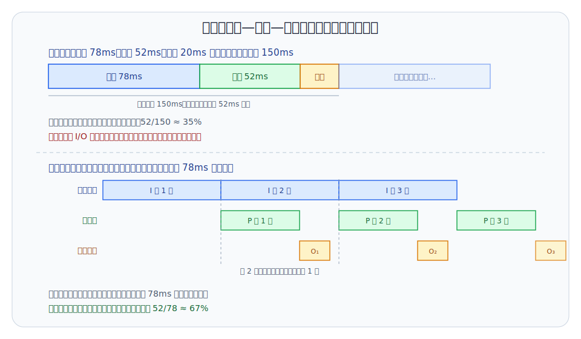
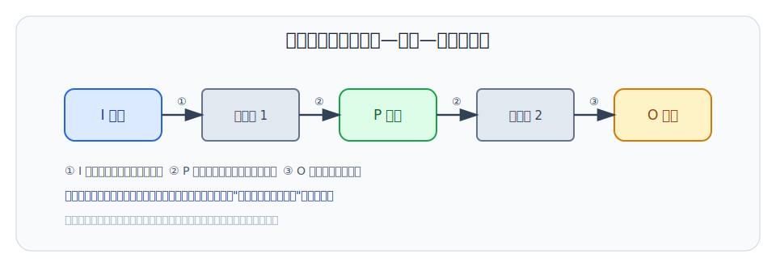
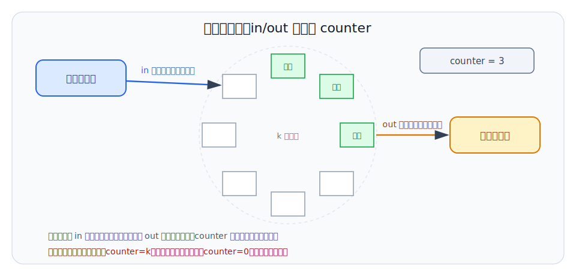
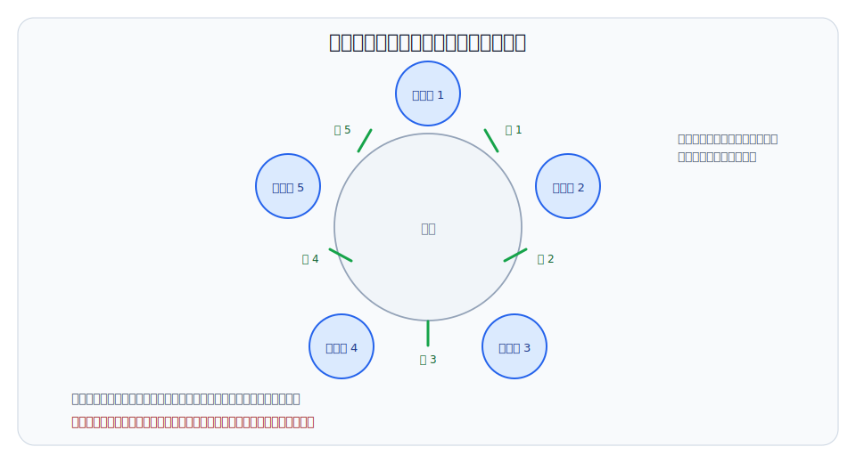

# 第 7 章：并发控制与信号量

## 学习目标

- 用时间线和利用率公式解释并发为什么能提高处理器利用率，并能算出顺序组织与并发组织下的利用率。
- 区分无关、竞争、协作三种进程关系，并能在一段给定代码里圈出临界资源和临界区。
- 用互斥进入、不能无限等待、不能阻塞其他无关进程、择一进入四条原则评价一个互斥方案，并说出标志变量两种写法各自的失败方式。
- 逐句读懂 Dekker、Peterson 和 TSL 的进入/退出协议，说明每条语句在"表达意愿"与"冲突让步"中扮演的角色。
- 写出记录型信号量的 P/V 操作，并能用信号量解出售票、哲学家进餐、生产者—消费者、读者—写者和理发师问题。

## 上章回顾

上一章我们把"处理器交给谁"这件事交给了调度算法：三级调度决定任务在哪条队列上前进，时间片轮转、优先数法和多级反馈队列轮流回答"下一个运行谁"。但调度只管次序，不管后果——它可以在任何一条指令之后把进程换下处理器。我们还会反复用到更早建立的两样工具：进程的就绪、运行、等待状态，以及把进程挂入队列、再从队列中唤醒的状态迁移。本章要面对的，正是调度自由交错执行流之后留下的麻烦。

## 开篇问题

两个售票窗口同时处理同一航班的最后一张票。两边几乎同时查询，都看到"还剩 1 张"，于是都收钱、出票、把余票改成 0。乘客拿到了两张票，系统记录却只少了一张。最让人不安的是：单独审查任何一个窗口的程序，逻辑都无懈可击；错误只藏在两段正确代码被调度交错执行的缝隙里，而且不是每次都发生。这种"看代码看不出来、跑起来偶尔出错"的问题，靠测试几乎抓不住。本章要回答：交错为什么会出错？怎样的机制能让并发既保住效率，又保住正确性？

## 本章地图

本章先算一笔账：把输入、处理、输出拆成可以重叠的进程，处理器利用率能提高多少——这是并发的收益。接着看代价：共享变量在交错读写下会产生结果不唯一和永久等待两类错误。为了控制风险，我们把危险代码圈进临界区，提出四条调度原则，然后沿两条路线实现互斥：软件算法从失败的标志变量改良到 Dekker 和 Peterson；硬件路线用关中断和原子指令换取简单性。这些方案都让等待者空转，于是后半章引入信号量，用阻塞与唤醒取代忙等，并用它逐一解决售票、哲学家进餐、生产者—消费者、读者—写者和理发师这些经典问题。至于把同步逻辑封装成更高层构件的管程，以及进程之间传递数据的通信机制，等本章的 P/V 操作用熟之后再引入会更自然。

## 正文

### 7.1 并发：收益与代价

#### 7.1.1 从顺序执行到并发流水线

先算收益。设一批数据的加工要经过三个阶段：输入机读入用 78ms，处理器计算用 52ms，输出设备打印用 20ms。顺序程序把三段串成一条直线，处理器在输入和输出期间只能空等。



图 7-1 上半部分就是这笔账：一个周期 150ms，处理器只忙 52ms。利用率按处理时间除以总周期计算：

$$
\eta = \frac{t_P}{t_I + t_P + t_O} = \frac{52}{78 + 52 + 20} \approx 35\%
$$

| 符号 | 含义 |
|---|---|
| `t_I` | 一批数据的输入时间（本例 78ms） |
| `t_P` | 一批数据的处理器计算时间（本例 52ms） |
| `t_O` | 一批数据的输出时间（本例 20ms） |
| `η` | 顺序执行下的处理器利用率 |

改成并发的办法，是把三个阶段拆成三个进程，用缓冲区把它们接起来。



图 7-2 中数据沿箭头流动：输入进程把读到的数据放进缓冲区，处理进程取走、算完、再放进第二个缓冲区，输出进程取走打印。三个进程可以分别工作在不同批次的数据上，于是图 7-1 下半部分的重叠出现了：第 2 批在输入时，处理器正在算第 1 批。稳定之后，每过 78ms（最长的输入段）就完成一批，处理器利用率提高到约 52/78 ≈ 67%。流水线的节拍由最慢的阶段决定，这个规律以后在设备管理中还会反复出现。

收益算清了，代价也随之而来：三个进程必须协调。缓冲区满了，输入进程要等；缓冲区空了，处理进程要等。==并发的收益来自重叠，代价来自交错==——一旦多个执行流读写同一个变量，谁先谁后就开始影响结果。

#### 7.1.2 进程之间的三种关系

不是所有并发进程都互相干扰。按是否共享状态、是否交换数据，可以把进程关系分成三种。

| 关系 | 特征 | 需要的控制 |
|---|---|---|
| 无关 | 不共享变量，也不交换数据 | 只需要调度器分配处理器 |
| 竞争 | 争用同一共享资源 | 互斥：同一时刻只许一个进程访问 |
| 协作 | 交换数据或等待对方的结果 | 同步：条件不满足时等待，满足后继续 |

> **核心判断**：并发进程之间可无关，也可因竞争共享资源或协作交换数据而发生交互。判断一组进程要不要控制，先看它们是否碰同一份状态、是否互相传递数据。

图 7-2 的流水线里三个进程是协作关系；下面的售票例子则是竞争关系。两类交互出错的方式不同，值得分开看。

#### 7.1.3 并发错误的两种典型形态

**第一类错误：结果不唯一。** 回到开篇的售票问题。设共享变量 A 是某航班的余票数，两个售票进程各用自己的工作变量读它、改它、写回它：

```pascal
var A: integer;                 { 共享余票变量 }

process T1;                     { 售票进程之一 }
var X: integer;
begin
  X := A;                       { 读余票 }
  if X >= 1 then begin
    X := X - 1;                 { 在工作变量上减票 }
    A := X;                     { 写回 }
    售出一张票
  end else
    显示"票已售完"
end;

process T2;                     { 与 T1 同构，工作变量为 Y }
```

设 A = 1。若 T1 执行完 X := A 后恰好被时钟中断换下处理器，T2 完整跑完一遍把 A 改成 0，T1 再恢复执行——它手里的 X 还是 1，于是照样减票、写回、出票。两个进程都可能读到 X=1，随后各自执行 X:=X-1 与 A:=X 的写回，若交错不当会卖出两张票或产生错误余票。错误的根源在于"读—改—写"三步不是一个不可分割的动作，调度可以在任何两步之间插入对方。

**第二类错误：永久等待。** 再看一个内存资源借还的例子。borrow 申请一块内存，不够就登记等待；return 归还内存并唤醒等待者：

```pascal
procedure borrow(x);
begin
  if x > available then begin
    把申请登记到资源等待队列;      { 先登记 }
    挂起自己，等待唤醒             { 后挂起：两步之间可能被打断 }
  end;
  available := available - x
end;

procedure return(x);
begin
  available := available + x;     { 更新资源量 }
  唤醒等待队列中可满足的进程
end;
```

borrow 进入等待队列并释放正在等待的进程，这两个动作分别落在借与还两段代码里：申请方发现资源不足时把自己登记进队列、让出处理器，而把等待者放出来要靠归还方；return 保存变量并唤醒等待进程，归还方先更新资源量，再按队列里登记的需求挑出能满足的进程。麻烦在于，交错不当可能导致进程永久等待：设想申请方刚登记完、还没真正挂起，归还方的唤醒恰好在此刻送达——唤醒扑了个空；申请方随后挂起，而那次唤醒不会再来第二遍。这类错误比多卖一张票更隐蔽：系统不报错，只是有个进程从此停在等待状态。

两类错误指向同一个结论：并发程序的正确性不能靠"每个进程单独看起来对"，必须把共享变量、等待登记和唤醒动作放在交错的时间轴上一起检查。

### 7.2 临界区：把竞争关进一扇门

#### 7.2.1 临界资源、临界区与四条调度原则

控制竞争的第一步是把危险区域划出来。一次只允许一个进程安全访问的资源，称为**临界资源（critical resource）**；进程中访问临界资源的那段代码，称为**临界区（critical section）**。售票程序里，读余票、减票、写回这三行是临界区，余票变量 A 是临界资源；打印票据不碰共享变量，不属于临界区。书写时常把这种结构记作：先用 shared 声明共享变量，再用 region X do 这样的记号把访问它的语句包起来，表示"这段要受保护"。

划出临界区之后，还要规定进出规则。一个合格的互斥方案要同时满足四条原则。

| 原则 | 含义 | 违反后果 |
|---|---|---|
| 互斥进入 | 同一临界资源的临界区内同一时刻至多一个进程 | 结果不唯一 |
| 不能无限等待 | 想进入的进程不能永远轮不到 | 饥饿或永久等待 |
| 不能阻塞其他无关进程 | 不竞争该资源的进程不受牵连 | 局部互斥变成全局停顿 |
| 择一进入 | 临界区空闲且有人等待时，放一个进去 | 资源空转，无人推进 |

> **核心判断**：临界区是并发进程中访问共享变量的程序段，临界资源是共享变量代表的资源；临界区调度原则包括互斥进入、不能无限等待、不能阻塞其他无关进程和择一进入。

#### 7.2.2 标志变量为什么靠不住

最直观的互斥方案是布尔标志：两个布尔量 inside1/inside2 表示进程是否在临界区内，进入前看一眼对方的标志。按"测试"与"置位"的先后，有两种写法，各有各的死法。

```pascal
{ 尝试一：先测试，后置位 }
process P1;
begin
  while inside2 do begin end;   { 对方在里面就等 }
  inside1 := true;              { 声明自己进入 }
  临界区;
  inside1 := false
end;
```

先测试后置位可能让两个进程同时进入：P1 测试通过后、还没来得及置位，调度切到 P2，P2 看到 inside1 仍是假，也测试通过——两个进程一起进了临界区，互斥被破坏。

```pascal
{ 尝试二：先置位，后测试 }
process P1;
begin
  inside1 := true;              { 先声明自己要进 }
  while inside2 do begin end;   { 再看对方 }
  临界区;
  inside1 := false
end;
```

先置位后测试可能两个进程都等待：双方几乎同时把自己的标志置真，再各自看到对方的标志也为真，于是都停在循环里，谁也进不去。这两次失败暴露了问题的两面——既要让进程**表达意愿**，又要在双方同时表达意愿时有一条**让步规则**。接下来的算法正是围绕这两点修补。

### 7.3 互斥的实现：从软件算法到硬件指令

#### 7.3.1 Dekker 算法：意愿加轮次

Dekker 算法面向两个进程，在标志变量之外增加一个轮次变量：

```pascal
var inside1, inside2: boolean;  { 初值均为 false }
    turn: integer;              { 初值 1，冲突时该让谁等 }

process P1;
begin
  inside1 := true;                    { 表达意愿 }
  while inside2 do                    { 对方也想进 }
    if turn = 2 then begin
      inside1 := false;               { 暂时收回意愿 }
      while turn = 2 do begin end;    { 等轮次转回自己 }
      inside1 := true
    end;
  临界区;
  turn := 2;                          { 把优先权交给对方 }
  inside1 := false
end;
```

这里 inside1/inside2 表示进程意愿，turn 指示让哪个进程优先。与失败的尝试二相比，关键改动是：进程在等待时可能暂时撤销自己的 inside 标志，让 turn 指定的一方先走，自己稍后再竞争。于是"双方都置位、互相干等"的僵局被 turn 打破——任何时刻 turn 只有一个值，总有一方会让步。Dekker 算法在今天的价值不在于照抄，而在于它第一次把互斥拆成两个正交的要素：表达意愿，冲突让步。

#### 7.3.2 Peterson 算法：把让步写成一条赋值

Peterson 算法用更紧凑的写法实现同样的两要素。设 i 是自己的编号，j 是对方的：

```pascal
var inside: array[1..2] of boolean;   { 初值均为 false }
    turn: integer;

process Pi;
begin
  inside[i] := true;                  { 声明意愿 }
  turn := j;                          { 主动让步 }
  while inside[j] and (turn = j) do begin end;
  临界区;
  inside[i] := false                  { 收回意愿 }
end;
```

前两条赋值各管一件事：inside[i] := true 表示自己想进入，turn := j 表示冲突时让对方优先。等待条件由两部分与起来——进程在 while inside[j] and turn=j 时忙等，缺任何一半都放行：对方不想进（inside[j] 为假），直接进入；双方都想进，则后写 turn 的那个把优先权让了出去，先写的一方通过。退出时 inside[i] := false，把通行权还给对方。

> **思维停顿**：Peterson 算法里 turn 被两个进程写、却不需要保护，为什么？因为冲突时 turn 无论最终是 1 还是 2，都恰好放行一个进程——这个变量的"最后写入者吃亏"规则本身就是让步协议。

#### 7.3.3 关中断与原子指令

软件算法概念清晰，但依赖对共享变量读写次序的细致推理，进程一多就难以推广。另一条路线是让硬件出力。

第一种硬件手段是**关中断**：进入临界区前屏蔽中断，时钟中断进不来，调度器就无法把当前进程换下去，短小的临界区得以一口气执行完。它的局限同样明显——只对 <u>单处理器</u> 有效：关掉本处理器的中断，挡不住另一个处理器上的进程访问同一内存单元；而且中断关得太久会拖垮整个系统的响应。

第二种手段是原子指令。**测试并设置（TSL，test and set lock）**把"读出旧值"和"写入新值"合成一个不可分割的总线动作：

```asm
enter_region:
    TSL  R, lock        ; TSL 把内存锁装入寄存器并把锁设为 1
    CMP  R, 0           ; 原来的锁值是 0 吗
    JNZ  enter_region   ; 若原锁值非 0 则循环等待
    RET                 ; 锁原来是 0，进入临界区

leave_region:
    MOV  lock, 0        ; 离开临界区时把锁清 0
    RET
```

由于装入与置 1 在一条指令内完成，两个处理器同时执行 TSL 也只有一个能读到 0。**交换指令（Swap）**思路相同：把寄存器与内存单元原子交换，看换回来的旧值决定去留。用原子指令构造的锁常称为**自旋锁（spin lock）**——等待者不睡眠，而是循环测试，适合临界区极短的场合。

> **易错点**：关中断简单但不适合多处理器；TSL/Swap 原子指令通用但可能导致忙等消耗 CPU。

把本节的方案排在一起，可以看到一条清晰的演化线：

| 方案 | 基本思想 | 主要局限 |
|---|---|---|
| 标志变量 | 看对方标志决定进退 | 测试与置位之间可被打断，互斥或推进性被破坏 |
| Dekker | 意愿标志 + 轮次让步 | 仅两个进程，代码繁琐 |
| Peterson | 意愿数组 + 一条让步赋值 | 仅两个进程，仍是忙等 |
| 关中断 | 禁止抢占，独占处理器 | 多处理器无效，损害响应 |
| TSL / Swap | 硬件原子地测试并上锁 | 等待者自旋，白耗处理器 |

它们共同的遗留问题是：等待者都在**忙等**。如果等待可能很长，就需要一种能让进程真正睡下去、条件满足时再被叫醒的工具。

### 7.4 信号量与 P/V 操作

#### 7.4.1 从忙等到阻塞：一个有限缓冲区

睡眠与唤醒并不是新想法，难的是把它做对。看一个贯穿本章后半部分的场景：生产者和消费者通过一个容量为 k 的环形缓冲区交换产品。



图 7-3 给出全部要素：生产者通过 in 指针放入产品，消费者通过 out 指针取出产品，counter 记录缓冲区中产品数量；环形缓冲区容量有限，满了生产者要等，空了消费者要等。一个直觉的实现是用 counter 直接驱动睡眠与唤醒：

```pascal
var counter: integer;           { 初值 0，共享 }

process producer;
repeat
  生产一个产品;
  if counter = k then sleep;            { 满则睡 }
  按 in 指针放入产品;
  counter := counter + 1;
  if counter = 1 then wakeup(consumer)  { 从空变非空，叫醒消费者 }
until false;

process consumer;
repeat
  if counter = 0 then sleep;            { 空则睡 }
  按 out 指针取出产品;
  counter := counter - 1;
  if counter = k - 1 then wakeup(producer);
  消费产品
until false;
```

这段代码把约束表达得很直白：生产者在 counter=k 时 sleep 等待，消费者在 counter=0 时 sleep 等待。但它有两处致命伤。其一，wakeup 调用依赖 counter 判断，而"判断该睡"与"真正睡下"之间存在缝隙——消费者读到 counter 为 0、尚未执行 sleep 时，生产者放入产品并发出 wakeup，这次唤醒无人接收；消费者随后睡去，再也没人叫它。其二，counter 的加一减一本身就是读—改—写序列，非原子更新可能丢失唤醒或破坏计数。这正是 7.1.3 的两类错误在同一段代码里会师。

#### 7.4.2 信号量的分类与整型信号量

**信号量（semaphore）**是 Dijkstra 提出的同步工具：一个受保护的整型量，只能通过两个原子操作访问——P 操作申请，V 操作释放。最朴素的整型信号量这样定义：P(s) 在 s>0 时减 1，否则等待；V(s) 将 s 加 1。P/V 的原子性由实现保证（单处理器可用关中断，多处理器可用原子指令），使用者不必再为信号量本身的读—改—写操心。

| 分类维度 | 种类 | 典型用途 |
|---|---|---|
| 按用途 | 公用信号量 | 互斥：多个进程围绕同一临界资源竞争，初值常为 1 |
| 按用途 | 私用信号量 | 同步：等待某个事件或资源出现，初值常为 0 或资源数 |
| 按取值 | 二元信号量 | 只取 0/1，相当于一把锁 |
| 按取值 | 一般信号量 | 非负整数表示同类资源份数 |
| 按取值 | 记录型信号量 | 带等待队列，支持阻塞与唤醒 |

> **核心判断**：信号量按用途可分为互斥用的公用信号量和同步用的私有信号量；按取值可分为二元、一般和记录型信号量。

#### 7.4.3 记录型信号量：value 和 queue 要一起读

整型信号量的"否则等待"若用循环实现，仍是忙等。记录型信号量把等待队列装进结构里，让 P 操作真正阻塞进程：

```pascal
type semaphore = record
       value: integer;          { 资源计数 }
       queue: 进程等待队列
     end;

procedure P(var s: semaphore);
begin
  s.value := s.value - 1;       { P: value 减 1，若小于 0 则调用 W(queue) }
  if s.value < 0 then W(s.queue)
end;

procedure V(var s: semaphore);
begin
  s.value := s.value + 1;       { V: value 加 1，若小于等于 0 则调用 R(queue) }
  if s.value <= 0 then R(s.queue)
end;
```

其中 W(queue) 把当前进程挂入等待队列并转入等待状态，R(queue) 从队列中释放一个进程回就绪队列——正是第 5 章状态模型里"运行→等待"和"等待→就绪"两条迁移。读这段代码的钥匙是 value 的符号：==value 为正表示可用资源数，为负表示等待进程数==；<u>value = 0</u> 表示资源刚好用完且无人等待。V 操作加 1 后仍 <u>小于等于 0</u>，说明加 1 之前队列里有进程，必须唤醒一个。

> **核心判断**：P 操作意味着请求一个资源并可能阻塞，V 操作意味着释放一个资源并可能唤醒阻塞进程。

与 7.4.1 的 sleep/wakeup 相比，记录型信号量把"计数"与"登记等待"合并成一个原子动作，判断与睡下之间不再有缝隙，丢失唤醒的窗口被关死了。

### 7.5 用信号量解决经典同步问题

用信号量解题的套路是固定的：先找共享变量——它们需要互斥信号量保护；再找等待条件——每个"必须等到某事发生"用一个同步信号量表达；最后检查 P/V 的配对与顺序。下面的经典问题各自示范一种模式。

#### 7.5.1 售票问题：互斥保护共享余票

售票问题只有竞争没有协作，一个初值为 1 的 mutex 就够了。找到旅客要求的 A[j] 后执行 P(mutex)，进入互斥区后读 Xi:=A[j] 并判断 Xi>=1，有票时 Xi 减一并写回 A[j] 后 V(mutex)，无票时先 V(mutex) 再提示售完：

```pascal
var A: array[1..m] of integer;  { 各航班余票 }
    mutex: semaphore;           { 初值 1 }

process 售票进程;
var Xi: integer;
begin
  按旅客要求找到航班 j;
  P(mutex);
  Xi := A[j];
  if Xi >= 1 then begin
    Xi := Xi - 1;
    A[j] := Xi;                 { 减票、写回都在保护之下 }
    售出一张票;                  { 打印票据：慢操作，却还占着锁 }
    V(mutex)
  end else begin
    V(mutex);
    显示"票已售完"
  end
end;
```

这个解法正确，但有票分支把打印票据也关进了互斥区。打印不碰共享变量，却让其他售票进程多等了一次慢速输出。改进版把判断结果留在工作变量里，输出统一移出去：

```pascal
  P(mutex);
  Xi := A[j];
  if Xi >= 1 then begin
    Xi := Xi - 1;
    A[j] := Xi
  end;
  V(mutex);
  if Xi >= 1 then 售出一张票
  else 显示"票已售完"
```

改进后互斥区内只完成查票、减票和写回，有票/无票的输出在 V(mutex) 之后执行。缩短临界区以提高并发性是一条通用手法：先问哪几行真正读写共享状态，再把其余的慢操作请出去。

#### 7.5.2 哲学家进餐：共享资源围成一个圈

五名哲学家围桌而坐，相邻两人之间放一把叉子，每人只有 <u>同时拿到左右两把</u> 才能进餐。



图 7-4 的环形结构是问题的全部要点：叉子是相邻哲学家共享的临界资源，给每把叉子配一个初值为 1 的信号量似乎就够了。但若五人同时各拿起左手边的叉子，再伸手拿右边时，右边那把都在邻座手里——人人持一把、等一把，围成一个谁也解不开的等待圈。

> **易错点**：哲学家问题可通过最多允许四名哲学家同时取叉子等策略避免全部相互等待——关键是先看出问题的根源在于五人同时各持一把叉子。

"最多四人"用一个初值为 4 的信号量就能表达：

```pascal
var fork: array[0..4] of semaphore;   { 每把叉子初值 1 }
    room: semaphore;                  { 初值 4：同时取叉的人数上限 }

process 哲学家 i;
repeat
  思考;
  P(room);                            { 第五个人在门外等 }
  P(fork[i]);                         { 取左叉 }
  P(fork[(i + 1) mod 5]);             { 取右叉 }
  进餐;
  V(fork[(i + 1) mod 5]);
  V(fork[i]);
  V(room)
until false;
```

至多四人取叉时，至少有一名哲学家两边的叉子不会同时被占，等待圈出不来。其他策略（如奇偶编号者先取的叉子方向相反）思路相同：打破"全员等成一圈"的对称性。第 9 章会把这种相互等待正式命名为死锁，并系统讨论它的条件与对策。

#### 7.5.3 生产者—消费者：同步在前，互斥在后

回到 7.4.1 的有限缓冲区，这次用信号量重写。两个等待条件各配一个同步信号量：buf 表示空缓冲单元数（初值 k），product 表示已有产品数（初值 0）。生产者先 P(buf) 等空位，消费者先 P(product) 等产品：

```pascal
var buf: semaphore;             { 初值 k：空缓冲单元数 }
    product: semaphore;         { 初值 0：已有产品数 }

process producer;
repeat
  生产一个产品;
  P(buf);                       { 等到空位 }
  按 in 指针放入产品;
  V(product)                    { 产品多了一个 }
until false;

process consumer;
repeat
  P(product);                   { 等到产品 }
  按 out 指针取出产品;
  V(buf);                       { 空位多了一个 }
  消费产品
until false;
```

注意 P/V 的交叉配对：生产者 P 的是 buf，V 的却是 product——申请自己要的资源，释放对方等的资源。单生产者、单消费者时这就够了，因为 in 只有一个进程写，out 也只有一个进程写。在 <u>多生产者多消费者</u> 场景下，in/out 指针本身成了共享变量，还要加一个初值为 1 的 mutex：

```pascal
process producer_i;
repeat
  生产一个产品;
  P(buf);
  P(mutex);                     { 互斥的 P 在同步的 P 之后 }
  按 in 指针放入产品; in := (in + 1) mod k;
  V(mutex);
  V(product)
until false;
```

两个 P 的顺序不能颠倒：==同步信号量的 P 在前，互斥信号量的 P 在后==。

> **思维停顿**：要是先 P(mutex) 再 P(buf) 会怎样？缓冲区满时，生产者带着 mutex 睡在 buf 上；消费者想取产品腾空位，却在 P(mutex) 上被挡住——能解除条件的人进不来，等待条件的人不松手，整个系统卡死。"持有锁就不要再去等条件"，这条纪律后面还会反复用到。

#### 7.5.4 读者—写者：共享读与独占写

读者—写者问题的规则是 <u>读读兼容、读写互斥、写写互斥</u>：多个读者可以同时读，写者必须独占。读者优先的解法让读者群体推选代表与写者交涉——用计数器 rc 记录在读人数，第一个读者 P(wr) 阻止写者，最后一个读者 V(wr) 释放写者；写者进入时 P(wr)，退出时 V(wr)：

```pascal
var rc: integer;                { 初值 0：正在读的读者数 }
    mutex: semaphore;           { 初值 1：保护 rc }
    wr: semaphore;              { 初值 1：写者与读者群体互斥 }

process reader;
begin
  P(mutex);
  rc := rc + 1;
  if rc = 1 then P(wr);         { 代表全体读者挡住写者 }
  V(mutex);
  读数据;
  P(mutex);
  rc := rc - 1;
  if rc = 0 then V(wr);         { 最后一人放写者进来 }
  V(mutex)
end;

process writer;
begin
  P(wr);
  写数据;
  V(wr)
end;
```

rc 本身是共享变量，所以它的每次增减都裹在 mutex 里。这个方案的偏心也很明显：只要读者持续到来，rc 就不会归零，wr 永远轮不到写者——==读者优先可能导致写者饥饿==。补救办法是在最外层再加一个排队信号量 w，读者和写者都经过 mutex 或队列控制，按到达次序通过：

```pascal
process reader;                 process writer;
begin                           begin
  P(w);                           P(w);     { 排队闸门 }
  ... 第一个读者 P(wr) ...          P(wr);
  V(w);                           写数据;
  读数据;                          V(wr);
  ... 最后一个读者 V(wr) ...        V(w)
end;                            end;
```

写者到达后可阻止后续读者插队：它在 w 上排到了位置，后来的读者只能排在它身后，已在读的读者退完后写者就能动笔。这种"按到达次序近似公平"的取舍，与 pthread_rwlock_t 的公平策略相关——真实的读写锁实现同样要在读吞吐量与写者等待之间做选择。

#### 7.5.5 用二元信号量构造一般信号量

如果硬件或内核只提供 0/1 的二元信号量，一般信号量可以用"一个计数变量 + 两个二元信号量"搭出来——这说明二元信号量可作为记录型信号量的构造基础。难点全在细节顺序上：

```pascal
type general = record
       value: integer;          { 资源计数，可为负 }
       mutex: 二元信号量;        { 初值 1：保护 value }
       wait:  二元信号量         { 初值 0：申请者在它上面睡 }
     end;

procedure P(var s: general);
begin
  P(s.mutex);
  s.value := s.value - 1;
  if s.value < 0 then begin
    V(s.mutex);                 { 先放开 mutex }
    P(s.wait)                   { 再去睡 }
  end else
    V(s.mutex)
end;

procedure V(var s: general);
begin
  P(s.mutex);
  s.value := s.value + 1;
  if s.value <= 0 then V(s.wait);
  V(s.mutex)
end;
```

错误的写法是把 P 操作里的两行倒过来——先 P(s.wait) 再 V(s.mutex)：申请者带着 mutex 睡下，释放方在 P(s.mutex) 上被挡住，永远发不出唤醒。错误实现可能在 wait 与 mutex 顺序上造成丢失唤醒，正是 7.5.3 思维停顿里"持锁等条件"的翻版。上面的版本在 V(s.mutex) 与 P(s.wait) 之间确实存在一个缝隙，但不要紧：若释放方的 V(s.wait) 抢先到达，二元信号量会把这次通行记成 1，申请者随后的 P(s.wait) 直接通过——信号量记得住唤醒，这正是它优于 sleep/wakeup 的地方。正确实现保证 value 与等待队列一致更新：计数怎么变、谁睡谁醒，必须当成一个整体来设计。

#### 7.5.6 理发师问题：容量、睡眠与唤醒的组合

理发店有一名理发师、一把理发椅和 n 把等候椅。没有顾客时理发师睡觉；顾客到来时，理发师在睡就叫醒他，否则有空椅就坐下等，连空椅都没有就离开。这个问题把同步、互斥和容量限制揉在一起，恰好检验前面所有套路：

```pascal
var customers: semaphore;       { 初值 0：等待服务的顾客数 }
    barbers: semaphore;         { 初值 0：空闲的理发师数 }
    mutex: semaphore;           { 初值 1：保护 waiting }
    waiting: integer;           { 初值 0：等候椅上的顾客数 }

process barber;
repeat
  P(customers);                 { 没有顾客就在这里睡 }
  P(mutex);
  waiting := waiting - 1;       { 领一位顾客离开等候椅 }
  V(barbers);                   { 宣布自己空闲 }
  V(mutex);
  理发
until false;

process customer;
begin
  P(mutex);
  if waiting < n then begin
    waiting := waiting + 1;     { 占一把等候椅 }
    V(customers);               { 多了一位待服务顾客 }
    V(mutex);
    P(barbers);                 { 等理发师空闲 }
    接受理发
  end else
    V(mutex)                    { 没有空椅，离开 }
end;
```

逐个对照需求：无顾客时理发师在 barbers/customers 同步上睡眠——customers 初值为 0，P(customers) 让理发师阻塞到第一位顾客出现；顾客到来若有空椅则 waiting 加一并唤醒理发师，那次 V(customers) 就是唤醒；若没有空椅，满座顾客离开，只做一次 V(mutex) 不留任何痕迹；而 mutex 保护 waiting 计数，因为等候人数被理发师和所有顾客并发读写。四个信号量各答一问，没有一个多余。

把 7.5 节的问题排成一行回头看：售票只需互斥；生产者—消费者加上"等空位、等产品"两个同步条件；读者—写者引入"群体代表"与公平排队；理发师把容量判断、睡眠唤醒和计数保护组合起来；哲学家则警告我们，即使每个资源都正确互斥，申请的**顺序**仍可能让所有人陷入相互等待。

## 例题讲解

**例题一：** 某记录型信号量当前 value = -3。它表示还有 3 份资源可用吗？接下来执行一次 V 操作会发生什么？

**解答：** 不是。value 为负时其绝对值表示等待进程数，value = -3 说明等待队列里有 3 个进程。执行 V 操作：value 加 1 变为 -2；因为加 1 后 <u>仍小于等于 0</u>，说明加 1 之前队列非空，于是调用 R(queue) 从等待队列中释放一个进程。剩下的 2 个进程继续等待后续的 V 操作。

**例题二：** 容量 k = 8 的缓冲区，三个生产者、两个消费者并发工作。某同学写的生产者代码是：P(mutex); P(buf); 放入产品; V(mutex); V(product)。请指出问题并改正。

**解答：** 错误在两个 P 的顺序。设缓冲区已满（buf = 0）：某生产者先拿到 mutex，再在 P(buf) 上阻塞——它带着互斥锁睡了。消费者想取走产品、执行 V(buf) 解除满状态，却必须先过自己代码里的 P(mutex)，而 mutex 在睡眠者手里，谁也动不了。改正：把同步放在互斥前面，写成 P(buf); P(mutex); 放入产品; V(mutex); V(product)。先确认条件满足、再短暂进入互斥区，就不会发生持锁睡眠。

## 常见误区

- **把"每个进程单独正确"当成"并发正确"。** 售票问题里两个进程各自的逻辑都对，错误只出现在读—改—写被交错的瞬间。判断并发正确性必须考察交错，而不是逐个审查进程。
- **把临界区划得越大越好。** 互斥范围过大虽然不会出错，却把打印、输入等慢操作也串行化了。临界区应当只包住真正读写共享变量的语句。
- **把互斥和同步混为一谈。** 互斥解决"不能同时"，同步解决"必须等到"。生产者—消费者问题里 mutex 与 buf/product 各司其职，谁也替不了谁。
- **以为关中断到处可用。** 它只在单处理器上有效，且只适合极短的临界区；多处理器上另一个 CPU 不受影响，照样能闯进临界区。
- **把信号量负值读成"负的资源"。** 负值的绝对值是排队人数；只有正值才是可用资源数。
- **拿着互斥锁去等同步条件。** 持锁睡眠会把能解除条件的进程一起挡在门外，系统整体卡死。先同步、后互斥的顺序纪律就是为了避开它。

## 本章小结

并发把输入、处理、输出和多个进程重叠起来，让处理器利用率从三段串行的约 35% 提高到受最长阶段制约的约 67%，但交错执行同时让共享变量面临结果不唯一与永久等待两类风险。临界区把风险圈进访问共享变量的代码段，四条调度原则给出互斥方案的及格线；软件算法靠意愿与让步两个要素演进到 Peterson，硬件靠关中断和 TSL/Swap 换取简单，但它们都让等待者忙等。记录型信号量把计数与等待队列绑成原子的 P/V 操作，使进程能真正阻塞和被唤醒，也使"判断"与"睡下"之间不再有丢失唤醒的缝隙。解经典同步问题的方法是固定的：共享变量配互斥信号量，等待条件配同步信号量，再守住"先同步后互斥"的顺序纪律。

## 关键术语

**并发（concurrency）** 多个执行流在同一时间间隔内交错推进，可能竞争资源或协作交换数据。

**临界资源（critical resource）** 一次只能被一个进程安全访问的共享资源。

**临界区（critical section）** 进程中访问临界资源的代码段，需要互斥保护。

**互斥（mutual exclusion）** 保证同一临界资源的临界区在同一时刻至多被一个进程执行的约束。

**忙等（busy waiting）** 进程占用处理器循环测试条件而不让出处理器的等待方式。

**自旋锁（spin lock）** 基于原子指令循环测试锁变量的互斥机制，适合极短临界区。

**信号量（semaphore）** 只能通过原子的 P/V 操作访问的整型同步工具。

**P 操作（P operation / wait）** 申请一份资源：计数减 1，不足时阻塞调用者。

**V 操作（V operation / signal）** 释放一份资源：计数加 1，有等待者时唤醒其中一个。

**记录型信号量（record semaphore）** 由计数值 value 与等待队列 queue 组成的信号量实现，用阻塞与唤醒取代忙等。

## 练习与解答

1. 顺序程序一个周期中输入 60ms、处理 30ms、输出 10ms。改成三进程流水线并稳定运行后，处理器利用率从多少提高到多少？

   **解答**：顺序执行利用率为 30/(60+30+10) = 30%。并发后节拍由最长阶段（输入 60ms）决定，处理器每 60ms 工作 30ms，利用率为 30/60 = 50%。

2. 临界区调度的四条原则中，哪一条排除了"资源空着却没人能进"的情况？哪一条排除了"某个进程永远轮不到"的情况？

   **解答**：择一进入要求临界区空闲且有进程等待时必须放一个进去，排除前者；不能无限等待保证每个申请者最终能进入，排除后者。

3. Peterson 算法中，把 inside[i] := true 与 turn := j 两条语句对调，互斥还成立吗？

   **解答**：不成立。对调后进程先写 turn 再声明意愿。设 P1 执行完 turn := 2 后被切换，P2 执行 turn := 1 并声明意愿，检查发现 inside[1] 仍为假，进入临界区；P1 恢复后声明意愿，检查 inside[2] 为真但 turn = 1，不满足等待条件，也进入——两个进程同时在临界区，互斥被破坏。意愿必须先于让步公开，等待条件才能正确观察到冲突。

4. 记录型信号量 s 初值为 2，先后发生：P(s)、P(s)、P(s)、V(s)。此刻 value 是多少？等待队列里有几个进程？

   **解答**：三次 P 使 value 依次变为 1、0、-1（第三次调用者进入等待队列）；V 使 value 变为 0，且因加 1 后小于等于 0 而唤醒队列中那个进程。最终 value = 0，等待队列为空。

5. 读者优先的读者—写者方案中，为什么 rc 的增减必须用 mutex 保护，而读数据本身不用？

   **解答**：rc 被所有读者并发读写，它的加一减一是读—改—写序列，交错会丢失计数，进而让 P(wr)/V(wr) 在错误的时机执行甚至不执行。读数据则是问题规则明确允许共享的操作——读读兼容，多个读者同时读不破坏任何约束，所以不需要互斥。

## 覆盖记录

- OSPPT-CH03-CONCURRENCY-MOTIVATION-RELATIONS
- OSPPT-CH03-CRITICAL-SECTION-PRINCIPLES
- OSPPT-CH03-CRITICAL-SECTION-ALGORITHMS
- OSPPT-CH03-SEMAPHORE-PV-MODEL
- OSPPT-CH03-SEMAPHORE-CLASSIC-PROBLEMS
