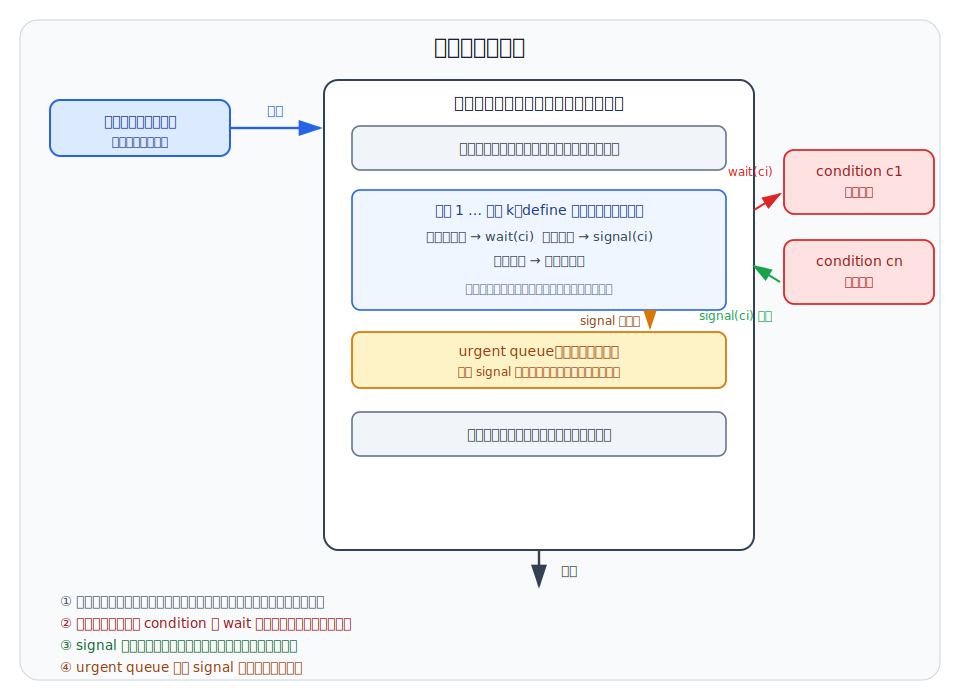
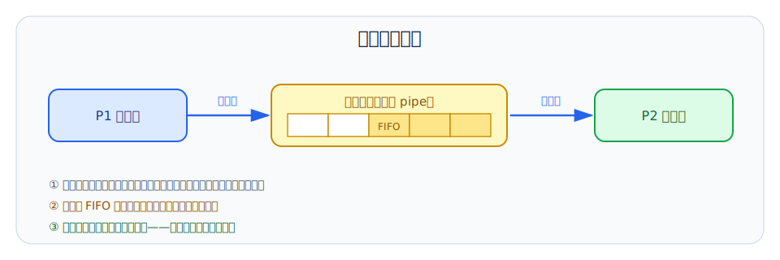
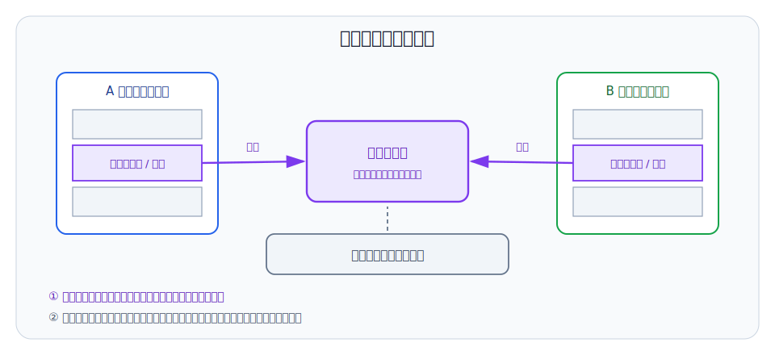

# 第 8 章：管程与进程通信

## 学习目标

- 说出信号量方案把同步逻辑分散在各进程中带来的三类风险，并解释管程如何用封装消除它们。
- 读懂管程的工作流程图：入口队列、条件变量等待队列和 urgent queue 分别在什么时刻收留进程。
- 解释 signal 之后"两个进程同时在管程内"的互斥冲突，并区分 Hoare 与 Hanson 两种解决方案。
- 用 mutex、next/next_count、x_sem/x_count 这套信号量写出 Hoare 管程的 wait、signal 和外部过程模板。
- 用管程改写生产者—消费者和哲学家进餐问题，并能按数据规模与同步需求为信号、管道、共享存储区、消息传递四种通信机制选型。

## 上章回顾

上一章我们拿到了第一件趁手的同步工具：记录型信号量把计数值和等待队列绑成原子的 P/V 操作，用阻塞与唤醒取代了忙等。靠着"共享变量配互斥信号量、等待条件配同步信号量"的固定套路，我们解开了生产者—消费者、哲学家进餐这些经典问题。但也留意到一个反复出现的麻烦：P/V 的正确性完全依赖每个进程把每一对操作写对、放对位置——例题里只是交换了两个 P 的顺序，整个系统就停了。

## 开篇问题

一个由二十个进程组成的系统用信号量同步，运行三个月后突然整体卡死。排查发现：某个新加入的进程在一条出错返回路径上忘了执行 V(mutex)。注意这个错误的形状——它不在共享资源那里，也不在其他十九个写对了的进程那里，而是散落在任何一个使用共享资源的代码角落里。只要有一个进程在任何一条路径上漏写、写反或写错一个 P/V，所有进程一起陪葬。高级语言曾用结构化语句把容易失控的 goto 关进笼子，同步逻辑能不能也这样办：把它从各进程里收回来，集中放进一个编译器看得住的结构里？

## 本章地图

本章前半部分回答上面的问题。我们先看清信号量方案的病根——同步逻辑分散、共享变量裸露，然后引入管程：把共享资源的数据结构和操作它的全部过程封装成一个语言成分，互斥由结构自动保证，等待和唤醒交给条件变量。管程的 signal 原语会带来"两个进程同时在管程内"的新麻烦，Hoare 和 Hanson 给出两种解法；我们还会用上一章的信号量亲手实现一个 Hoare 管程——这件事本身就证明两种工具表达能力相同。随后用管程重解生产者—消费者和哲学家进餐，看看封装带来了什么。后半部分把视野从"协调次序"放宽到"交换数据"：进程之间真正传递信息要靠通信机制，我们按信息规模从小到大依次考察信号、管道、共享存储区和消息传递。

## 正文

### 8.1 把分散的同步逻辑收进一个结构

先给上一章的方案做个体检。用信号量与 P/V 操作实现同步时，对共享资源的管理分散在各个进程中，进程能够直接修改共享变量。这带来三个层面的风险：系统层面，<u>不利于系统对临界资源的管理</u>——操作系统看不出哪些 P/V 属于哪个资源的访问协议；安全层面，难以防止进程<u>有意或无意</u>的违法同步操作——任何进程都可以跳过 P 直接动共享变量，或者恶意多执行一次 V；工程层面，容易造成程序设计错误——协议对不对，要把所有进程的代码摆在一起才能检查，开篇那个三个月后才发作的 bug 就是这么藏下来的。

三个风险指向同一个病根：**该集中的东西被分散了**。管程（monitor）的基本思想正是反着来：把分散在各进程中的临界区集中起来管理，把系统中的共享资源用数据结构抽象地表示出来。代表共享资源的数据结构，加上施加于它的一组操作过程，合在一起就构成了**管程**。进程不再直接碰共享变量，只能调用管程开放的过程；同步细节缩进管程内部，==集中管理临界区和同步逻辑==。

如果你接触过面向对象编程，会觉得这个思路眼熟：数据私有、方法公开，外界只能通过方法访问数据。管程正是把这种封装纪律用在并发上，而且它不是函数库，而是一种**程序设计语言结构成分**——由编译器参与检查和实现。表达能力上它并不比上一章的工具弱：==管程和信号量有同等的表达能力==。

> **核心判断**：信号量把同步逻辑分散到每个使用者手里，管程把同步逻辑集中到资源自己身上。两者能解的问题相同，不同的是出错的机会——前者的协议靠全体进程自觉遵守，后者的协议被编译器和结构锁死。

### 8.2 管程的结构与工作流程

#### 8.2.1 管程的基本结构

管程既然是语言成分，就有固定的语法骨架：

```pascal
TYPE <管程名> = MONITOR
  <管程变量说明>;
  define <（能被其他模块引用的）过程列表>;
  use <（要引用的外部模块定义的）过程列表>;

  procedure <过程名>(<形式参数>);
  begin
    <过程体>;
  end;
  { ……更多过程…… }
begin
  <管程的局部数据初始化语句>;
end.
```

骨架里的每个部分各司其职。开头的管程变量描述共享资源状态，比如缓冲区数组、计数器、指针——它们对外不可见，是被保护的对象。define 列出外部可调用过程，这是管程的全部门面：进程想动共享资源，只能从这张清单里挑一个过程来调用；use 则声明管程自己要引用的外部过程。末尾的 begin/end 初始化代码建立初始状态，在任何进程调用之前执行一次，保证共享变量从一个一致的起点出发。

#### 8.2.2 管程的工作流程

结构看懂了，再看进程在管程里怎么流动。管程对互斥的承诺是结构性的：<u>一次只允许一个进程在管程内执行</u>，这条规则由编译器和运行系统实现，不需要使用者写任何 P/V。于是管程外自然形成一支等待调用的进程队列——图 8-1 里的"管程等待区域"。



图 8-1 值得花一分钟读完整：它标出了进程在管程里的三种去处。顺利的路径是从入口进入、执行某个过程、从出口离开；不顺利时，进程会停在条件变量的等待队列上（②号路径）；还有一条容易被忽略的 urgent queue（④号路径），它收留的是发出 signal 之后暂时让位的进程——为什么需要这条队列，是 8.2.4 节的主题。

#### 8.2.3 条件变量：wait 与 signal

互斥解决了，同步还没有：进程进了管程，发现条件不满足——缓冲区是满的、资源被借空了——它不能继续，也不能抱着管程干等，否则能改变条件的进程永远进不来。管程为此提供**条件变量**（condition variable）：当调用管程过程的进程无法继续运行时，用于阻塞进程的一种设施。配套两个原语：

- **wait 原语**：当一个管程过程无法继续时，在某个条件变量上执行 wait，调用该过程的进程随即阻塞，进入这个条件变量的等待队列，同时<u>释放管程</u>让别的进程进来。
- **signal 原语**：另一个进程改变了条件后，对同一个条件变量执行 signal，唤醒在它上面等待的伙伴进程；每个条件变量维护自己的等待队列，等谁、由谁叫醒，一目了然。

> **易错点**：条件变量不是信号量。信号量有值，V 操作发出的"通行证"会被计数记住，迟到的 P 仍能领到；条件变量没有值，signal 时若无人等待，这次唤醒就<u>无声地消失</u>。所以管程过程必须先检查条件、不满足再 wait，顺序不能颠倒。

#### 8.2.4 signal 之后谁留下：Hoare 与 Hanson

signal 原语藏着一个微妙的冲突。设进程 Q 在条件变量 c 上等待，进程 P 在管程内执行 signal(c) 唤醒了 Q——此刻 P 还没离开管程，Q 又被唤醒要继续执行，两个进程同时"有权"留在管程中，这与管程的互斥性相违背。

> **思维停顿**：互斥保证是管程的立身之本，而 signal 是管程自己的原语——自家原语打破自家承诺，必须在语义层面补一条规则：signal 之后，P 和 Q 只能走一个，另一个去哪儿等？

两种修补方案，对应两种管程语义：

| 方案 | 规则 | 唤醒后的局面 |
|---|---|---|
| **Hoare 方法** | 执行 signal 的进程立即让出管程，到 urgent queue 等待，直到被唤醒的进程退出管程或再次等待 | 被唤醒者无缝接管，它等的条件此刻必然成立 |
| **Hanson 方法** | 限制 signal 只能作为过程体的最后一条语句 | signal 一执行完发出者就离开管程，同样没有共存 |

Hoare 选择==让 signal 发出者等待==，被唤醒者优先——代价是需要一条专门的 urgent queue 安置让位的进程，它比管程入口的普通队列优先级更高，毕竟让位者只是把话说到一半。Hanson 的限制更朴素：==signal 只能在过程体最后调用==，发出唤醒和离开管程合成一步，连让位都省了——代价是表达受限，一个过程里不能在中途报信再接着干活。本章后续实现和例子都采用 Hoare 语义。

### 8.3 用信号量实现 Hoare 管程

管程是语言成分，总要有人在底层把它造出来。Hoare 的实现方案恰好用的是上一章的信号量与 P/V 操作——读完这一节你会对"两者表达能力相同"有具体的体感：管程能用信号量实现，信号量也能装进管程里提供。

#### 8.3.1 实现需要哪些信号量

每个管程引入两个信号量和一个计数器，打包成一条接口记录；每个条件变量再配一对：

```c
TYPE interf = RECORD
  semaphore mutex = 1;   /* 互斥进入管程 */
  semaphore next  = 0;   /* signal 发出者在此挂起 */
  int next_count  = 0;   /* next 上等待的进程数 */
END;

/* 每个条件变量 x 配套： */
semaphore x_sem = 0;
int x_count = 0;
```

| 成分 | 初值 | 职责 |
|---|---|---|
| `mutex` | 1 | mutex 保证互斥进入管程：任何外部过程都先 P(mutex) 再执行过程体 |
| `next` | 0 | next 挂起发出 signal 的进程，把执行权让给被唤醒者——它就是 urgent queue |
| `next_count` | 0 | next_count 统计 urgent queue 上等待的进程数，离开管程时据此决定先放谁 |
| `x_sem` 与 `x_count` | 0 与 0 | x_sem/x_count 对应条件变量等待队列：x_sem 让等待者睡眠，x_count 记录等待人数 |

三个信号量的初值印证了各自的角色：mutex 初值 1 是一把开着的锁；next 和 x_sem 初值 0，是纯粹的"睡觉地点"，只能先有人 V 才放行。

#### 8.3.2 wait 与 signal 的代码

```c
void wait(semaphore x_sem, int x_count, interf IM) {
  x_count++;                  /* 登记：又多一个等条件的 */
  if (IM.next_count > 0)
    V(IM.next);               /* 优先放行 urgent queue 里让位的进程 */
  else
    V(IM.mutex);              /* 没有让位者，开门放新进程 */
  P(x_sem);                   /* 自己睡到条件变量队列上 */
  x_count--;                  /* 醒来：等待结束，注销登记 */
}

void signal(semaphore x_sem, int x_count, interf IM) {
  if (x_count > 0) {          /* 有人等才动作；没人等就什么都不发生 */
    IM.next_count++;
    V(x_sem);                 /* 唤醒条件队列上的等待者 */
    P(IM.next);               /* 自己挂到 urgent queue，让出管程 */
    IM.next_count--;
  }
}
```

wait 的关键在睡下之前的让路动作：管程马上要空出来，让给谁？若 urgent queue 上有让位的进程（next_count > 0），它优先回来把话说完；否则才 V(mutex) 放进新调用者。signal 的代码则把 Hoare 语义一字不差地翻译了出来——先 V(x_sem) 唤醒等待者，再 P(IM.next) 把自己挂起，"唤醒"与"让位"连成原子的一步。注意 if (x_count > 0) 这个判断：它就是 8.2.3 节易错点的代码形态，<u>无人等待的 signal 是空操作</u>，不留任何痕迹。

#### 8.3.3 外部过程的进出模板

最后一块拼图是 define 清单上的每个外部过程，它们必须套进统一的进出模板，互斥才有保证：

```c
P(IM.mutex);                  /* 进门：拿到管程的互斥权 */
  ...                         /* 过程体 */
if (IM.next_count > 0)
  V(IM.next);                 /* 出门：优先放行 urgent queue */
else
  V(IM.mutex);                /* 否则开门放新进程 */
```

出口处的两行判断和 wait 里的完全相同——这不是巧合，而是同一条原则的两次落实：<u>管程空出来时，让位者优先于新来者</u>。把 8.3 节三段代码连起来读：mutex 管大门，x_sem 管条件队列，next 管让位队列，三支队列的进出全部由 P/V 驱动。编译器为每个管程生成这套代码，程序员就再也不用手写它们了。

### 8.4 用管程解经典同步问题

#### 8.4.1 生产者—消费者：条件变量替掉同步信号量

用管程重写上一章的核心例题，对比会非常直观。把缓冲区、指针、计数连同 insert/remove 两个过程一起封进管程，再设 full、empty 两个条件变量：

```pascal
TYPE producer-consumer = MONITOR
  var buffer: array[0..k-1] of item;
      in, out: 0..k-1;
      count: 0..k;
      full, empty: condition;     { full：等"不满"；empty：等"不空" }
  define insert, remove;
  use wait, signal;

  procedure insert(x: item);
  begin
    if count = k then wait(full);     { 缓冲已满，生产者等 }
    buffer[in] := x;
    in := (in + 1) mod k;
    count := count + 1;
    signal(empty);                    { 报信：现在肯定不空 }
  end;

  procedure remove(var x: item);
  begin
    if count = 0 then wait(empty);    { 缓冲已空，消费者等 }
    x := buffer[out];
    out := (out + 1) mod k;
    count := count - 1;
    signal(full);                     { 报信：现在肯定不满 }
  end;
begin
  in := 0; out := 0; count := 0;
end.
```

对照需求走一遍：缓冲满时 producer 在 full 上 wait，让出管程直到有消费者腾出空位；缓冲空时 consumer 在 empty 上 wait，等生产者送来产品；插入后 signal(empty)，移除后 signal(full)——每次状态改变都顺手通知可能在等的那一方。条件变量的名字描述的是"卡住的原因"：在 full 上等的是被"满"卡住的生产者，在 empty 上等的是被"空"卡住的消费者。

再对照上一章的信号量版本，变化一目了然：mutex 信号量消失了——互斥由管程结构自动提供；buf 和 product 两个同步信号量降格成普通整型 count 加两个条件变量——计数与等待分了家，count 只负责记录，等待交给 wait/signal。上一章"先同步后互斥"的顺序纪律在这里根本无从违反，因为程序员手里已经没有互斥操作可写。

#### 8.4.2 语言里的管程：Java 与 pthread

管程思想离实践并不远，主流语言和线程库内置的正是它的变体：

| 实现层 | 写法 | 要点 |
|---|---|---|
| Java 语言级 | `synchronized` 方法 + `wait()`/`notify()` | Java 示例使用 monitor 对象和 wait/notify 思路：每个对象自带一把监视器锁，synchronized 方法互斥执行，条件不满足时 wait，状态改变后 notify 唤醒 |
| pthread 库级 | `pthread_mutex_t` + `pthread_cond_t` | pthread 示例使用 pthread_mutex 与 condition：互斥锁包住共享数据操作，pthread_cond_wait 睡眠时自动放锁、醒来重新拿锁 |
| 共同点 | 互斥与条件等待打包提供 | 语言或库级管程把互斥与条件等待组合起来，程序员描述"等什么条件"，而不是手工排布 P/V 的顺序 |

用 Java 写生产者—消费者，insert/remove 写成同一个对象的两个 synchronized 方法，缓冲满了调 wait()、插入后调 notify()——结构与 8.4.1 的管程逐行对应。pthread 没有语言级语法，但 mutex 加 condition 的组合提供了同样的两件套。可见管程不只是教科书构造：你在工程里写下的每个 synchronized，背后都是这一章的机制。

#### 8.4.3 哲学家进餐：把申请顺序问题变成状态判断

第 7 章解哲学家问题时，我们靠"至多四人同时取叉"打破等待圈——约束的是进程的**行为**。管程方案换了思路：约束**状态**。把五个人的状态收进一个数组集中判断，"能不能吃"不再由各人抓叉子试出来，而是由管程一次裁定：

```pascal
TYPE dining-philosophers = MONITOR
  var state: array[0..4] of (thinking, hungry, eating);
      self: array[0..4] of condition;   { 每人一个条件变量 }
  define pickup, putdown;
  use wait, signal;

  procedure test(k: 0..4);
  begin
    if (state[(k-1) mod 5] <> eating) and (state[k] = hungry)
       and (state[(k+1) mod 5] <> eating) then begin
      state[k] := eating;               { 两侧都没人吃，k 开吃 }
      signal(self[k]);                  { 若 k 正在等，叫醒它 }
    end;
  end;

  procedure pickup(i: 0..4);
  begin
    state[i] := hungry;
    test(i);                            { 试试自己能不能吃 }
    if state[i] <> eating then wait(self[i]);
  end;

  procedure putdown(i: 0..4);
  begin
    state[i] := thinking;
    test((i-1) mod 5);                  { 我放下叉子，左邻居有机会了吗 }
    test((i+1) mod 5);                  { 右邻居呢 }
  end;
begin
  for i := 0 to 4 do state[i] := thinking;
end.
```

整个方案的控制流可以压缩成四步：

1. 进餐前调用 pickup：pickup 将自己置为 hungry 并 test 自己能否进餐。
2. test 失败、不能 eating 时 wait(self[i])，哲学家挂在自己专属的条件变量上等待。
3. 进餐结束调用 putdown：putdown 将自己置为 thinking 并测试左右邻居，替他们检查机会。
4. test 在左右邻居不 eating 且自己 hungry 时置为 eating 并 signal(self[k])，被唤醒的哲学家从 wait 返回时已经处于进餐状态。

留意第 4 步的精妙之处：test 把"判断条件、修改状态、发出唤醒"三件事打包在管程互斥的保护下完成，被唤醒者醒来时<u>不需要再抢任何叉子</u>——它的 eating 状态在唤醒前就已写好。第 7 章的死锁隐患来自"拿左叉、等右叉"两次独立申请之间的缝隙；这里申请变成了一次原子的状态判断，要么两侧叉子一起到手，要么一根也不占着，"占有并等待"的局面从根上消失。第 9 章讨论死锁的必要条件时，可以回头把这个方案当作"破坏占有并等待"的标准示例。

#### 8.4.4 管程不是进程

管程和进程都是教材里的"主角级"概念，初学时容易混作一团。把它们摆在一起对照：

| 维度 | 管程 | 进程 |
|---|---|---|
| 数据结构 | 定义**公共**数据结构，代表共享资源 | 定义**私有**数据结构（如 PCB） |
| 同步逻辑 | 把共享变量上的同步操作集中在管程内 | 临界区分散在各进程代码中 |
| 存在目的 | 为管理共享资源而建立 | 为占有资源、实现系统并发而存在 |
| 工作方式 | 与调用它的进程串行工作 | 进程之间可并行工作 |
| 生命周期 | 由编程语言实现，静态存在 | 动态产生和消亡，有创建与撤销 |

> **易错点**：管程静态存在，进程动态产生和消亡。管程是被进程调用的语言结构，自己没有生命周期，也不会被调度——说"管程在运行"，实际运行的永远是调用它的那个进程。

### 8.5 进程通信：从协调走向交换数据

到这里，并发进程之间"管次序"的问题——互斥与同步——已经有了两层工具。但进程间的交互不止于此：进程通信服务于==竞争互斥、协作同步和交换数据==三类需求，前两类是特殊形式的通信（传递的只是"该谁走"这一位信息），第三类才是字面意义的通信——把成块的数据从一个地址空间送进另一个。常见的通信机制有四种：信号、共享文件（管道）、共享存储区和消息传递，按能承载的信息规模从小到大排列。

#### 8.5.1 信号：最轻的通知

**信号通信**又称软中断，是最简单的通信机制：通过发送一个特定的信号，通知进程某个异常事件发生。信号可以由内核发送给进程，也可以由一个进程发送给另一个进程；Unix 系的 SIGHUP、SIGKILL、SIGCHLD 等信号用于进程终止与状态通知，Minix 中对应 sigaction 系统调用。信号承载的信息量极小——本质上只有"哪个事件发生了"这一个编号，适合报告异常，不适合传数据。顺带把术语理清：这里的信号（signal）是一种通信机制，与管程的 signal 原语、信号量（semaphore）是三个不同的概念，只是都借了"发信号"这个日常词。

#### 8.5.2 管道：用共享文件传字节流

要传成流的数据，最经典的机制是**管道**（pipe）：引入一个特殊的共享文件连接两个读写进程，写进程从一端写入字节流，读进程从另一端读出。



图 8-2 的三条注释覆盖了管道的全部要点：连接、次序与同步。管道允许进程按<u>先进先出</u>的方式传送数据，也能使进程同步执行操作——写满了写者阻塞、读空了读者阻塞，数据流动的节奏天然带着同步关系。实现上管道借助文件系统的机制：管道文件的创建、打开、关闭和读写都沿用文件那一套；进程对共享文件互斥使用，一个进程正在读或写时另一个必须等待；由于共享文件有大小限制，通信双方必须正确同步，且必须知道对方是否存在。

> **易错点**：普通管道通常只能连接有共同祖先的进程且具有临时性，难以提供全局服务；有名管道（FIFO）补上了这两个短板——它有 Unix 文件名和访问权限，是永久性通信机制，性能与普通管道相同。

#### 8.5.3 共享存储区：最快的通信方式

管道的数据要经过共享文件中转，量大时开销可观。**共享存储区**机制砍掉中转：进程向系统申请一个共享分区段并指定关键字；若该分区已分配给其他进程，系统把对应关键字返回给申请者；随后分区段被连接到进程的虚地址空间，进程对它直接读写，数据一步到位——这是==进程通信中最快捷和有效的方法==。



图 8-3 里内核的位置值得注意：它只出现在"建立映射"的虚线上，不在数据通路上。映射建好之后，A、B 两个进程读写共享区就像读写自己的变量，没有系统调用、没有数据拷贝。

> **常见误区**：共享存储区"快"不等于"省心"。内核只负责建立映射，对共享区上的并发读写不做任何仲裁——多个进程同时写就是第 7 章的竞争条件。需要额外同步机制避免竞争：信号量或管程在这里重新登场，通信机制和同步机制是搭档而不是替代。

#### 8.5.4 消息传递：把信号扩展成信息单元

把信号沿"信息规模"的方向扩展，从低级通知变成高级通信，就得到**消息传递**机制：传递的不再是一个事件编号，而是一组有结构的信息——**消息**，由消息头和消息体组成。消息头携带发送者、接收者、类型、长度等管理信息，消息体装数据。两个基本原语：send 发出消息，receive 接收消息。它们既可以实现为同步操作，也可以实现为异步操作；常见的搭配是 <u>异步 send、同步 receive</u>——发送者投递完就走，接收者没有消息时阻塞等待，恰好与"生产者尽管生产、消费者等货上门"的直觉一致。

#### 8.5.5 四种机制怎么选

| 机制 | 传递内容 | 信息规模 | 同步配合 | 典型场景 |
|---|---|---|---|---|
| 信号 | 事件编号 | 最小 | 自带通知语义 | 异常事件、进程终止通知 |
| 管道 | FIFO 字节流 | 中 | 读写阻塞内建同步 | 有亲缘关系进程间的流式数据 |
| 共享存储区 | 任意结构数据 | 最大 | 不提供，需另配同步机制 | 大量数据高频交换 |
| 消息传递 | 消息头+消息体 | 中 | send/receive 可同步可异步 | 通用通信，易于扩展到分布式 |

选型的主线是信息规模与同步代价的权衡：通知用信号，流数据用管道，大块数据用共享存储区但自带同步责任，结构化通用通信用消息传递。

## 例题讲解

**例题一：** Hoare 管程中，进程 Q 在条件变量 c 上等待，进程 P 在管程内执行了 signal(c)。请按 8.3 节的实现，逐步说明接下来 P、Q 的执行权交接过程；若 c 上无人等待，又会发生什么？

**解答：** 有人等待时，signal 的代码依次执行：c 的等待计数 x_count > 0 成立，于是 next_count 加 1、V(x_sem) 唤醒 Q、P 自己执行 P(IM.next) 挂到 urgent queue 上——执行权移交给 Q，且 Q 等待的条件此刻必然成立，可直接继续。Q 随后有两种走法：若它执行完过程体离开管程，出口模板检查到 next_count > 0，执行 V(next) 而不是 V(mutex)，把 P 从 urgent queue 放回来继续执行 signal 之后的语句；若 Q 中途再次 wait，wait 里同样优先 V(next) 放行 P。若 c 上无人等待，x_count = 0，signal 的 if 不成立，整个调用是空操作——什么也不改变，这次"唤醒"不会像信号量的 V 那样被记下来。

**例题二：** 某同学担心管程版生产者—消费者（8.4.1）的 insert 过程不安全，在过程体首尾自行加上了 P(s) 和 V(s)（s 是初值为 1 的信号量）。请评价这个改动。

**解答：** 改动有害无益。首先它是冗余的：管程结构已保证一次只有一个进程在管程内执行，insert 不可能被并发进入，s 永远不会出现争用。更糟的是它引入了第 7 章"持锁等条件"的死锁：设缓冲已满，生产者拿着 s 执行到 wait(full) 睡下——wait 只释放管程的互斥权（V(mutex) 或 V(next)），并不知道也不会释放程序员私加的 s；消费者随后调用 remove 进入管程，若它也被套上同一个 s，就会在 P(s) 上永久等待，谁也无法 signal(full)。结论：管程内不应再使用信号量做互斥，封装的意义正是让程序员交出这件事。

## 常见误区

- **把管程当成进程。** 管程是静态的语言结构，没有生命周期、不参与调度；"管程在工作"时真正运行的是调用它的进程，且管程与调用者串行工作。
- **三个"signal"混为一谈。** 信号量的 V 操作（有的教材也叫 signal）会被计数记住；管程的 signal 原语无人等待就消失；信号通信（软中断）是一种进程间通知机制。名字相近，语义各异。
- **以为条件变量像信号量一样存得住唤醒。** 条件变量没有值，必须"先检查条件、不满足再 wait"；指望先 signal 后 wait 也能配对，是管程程序设计的典型错误。
- **忘了 signal 之后的互斥冲突。** 被唤醒者和发出者不能同时留在管程中；Hoare 用 urgent queue 让发出者让位，Hanson 干脆限制 signal 只能放在过程体末尾。
- **以为共享存储区开箱即用。** 内核只建立映射，不仲裁并发读写；不配信号量或管程就直接共享写，等于把第 7 章的竞争条件重演一遍。
- **在管程过程里再加互斥信号量。** 轻则冗余，重则持锁等条件而死锁——例题二就是完整推演。

## 本章小结

信号量把同步逻辑分散在每个进程手里，错一处、瘫一片；管程反其道而行，把共享资源的数据结构与全部操作过程封装成语言成分，互斥由结构自动保证，等待与唤醒交给条件变量的 wait/signal。signal 带来"两个进程同时在管程内"的冲突，Hoare 让发出者到 urgent queue 让位，Hanson 限制 signal 只能收尾；用 mutex、next、x_sem 三组信号量就能实现 Hoare 语义，也反过来证明管程与信号量表达能力相同。生产者—消费者和哲学家进餐的管程解法展示了封装的红利：互斥代码消失，死锁隐患化为集中的状态判断。最后，进程交互从协调次序走向交换数据：信号传事件、管道传字节流、共享存储区直接共享地址空间但需自配同步、消息传递用 send/receive 搬运结构化信息——机制按信息规模递进，而同步始终是通信的搭档。

## 关键术语

**管程（monitor）** 把代表共享资源的数据结构及其操作过程封装在一起的程序设计语言结构成分，互斥由结构自动保证。

**条件变量（condition variable）** 管程内供无法继续的进程阻塞等待的设施，没有计数值，配 wait/signal 两个原语。

**wait 原语（wait primitive）** 使调用管程过程的进程在某条件变量上阻塞并释放管程。

**signal 原语（signal primitive）** 唤醒在同一条件变量上等待的进程；无人等待时不产生任何效果。

**Hoare 管程（Hoare monitor）** signal 发出者立即让出管程、到 urgent queue 等待的管程语义，可用信号量与 P/V 操作实现。

**紧急等待队列（urgent queue）** 收留发出 signal 后让位进程的队列，进程离开管程或再次等待时优先放行其中的进程。

**信号通信（signal communication）** 又称软中断，通过发送事件编号通知进程异常事件的低级通信机制。

**管道（pipe）** 连接读写进程的共享文件，按先进先出方式传送字节流，读写阻塞自带同步关系。

**有名管道（named pipe / FIFO）** 具有 Unix 文件名和访问权限的永久性管道，可服务无亲缘关系的进程。

**共享存储区（shared memory）** 映射到多个进程虚地址空间的存储分区，进程直接读写交换数据，是最快的通信机制。

**消息传递（message passing）** 以消息头加消息体为单位、用 send/receive 原语收发信息的通信机制。

## 练习与解答

1. 条件变量的 signal 与信号量的 V 操作，在"无人等待"时的行为有什么本质区别？这个区别如何影响管程过程的写法？

   **解答**：V 操作总会把计数值加 1，相当于发出一张会被记住的通行证，之后哪个进程执行 P 都能领到；条件变量没有值，signal 时若等待队列为空，这次唤醒直接消失。因此管程过程必须遵循"先检查条件，不满足再 wait"的写法，绝不能依赖"对方会先 signal、我后 wait 也来得及"的时序假设。

2. Hoare 实现中，外部过程出口处为什么写成 if next_count > 0 then V(next) else V(mutex)，而不是无条件 V(mutex)？

   **解答**：urgent queue 上挂着的是发出 signal 后让位的进程，它们的过程体只执行到一半。若出口无条件 V(mutex)，新调用者会和让位者形成竞争，让位者可能迟迟回不来，signal 之后的收尾语句被无限推迟。优先 V(next) 保证"话说一半"的进程先把话说完，管程内的执行次序才与 Hoare 语义一致。

3. 哲学家管程方案中，putdown 为什么调用 test((i-1) mod 5) 和 test((i+1) mod 5)，而不是直接 signal(self[(i-1) mod 5]) 和 signal(self[(i+1) mod 5])？

   **解答**：邻居能否进餐取决于三个条件：它自己 hungry，且它的左右两侧都不在 eating——我放下叉子只满足了其中一侧。直接 signal 会把没资格进餐的邻居唤醒：它从 wait 返回时 state 仍不是 eating，却已经离开了等待队列，方案随即失效。test 先在管程互斥保护下完成完整判断，只有条件全部成立才置 eating 并 signal，保证被唤醒者醒来即可进餐。

4. 一个数据库进程和一个分析进程要高频交换数百 MB 的中间结果，应选哪种通信机制？使用时还要补什么？

   **解答**：选共享存储区——数据不经内核中转、无拷贝开销，是四种机制中规模最大、速度最快的。但内核只负责建立映射，必须另配同步机制避免竞争：例如用信号量实现"写完才能读、读完才能写"的交替，或把共享区的访问封进一个管程，让结构替程序员守住互斥。

5. 消息传递的 send 和 receive 为什么常实现为"异步 send、同步 receive"？

   **解答**：发送者通常不关心对方何时取走消息，异步 send 让它投递后立即继续工作，不被接收方的节奏拖住；接收者没有消息时往往无事可做，同步 receive 让它阻塞等待，消息一到即被唤醒。这个组合与生产者—消费者的缓冲直觉一致：发送端尽管投递，接收端按需取货，吞吐与响应都不吃亏。

## 覆盖记录

- OSPPT-CH03-MONITOR-CONCEPT-AND-SIGNAL
- OSPPT-CH03-MONITOR-IMPLEMENTATIONS-AND-EXAMPLES
- OSPPT-CH03-IPC-MECHANISMS
