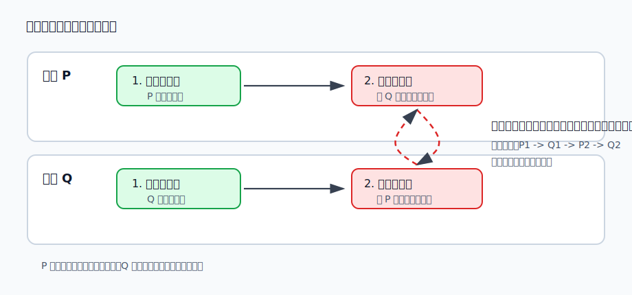
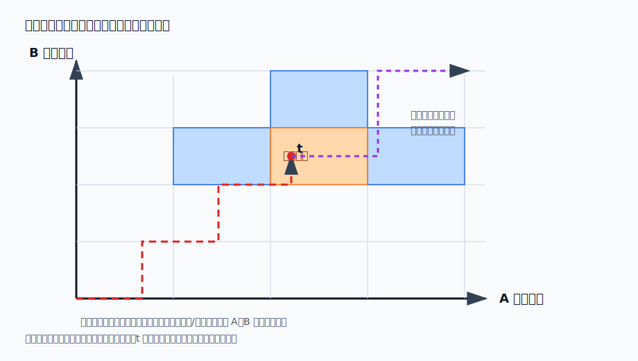
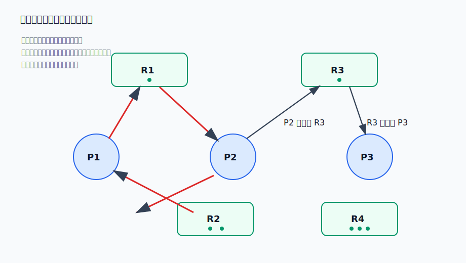

# 第 9 章：死锁——条件、防止、避免与检测

## 学习目标

- 用资源申请、使用、归还的过程解释死锁为什么会让一组进程永久等待。
- 判断一个系统是否同时满足互斥、占有并等待、不剥夺和循环等待四个必要条件，并说出破坏任一条件对应的防止策略。
- 区分死锁防止、死锁避免、死锁检测与死锁解除四种处理思路。
- 用资源轨迹图和银行家算法判断一次资源申请是否会把系统带入不安全状态。
- 读懂资源分配图，说明单实例与多实例资源下“有环”的判断差别，并按完全化简步骤检测死锁。
- 说明死锁解除的三类做法及其代价。

## 上章回顾

上一章把信号量方案中的同步协议收进了管程，用封装和条件变量降低了写错 P/V 的风险；同时也看到，进程之间不只要同步次序，还要通过管道、共享存储区、消息等机制交换数据。无论工具多高级，底层问题都没有消失：多个进程会同时争用有限资源，而且有些资源一旦被占住，别人只能等。本章就讨论这种“等着等着谁也走不了”的极端情形。

## 开篇问题

两个进程都要读卡机和打印机。进程 P 先拿到读卡机，再申请打印机；进程 Q 先拿到打印机，再申请读卡机。此时 P 等 Q 释放打印机，Q 等 P 释放读卡机。它们都不是被调度器忘了，也不是 CPU 不够用，而是各自都握着对方继续运行所需的资源。这样的系统该怎样识别、怎样预防，又在已经发生时怎样拆开？

## 本章地图

本章按处理死锁的时间顺序展开。先定义死锁，抓住它发生所需的四个必要条件；再看死锁防止如何通过破坏条件换取确定安全；随后进入死锁避免：系统不拒绝所有危险动作，而是在每次分配前判断未来是否还存在安全序列。最后讨论死锁检测与解除——当系统允许风险存在时，就必须能发现它、恢复它，并承担终止、回滚或抢占资源的代价。

## 正文

### 9.1 死锁从哪里来

**死锁（deadlock）** 是指一组进程中的每个进程都在等待只能由该组中其他进程引发的事件，于是所有进程都无法继续推进。独占资源的使用通常经历三个动作：申请、使用、归还。只要资源是独占的，进程在申请不到时就会等待；只要多个进程以交错顺序申请多个资源，就可能形成相互等待。

图 9-1 把开篇问题画成一条执行序列。P 先请求读卡机再请求打印机；Q 先请求打印机再请求读卡机。若各自持有一个资源后再请求另一个资源，会相互等待。这里最要紧的不是“谁先谁后”这个偶然顺序，而是系统进入了一个没有外力就无法离开的等待环。

> **核心判断**：独占资源的使用通常经历申请、使用、归还；多个进程交错申请多个资源可能形成死锁。

死锁并不只来自读卡机、打印机这类看得见的硬件设备。同步原语、同类资源份额、临时性消息都可能成为等待链的一部分。

| 场景 | 如何形成等待 | 结论 |
|---|---|---|
| P/V 顺序交错 | P/V 顺序交错可能形成相互等待，例如 P1 等 P3 的信件 S3，P2 等 P1 的信件 S1，P3 等 P2 的信件 S2。 | 死锁不一定只来自硬件资源。 |
| 同类资源轮流分配 | 5 个进程各需 2 个同类资源而每人先分 1 个会阻塞；每个进程都差 1 个资源才能继续，但系统没有剩余资源。 | 同类资源数量不足且分配策略不当，也会形成死锁。 |
| 临时性资源无约束 | 进程通信中，信件、缓冲区或消息可被看作临时性资源；如果发送与等待顺序闭合，也会卡住。 | 死锁不一定只来自硬件资源。 |

从进程状态看，死锁中的进程通常处于阻塞态；但阻塞不等于死锁。等待键盘输入、等待 I/O 完成、等待某个条件变量都可能只是正常阻塞。死锁的特殊性在于：等待事件只能由同一组被阻塞进程产生，而它们又都无法推进。

### 9.2 Coffman 条件与死锁防止

判断死锁时，最常用的是 Coffman 四个必要条件：

| 条件 | 含义 | 典型破坏方法 |
|---|---|---|
| 互斥 | 至少有一种资源一次只能被一个进程使用 | 尽量把独占资源改造成可共享资源，例如只读文件共享 |
| 占有并等待 | 进程已经占有至少一个资源，同时还在等待其他资源 | 静态分配：运行前一次申请所需全部资源 |
| 不剥夺 | 已分配给进程的资源不能被强行夺走，只能由进程主动释放 | 允许系统在必要时抢占资源并回滚进程状态 |
| 循环等待 | 存在进程等待环，每个进程都等待下一个进程持有的资源 | 层次分配：按资源编号递增顺序申请 |

> **核心判断**：Coffman 四个必要条件是互斥、占有并等待、不剥夺和循环等待；破坏任一条件即可防止死锁。

“必要条件”这个词要读准：只要死锁已经发生，四个条件一定同时成立；但看到其中几个条件，并不能立刻断言死锁已经发生。死锁防止（deadlock prevention）的思路很硬：系统设计时主动破坏某个必要条件，让死锁从结构上不可能出现。

最典型的两种策略都不免费。**静态分配策略** 要求进程在运行前一次性申请全部资源，拿不到就一个也不拿，从而破坏占有并等待。它简单可靠，但资源利用率低，进程可能长期等齐一整套资源。**层次分配策略** 给资源编号，规定进程只能按递增顺序申请资源，从而破坏循环等待。它比静态分配灵活，却限制了程序自然的申请顺序，也要求系统预先给资源排出合理层次。

> **易错点**：静态分配策略破坏占有并等待但资源利用率低；层次分配策略破坏循环等待但限制资源申请顺序。

防止策略的特点是保守：它不问这一次具体申请是否真的会把系统带进死锁，只要动作违反规则就不允许。接下来的死锁避免则细一些：它承认有些状态看起来接近危险，但只要还能安排一条让所有进程完成的路，就可以继续分配。

### 9.3 避免死锁：把每次分配放进未来轨迹里看

**死锁避免（deadlock avoidance）** 不像防止那样从制度上砍掉某个必要条件，而是在每次分配前做一次预测：如果满足这次申请后，系统仍存在一种调度顺序，使所有进程最终拿到最大需求并归还资源，那么这次分配就是安全的；否则让申请者等待。

两个概念要先立住。**安全状态（safe state）** 是指系统存在至少一个**安全序列（safe sequence）**，按这个序列推进时，每个进程都能在前面进程释放资源后得到自己还缺的资源并完成。**不安全状态（unsafe state）** 不是死锁本身，而是“已经找不到安全保证”的状态；它可能后来走出危险，也可能在某个推进顺序下进入死锁。

> **核心判断**：安全状态一定没有死锁；不安全状态不一定已经死锁，但系统不能保证后续所有推进都能完成。

资源轨迹图是建立避免思想的直观工具。它把两个进程的执行进度画成平面上的一点，横轴是 A 进程，纵轴是 B 进程；阴影区域表示 A、B 同时占有某些单实例资源的组合状态。

图 9-2 的价值在于把“当前能不能分配”转成“后面还有没有路”。资源轨迹图适合两个进程和单实例资源；进入同时持有资源的危险区域可能导致死锁；t 时刻分配要判断后续轨迹是否仍安全。它直观、好画，但适用范围很窄。

> **易错点**：资源轨迹图直观简单，但只适合两个进程且资源为单实例的情形。

真实系统里进程数、资源类型和资源实例数都可能更多，这时就需要银行家算法。

### 9.4 银行家算法：安全序列是分配前的闸门

**银行家算法（banker's algorithm）** 的名字来自贷款比喻。银行并不是有钱就借，而是先判断：如果把这笔钱借出去，是否仍能通过某种还款顺序让所有客户最终拿到其最大贷款额度并还清贷款。操作系统也类似：资源申请先试探性满足，再运行安全性测试；若存在安全序列，就正式分配，否则撤回试探、让进程等待。

一个资金小例子足以看出算法的精神。银行总资金 10，四个客户的当前贷款和最大贷款如下：张三 1/6，李四 1/5，王五 2/4，赵六 4/7，初始可用资金为 2。现在李四和王五都申请 1 个单位资金，判断完全不同。

| 申请对象 | 分配后状态 | 安全性判断 |
|---|---|---|
| 李四申请 1 个单位 | 张三 1/6，李四 2/5，王五 2/4，赵六 4/7；可用资金为 1。 | 李四申请后可用资金为 1 且无客户能完成，状态不安全；无安全序列，应让李四等待。 |
| 王五申请 1 个单位 | 张三 1/6，李四 1/5，王五 3/4，赵六 4/7；可用资金为 1。 | 王五申请后存在王五、李四、张三、赵六安全序列，状态安全；王五先完成可释放资金并形成安全序列。 |
| 原始资金结构 | 总资金 10，客户有已贷款和最大贷款列；初始可用资金为 2。 | 银行家只批准能让系统保留安全序列的申请。 |

这个例子的反直觉处在于：两个人都只申请 1 个单位，但一个被拒绝，一个被批准。算法看的不是申请量大小，而是满足申请后能不能让某个客户先完成，从而释放资源，带动后面的人依次完成。

多资源版本把上面的口算写成向量和矩阵。常用符号如下：

| 符号 | 含义 |
|---|---|
| `Resource` | 系统中每类资源的总数 |
| `Available` | 当前可用资源向量 |
| `Claim` | 每个进程声明的最大需求矩阵 |
| `Allocation` | 当前已经分配给各进程的资源矩阵 |
| `Need = Claim - Allocation` | 每个进程还需要的资源矩阵 |
| `CurrentAvail` | 安全性测试过程中临时维护的可用向量 |
| `Possible` | 某进程在当前 `CurrentAvail` 下是否能完成 |

安全性测试的步骤可以写得很机械：

1. 令 `CurrentAvail = Available`，所有进程先标记为未完成。
2. 寻找一个未完成进程 `Pk`，使 `Need[k] <= CurrentAvail`。
3. 若找到这样的进程，假设它运行结束并释放资源，令 `CurrentAvail = CurrentAvail + Allocation[k]`，并把它加入安全序列。
4. 重复第 2、3 步，直到所有进程完成，或再也找不到可完成进程。
5. 若所有进程都完成，则状态安全；否则状态不安全。

下面的表把一次安全性测试压缩成可扫读的执行轨迹。初始 `Available = (3, 3, 2)`，`Resource = (10, 5, 7)`。

| 进程 | CurrentAvail | Ck-Ak | Allocation | 判断 |
|---|---|---|---|---|
| P1 | (3, 3, 2) | (1, 2, 2) | (2, 0, 0) | 逐行比较 Ck-Ak 与 CurrentAvail，P1 可完成，释放 Allocation 后 CurrentAvail 变为 (5, 3, 2)。 |
| P3 | (5, 3, 2) | (0, 1, 1) | (2, 1, 1) | 可完成进程释放 Allocation 后更新 CurrentAvail，得到 (7, 4, 3)。 |
| P0 | (7, 4, 3) | (7, 4, 3) | (0, 1, 0) | P0 正好可完成，释放后得到 (7, 5, 3)。 |
| P2 | (7, 5, 3) | (6, 0, 0) | (3, 0, 2) | P2 可完成，释放后得到 (10, 5, 5)。 |
| P4 | (10, 5, 5) | (4, 3, 1) | (0, 0, 2) | 所有进程 possible 为 T 表示安全。 |

银行家算法很漂亮，也很苛刻。它要求进程预先声明最大需求，且进程数与资源类型数固定；它还默认进程之间没有额外同步要求，否则“资源够”不代表“进程能按算法设想的顺序完成”。

> **常见误区**：银行家算法要求进程预知最大需求、进程间无同步要求、进程数与资源数固定，因此现实适用范围有限。

### 9.5 检测死锁：资源分配图和化简

如果系统既不使用严格防止，也不在每次分配前运行避免算法，那就必须接受一种后果：死锁可能发生。此时策略变成**死锁检测（deadlock detection）**：周期性或在资源紧张时检查系统状态，确认是否存在死锁，再进入解除阶段。

资源分配图是检测的基本语言。图中有两类节点：进程节点和资源节点。申请边从进程指向资源，表示进程正在等待该资源；分配边从资源指向进程，表示资源实例已经分配给该进程。

图 9-3 中，进程节点与资源节点构成二部图，申请边从进程指向资源，分配边从资源指向进程，图中环路用于判断死锁可能性。判断环路时要看资源实例数：==单实例资源分配图有环意味着死锁==；多实例资源有环只是死锁必要条件而非充分条件。这是本节最容易错的判断题。

多实例资源下，单纯找环不够，需要做**完全化简**。它的思路和银行家安全性测试很像：找一个申请能被当前可用资源满足的进程，假设它完成并释放已经占有的资源，然后删除这个进程及其相关边。

1. 先找可满足申请并能完成的进程。
2. 删除完成进程及其占用/申请边。
3. 反复化简直到图为空或不能继续。

如果所有进程最终都能化成孤立点，就说明没有死锁；如果化简停住，剩下的进程和资源构成死锁相关子图。

多类资源多实例检测也可以写成矩阵。下面这组符号常见于考题：

| 符号 | 含义 | 本例 |
|---|---|---|
| `E` | E 表示总资源向量 | `E = (4, 2, 3, 1)`，对应 Tape drives、Plotters、Scanners、CD Roms。 |
| `A` | A 表示可用资源向量 | `A = (2, 1, 0, 0)`。 |
| `C` | C 表示当前分配矩阵 | `C = [[0,0,1,0], [2,0,0,1], [0,1,2,0]]`。 |
| `R` | R 表示当前请求矩阵 | `R = [[2,0,0,1], [1,0,1,0], [2,1,0,0]]`。 |

检测算法把 `A` 当作当前可用资源，逐行查看请求矩阵 `R`：若某行请求不超过当前可用量，就假设该进程完成，把它在 `C` 中的已分配资源加回 `A`。反复执行后，如果所有进程都能完成，则没有死锁；否则剩余进程处在死锁中。

### 9.6 解除死锁：拆环也要付代价

检测只回答“有没有”，不负责“怎么办”。一旦确认死锁，系统需要进入**死锁解除（deadlock recovery）**。常见办法有三类。

| 方法 | 做法 | 代价 |
|---|---|---|
| 终止所有死锁进程 | 一次性杀掉死锁环中的全部进程 | 简单粗暴，已经完成的工作全部丢失 |
| 逐个终止进程 | 每杀掉一个进程就重新检测，直到死锁消失 | 损失较小，但需要选择牺牲者并反复检测 |
| 资源抢占 | 从某些进程手里抢回资源分配给其他进程 | 必须处理选择、回滚和饥饿问题 |

> **核心判断**：死锁解除可终止所有死锁进程、逐个终止并反复检测，或通过资源抢占并处理选择、回滚和饥饿问题。

“解除”听起来像最后的补救，但它其实是系统策略的一部分。越是允许资源分配灵活，越需要有检测和恢复机制兜底；越是要求系统不进入死锁，越要在防止或避免阶段付出利用率和运行时开销。

## 例题讲解

**例 1：银行家资金例题。** 银行有 10 个单位资金，四个客户的“已贷款/最大贷款”为：张三 1/6，李四 1/5，王五 2/4，赵六 4/7，当前可用 2。

若李四申请 1 个单位，分配后状态为张三 1/6，李四 2/5，王五 2/4，赵六 4/7，可用资金为 1。此时张三还需 5，李四还需 3，王五还需 2，赵六还需 3，没有任何客户能用 1 个单位资金完成并还款。因此状态不安全，李四应等待。

若王五申请 1 个单位，分配后状态为张三 1/6，李四 1/5，王五 3/4，赵六 4/7，可用资金为 1。王五还需 1，可以先完成并释放 4 个单位；可用资金变为 5 后，李四、张三、赵六都可以依次完成。因此存在安全序列“王五、李四、张三、赵六”，可以满足王五的申请。

**例 2：资源分配图判断。** 某系统中每类资源只有一个实例，资源分配图出现环 `P1 -> R1 -> P2 -> R2 -> P1`。因为每个资源都只有一个实例，环上的每个进程都在等待下一个进程占有的唯一资源，所以可以判断发生死锁。

若 `R1` 或 `R2` 有多个实例，结论就要谨慎：有环只说明可能死锁，还要看是否存在其他实例能满足某个进程，使它完成并释放资源。此时应使用完全化简或矩阵检测算法。

## 常见误区

- 把阻塞当成死锁。阻塞只是进程等待某事件；死锁要求等待关系在一组进程内部闭合，外部不介入就无法推进。
- 以为四个 Coffman 条件是充分条件。死锁发生时四者必然同时成立，但判断系统是否已经死锁，还要结合资源实例数和等待图结构。
- 把不安全状态等同于死锁。不安全状态只是找不到安全序列，系统可能还没有死锁。
- 看到资源分配图有环就直接判死锁。单实例资源可以这样判断，多实例资源有环只是必要条件。
- 把银行家算法当成通用调度算法。它依赖最大需求已知、进程与资源集合固定、进程间无额外同步约束，这些条件在实际系统中往往很难满足。
- 只讨论“杀进程”而忘记回滚和饥饿。资源抢占不是把资源拿回来那么简单，还要保证被抢占进程能回到一致状态，并避免同一进程反复被牺牲。

## 本章小结

死锁的核心不是 CPU 不调度，而是一组进程的等待关系闭合了：每个进程都在等待别人释放自己需要的资源。Coffman 四个必要条件给了我们分析入口，死锁防止通过破坏条件换取结构性安全，但会牺牲资源利用率或申请自由。死锁避免把判断推迟到每次分配前，用安全状态和安全序列决定是否批准申请；资源轨迹图提供直观图像，银行家算法提供多资源版本的系统方法。若系统允许死锁风险存在，就要依靠资源分配图、完全化简和矩阵算法检测，再用终止进程或资源抢占解除死锁。整章贯穿的权衡只有一个：越早排除风险，越保守；越晚处理风险，越需要昂贵的恢复机制。

## 关键术语

**死锁（deadlock）** 一组进程相互等待只能由组内其他进程引发的事件，导致所有进程都无法继续推进。

**互斥（mutual exclusion）** 某些资源一次只能被一个进程使用，是死锁的必要条件之一。

**占有并等待（hold and wait）** 进程已经占有资源，同时又申请并等待其他资源。

**不剥夺（no preemption）** 已分配资源不能被系统强行夺走，只能由占有进程主动释放。

**循环等待（circular wait）** 存在一个进程等待环，环中每个进程都等待下一个进程持有的资源。

**死锁防止（deadlock prevention）** 通过破坏死锁必要条件，使死锁从结构上不可能发生。

**死锁避免（deadlock avoidance）** 在每次资源分配前判断系统是否仍能保持安全状态，从而避免进入危险路径。

**安全状态（safe state）** 存在至少一个安全序列，使所有进程最终都能获得所需资源并完成。

**安全序列（safe sequence）** 一种进程完成顺序，前面进程释放资源后能满足后面进程的剩余需求。

**银行家算法（banker's algorithm）** 基于最大需求、当前分配和可用资源进行安全性测试的死锁避免算法。

**资源分配图（resource allocation graph）** 用进程节点、资源节点、申请边和分配边描述资源等待关系的图。

**完全化简（complete reduction）** 反复删除可完成进程及其相关边，用于判断多实例资源图中是否存在死锁的检测方法。

**死锁检测（deadlock detection）** 在系统运行中检查当前资源分配状态是否已经形成死锁。

**死锁解除（deadlock recovery）** 死锁发生后通过终止进程、逐个终止或资源抢占等方式恢复系统推进。

## 练习与解答

1. 哲学家进餐问题中，若五位哲学家都先拿起左手边的叉子，再等待右手边的叉子，四个 Coffman 条件分别体现在哪里？

   **解答**：叉子一次只能被一位哲学家使用，体现互斥；每位哲学家已经占有一把叉子又等待另一把，体现占有并等待；叉子不能被系统强行从哲学家手中夺走，体现不剥夺；五位哲学家首尾相接地等待右手边叉子，体现循环等待。

2. 静态分配为什么能防止死锁？代价是什么？

   **解答**：静态分配要求进程运行前一次性申请全部资源，申请不到就一个资源也不占有，因此破坏占有并等待条件。代价是资源利用率低，进程可能为了等齐全部资源而长期不运行。

3. 一个资源分配图有环，一定发生死锁吗？

   **解答**：不一定。若每类资源都只有一个实例，有环就意味着死锁；若资源有多个实例，有环只是死锁的必要条件，还要用完全化简或矩阵检测判断是否所有进程都无法完成。

4. 银行家算法为什么要求进程预先声明最大需求？

   **解答**：安全性测试要计算每个进程的剩余需求 `Need = Claim - Allocation`，并判断是否存在某个完成顺序。如果最大需求未知，系统无法知道当前可用资源是否足以让某个进程完成，也就无法判断安全序列是否存在。

## 覆盖记录

- OSPPT-CH03-DEADLOCK-CONDITIONS-PREVENTION
- OSPPT-CH03-DEADLOCK-AVOIDANCE-BANKER
- OSPPT-CH03-DEADLOCK-DETECTION-RECOVERY
