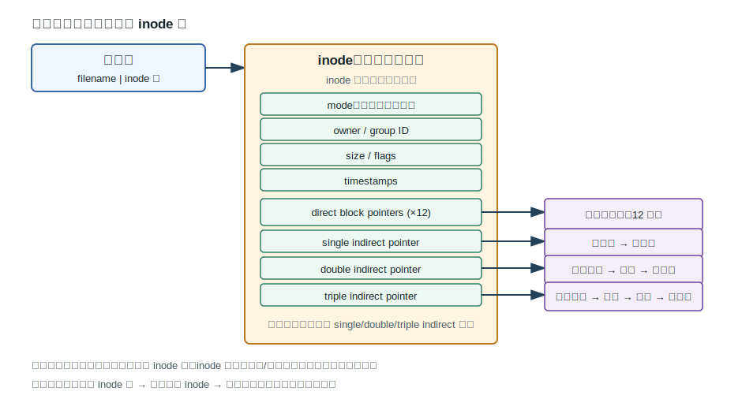
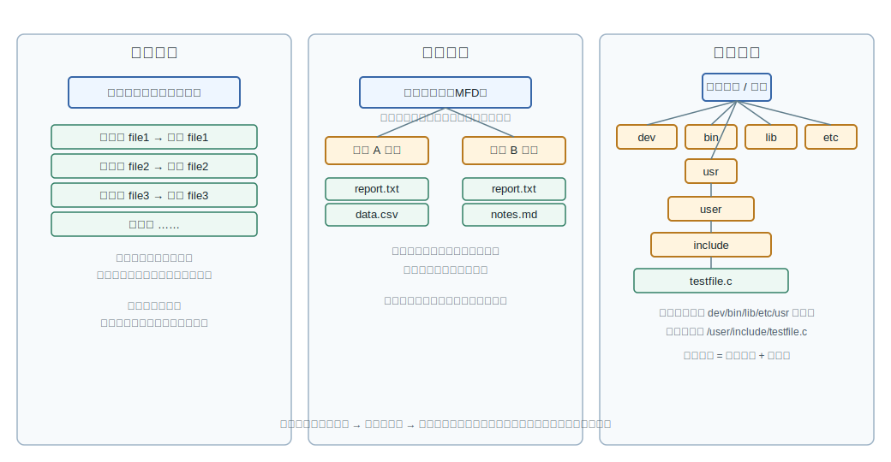
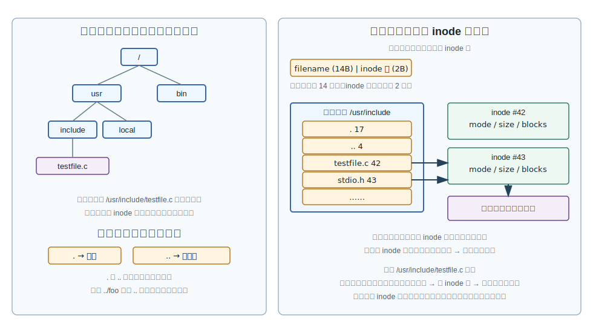

# 第 10 章：文件系统接口与目录结构

## 学习目标

- 说明文件系统从用户和操作系统两个角度分别要解决什么问题。
- 用文件名、扩展名、通配符、文件类型字符和权限位描述一个文件的抽象。
- 区分顺序存取、直接存取和索引存取，并说出各自的访问依据。
- 顺着 `open`、`creat`、`read`、`write`、`close` 的调用顺序读懂一段最小的文件复制程序。
- 解释文件控制块（FCB）和 inode 中保存了哪些信息，以及目录如何把名字映射到这些信息。
- 用一张图说明从一级目录到树形目录的演化逻辑，并解释 UNIX 为什么要把文件名和 inode 分开。

## 上章回顾

到此为止，前面几章谈的都是处理器视角的资源：进程把执行流变成可调度的对象，并发原语让多个执行流安全共享数据，死锁的讨论又提醒我们资源分配的策略需要全局协调。这些机制保证了 CPU 时间和共享内存上的秩序，但用户每天接触最多、最容易感知"丢了""错了"的资源其实是另一类——长期保存在外部存储器上的数据。本章把视角换到这一边，从一个用户问题开始：硬盘上一片片机械化的字节，怎样变成 `report.txt` 这样可以被叫出名字的对象？

## 开篇问题

想象一下，你新买的笔记本只有 BIOS 和一块空白的硬盘，没有任何操作系统。你想保存一段文字，于是按字节算出位置：第 200 万号扇区、偏移 512 字节、长度 1024。下一次再想取回来，必须记住这一串数字；再写第二个文件，要自己避免覆盖；想发给同事，得告诉对方完整地址。这显然不可行。问题是：本章要回答的就是文件系统怎样把"按字节定位"翻译成==按名存取==，又付出哪些机制代价。

## 本章地图

本章先回答"文件系统解决什么问题"，把它的目标和功能边界讲清楚。随后我们逐层堆抽象：第一层是单个文件的抽象——名字、类型和属性；第二层是文件的存取方法和系统调用接口，看应用程序怎样使用文件；第三层是目录与文件控制块，看操作系统在内部用什么数据结构把名字落到磁盘上。整章的主线只有一条：==按名存取==到底要付出哪些机制成本。

## 正文

### 10.1 文件系统解决什么问题

把磁盘的字节直接暴露给用户会带来三类困难。一是繁琐：每写一条信息都要算地址、记长度；二是易错：算错地址会破坏别的信息；三是==可靠性差的问题==：用户没有统一的备份和恢复机制。当系统从单用户单道扩展到 ==多道/分时系统中大容量辅助存储器共享== 时，这三类困难还会被放大——多个用户、多个程序同时访问同一块物理介质，没有一个公共的协调者就无法谈共享和保护。

操作系统对此的回答是引入一个专门的子系统：**文件系统（file system）** 是操作系统中负责存取和管理信息的模块。它要==统一管理存储==、检索、更新、共享和保护，对硬盘的字节空间做了统一管理，向用户和应用程序提供一套围绕"按名访问"组织的接口。

> **核心判断**：文件系统功能以按名存取为基本功能，以目录维护实现按名存取，以逻辑文件到物理文件转换为核心内容。

围绕这个核心判断，文件系统还要负责一组配套功能：<u>存储空间的分配与回收</u>、<u>数据保密、保护与共享</u>，并向用户提供从控制台命令到系统调用的文件操作接口。这些功能在后续章节会分别展开；本章我们关注的是"接口长什么样"，以及"目录与 FCB 怎样把名字接上字节"。

### 10.2 文件抽象、命名与属性

文件系统给应用程序的第一个抽象是**文件（file）**：一个由名字标识、看起来线性、可以被按名存取的一组信息集合。这层抽象的价值不在于"加了一层壳"，而在于：通过名字而不是地址来引用数据，应用程序就和磁盘上具体的物理布局解耦了。换句话说，==按名存取可屏蔽物理地址管理==，并因此支撑保护措施、实现同名/异名共享——同一份内容可以挂多个名字，不同用户也可以使用相同的文件名而不冲突。

文件的名字通常分两段：<u>文件名 + 扩展名</u>，中间以一个点分隔。在 shell 里我们经常用通配符模糊指定一组文件：==问号匹配单个合法字符，星号匹配合法字符串==。`a?.txt` 能匹配 `a1.txt` 和 `ab.txt`，但匹配不了 `abc.txt`；`*.c` 才能把所有以 `.c` 结尾的文件一次性选中。

文件可以从多个维度分类：按用途（系统文件、用户文件、库文件）、按保护级别（只读、读写、可执行）、按信息流向（输入文件、输出文件、输入输出文件）、按存放时限（临时文件、永久文件、档案文件）、以及按存放设备类型（磁盘文件、磁带文件、卡片文件）。这些分类不互斥，更像是"看文件的不同侧面"。

UNIX 把"文件是什么类型"压缩成了 `ls -l` 输出最左边的一个字符。下表列出常见的几类：

| 类型字符 | 含义 | 典型例子 |
|---|---|---|
| `-` | 普通文件 | `report.txt`、`a.out` |
| `d` | 目录文件 | `/usr`、`/home/alice` |
| `l` | 链接文件 | 符号链接 |
| `b` | 块设备 | `/dev/sda` |
| `c` | 字符设备 | `/dev/tty` |
| `s` | Socket | UNIX 域套接字 |
| `p` | 有名管道 | FIFO |

UNIX 文件类型字符里 `b` 和 `c` 都是设备文件，`l` 表示链接文件，==有名管道==则是用 `p` 表示的 FIFO 通信文件——这是一组需要逐个对照的辨析点。

紧跟在类型字符后面的，是一组按位排列的属性。文件属性包括基本、类型、保护和管理属性。其中保护属性以一组并列的权限位实现，把<u>所有者、同组用户、其他用户</u>三类主体的可读/可写/可执行权限放在一起：

| 位段 | 长度 | 含义 |
|---|---|---|
| 文件类型位 | 1 位字符 | 文件类型可用 -, d, l, b/c, s, p 表示 |
| 所有者权限 | 3 位 rwx | 文件主对读、写、执行的权限 |
| 同组用户权限 | 3 位 rwx | 与文件主同组用户的读、写、执行权限 |
| 其他用户权限 | 3 位 rwx | 其余用户的读、写、执行权限 |
| 排列方式 | 3 组三元 | 权限位按所有者、同组用户、其他用户分组三元排列 |
| 属性总览 | 综合 | 文件属性包括基本、类型、保护和管理属性 |

> **易错点**：UNIX 文件类型字符里 `b` 和 `c` 都是设备文件，区别在于一个按块寻址、一个按字节流；`l` 表示链接文件，而硬链接看起来仍像普通文件（`-`），它的"链接性"藏在目录项里，不出现在类型字符上。

### 10.3 文件存取方法与系统调用接口

有了抽象，下一步要回答：应用程序怎样读写文件？==文件存取方法包括顺序存取==、直接存取和索引存取，三者描述的是访问的依据：

| 存取方法 | 访问依据 | 适合场景 |
|---|---|---|
| 顺序存取 | 从头到尾按读写位置推进 | 日志、磁带、流式处理 |
| 直接存取 | 按记录号或文件偏移直接定位 | 随机访问的数据库记录 |
| 索引存取 | 通过键值经索引结构定位 | 按关键字快速查找的数据文件 |

顺序存取又可以进一步分成面向<u>定长记录</u>和<u>变长记录</u>两种：定长记录可以按"第 N 条"乘以记录长度算位置，逻辑上接近直接存取；变长记录则必须依赖每条记录的长度字段，才能找到下一条的起点。

文件使用接口分两层：一层是**控制台命令**（`cp`、`ls`、`cat`），面向终端用户；另一层是**系统调用与 API**（`open`、`read`、`write`、`close`），面向程序。典型的文件操作包括：建立、打开、读写、控制、关闭、撤消。回想第 2 章里的系统调用机制：用户程序通过陷入指令进入内核，由系统调用处理子程序完成实际工作。文件系统的接口正是其中最常用的一组。

下面是一段最小的"文件复制"程序的开头部分，展示了`open` 和 `creat` 的典型用法：

```c
#define BUF_SIZE       4096
#define OUTPUT_MODE    0700

int main(int argc, char *argv[]) {
    int in_fd, out_fd, count;
    char buffer[BUF_SIZE];

    if (argc != 3) exit(1);

    in_fd = open(argv[1], O_RDONLY);          /* 打开源文件 */
    if (in_fd < 0) exit(2);                   /* 打开失败 */

    out_fd = creat(argv[2], OUTPUT_MODE);     /* 创建目标文件 */
    if (out_fd < 0) exit(3);                  /* 创建失败 */
    ...
}
```

读这段代码有三个抓手。第一，`in_fd = open(argv[1], O_RDONLY)` 表示 ==open(argv[1], O_RDONLY) 打开源文件==，只读方式打开命令行给出的第一个参数。第二，`out_fd = creat(argv[2], OUTPUT_MODE)` 表示 ==creat(argv[2], OUTPUT_MODE) 创建目标文件==，以保护模式 `0700` 新建第二个参数指定的文件。第三，==fd 小于 0 表示打开或创建失败==，所以两次返回值都要检查；这是 UNIX 风格 API 的固定套路。

紧接着是读写循环：

```c
while (1) {
    count = read(in_fd, buffer, BUF_SIZE);    /* 从源文件读入 */
    if (count <= 0) break;                    /* 读完或出错 */
    if (write(out_fd, buffer, count) != count) /* 写到目标文件 */
        exit(4);                              /* 写错误 */
}

close(in_fd);
close(out_fd);
```

这段代码的关键语义比代码量大。`count = read(in_fd, buffer, BUF_SIZE)` 表示每轮调用都把最多 `BUF_SIZE` 个字节从源文件读入缓冲区，==read 返回 count 后调用 write 写出 count 字节==——也就是说，`write` 要写出的不是 `BUF_SIZE`，而是 `read` 实际给出的字节数。如果 `write` 的返回值不等于 `count`，说明==write 数量不等于 count 表示写错误==，必须报错退出。整个循环结束、跳出 `while` 之后，==读完后关闭 in_fd 与 out_fd==，分别 `close` 输入和输出文件。

> **思维停顿**：这段程序里没有出现任何"扇区号"或"磁盘地址"。所有底层细节都被内核藏在 `read`/`write` 后面；应用程序看到的只是<u>文件描述符 fd</u> 和字节缓冲区。这正是按名存取在用户层的体感。

### 10.4 目录与文件控制块

应用程序只看到名字和 fd，但操作系统必须知道每个名字对应硬盘上哪一块数据。承担这种映射的，是**目录**和**文件控制块（FCB）**。

#### 10.4.1 目录项就是 FCB

==目录是文件系统维护的所有文件清单==。它本身也是一种文件——目录信息通常作为<u>目录文件</u>保存在磁盘上，目录文件里的每个目录项对应一个文件的信息描述，这条目录项也称为**文件控制块（FCB, File Control Block）**。FCB 通常==包含存取控制==、文件结构、文件使用和文件管理四类信息：权限位、所有者属于存取控制；文件类型、组织方式、起始位置属于文件结构；创建/访问/修改时间属于使用信息；占用空间、引用计数属于管理信息。

不同的文件系统把 FCB 的字段安排得各有差异。FAT12 把整个目录项压缩在 32 字节里：

| 字段 | 长度（字节） | 含义 |
|---|---|---|
| File name | 8 | FAT12 目录项含文件名与扩展名 |
| File extension | 3 | FAT12 目录项含文件名与扩展名 |
| Attribute | 1 | 含属性、创建/访问/修改时间日期 |
| Created date/time | 4 | 含属性、创建/访问/修改时间日期 |
| Last access date | 2 | 含属性、创建/访问/修改时间日期 |
| Modified date/time | 4 | 含属性、创建/访问/修改时间日期 |
| First Logical Cluster | 2 | 含 First Logical Cluster 与 File size 字段 |
| File size | 4 | 含 First Logical Cluster 与 File size 字段 |

每一项都是定长字段，结构简单到可以用一段连续的字节直接解释。这种紧凑布局适合早期内存有限的环境，代价是文件名长度受限、没有为大量元数据留下空间。

UNIX 走了另一条路：把"文件名"从 FCB 里拿走，剩下的字段集中起来叫做 inode：



读这张图有两个关键点。第一，==inode 不直接保存文件名==。文件名只在目录项里出现，目录项把<u>文件名映射到 inode 号</u>。第二，inode 内部用一组定长指针组织数据块：直接块指针保存前若干块的位置，间接指针通过一级、二级、三级跳转覆盖更大的文件——也就是包含直接块指针和 single/double/triple indirect 指针这一组合。这种"小文件直接指、大文件层层指"的结构，让 inode 用固定大小支持文件长度跨几个数量级。

> **核心判断**：FAT 风格把"名字和元数据"绑在一起；UNIX 风格把"名字"留给目录、把"元数据"集中到 inode。后者是后续讲硬链接和共享的基础。

#### 10.4.2 按名存取的工作流程

不管底层是 FAT 还是 UNIX，按名存取的工作流程在抽象上是同一条三步链：

1. 在目录文件中按文件名查找目录项。
2. 取得目录项中的 FCB 信息。
3. 依据 FCB 记录的存放位置依次存取文件内容。

这三步对应了 `open`、读 FCB 元数据、`read`/`write` 三件事。`open` 真正做的事就是前两步，并把得到的内部句柄包装成<u>文件描述符</u>返回给应用程序；后面的 `read`/`write` 才走到第三步。理解了这条链条，再看任何一种文件系统的实现细节，都能找到对应位置。

#### 10.4.3 目录结构演化

目录本身的组织方式也是一个值得追问的问题。最朴素的做法是把所有文件目录项放在一张表里；当用户和文件增多时，这种做法会出现两类痛点：重名冲突和命名拥挤。下图把目录结构的演化整理为三步：



最左侧是一级目录：整个系统只有一张主目录，所有文件共用同一个目录命名空间。它的优点是结构简单——目录项与文件一一对应——但缺点也很直接：缺点是重名冲突。两个用户想用 `report.txt` 这种自然名字，就会撞名。

中间是二级目录：把目录拆成两层。第一级目录记录用户及其文件目录地址，相当于一张"用户索引"；第二级用户文件目录记录文件项，每个用户在自己的目录里维护文件清单。==不同用户可拥有同名文件==，因为名字落在不同的子目录里。这一改动用很小的代价解决了多用户场景下的重名问题。

最右侧是树形目录：把二级结构再推一步，允许任意层次的嵌套。==根目录以 / 表示==，根目录下可以建立任意多层子目录，文件作为叶子节点出现。一个典型的 UNIX 树会让<u>路径逐级经过 dev/bin/lib/etc/usr 等目录</u>，==示例路径为 /user/include/testfile.c==。一个文件的"全名"就是从根开始的整条路径加上自身名字。

> **核心判断**：树形目录是多级目录结构，根目录向下分出子目录，叶子为文件，==可按目录单位做保护、保密和共享==——也就是说，权限和共享的粒度从单个文件升级到一整棵子树。

#### 10.4.4 把名字与 inode 分离的代价与好处

UNIX 之所以采用 inode，配套要解决的就是"名字怎么挂到 inode 上"。它的目录项设计极其简洁：

| 字段 | 长度 | 作用 |
|---|---|---|
| 文件名 | 14 字节 | 目录项只保存文件名和 inode 号；文件名字段 14 字节 |
| inode 节点号 | 2 字节 | 目录项只保存文件名和 inode 号；inode 节点号字段 2 字节 |

一条目录项只有 16 字节，再没有任何属性。文件大小、权限、时间戳全都被赶到了 inode 里。这种安排带来一组很重要的效果：



左半边是用户视角：用户看到的是目录树，路径形如 `/usr/include/testfile.c`。每个目录都额外维护两个特殊目录项——`.` 指向自身，`..` 指向父目录。所以 ==. 和 .. 目录项参与路径检索==，是 `cd ..` 这类操作能跨目录回退的根据。

右半边是系统视角：每个目录文件其实是一串"文件名 + inode 号"的二元记录，==系统通过目录项中的 inode 号链接目录和文件==。检索 `/usr/include/testfile.c` 时，内核从根目录开始，逐级用名字查目录项、拿到 inode 号、再读下一级目录，直到取得目标文件的 inode 为止。

把名字和 inode 分开有几个直接好处：重命名文件只需改目录项里的名字字段；移动文件到同一文件系统的另一个目录只需删旧目录项加新目录项，inode 不动；多个目录项可以引用同一个 inode——这就是后续章节会展开的<u>硬链接</u>的基础。

## 例题讲解

**例题：** 给定如下两段最小复制程序，按运行顺序回答：(1) 第一次 `open` 成功后，内核里发生了什么？(2) 如果中间的 `read` 在第 N 轮返回 0，循环为什么会停？(3) 程序退出前为什么必须 `close` 两次？

```c
in_fd  = open(argv[1], O_RDONLY);
out_fd = creat(argv[2], OUTPUT_MODE);
while ((count = read(in_fd, buffer, BUF_SIZE)) > 0) {
    if (write(out_fd, buffer, count) != count) exit(4);
}
close(in_fd);
close(out_fd);
```

**解答：**

1. `open` 成功后，内核做了按名存取的前两步：在<u>目录文件</u>里按 `argv[1]` 查找目录项，取得对应的 FCB / inode，把它登记到一张内核内部的打开文件表中，并把表中的某个槽位作为<u>文件描述符</u>编号返回给应用程序。从这一刻起，应用程序之后的 `read` 不再涉及目录查找，只需按 fd 找内部句柄。
2. `read` 返回 0 表示已经读到文件末尾。`read` 返回 count 后调用 write 写出 count 字节是正常情形；当 count 等于 0，循环条件 `count > 0` 不成立，跳出。如果 `read` 返回负数则代表出错。
3. 内核为每个 fd 维护资源（打开文件表项、缓冲区、引用计数）。`close` 通知内核可以释放或减少引用。源文件和目标文件各自占用一个 fd，所以要分别 `close(in_fd)` 和 `close(out_fd)`。不 `close` 在程序结束时也会被回收，但写文件可能因缓冲未刷新而丢失尾段数据。

## 常见误区

- 把"按名存取"等同于"用名字代替地址"。它的真正含义是：应用程序看到的接口完全去掉了物理地址，但操作系统内部仍需要靠目录与 FCB 完成名字到位置的映射，这条链是必须存在的。
- 以为 FCB 一定包含文件名。FAT 目录项里确实有文件名，但 UNIX 的 inode 里没有；==inode 不直接保存文件名==，文件名属于目录项。
- 把"目录"理解成"一种特殊结构，不是文件"。在 UNIX 里目录本身就是文件，只是内容被解释为"文件名 + inode 号"的记录序列。
- 把树形目录的好处只理解成"层次清晰"。==可按目录单位做保护、保密和共享== 才是树形目录在权限管理上的关键贡献。
- 看到 `cd ..` 就以为是"内核特殊处理"。其实 `..` 是每个目录里实打实的一个目录项，路径解析对它和对普通名字一视同仁。

## 本章小结

文件系统把"按字节定位"换成了"按名存取"。它对外提供文件抽象、命名、属性、存取方法和系统调用接口；对内维护目录和文件控制块，按名查目录项、取 FCB、再依 FCB 访问数据块。FAT 把名字与元数据绑在目录项里；UNIX 把元数据集中到 inode、目录项只留名字与 inode 号——这一选择支撑了树形目录、硬链接和按目录粒度共享。理解这一章的关键不是背字段，而是能在脑里复现"open → 查目录 → 拿 FCB → 拿到 fd → read/write 走 FCB 指向的数据块"这条完整链。

## 关键术语

**文件（file）** 由名字标识的一组信息集合，文件系统对外提供的基本抽象。

**文件系统（file system）** 操作系统中负责存取和管理信息的模块，统一管理存储、检索、更新、共享和保护。

**按名存取（access by name）** 通过名字而不是物理地址引用文件的访问方式，是文件系统的基本功能。

**文件控制块（FCB, File Control Block）** 目录项中保存的、描述单个文件存取控制、结构、使用和管理信息的数据结构。

**目录（directory）** 文件系统维护的所有文件清单，本身通常作为目录文件存在。

**inode** UNIX 中集中保存文件元数据和数据块指针的控制结构，不包含文件名。

**树形目录（tree-structured directory）** 多级嵌套的目录组织，根目录向下分出子目录，文件作为叶子节点出现。

## 练习与解答

1. 为什么"按名存取"必然依赖目录？能否设想一种没有目录的按名存取实现？

   **解答**：按名存取要求把任意一个用户给出的名字翻译成磁盘上的具体位置，这种翻译关系必须有载体。目录正是这个载体：它维护所有名字到 FCB（进而到磁盘块）的映射。没有目录就意味着内核必须为每次访问扫描整个磁盘寻找名字，时间复杂度无法接受。所以"按名存取"在工程上总是依赖某种目录结构。

2. FAT12 目录项 32 字节里 8+3 字节给了文件名，这一选择带来哪些后果？

   **解答**：8.3 命名直接限制了文件名长度，长名字必须靠扩展机制（VFAT 长文件名）。同时整个目录项是固定大小，目录可以按定长顺序扫描，定位算法简单；但要为时间戳、起始簇号、文件大小预留空间就所剩无几，复杂元数据被迫挤压。

3. `ln a b` 让 `a` 和 `b` 引用同一个文件。从目录和 inode 的角度解释这种"硬链接"的工作机制。

   **解答**：在 UNIX 中目录项只保存文件名和 inode 号。`ln a b` 不复制 inode，也不复制数据块，而是在当前目录里再增加一条目录项，名字是 `b`，inode 号与 `a` 的目录项指向同一个 inode。两个名字对应同一份元数据和数据块；inode 内部的引用计数加一，删除其中一个名字只把对应目录项移除并把引用计数减一，数据本身只在引用计数降到零时才回收。

4. 同样是要避免重名，二级目录和树形目录在多用户场景下有什么实质区别？

   **解答**：二级目录已经能解决"不同用户的同名文件"问题，因为每个用户有自己的子目录。但二级目录的层级是固定两层，单用户内部不能再分组。树形目录把层数放开，让单用户也能按项目、按主题继续分桶；同时还能在任意层次上按目录单位做保护、保密和共享。

5. `open` 返回的文件描述符是一个小整数。从内核数据结构的角度，它实际指向什么？

   **解答**：fd 是当前进程打开文件表的索引。表里每个槽位指向一条系统范围的打开文件结构，再由它指向具体文件的 inode（或等价的 FCB）。所以 fd → 进程级表项 → 系统级打开文件项 → inode → 数据块。后面三层把"按名存取"中目录查找的结果缓存了下来，避免每次 `read`/`write` 都重新查目录。

## 覆盖记录

- OSPPT-CH04-FS-PURPOSE-FUNCTIONS
- OSPPT-CH04-FILE-ABSTRACTION-TYPES-ATTRIBUTES
- OSPPT-CH04-FILE-ACCESS-APIS
- OSPPT-CH04-DIRECTORY-FCB-STRUCTURES
