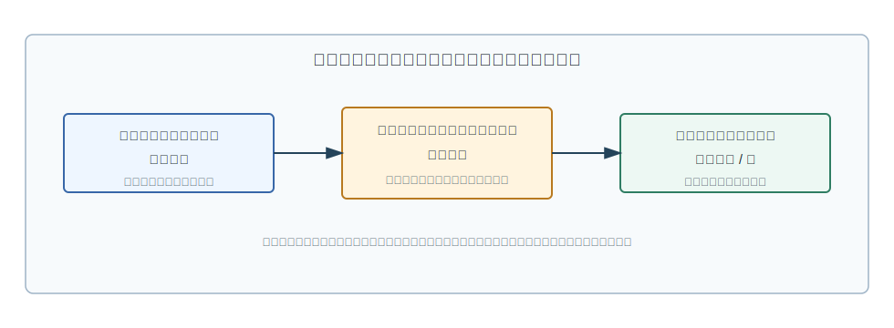
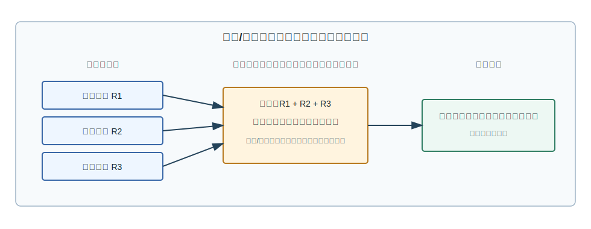
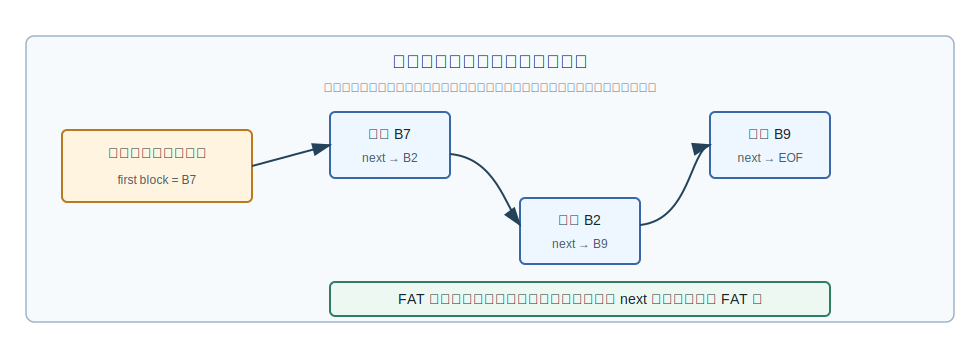
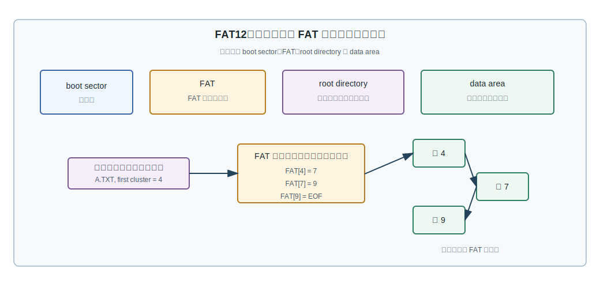
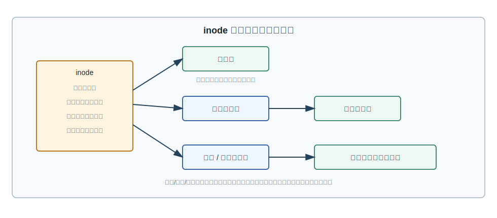
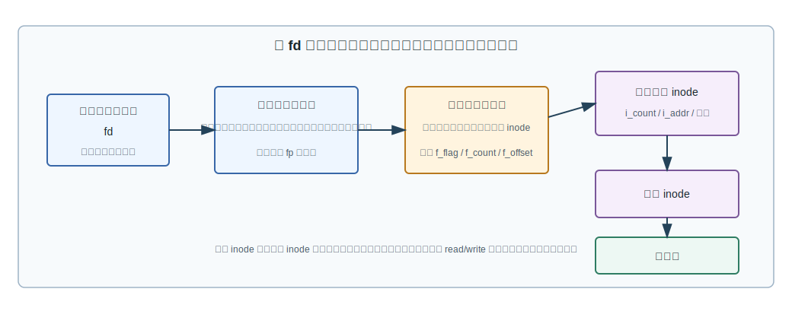
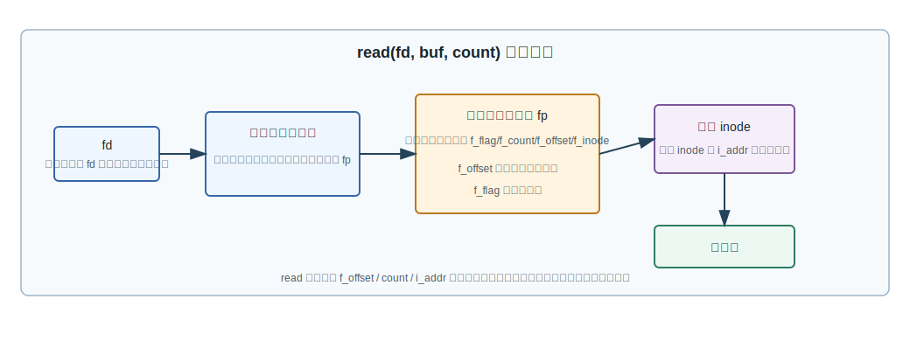

# 第 11 章：文件组织与 UNIX 文件操作实现

## 学习目标

- 区分卷、块、逻辑记录、存储记录和物理记录，并说明它们分别服务于哪个层次。
- 用图解释逻辑记录怎样经过存取方法映射到存储记录和物理记录。
- 比较顺序文件、连接文件、直接文件和索引文件的定位方式、优点和代价。
- 说明 FAT 表怎样把连接文件中的“下一块”指针集中管理。
- 按步骤读懂哈希目录的建立、查找与溢出处理。
- 解释 UNIX 中 `fd`、进程打开文件表、系统打开文件表和活动 inode 表的关系。
- 顺着 `creat`、`open`、`close`、`read`、`write`、`lseek`、`dup` 说明文件操作在内核中的主要动作。

## 上章回顾

上一章已经建立了文件系统的接口视角：用户按文件名访问文件，目录把名字映射到 FCB 或 inode，系统调用让程序通过 `open`、`read`、`write`、`close` 使用文件。本章继续往内部走一层：当名字已经找到，文件系统怎样组织记录，怎样把逻辑位置落到磁盘块，又怎样在 UNIX 中维护一次打开文件的运行时状态。

## 开篇问题

如果一个文件由 1000 条学生记录组成，应用程序想读第 37 条记录。这个请求听起来像“第 37 条”，磁盘却只能按块传输；记录可能定长，也可能变长；文件可能连续存放，也可能散落在许多簇里。问题是：文件系统如何把应用程序的记录请求转换成可执行的磁盘块访问，同时还要支持打开、关闭、共享位移和权限检查？

## 本章地图

本章先把“记录”这件事拆清楚：用户看到的是逻辑记录，设备交换的是物理记录，文件系统要在中间做映射。随后比较几种文件物理结构：顺序文件追求连续，连接文件用指针保存顺序，直接文件用关键字映射地址，索引文件用一张表把逻辑记录号或关键字落到块。最后回到 UNIX，把这些结构放进真实的打开文件路径中，看 `fd` 如何一步步连到系统打开文件表、活动 inode 和数据块。

## 正文

### 11.1 从记录单位看文件组织

文件系统的难点不只是“把字节存起来”，而是让不同层次都看到适合自己的单位。用户关心一条业务记录，内核关心一次传输和控制信息，设备关心块。把这些单位混在一起，最容易造成概念错位：把应用程序的逻辑记录误当成磁盘块，或者以为物理记录天然就是用户记录。

| 单位 | 面向层次 | 作用 |
|---|---|---|
| 卷 | 物理介质 | 卷是物理存储介质单位，例如一盘磁带、一个磁盘分区或一个逻辑卷。 |
| 块/物理记录 | 主存与辅存交换 | 块/物理记录是主存和辅存信息交换单位，通常按设备块大小传输。 |
| 逻辑记录 | 应用程序 | 逻辑记录面向应用程序，是程序按业务含义处理的一条信息。 |
| 存储记录 | 文件管理程序 | 存储记录附加操作系统控制信息，是逻辑记录进入文件管理程序后的组织单位。 |

> **核心判断**：卷、块、逻辑记录、存储记录分别对应物理介质单位、交换单位、应用程序处理单位和文件管理程序处理单位。

在这一组概念中，**文件逻辑结构（logical file structure）** 从用户角度描述抽象信息组织方式。它可以是无结构的流式文件，也可以是有结构的记录式文件。考试里常见的说法要压缩成一句：==分为无结构的流式文件和有结构的记录式文件==。前者像一串连续字节，后者则把文件看成一组有边界、有字段意义的记录。

图 11-1 提醒我们：逻辑结构和物理结构不是同一个问题。逻辑数据组织面向用户，物理数据组织面向设备，存取方法承担逻辑到存储的映射。也就是说，应用程序提出“读第 N 条记录”，文件系统要通过某种存取方法把它转换为“读哪个块、从块中哪个偏移取多少字节”。

记录大小和块大小往往不一致，于是需要**成组（blocking）**和**分解（deblocking）**。成组把多个逻辑记录放进一个物理记录，减少外存交换次数；分解则在读入物理块后，把其中的逻辑记录拆回给应用程序。

图 11-2 中的系统缓冲区很关键。它不是简单的临时变量，而是用户缓冲区和物理记录之间的适配层：当逻辑记录短于块时，它负责把多条记录凑成一次传输；当应用程序只需要其中一条记录时，它又负责把块内内容拆出来。<u>记录边界</u>由逻辑结构决定，<u>传输边界</u>由设备块决定，文件系统要把这两种边界对齐。

### 11.2 四种物理结构如何定位记录

**文件物理结构（physical file structure）** 讨论的是文件内容在外存上的组织方式。常见文件物理结构包括顺序文件、连接文件、直接文件和索引文件，其中后三者体现非连续存储。四者的差别可以用一个问题来统一理解：给定一个逻辑记录，怎样找到它所在的物理块？

| 物理结构 | 定位依据 | 优点 | 代价 |
|---|---|---|---|
| 顺序文件 | 逻辑记录连续存放在相邻物理块上 | 顺序读写快，地址计算简单 | 插入、删除和扩展不灵活，可能需要移动大量记录 |
| 连接文件 | 目录项找到链首，记录之间通过指针连接 | 增删改方便，逻辑顺序可独立于物理顺序 | 随机访问慢，指针损坏会影响后续链 |
| 直接文件 | 记录关键字经映射函数得到物理地址 | 按关键字定位快 | 哈希冲突和溢出处理复杂 |
| 索引文件 | 目录项指向索引表，索引项给出记录地址 | 支持随机访问与较灵活的扩展 | 需要额外索引空间，索引维护有开销 |

顺序文件是最容易想象的形式：第 1 条记录放在第 1 个物理块附近，第 2 条紧跟着第 1 条。顺序文件把逻辑记录连续存放在相邻物理块上，也可发展出扩展顺序文件、连接顺序文件等变种。它适合批量顺序处理，例如按时间追加的日志；但当记录频繁插入、删除或变长时，连续存放会变成负担。

连接文件则把“物理相邻”换成“指针相邻”。目录项只需要指向链首，每个记录或块再保存下一块的位置。

图 11-3 中，B7、B2、B9 在物理上不连续，但通过指针形成逻辑顺序。这样插入和删除较方便，因为只要改指针；缺点是要找第 100 条记录，通常得从链首一路走过去。==顺序文件、连接文件、直接文件和索引文件==不是四个孤立名词，而是四种不同的定位策略。

### 11.3 FAT：把链指针集中成一张表

FAT 的思想可以看成连接文件的一种工程化实现：不把“下一簇”指针塞在数据块里，而是集中放到一张 File Allocation Table 中。目录项保存文件起始簇，FAT 表项保存每个簇的后继簇或结束标志，数据区则按簇存放文件内容。

不同 FAT 版本的核心差别，首先体现在表项宽度和可表达的簇编号范围上。

| FAT 版本 | 表项宽度 | 寻址能力 | 适用边界 |
|---|---|---|---|
| FAT12 | 12 位 | FAT 表项宽度随版本变化，簇编号空间较小 | 适合较小容量介质 |
| FAT16 | 16 位 | 比 FAT12 可表示更多簇 | 曾常用于较小磁盘分区 |
| FAT32 | 32 位字段中主要使用较低位 | FAT32 支持更大的簇编号空间 | 支持更大的分区与更多簇 |
| exFAT | 更宽的簇编号和更现代的元数据组织 | exFAT 面向更大介质容量 | 常见于大容量闪存介质 |

FAT12 的磁盘结构可以分成 boot sector、FAT、root directory 和 data area。一次访问的路线是：先在根目录中找到文件名和首簇，再用 FAT 表沿簇链走，最后到数据区读取对应簇。

> **易错点**：FAT 表不是文件内容本身，它保存的是簇链关系；目录项也不是整条链，它只需要给出文件名和首簇。

把 FAT 放回连接文件的语境中，就能看清它的优点和代价。优点是链指针集中，文件块本身可以只存数据；代价是 FAT 表成为一个必须频繁访问和维护的集中结构。若 FAT 表损坏，簇链关系就可能断裂。

### 11.4 直接文件与哈希目录

**直接文件（direct file）** 试图从关键字直接算出地址。它在记录关键字与物理地址之间建立映射，通常采用散列函数，关键问题是冲突处理。这个思路适合按关键字查找，例如“根据文件名快速找到 FCB 所在块”。

建立哈希目录时，可以把文件名映射为一个 hash 值 `A`，再把对应 FCB 放入 `A` 所指的物理块。课程示例中，8 个 ASCII 字符名经模 2 加计算得到 hash 值 `A`，作为 FCB 所在物理块在索引表中的位置；若多个文件得到同一个 `A`，就把它们的 FCB 放入同一物理块。

| 哈希查找环节 | 本例取值 | 说明 |
|---|---|---|
| 计算 hash 值 | hash 值 A=10 | 由文件名计算得到索引表相对位置。 |
| 读索引表项 | 索引表第 10 项保存物理块号 26 | A 值所在表项给出 FCB 所在物理块。 |
| 比较 FCB | 26 号物理块保存多个同 hash 的 FCB | 读入该块后逐个比较文件名，找到目标 FCB。 |

查找过程因此分成三步：先由文件名算出 `A`，再读入 `A` 对应的物理块，最后在块内逐个比较文件名。若发生哈希溢出，可以申请额外盘区，把块号依次放在 `A+k`、`A+2k` 等索引表项；查找时顺序比较这些溢出块。

1. 根据文件名计算 hash 值 `A`。
2. 访问索引表中相对位置 `A`，取得主物理块号。
3. 把该物理块读入内存，在块中逐项比较文件名。
4. 如果没找到且存在溢出块，按 `A+k`、`A+2k` 的顺序继续查找。
5. 找到目标 FCB 后，再依据 FCB 中的地址信息访问文件内容。

> **常见误区**：哈希函数只把搜索范围缩小到一个候选块或一组候选块；它不保证同 hash 的文件名已经唯一，因此仍要逐项比较。

### 11.5 索引文件与多级索引

**索引文件（indexed file）** 为每个文件建立索引表。表目把关键字或逻辑记录号映射到存储地址，文件目录项指向索引表，访问时先查索引，再根据索引项访问数据块。

| 索引文件部件 | 保存内容 | 定位作用 |
|---|---|---|
| 文件目录项 | 文件基本信息和索引表位置 | 文件目录项指向索引表。 |
| 索引表表目 | 索引表表目含关键字/逻辑记录号和地址 | 把用户可见的记录标识映射到存储地址。 |
| 数据块 | 记录实际内容 | 每个记录可通过索引项定位到块。 |

索引可以是稠密的，也可以是稀疏的。稠密索引为每条记录保存索引项，查找直接但空间开销大；稀疏索引只为一部分记录建索引，空间省一些，但可能需要在目标块内继续顺序查找。与连接文件相比，索引文件更适合随机访问；与顺序文件相比，它牺牲一部分索引空间来换定位灵活性。

UNIX/Linux 的多重索引结构把这个思想推进了一步：inode 中保存若干直接块指针，也保存一级、二级、三级间接块入口。小文件直接走直接索引，避免额外查表；大文件再逐级使用间接块扩大寻址范围。

> **核心判断**：多级索引的价值在于同时照顾小文件和大文件：小文件少走层级，大文件通过间接块扩大可寻址范围。

这一点和上一章的 inode 结构相呼应。目录项只把名字映射到 inode 号；真正的数据块地址，由 inode 内部的直接和间接索引入口继续给出。

### 11.6 UNIX 打开文件的三层动态结构

现在把视角从“文件在磁盘上怎么组织”转到“一个进程打开文件后，内核怎么记住它”。UNIX 文件系统的静态结构包含超级块、索引节点区和数据区；动态结构包含进程打开文件表、系统打开文件表和内存活动 inode 表。==静态结构在外存上组织文件，动态结构在内存中组织打开状态==。

三层动态结构的分工如下：

| 结构 | 归属 | 保存什么 | 为什么要分开 |
|---|---|---|---|
| 进程打开文件表 | 每个进程私有 | `fd` 到系统打开文件表项的指针 | 同一个进程用整数文件描述符访问文件。 |
| 系统打开文件表 | 内核全局 | `f_flag`、`f_count`、`f_offset`、`f_inode` | 多个描述符可以共享同一个打开实例和位移。 |
| 活动 inode 表 | 内核全局 | 内存中的 inode、引用计数、块地址入口 | 多个打开实例可指向同一个文件对象。 |

这种分层不是为了复杂而复杂。进程打开文件表让每个进程拥有自己的 `fd` 编号；系统打开文件表让多个 `fd` 可以共享同一个 `f_offset`；活动 inode 表则把“文件对象本身”的元数据缓存到内存里。<u>打开实例</u>和<u>文件对象</u>分开后，才能解释 `dup`、父子进程共享位移、硬链接删除后文件仍可被已打开进程继续访问等现象。

### 11.7 creat、open、close、read 与文件位移

UNIX 通过创建、打开、关闭、撤销、读、写、共享等系统调用向用户程序提供服务。这些调用的表面形式很短，内核动作却不短。

`creat(filenamep, mode)` 创建文件并返回文件描述字 `fd`。实现时，内核要分配外存 inode 和活动 inode，建立目录项，初始化权限和连接计数，分配两级打开文件表项，最后把新分配的 `fd` 返回给用户程序。

`unlink(filenamep)` 的名字容易误导：它不是“立刻擦掉所有数据块”，而是删除目录项并把 `i_link` 减 1。调用者需要写权限；只有当 `i_link` 减为 0，并且没有活动引用需要保留时，文件占用空间才会被释放。==unlink 删除的是目录链接==，不等于立即清空一个仍被打开的文件对象。

`open(filenamep, mode)` 按模式打开文件并返回文件描述字。实现时，内核先检索目录，把外存 inode 复制到活动 inode 表，再核对权限，分配进程打开文件表项和系统打开文件表项，并建立表项之间的指针连接。`close(fd)` 则沿反方向释放：先释放用户打开文件表项，再递减系统打开文件表 `f_count` 和活动 inode `i_count`，必要时写回并释放活动 inode。

| 调用 | 入口参数 | 内核主要动作 | 返回/效果 |
|---|---|---|---|
| `creat(filenamep, mode)` | 路径名、权限模式 | 分配 inode，建立目录项，初始化权限与连接计数，分配两级打开文件表项 | 创建文件并返回 `fd` |
| `open(filenamep, mode)` | 路径名、打开模式 | 检索目录，装入活动 inode，检查权限，分配打开文件表项 | 返回 `fd` |
| `close(fd)` | 文件描述字 | 释放进程表项，递减 `f_count` 与 `i_count`，必要时写回 inode | 关闭打开实例 |
| `unlink(filenamep)` | 路径名 | 检查写权限，删除目录项，递减 `i_link` | 名字消失，空间可能稍后释放 |

`read(fd, buf, count)` 从打开文件读取指定字节数到用户缓冲区。它不是直接拿 `fd` 去找磁盘，而是沿着图 11-7 的链路逐步定位。

`read` 实现先检查 `f_flag` 是否允许读，再依据 `f_offset`、`count` 和活动 inode 中的 `i_addr` 计算物理块地址，把数据读入系统缓冲区，最后复制到用户主存区。读完后，`f_offset` 会相应推进。`write(fd, buf, count)` 的方向相反：把用户主存区 `buf` 中的数据写入指定文件，并同样依赖打开文件表中的位移和 inode 中的地址信息。

`lseek(fd, offset, whence)` 用来调整随机访问文件的 `f_offset`。当 `whence = 0` 时，用 `offset` 直接置位；当 `whence = 1` 时，用当前位置加 `offset`。`dup(old_fd)` 则复制文件描述符，新的描述符通常指向同一个打开文件表项，因此会共享 `f_offset`。另外，`0`、`1`、`2` 通常分别为标准输入、标准输出和标准错误。

> **易错点**：`fd` 是进程私有的小整数；真正保存读写位移的是系统打开文件表中的 `f_offset`。因此复制描述符后，两个 `fd` 可能共享同一个文件位移。

## 例题讲解

**例 1：哈希目录怎样找到一个文件的 FCB？**

某目录采用哈希组织。文件名经函数计算得到 `A=10`，索引表第 10 项保存物理块号 26，26 号物理块中存放 `file1`、`file2` 等多个同 hash 的 FCB。查找 `file2` 时，步骤如下：

1. 用文件名 `file2` 计算 hash 值，得到 `A=10`。
2. 访问索引表第 10 项，取得物理块号 26。
3. 将 26 号物理块读入内存。
4. 在块内逐个比较文件名，直到找到 `file2` 的 FCB。
5. 若没有找到且存在溢出块，再按溢出链或 `A+k`、`A+2k` 指定的位置继续查找。

这个例子的关键不在公式，而在“哈希值只决定候选位置”。冲突存在时，最后仍要比较文件名。

**例 2：`read(fd, buf, count)` 为什么需要多张表？**

假设进程调用 `read(3, buf, 100)`。内核先用 `3` 查进程打开文件表，得到系统打开文件表项 `fp`；再在 `fp` 中检查 `f_flag`，取得当前 `f_offset` 和 `f_inode`；随后根据活动 inode 的 `i_addr` 与当前位移计算物理块地址。读入数据后，内核把数据复制到用户缓冲区 `buf`，并把 `f_offset` 推进 100 字节。

如果另一个文件描述符是通过 `dup(3)` 得到的，它可能指向同一个 `fp`，因此下一次读会从推进后的位移继续。这就是“文件描述符是整数，打开文件表项才保存位移”的实际含义。

## 常见误区

- 把逻辑记录、存储记录和物理记录当成同一个单位。逻辑记录面向应用程序，存储记录面向文件管理程序，物理记录/块面向主存与辅存交换。
- 以为顺序文件只能顺序访问。更准确地说，顺序文件的物理布局连续，因此顺序处理高效；是否能随机定位，还取决于记录定长、索引辅助和接口支持。
- 把 FAT 表当作目录。目录项记录文件名和首簇，FAT 表项记录簇链，数据区才保存文件内容。
- 认为哈希目录算出地址后就一定得到唯一文件。哈希冲突会让多个 FCB 落入同一物理块，必须继续比较文件名。
- 把 `close` 看成直接关闭“文件本身”。`close` 释放的是当前进程的打开引用；系统打开文件表和活动 inode 只有在引用计数降到相应条件时才释放。

## 本章小结

本章把文件系统从接口推进到内部组织。逻辑记录、存储记录和物理记录解释了为什么应用程序的“第 N 条记录”不能直接等同于磁盘块；顺序、连接、直接和索引文件则给出了几种从逻辑位置到物理位置的定位策略。FAT 把连接文件的指针集中成表，哈希目录用关键字映射缩小查找范围，多级索引则在小文件效率和大文件容量之间取得平衡。最后，UNIX 的打开文件结构说明：`fd` 只是入口，真正维持打开状态、位移和 inode 关联的是内核中的几张表。

## 关键术语

**逻辑记录（logical record）** 应用程序按业务含义处理的一条记录，是用户视角的文件组织单位。

**存储记录（stored record）** 逻辑记录附加操作系统控制信息后形成的文件管理程序处理单位。

**物理记录（physical record）** 主存和辅存之间交换信息的单位，通常对应设备块。

**成组（blocking）** 将多个逻辑记录组合成一个物理记录，以适配外存块大小并减少传输次数。

**分解（deblocking）** 从读入的物理记录中拆出应用程序需要的逻辑记录。

**连接文件（linked file）** 通过指针把分散的物理块串成逻辑顺序的文件组织方式。

**FAT（File Allocation Table）** 集中保存簇链关系的文件分配表，目录项通过首簇进入该链。

**直接文件（direct file）** 通过关键字到物理地址的映射函数定位记录的文件组织方式。

**索引文件（indexed file）** 通过索引表把关键字或逻辑记录号映射到存储地址的文件组织方式。

**进程打开文件表（per-process open file table）** 每个进程私有的 `fd` 映射表，表项指向系统打开文件表。

**系统打开文件表（system open file table）** 内核全局的打开实例表，保存打开标志、引用计数、文件位移和 inode 指针。

**活动 inode 表（active inode table）** 内存中的 inode 缓存与引用管理结构，连接打开文件实例和外存 inode。

## 练习与解答

1. 说明卷、块、逻辑记录、存储记录分别对应什么层次。

   **解答**：卷、块、逻辑记录、存储记录分别对应物理介质单位、交换单位、应用程序处理单位和文件管理程序处理单位。块/物理记录是主存和辅存信息交换单位，逻辑记录面向应用程序，存储记录附加操作系统控制信息。

2. 文件逻辑结构有哪些基本类型？

   **解答**：文件逻辑结构从用户角度描述抽象信息组织方式，分为无结构的流式文件和有结构的记录式文件。

3. 顺序文件、连接文件、直接文件和索引文件的核心差别是什么？

   **解答**：常见文件物理结构包括顺序文件、连接文件、直接文件和索引文件，其中后三者体现非连续存储。顺序文件把逻辑记录连续存放在相邻物理块上，也可发展出扩展顺序文件、连接顺序文件等变种；连接文件靠指针串接；直接文件在记录关键字与物理地址之间建立映射，通常采用散列函数，关键问题是冲突处理；索引文件用索引表保存关键字或逻辑记录号到地址的映射。

4. UNIX 文件系统的静态结构和动态结构分别包括什么？

   **解答**：UNIX 文件系统静态结构包含超级块、索引节点区和数据区；动态结构包含进程打开文件表、系统打开文件表和内存活动 inode 表。文件系统通过创建、打开、关闭、撤销、读、写、共享等系统调用向用户程序提供服务。

5. `lseek(fd, offset, whence)` 和 `dup(old_fd)` 分别改变什么？

   **解答**：`lseek(fd, offset, whence)` 调整随机访问文件的 `f_offset`；`whence=0` 用 `offset` 置位，`whence=1` 用当前位置加 `offset`。`dup(old_fd)` 复制文件描述符；`0`、`1`、`2` 通常分别为标准输入、标准输出、标准错误。若复制出的描述符共享同一系统打开文件表项，它们也共享同一个 `f_offset`。

## 覆盖记录

- OSPPT-CH04-LOGICAL-RECORD-ORGANIZATION
- OSPPT-CH04-PHYSICAL-FILE-STRUCTURES
- OSPPT-CH04-UNIX-FILE-OPERATIONS
