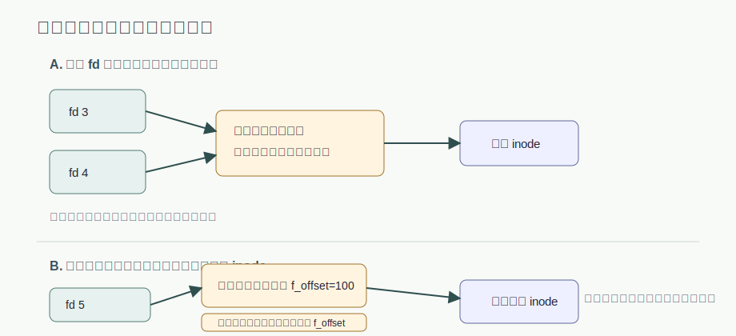
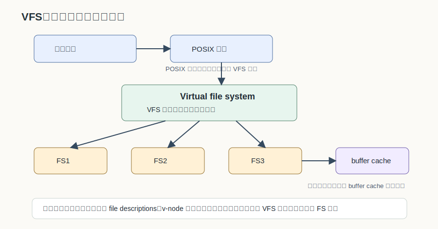
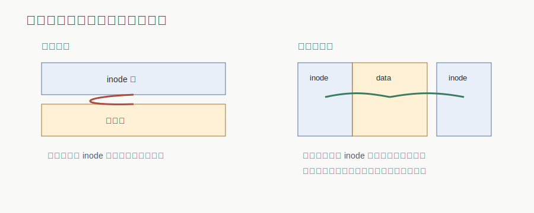
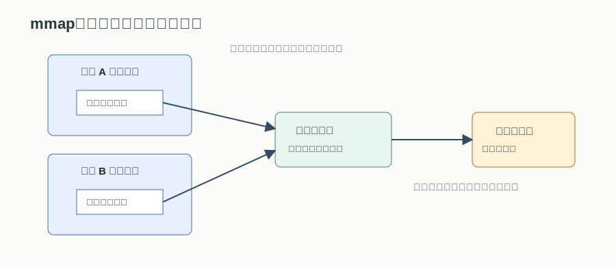

# 第 12 章：文件共享、VFS 与文件系统可靠性

## 学习目标

- 区分硬链接、符号链接和动态共享，并解释它们分别共享 inode、路径还是打开实例。
- 用系统打开文件表和活动 inode 表说明 `f_offset` 何时共享、何时独立。
- 解释日志结构文件系统、日志文件系统和 VFS 分别解决的文件系统问题。
- 比较位示图、成组空闲块链表、块大小、缓存和布局优化背后的 I/O 权衡。
- 按步骤说明逻辑备份和一致性检查怎样帮助文件系统从故障中恢复。
- 说明 `mmap` 怎样把文件页映射进进程地址空间，以及撤销映射时为什么需要写回。

## 上章回顾

上一章已经把 UNIX 文件操作的运行路径打通：`fd` 先连到进程打开文件表，再连到系统打开文件表，最后通过活动 inode 找到文件内容和元数据。这个三层结构是理解本章的钥匙，因为文件共享并不总是“大家拿到同一个文件”这么简单；它可能共享名字、共享 inode，也可能只共享一次打开文件时留下的运行状态。

## 开篇问题

两个进程同时写同一个文件，为什么有时一个进程的 `read` 会接着另一个进程的当前位置走，有时却互不影响？再进一步，文件系统断电后为什么有时能恢复到一致状态，有时需要扫描整盘？这两个问题看似分属“共享”和“可靠性”，其实都围绕同一件事：文件系统必须明确哪些状态被共享，哪些状态要持久化，哪些状态只是在内存里临时协作。

## 本章地图

本章先从共享语义讲起，比较硬链接、符号链接和动态共享；随后引入日志和 VFS，说明文件系统怎样在可靠性和统一接口之间分层。后半章转向工程管理：空闲空间、块大小、缓存、布局、备份和一致性检查都在回答“怎样让文件系统既快又不丢结构”。最后用主存映射文件收束：当文件访问被映射为内存访问时，文件系统和虚拟内存会在同一页上合作。

## 正文

### 12.1 静态共享：硬链接与符号链接

**文件共享（file sharing）** 指不同用户或进程共同使用同一文件。共享的直接收益是减少重复副本，也减少为多个副本分别访问外存的开销；但共享也带来语义问题：目录项、inode、路径名、打开文件表项，到底哪一个才是被共享的对象？

UNIX 中常见的静态共享包括硬链接和符号链接。硬链接由 `link(oldnamep, newnamep)` 建立：系统先按目录检索 `oldnamep`，得到旧文件的 inode 号，再在新父目录中建立一个指向同一 inode 的目录项，并增加 inode 中的链接计数 `i_link`。解除链接的 `unlink(namep)` 与删除文件使用同一套机制：每次解除目录项只让 `i_link` 减一，只有当 `i_link` 为零时，文件内容和 inode 才能被真正回收。

> **核心判断**：文件共享指不同用户或进程共同使用同一文件，可减少复制和外存访问；UNIX 中常见静态共享和动态共享。

| 共享方式 | 目录项保存什么 | 与 inode 的关系 | 典型特点 |
|---|---|---|---|
| 硬链接 | 文件名到 inode 号的映射 | 多个目录项指向同一 inode，`i_link` 记录引用数 | 删除一个名字不等于删除文件，只要还有链接计数 |
| 符号链接 | 指向目标的路径字符串 | 符号链接有自己的目录项和元数据，内容保存目标路径 | 可跨文件系统；目标移动或删除后可能悬空 |

> **易错点**：==硬链接共享 inode，符号链接保存路径==。符号链接不是把目录项直接指向目标文件 inode，而是把目标路径作为文件内容保存下来；符号链接的文件内容是目标路径，路径名短于 60 时，ext2 可将其直接存入 inode，且可跨文件系统。

这张表也解释了为什么符号链接可以跨文件系统：路径字符串可以描述另一个挂载点中的对象，而硬链接要求目录项能直接引用同一文件系统内的 inode。考试中看到“链接”和“共享”时，先问共享的是 <u>inode 号</u> 还是 <u>路径名</u>，许多判断就会变得清楚。

### 12.2 动态共享：共享的是打开实例还是文件内容

静态共享靠目录结构长期存在；**动态共享（dynamic sharing）** 则发生在进程并发访问同一文件时。动态共享通常随着进程打开、复制、继承文件描述符而产生，进程消亡后关系自动消失。它最容易混淆的状态是文件位移指针：同样是“访问同一文件”，两个进程可能共用一个当前位置，也可能各自维护当前位置。

图 12-1 把上一章的打开文件结构拿回来使用。多个 `fd` 如果指向同一个系统打开文件表项，它们就共享同一个文件位移指针；一次 `read` 或 `write` 改变 `f_offset` 后，其他共享者看到的当前位置也随之改变。相反，如果多个系统打开文件表项都指向同一个活动 inode，它们共享的是文件内容和元数据入口，但每个打开表项仍有独立 `f_offset`。

> **核心判断**：同一系统打开文件表项才共享 f_offset；同一 inode 只说明共享文件内容。动态共享发生在进程并发访问同一文件时，进程消亡后共享关系自动消失；读写位置由文件位移指针决定。

因此，`dup` 或父子进程继承文件描述符时，常见结果是共享打开实例；两个进程分别 `open` 同一文件时，更常见的是不同系统打开文件表项指向同一 inode。==同一系统打开文件表项才共享 f_offset==，这是判断动态共享题目的第一步。

### 12.3 日志：先留下可恢复的顺序

文件系统修改很少只改一个位置。例如创建文件可能要改目录项、inode、空闲块信息和数据块。如果断电发生在这些修改中间，磁盘上就可能出现“目录已经指向 inode，但 inode 尚未完整初始化”之类的不一致状态。日志机制的核心想法不是让故障消失，而是在真正修改前后留下足够线索，使恢复程序能判断哪些修改应该重做、哪些应该撤销。

**日志结构文件系统（log-structured file system）** 把同一次文件变动涉及的修改集合成日志记录写回磁盘。顺序写可以提高 I/O 效率，尤其适合把分散的小修改聚合起来；但如果缺少良好的清理和一致性控制，也会增加恢复和空间回收的复杂度。**日志文件系统（journaling file system）** 更强调恢复顺序：在文件变动前先记录操作，操作成功后删除或标记日志记录，失败时根据日志恢复。

> **核心判断**：日志先给恢复留下线索，再让修改落盘。日志结构文件系统把同一次文件变动涉及的修改集合为日志记录写回磁盘；日志文件系统在文件变动前记录操作，成功后删除操作记录，失败时根据日志恢复。

可以把二者的侧重点这样区分：日志结构文件系统把“写到哪里”组织成顺序日志，以改善写入效率；日志文件系统把“如何恢复”组织成事务记录，以降低故障后的不一致风险。二者都利用日志，但一个更偏数据布局和写入策略，一个更偏崩溃恢复协议。

### 12.4 VFS：把多种文件系统折成一致接口

随着一个系统同时挂载本地磁盘、移动介质、网络文件系统和不同格式的分区，用户程序不可能为每种文件系统写一套 `open/read/write`。**虚拟文件系统（Virtual File System, VFS）** 的目标就是在上层提供一致接口，同时支持多种具体文件系统、网络共享和后续扩充。

图 12-2 展示了两层含义。外部看，用户进程经 POSIX 接口进入 VFS，VFS 再把请求交给 FS1、FS2、FS3 等具体文件系统，具体文件系统通过 buffer cache 访问存储。内部看，进程先通过文件描述符表找到 file descriptions，再到 v-node；v-node 抽象具体文件对象，函数指针把 VFS 操作分派到具体 FS 实现。

> **核心判断**：VFS 统一接口，不统一磁盘格式；真正的读写仍由具体文件系统完成。

这也解释了 VFS 为什么能同时支持“像本地文件一样访问远程文件”和“在同一目录树下挂载不同格式分区”。它统一的是 <u>操作入口和对象抽象</u>，不是要求所有文件系统拥有相同的磁盘布局。

### 12.5 管理与优化的共同问题

从这里开始，文件系统问题从“怎样命名和打开文件”转向“怎样让整个系统长期运行”。空闲空间管理决定新块如何分配；块大小影响空间利用率和传输效率；缓存和提前读减少重复 I/O；磁盘布局减少寻道；备份和一致性检查则面对灾难和误操作。它们看起来分散，其实都在围绕三个指标取舍：空间、时间和可恢复性。

| 管理对象 | 主要目标 | 典型代价 |
|---|---|---|
| 空闲空间 | 快速找到可分配块 | 维护位图或链表需要额外元数据 |
| 块大小 | 平衡空间浪费与 I/O 效率 | 小块元数据多，大块内部碎片多 |
| 缓存 | 减少重复磁盘访问 | 脏块写回时机影响一致性 |
| 布局 | 减少寻道和旋转等待 | 需要按局部性组织 inode 与数据 |
| 备份与检查 | 故障后恢复文件系统结构 | 备份占空间，检查可能耗时 |

### 12.6 空闲空间管理与块大小权衡

文件存储空间管理首先要回答：哪些块空闲，怎样快速分配，释放后怎样重新纳入管理。常见方法包括位示图和成组空闲块链表。

| 方法 | 记录方式 | 分配作用 |
|---|---|---|
| 位示图 | 位示图用位记录块空闲状态，一个 bit 对应一个块或一组块 | 二者都服务于文件存储空间分配，适合快速定位连续空闲区域 |
| 成组空闲块链表 | 成组空闲块链表批量记录空闲块，把若干空闲块号成组保存 | 二者都服务于文件存储空间分配，适合批量取出和归还空闲块 |

成组空闲块链表的工程细节在临时文件场景下尤其重要。如果链表过满或过空，系统可能频繁把空闲块信息读入或写回磁盘；临时文件反复创建和释放时，这种边界状态会来回震荡。

1. 检查空闲块链表过满或过空会触发磁盘 I/O 的边界状态。
2. 观察临时文件创建释放可使状态在 a/b 间多次切换 的反复震荡。
3. 通过保持半满状态 c 可减少不必要 I/O。

块大小则体现另一组经典权衡：==块越小利用率越高，块越大 I/O 效率越高==。物理块越小，磁盘利用率越高；物理块越大，磁盘 I/O 效率越高。小块减少内部碎片，一个只占几十字节的小文件不必浪费太多空间；大块让顺序读写一次传输更多数据，减少块地址管理和磁盘访问次数。选择块大小时，不能只追求空间利用率，也不能只追求传输吞吐，必须结合文件大小分布和访问模式。

### 12.7 缓存、提前读与磁盘布局

高速缓存管理可以使用 LRU 等替换策略，但文件系统缓存比普通页缓存多一层风险：某些缓存块是 inode、目录项、位图等元数据，写回顺序会影响文件系统一致性。提前读则利用顺序访问的局部性，在程序真正请求下一块前先把它读入缓存，减少等待。

> **易错点**：缓存命中率不是唯一目标；高速缓存管理可用 LRU，但还必须考虑 inode 块等缓存块与文件系统一致性的关系，并可使用块提前读。

磁盘布局优化关注的是另一类局部性。如果 inode 和数据块相距很远，每次从元数据跳到数据都可能带来额外寻道；把相关 inode 和数据按柱面组组织，可以减少磁头臂移动，提高 I/O 效率。

图 12-3 中，传统布局把 inode 区和数据区分得较远，访问路径容易来回移动；柱面组布局则把一组 inode 和相关数据放近，目标是减少磁头臂移动。这个优化不是改变文件抽象，而是让常一起访问的元数据和数据在物理位置上更接近。

### 12.8 备份与一致性检查

备份面对的是灾难和误操作。文件系统备份用于从灾难或误操作中恢复。物理备份按磁盘块或分区复制，效率高、结构简单，但难以做增量备份，也不便恢复单个文件。逻辑备份按文件系统层次选择对象，能做增量，也能恢复单个文件，但需要理解目录树、文件属性和备份历史。

| 备份方式 | 工作粒度 | 优点 | 局限 |
|---|---|---|---|
| 物理备份 | 块或分区 | 物理备份效率高 | 难以增量和单文件恢复 |
| 逻辑备份 | 文件和目录树 | 逻辑备份可增量并恢复单个文件 | 遍历和筛选成本更高 |

> **核心判断**：物理备份效率高但难以增量和单文件恢复，逻辑备份可增量并恢复单个文件。

==物理备份快，逻辑备份细==。逻辑备份的典型过程可以按目录树来理解：

1. 从根目录遍历目录树。
2. 区分目录、文件和已备份状态。
3. 逻辑备份可按文件粒度选择。

一致性检查则是在文件系统结构已经可能受损时，检查元数据之间是否互相吻合。块一致性检查关注每个块在“已使用”和“空闲”结构中的计数关系；文件一致性检查关注 inode、目录项和引用关系是否对应。

| 检查对象 | 计数或引用关系 | 发现问题后的修复 |
|---|---|---|
| 块一致性 | 块一致性检查比较块使用计数和空闲计数，查看同一块是否缺失、重复或同时出现在冲突位置 | 发现缺失块或重复块需要修复，通常要补入空闲结构或断开错误引用 |
| 文件一致性 | 文件一致性检查关注 inode/目录引用关系，比较链接计数与实际目录项引用 | 发现缺失块或重复块需要修复；引用计数错误则要校正 inode 或目录项 |

备份和一致性检查的关系是互补的：备份让系统能回到某个可用历史版本，一致性检查让当前结构重新满足文件系统规则。前者回答“没有了怎么办”，后者回答“结构坏了怎样整理回来”。

### 12.9 主存映射文件：把文件访问变成内存访问

传统 `read/write` 要在用户缓冲区和内核文件缓存之间复制数据，程序看到的是系统调用接口。**主存映射文件（memory-mapped file）** 结合虚存管理和文件管理技术，把文件的一部分映射到进程地址空间；程序访问这段虚拟地址时，缺页机制把文件页调入内存，于是磁盘访问被转化为内存访问路径。

`mmap` 将文件映射到进程地址空间，`unmmap` 断开文件与进程地址空间的关系，并把需要持久化的内存数据写回磁盘文件。多个进程可以把同一文件页映射到各自地址空间，底层共享物理页充当磁盘文件缓存；写回时，内存数据再同步到磁盘文件。

> **核心判断**：mmap 提升的是访问路径：程序像访问内存一样访问文件页，但写回语义仍属于文件系统。

因此，`mmap` 不是把文件“变成普通内存”后就不再需要文件系统。它只是把访问入口换成地址空间，把缓存页同时交给虚存和文件系统管理。==mmap 把文件 I/O 转换为内存访问路径==，但何时写回、如何保持一致、映射撤销时如何处理脏页，仍要回到文件系统和虚存管理的协作。

## 例题讲解

某程序执行 `fd2 = dup(fd1)`，随后通过 `fd1` 读 100 字节，再通过 `fd2` 读 50 字节。第二次读取从哪里开始？

`dup` 让两个文件描述符指向同一个系统打开文件表项，因此它们共享同一个 `f_offset`。第一次通过 `fd1` 读 100 字节后，表项中的位移指针前进 100；第二次通过 `fd2` 读时，会从新的当前位置继续读。若两个描述符来自两次独立 `open`，通常就是两个系统打开文件表项，各自维护位移指针。

再看一个恢复问题：创建文件时已经写入目录项，但 inode 修改尚未完整落盘，随后系统崩溃。日志文件系统为什么更容易恢复？因为它在文件变动前记录操作，成功后删除或标记记录；失败时恢复程序能依据日志判断这次修改是否完整，从而重做或回滚相关元数据。

## 常见误区

- 把“同一文件”理解成“同一位移指针”。同一 inode 说明内容入口相同，不说明打开实例相同；==同一系统打开文件表项才共享 f_offset==。
- 把符号链接看成硬链接的别名。硬链接让目录项指向同一 inode；符号链接保存目标路径，目标不存在时可能变成悬空链接。
- 把日志结构文件系统和日志文件系统混为一谈。前者更强调把修改集合成日志记录顺序写以提高 I/O 效率，后者更强调变动前记录操作、失败后根据日志恢复。
- 只用 LRU 理解文件系统缓存。文件数据块可以看命中率，元数据块还要看一致性和写回顺序。
- 认为 `mmap` 后文件修改自动永久保存。映射让访问像内存，持久化仍取决于写回时机、撤销映射和系统的一致性策略。

## 本章小结

文件共享首先要分清共享对象：硬链接共享 inode，符号链接保存路径，动态共享则可能共享一次打开文件留下的 `f_offset`。VFS 通过统一接口把多种具体文件系统纳入同一调用路径，日志机制则为崩溃恢复保留顺序线索。空间管理、块大小、缓存、布局、备份和一致性检查体现了文件系统长期运行时的工程权衡。主存映射文件把访问路径接到虚拟内存，但最终仍要由文件系统负责命名、缓存和写回。

## 关键术语

**文件共享（file sharing）** 多个用户或进程共同使用同一文件，以减少复制和外存访问。

**硬链接（hard link）** 多个目录项指向同一 inode 的链接方式，通过 `i_link` 维护引用计数。

**符号链接（symbolic link）** 内容保存目标路径的链接文件，可跨文件系统，但目标失效时会悬空。

**动态共享（dynamic sharing）** 进程并发访问同一文件时形成的临时共享关系，常围绕系统打开文件表项和 `f_offset` 展开。

**虚拟文件系统（Virtual File System, VFS）** 在用户接口和具体文件系统之间提供统一对象抽象与操作分派的内核层。

**日志文件系统（journaling file system）** 在文件变动前记录操作并在故障后按日志恢复一致性的文件系统机制。

**一致性检查（consistency check）** 检查块使用计数、空闲计数、inode 和目录引用关系是否互相吻合的恢复工具。

**主存映射文件（memory-mapped file）** 将文件页映射到进程地址空间，使程序通过内存访问路径读写文件内容的机制。

## 练习与解答

1. 为什么删除一个硬链接不一定删除文件内容？

   **解答**：硬链接只是一个目录项到 inode 的映射。`unlink` 每次让 `i_link` 减一；只有 `i_link` 为零，说明没有目录项再引用该 inode，文件内容才会被实际回收。

2. 两个进程分别 `open` 同一文件，它们一定共享读写位置吗？

   **解答**：不一定。分别 `open` 通常产生不同的系统打开文件表项，这些表项可以指向同一活动 inode，但各自维护 `f_offset`。只有当多个 `fd` 指向同一系统打开文件表项时，读写位置才共享。

3. 块大小选择为什么不能只追求越小越好？

   **解答**：小块能提高磁盘空间利用率，减少内部碎片；但块越小，顺序读写需要处理的块数和元数据越多，I/O 效率可能下降。块大小应结合文件大小分布和访问模式折中。

4. `mmap` 为什么还需要考虑写回？

   **解答**：`mmap` 只是把文件页映射进地址空间，修改可能先停留在内存页中。撤销映射或系统回收脏页时，需要把内存数据同步到磁盘文件，否则持久化副本不会反映这些修改。

## 覆盖记录

- OSPPT-CH04-FILE-SHARING-LINKS-OFFSETS
- OSPPT-CH04-VFS-AND-JOURNALING
- OSPPT-CH04-FS-MANAGEMENT-OPTIMIZATION
- OSPPT-CH04-MEMORY-MAPPED-FILES
