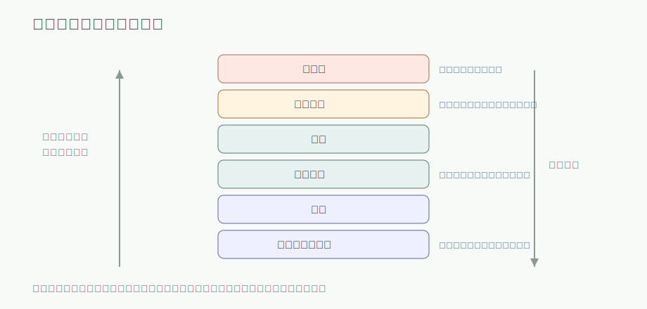
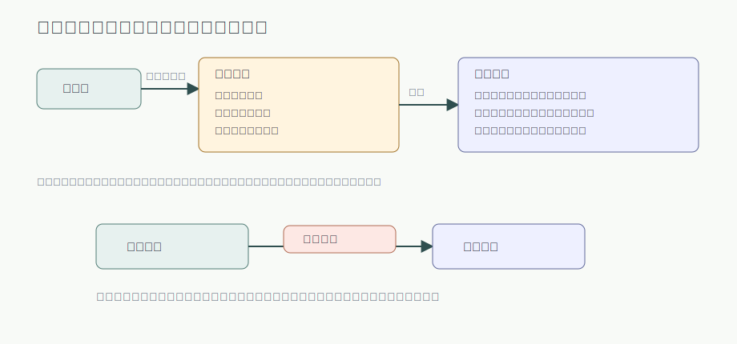
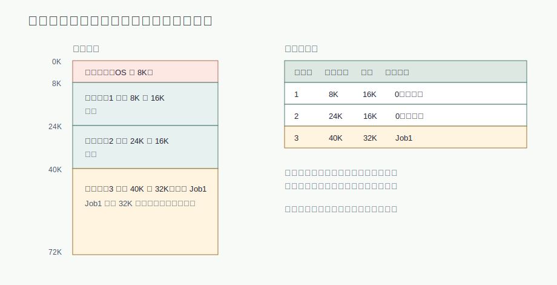
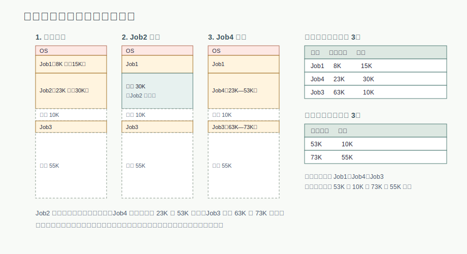
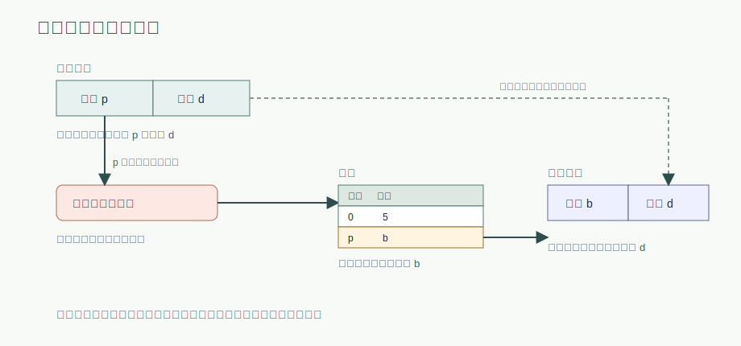
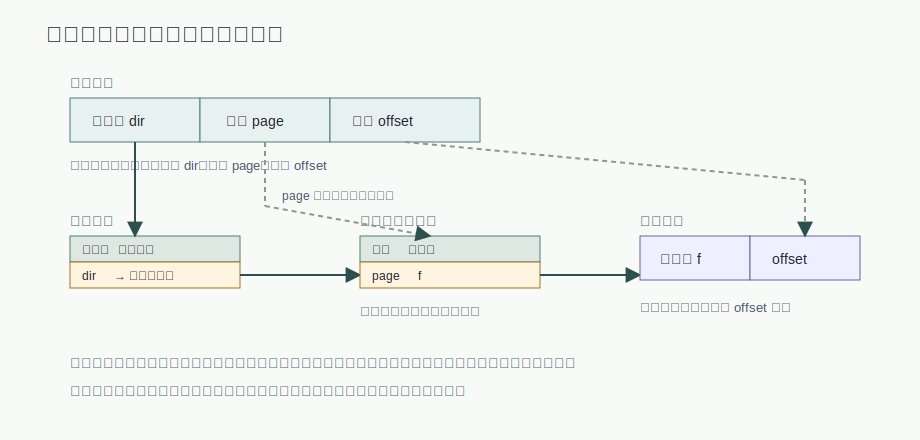
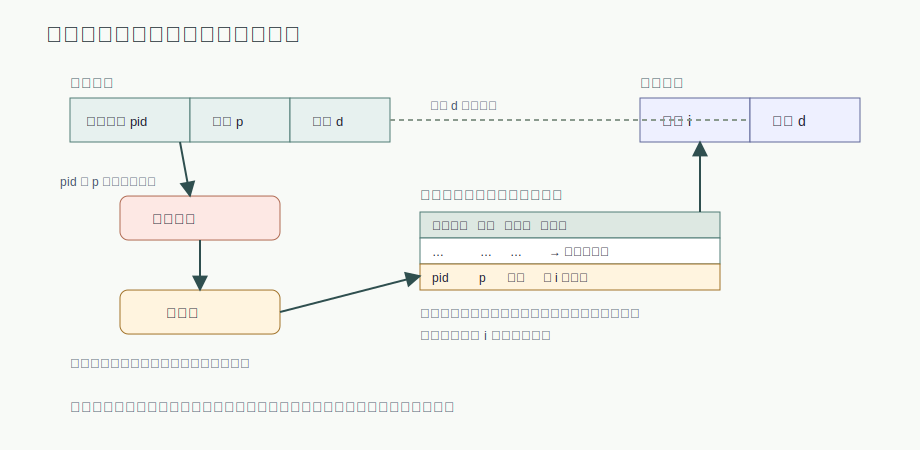
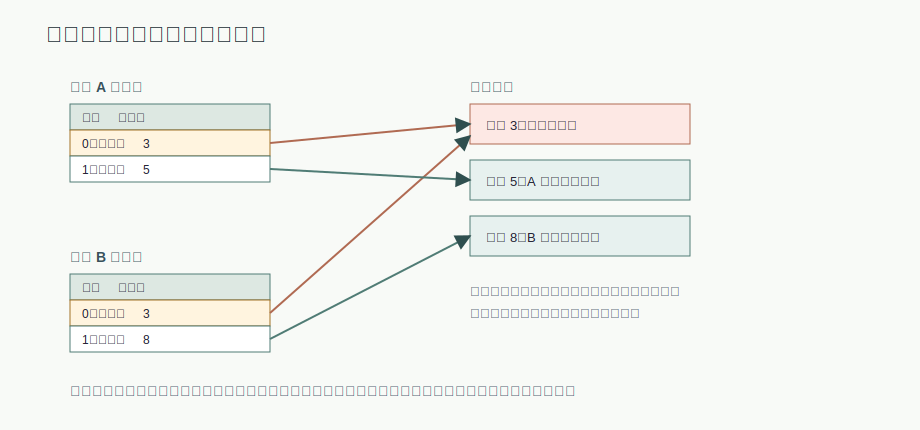
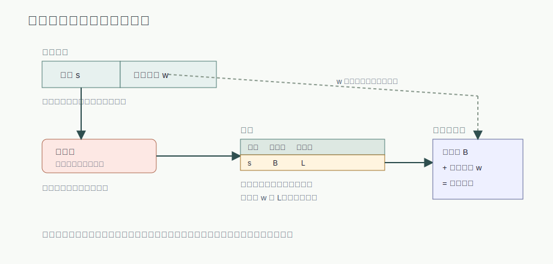

# 第 13 章：实存储管理——连续分配、分页与分段

## 学习目标

- 说出存储管理的基本任务，并用逻辑地址与物理地址解释程序为什么离不开地址重定位。
- 给定内存布局，能按固定分区和可变分区完成分配与回收，并正确更新主存分配表。
- 为作业选择空闲区时，能说出最先适应、最优适应等算法的取舍，并判断回收时四种相邻合并情形。
- 用伙伴系统完成 2 的幂存储块的拆分与合并，并区分内部碎片与外部碎片。
- 给定页长和页表内容，能手算逻辑地址到物理地址的转换，并解释快表为什么能减少访存次数。
- 比较多级页表与反置页表的组织方式，说明分段与分页在可见性和长度决定者上的差别。

## 上章回顾

上一章的结尾把文件接到了内存上：主存映射文件让进程像访问内存一样访问文件页，文件系统和地址空间在同一页上合作。再往前，我们在讲进程时已经知道每个进程都有自己的进程映像，里面装着代码、数据和栈。这两条线索都指向同一个还没回答的问题：进程地址空间背后的主存，究竟是怎么分配和管理的？

## 开篇问题

同一个可执行程序，这次运行被装到主存 8K 处，下次运行可能被装到 40K 处；它指令里引用的地址却一个字节都没改。程序为什么还能正确运行？更进一步：如果主存里同时挤着十几道程序，操作系统怎么保证它们既能各取所需，又不会互相踩到对方的数据？这两个问题——地址怎么对上、空间怎么分配——正是存储管理的全部主题。

## 本章地图

本章讨论实存储管理：程序必须全部装入主存才能运行的管理方式。我们先建立地址转换和存储保护这两个贯穿全章的概念，然后沿着历史脉络走过连续分配的三种形态——单用户、固定分区、可变分区——看碎片问题如何一步步把设计者逼向离散分配。分页和分段是离散分配的两条路线：分页用等长的页框换取分配的简单和高利用率，分段用程序的逻辑模块换取共享和保护的自然表达。至于"程序不必全部装入也能运行"的虚拟存储，需要先把本章的页表机制吃透，我们在后面单独展开。

## 正文

### 13.1 存储管理要解决什么

**存储管理（memory management）** 负责主存中用户区域的管理，基本任务包括：分配与去配（谁用哪块、用完收回）、地址转换（程序里的地址对到主存的地址）、存储保护（互不干扰）、存储共享（该共享的共享）和存储扩充（不够用时想办法）。由于主存和辅存需要协同工作，存储管理也兼顾辅存的管理。

这些任务发生在一个分层的硬件背景之上。计算机的存储器从来不是一整块均匀的资源，而是一个速度、成本与容量互相妥协的层次结构。

图 13-1 提醒我们：主存只是层次中的一层。寄存器和高速缓存比它更快也更贵，磁盘比它更大也更慢，磁盘缓存则在主存和磁盘之间充当桥梁。本章关注的"存储管理"，管理的正是主存这一层，以及它与辅存之间的数据移动。

接下来是贯穿全章的核心区分。**逻辑地址（logical address）** 是程序自己视角中的地址，从 0 开始编排；**物理地址（physical address）** 是主存硬件真正使用的地址。程序被装到主存的哪个位置事先并不确定，所以二者几乎总是不同的，必须有一个转换环节把它们对上——这个环节叫 **地址重定位（address relocation）**。

图 13-2 把地址的旅程分成两段。装载之前，编译和链接产生目标代码；装载之时或运行之时，逻辑地址被转换为物理地址。转换的时机有三种典型选择：**绝对装载** 在编译时就把地址写死，程序只能装到固定位置；**可重定位装载** 在装入时把全部地址一次改好，此后不再变动，称为静态重定位；**动态运行时装载** 把转换推迟到每次访存，由硬件在访问瞬间完成，称为动态重定位。越晚绑定越灵活——程序可以在运行中移动——代价是需要硬件支持。

地址转换解决"对得上"，存储保护解决"越不过"。多道程序共存时，操作系统要防止用户程序破坏系统，也要防止用户程序互相破坏。

> **核心判断**：存储保护要防止操作系统和用户程序之间、不同用户程序之间相互干扰；常见硬件包括界地址和存储键。界地址划出可访问的地址范围，存储键则给存储块和程序各配一把"钥匙"，对不上就触发中断。

### 13.2 连续分配：单用户与固定分区

最朴素的约定是：每个程序占据主存中一段 <u>连续</u> 的空间。连续存储空间管理按演化先后分为三种：单用户连续、固定分区和可变分区。

单用户连续管理把主存一分为二：系统区给操作系统，用户区给唯一的一道程序。地址转换简单到一行算式——物理地址等于界限地址加逻辑地址，保护也只需检查访问是否越过界限。它的问题同样明显：任一时刻只能有一道程序，处理器和主存都谈不上充分利用。

固定分区是多道程序方向上的第一步：系统启动时把用户空间静态划分成若干分区，每个分区任一时刻最多装入一道程序。分区的个数、大小和位置此后不再改变，系统用一张主存分配表记录各分区的状态。

图 13-3 左边是内存布局、右边是主存分配表，两者是同一状态的两种记法：考试画图时从布局推表、从表推布局都要熟练。地址转换与保护既可用静态定位（装入时改好地址），也可用动态定位（基址寄存器加界限检查）。作业调度则有两种组织：按"能容纳它的最小分区"排成多个队列，或所有作业排一个统一队列、来了再挑分区。

> **易错点**：固定分区难以预知合适分区大小，存在空间利用率低、难以动态扩充、分区数限制多道程序道数等问题。一道 10K 的作业装进 32K 的分区，剩下 22K 谁也用不上——浪费发生在分区内部。

### 13.3 可变分区：按作业大小动态建立分区

既然事先猜不准分区该多大，那就不猜了：**可变分区（variable partition）** 不预划分区，而是在作业装入时按它的实际大小现切一块。分区的时间、大小和位置都在 <u>装入前</u> 才动态确定，作业要多少给多少，分区内部不再有浪费。

图 13-4 用一段运行历史展示这种动态性：Job2 完成后让出一段 30K 的空闲区，稍后到达的 Job4 正好需要 30K，就装进了这段 23K 到 53K 的区间。右侧的两张表对应最终状态——已分配区表记录每个作业占据的始址和长度，未分配区表记录每段空闲区。

> **核心判断**：动态分区管理需要同时维护空闲与已分配信息：已分配区表和未分配区表必须随分配与回收同步更新。漏改任何一张表，下一次分配就会建立在错误的内存视图上。

分配靠查未分配区表，回收则多一个动作：检查 <u>左右邻居是否空闲</u>，能合并就合并，否则空闲区会越拆越碎。设释放的分区为 X，相邻关系共四种情形：

| 释放区的邻居情形 | 合并动作 |
|---|---|
| 左右都是已分配区 | A X B 可直接标记中间空闲，X 自己登记为一个新空闲区 |
| 左邻已分配、右邻空闲 | A X 可与右侧空闲段合并，新空闲区从 X 的始址开始、长度相加 |
| 左邻空闲、右邻已分配 | X B 可与左侧空闲段合并，左侧空闲区只需增加长度 |
| 释放区独立成段或左右皆空闲 | 单独 X 或两侧空闲时形成更大空闲区，三段并为一段、表项减少 |

主存里往往同时有多段空闲区，新作业该用哪一段？这就是主存分配算法的用武之地：

| 算法 | 思路 | 特点 |
|---|---|---|
| 最先适应 | 从头扫描，用第一个够大的空闲区 | 实现简单，低地址端容易积累小碎片 |
| 下次适应 | 从上次分配处继续向后找 | 让碎片分布更均匀，避免每次都从头扫 |
| 最优适应 | 挑能容纳作业的最小空闲区 | 留下的剩余最小，但会制造大量难用的小碎片 |
| 最坏适应 | 挑最大的空闲区切一块 | 剩余空闲区仍然较大、还能再用，但大作业可能等不到大区 |
| 快速适应 | 按常见尺寸分类维护空闲区链 | 分配快，合并与维护的开销更高 |

可变分区的地址转换和保护依赖一对寄存器：基址寄存器保存分区始址，限长寄存器保存分区长度。每次访存先检查逻辑地址是否小于限长，再加上基址形成物理地址——分区可以装在任何位置，程序毫无察觉。

### 13.4 伙伴系统、碎片与存储扩充

可变分区"要多少切多少"的另一面是切出来的空闲区五花八门，难以快速检索与合并。**伙伴系统（buddy system）** 在精确与粗放之间取了一个工程折中：所有块的尺寸都是 <u>2 的幂</u>，申请时把大块逐次对半切，直到得到能容纳请求的最小的 2 的幂块；释放时检查这块的"伙伴"——由同一父块对半切出的另一半——若伙伴也空闲，就并回父块，并可逐级向上继续合并。这种二分切分以逼近最佳适应为目标，优点是外部碎片小且便于合并，缺点是块内会有浪费：54K 的请求只能拿到 64K 的块。

这里正好把两种碎片放在一起辨析。固定分区和伙伴系统的浪费发生在已分配块的内部，称为内部碎片；可变分区运行一段时间后，会留下许多==不连续的小分区，即外部碎片==——每一段都不够装下新作业，加起来却可能不小。连续分配走到这里，矛盾已经清楚：只要要求程序占据连续空间，碎片就无法根治。

在转向离散分配之前，还有两种"主存不够用"时的传统技术值得记住：

| 技术 | 思路 | 由谁负责 |
|---|---|---|
| 覆盖技术 | 把不需同时装入的程序单位组织为覆盖段，轮流使用同一段内存 | 程序员划分覆盖结构，对用户不透明 |
| 交换技术 | 把暂时不用的程序或数据整体移到外存，需要时再换回 | 操作系统自动完成，对用户透明 |

覆盖靠程序员精打细算，交换靠系统搬进搬出；两者都缓解了"装不下"，但都没有打破"连续装入"的前提。真正的突破要靠下一节的分页。

### 13.5 分页：离散分配的地址转换

分页的核心想法是放弃连续性：把作业切成等长的小块，分散存放在主存中互不相邻的区域里。作业不必再等一段足够大的连续空间，主存利用率随之提高，也免去了为腾出连续空间而移动程序的开销。

**分页存储管理（paging）** 的基本术语只有一对：

| 概念 | 含义 |
|---|---|
| 页框（page frame） | 页框是物理内存等长块，按块号（页框号）统一编号 |
| 页面（page） | 页面是逻辑地址空间等长块，按页号从 0 起编号 |
| 页面大小 | 页面大小与页框大小相等，通常取 2 的幂 |
| 逻辑地址结构 | 逻辑地址形式为页号加单元号，高位是页号、低位是页内单元号 |

页面和页框等长，于是"把第 p 页放进第 b 块"成了一次干净的整块搬运。地址的对应关系也随之变成纯粹的算术：

$$
逻辑地址 = 页号 * 页长 + 单元号 \\
物理地址 = 页框号（块号）* 块长 + 单元号
$$

| 符号 | 含义 |
|---|---|
| 页号、单元号 | 逻辑地址拆出的两部分；页表查找由页号得到页框号 |
| 页长（块长） | 一页（一块）的字节数，页长与块长相等 |
| 页框号（块号） | 该页当前所在物理块的编号 |
| 页表始址、页表长度 | 作业表记录页表始址和页表长度，转换前先据此定位页表并检查页号越界 |

页号到页框号的映射记录在 **页表（page table）** 中，每道作业一张；系统再用一张作业表登记各作业页表的位置。硬件做转换时的完整流程如下图。

图 13-5 的要点是"页号查表，位移照抄"：查表改变的只有 <u>页号到块号</u> 这一段，==页内位移在转换前后保持不变==。由于页长是 2 的幂，硬件用移位和拼接就能完成整个计算，不需要真正做乘法。

流程里藏着一个性能问题：页表本身放在主存中，于是每次按逻辑地址取数据都要先访问一次页表、再访问一次数据。**快表（TLB）** 就是为消去第一次访问而生的：

| 问题或机制 | 说明 |
|---|---|
| 两次访存问题 | 页表在主存导致一次逻辑访问通常需要两次主存访问：先取页表项，再取数据 |
| 快表 | 用相联存储器保存最近访问的部分页表项，按页号对全部表项并行比较 |
| 快表项内容 | 快表项至少关联页号和页框号，命中时直接拼出物理地址，不再访问主存页表 |

> **思维停顿**：快表为什么敢只存"部分"页表项？因为程序的访问有局部性——一段时间内反复落在少数几页上。这个观察在这里只是省了一次访存，等到讨论虚拟存储时，它将撑起整套设计。

### 13.6 页表的规模问题：多级页表与反置页表

页表本身也要占内存，而且占得不少。地址空间为 4GB、页长 4KB 时，一张一级页表就有一百万项；每个进程都配一张完整的页表，主存很快就被页表自己吃掉了。**多级页表（multilevel page table）** 用"目录加小表"的结构化解这个问题。

图 13-6 中逻辑地址被划成三段：目录号选中页目录表的一项，找到对应的二级页表；页号在二级页表中选中一项，得到页框号；页框号与偏移量拼接成物理地址。关键的节省在于：进程没有用到的地址区间，对应的二级页表可以根本不建。

> **易错点**：==多级页表省的是页表内存，不是访存次数==。二级页表下访问一个数据可能需要访问页目录、页表和数据三次主存——层级越多访存越多，所以多级页表反而更依赖快表来兜底性能。

多级页表的表项数仍然跟着逻辑地址空间走。**反置页表（inverted page table）** 换了一个方向：不为每个进程的每个逻辑页建项，而是为每个物理块建一项，整个系统只有一张表，表项数取决于 <u>物理块数</u>。代价是查找方向反了——拿着进程号和页号，要在按物理块组织的表里找到匹配项，于是需要哈希结构加速。

图 13-7 中，进程标识和页号一起经过哈希函数落到哈希表的某个入口，沿链指针在反置页表中比对，命中项的序号就是物理块号。反置页表只保存已调入内存的页面信息，表的规模与物理内存成正比，特别适合逻辑地址空间远大于物理内存的体系结构。

### 13.7 分页下的分配、保护与共享

分页把主存分配变成了简单的记账：以块为单位，用位示图（每个块一个比特，0 空闲 1 占用）或空闲块链表记录即可。作业要 n 页就找 n 个空闲块，完全不必连续，外部碎片随之消失——浪费只剩下最后一页装不满的内部碎片。

保护同样落在页表上。页表项可以携带标志位，限定该页只读、可写或可执行，越权访问触发中断；也可以沿用存储保护键，给每个存储块配键、访问时核对。

分页还带来一种廉价的共享方式：让不同进程的页表项指向同一个页框，代码只在主存里放一份。

图 13-8 中进程 A 和 B 的页 0 都映射到页框 3，共享同一份代码；各自的数据页则映射到不同页框、互不干扰。共享代码有一个容易忽略的前提：代码内部的转移和访问地址在编译时已按页号生成，所以两个进程必须用同一个页号来映射这份代码，否则代码里的地址在另一个进程中会指错位置。

### 13.8 分段：面向程序逻辑的离散分配

分页对用户完全透明，这既是优点也是局限：页的边界是机械切出来的，与程序的逻辑结构毫无关系，想按"模块"共享或保护就很别扭。**分段存储管理（segmentation）** 为此而生——按程序自身的逻辑模块（主程序、子程序、数据区、栈）划分内存，满足模块化装配、共享和保护的需要。

图 13-9 与图 13-5 形成对照：逻辑地址由段号和段内地址组成，作业表定位段表，段表项给出段始址和段长度；先用段长检查越界，再用基址加偏移算出物理地址。因为段长不固定，这里是真正的加法，而不是分页那样的拼接。

每个段内部仍要求连续，所以分段的主存分配可以直接借鉴可变分区的全部机制——空闲区表、分配算法、回收合并，只是分配单位从整个作业变成了一个段。段共享也因此非常自然：两个作业的段表项指向同一个段基址，整段代码或数据就被共享了，==分段按模块共享，分页按页框共享==。

最后把两条离散分配路线放在一起比较：

| 维度 | 分段 | 分页 |
|---|---|---|
| 划分依据 | 程序的逻辑模块，用户可见 | 机械等分，用户不可见 |
| 长度 | 各段不等长，由程序结构决定 | 所有页等长，由系统决定 |
| 地址结构 | 段号加段内地址，二维地址 | 页号加单元号，一维线性地址切分而来 |
| 物理地址计算 | 段始址加段内地址（加法） | 块号拼页内位移（拼接） |
| 主要服务目标 | 模块化、共享、保护 | 主存利用率、分配简单 |

> **核心判断**：分段是用户可见的逻辑单位、段长由用户确定；分页是用户不可见的物理单位、页长由系统确定，且页按页大小整数倍对齐。判断题里凡是把"用户可见""长度由谁定"两个属性张冠李戴的说法，都是错的。

分页善于利用主存，分段善于表达程序——两者并不互斥。把每个段再按页管理，就得到段页式存储；它和"程序不必全部装入"的想法会合之后，才是现代虚拟存储的完整图景，那是我们接下来的主题。

## 例题讲解

**例 1：伙伴系统的拆分与合并。** 一片 1024K 的用户内存按伙伴系统管理，依次到达请求 A 54K、B 108K、C 60K、D 120K。分配过程如下：

1. A 54K 适配 64K 块：1024K 对半切成两个 512K，再切出 256K、128K、64K，把其中一个 64K 分给 A；此时空闲块为 512K、256K、128K 和 A 的 64K 伙伴。
2. B 108K 适配 128K 块：空闲的 128K 块正好够用，直接分给 B。
3. C 60K 适配 64K 块：A 拆分时留下的那个 64K 伙伴分给 C，64K 一级暂时用尽。
4. D 120K 适配 128K 块：只能把空闲的 256K 对半切开，一半给 D，另一半 128K 留作空闲。
5. 释放后相邻 buddy 可合并：若 A 与 C 先后释放，这两个 64K 块由同一个 128K 块切出，是一对伙伴，立即并回 128K；若此后 D 也释放，128K 们逐级向上合并。注意伙伴关系认"出身"——地址相邻但出身不同的两个空闲块不会合并。

**例 2：分页地址转换。** 某分页系统页长 1KB，作业的页表为：页 0 → 块 2，页 1 → 块 4，页 2 → 块 1，页 3 → 块 7。求逻辑地址 3500 对应的物理地址。

页号 = 3500 ÷ 1024 取整 = 3，单元号 = 3500 − 3 × 1024 = 428。查页表得页 3 在块 7，于是物理地址 = 7 × 1024 + 428 = 7596。若给出的逻辑地址换算出的页号不小于页表长度，硬件将触发越界中断而不是继续转换——这一步检查在考题里经常被故意埋成陷阱。

## 常见误区

- 把逻辑地址和物理地址当成一回事。程序里的地址全部是逻辑地址，装到哪、怎么转换由存储管理决定；只有绝对装载这种最不灵活的方式才让两者重合。
- 内部碎片与外部碎片张冠李戴。固定分区和伙伴系统的浪费在已分配块内部，是内部碎片；可变分区的浪费是区间留下的不连续小空闲区，是外部碎片。
- 页面与页框混用。页面属于作业的逻辑地址空间，页框属于物理主存；页表的职责就是把前者映射到后者。
- 把快表当成页表的替代品。快表只缓存部分页表项，未命中时仍要查主存中的页表；它改变的是访问速度，不是映射关系本身。
- 以为多级页表更省时间。它省的是页表占用的内存，访存次数反而增加，性能要靠快表挽回。
- 忽略共享代码页的页号约束。共享页中的地址引用要求统一页号，仅仅"指向同一页框"还不足以让代码在两个进程中都正确运行。

## 本章小结

实存储管理围绕两件事展开：地址怎么对上，空间怎么分配。地址转换把程序的逻辑地址映射到主存的物理地址，转换时机从编译时一路推迟到运行时，灵活性逐步增加；存储保护用界地址和存储键挡住越界访问。连续分配从单用户走到固定分区再到可变分区，配上分配算法、回收合并和伙伴系统，但碎片问题始终无法根治。分页用等长页框实现离散分配，依靠页表完成"页号查表、位移照抄"的地址转换，用快表消解两次访存，用多级页表和反置页表控制页表自身的规模。分段则按程序逻辑模块管理内存，让共享和保护表达得更自然。分页利用主存、分段表达程序，两者结合并引入按需装入之后，就是虚拟存储的世界。

## 关键术语

**存储管理（memory management）** 操作系统对主存用户区域的分配、去配、地址转换、保护、共享与扩充，兼顾辅存管理。

**逻辑地址（logical address）** 程序视角中从 0 开始编排的地址，需经转换才能用于访问主存。

**物理地址（physical address）** 主存硬件实际使用的地址。

**地址重定位（address relocation）** 把逻辑地址转换为物理地址的过程，按时机分为静态重定位和动态重定位。

**存储保护（memory protection）** 防止操作系统与用户程序、不同用户程序之间相互干扰的机制，常用界地址和存储键实现。

**固定分区（fixed partition）** 系统启动时静态划分用户空间，每个分区任一时刻最多装入一道程序的连续分配方式。

**可变分区（variable partition）** 作业装入时按实际大小动态建立分区的连续分配方式，依赖已分配区表与未分配区表。

**伙伴系统（buddy system）** 按 2 的幂对半切分与成对合并管理空闲块的分配算法，外部碎片小但存在内部碎片。

**内部碎片（internal fragmentation）** 已分配存储块内部未被使用的空间。

**外部碎片（external fragmentation）** 分配区之间留下的不连续小空闲区。

**覆盖技术（overlay）** 把不需同时装入的程序单位组织为覆盖段、轮流使用同一段内存的存储扩充技术。

**交换技术（swapping）** 把暂时不用的程序或数据在主存与外存之间整体移动的存储扩充技术。

**分页存储管理（paging）** 把地址空间与主存等分为页面和页框、允许作业离散存放的管理方式。

**页表（page table）** 记录页号到页框号映射的表，地址转换的核心数据结构。

**快表（translation lookaside buffer, TLB）** 用相联存储器缓存最近使用的页表项，以减少地址转换访存次数的硬件。

**多级页表（multilevel page table）** 用页目录索引多张小页表的结构，未使用的地址区间可不建页表以节省内存。

**反置页表（inverted page table）** 按物理块组织、借助哈希查找的系统级页表，规模与物理内存成正比。

**分段存储管理（segmentation）** 按程序逻辑模块划分内存、以段表完成地址转换的管理方式。

**段表（segment table）** 记录各段段始址与段长度的表，转换时先做越界检查再做基址加偏移。

## 练习与解答

1. 固定分区和可变分区分别在什么时机划分内存？它们各自主要产生哪种碎片？

   **解答**：固定分区在系统启动时静态划分，分区大小和数目此后不变；作业装不满分区时产生内部碎片。可变分区在作业装入前按作业大小动态建立分区；分区内部不浪费，但运行一段时间后会留下许多不连续的小空闲区，即外部碎片。

2. 某分页系统页长 1KB，页表为页 0 → 块 5、页 1 → 块 2、页 2 → 块 8。求逻辑地址 2100 的物理地址。

   **解答**：页号 = 2100 ÷ 1024 取整 = 2，单元号 = 2100 − 2048 = 52；查页表得块 8，物理地址 = 8 × 1024 + 52 = 8244。

3. 快表为什么能减少分页系统的访存次数？命中与未命中时各发生什么？

   **解答**：页表放在主存中，一次逻辑访问通常需要两次主存访问。快表用相联存储器保存最近访问的部分页表项；命中时直接由快表得到页框号、拼出物理地址，只访问主存一次；未命中时仍按页表基址寄存器查主存页表，并把该表项装入快表以备后用。

4. "多级页表减少了访问主存的次数"——这个说法对吗？多级页表到底解决什么问题？

   **解答**：不对。二级页表下访问一个数据可能需要页目录、页表、数据三次主存访问，次数反而增加。多级页表解决的是页表自身占用内存过大的问题：没有用到的地址区间不必建立二级页表。性能损失通常靠快表弥补。

5. 从可见性、长度决定者和物理地址计算方式三个角度比较分段与分页。

   **解答**：分段是用户可见的逻辑单位，段长由用户（程序结构）确定，物理地址由段始址加段内地址算出；分页是用户不可见的物理单位，页长由系统确定且页按页大小整数倍对齐，物理地址由块号与页内位移拼接而成。

## 覆盖记录

- OSPPT-CH05-MEMORY-MANAGEMENT-OVERVIEW
- OSPPT-CH05-CONTIGUOUS-ALLOCATION-MODELS
- OSPPT-CH05-BUDDY-OVERLAY-SWAP
- OSPPT-CH05-PAGING-BASICS-ADDRESS-TRANSLATION
- OSPPT-CH05-MULTILEVEL-INVERTED-PAGE-TABLES
- OSPPT-CH05-SEGMENTATION-MANAGEMENT
