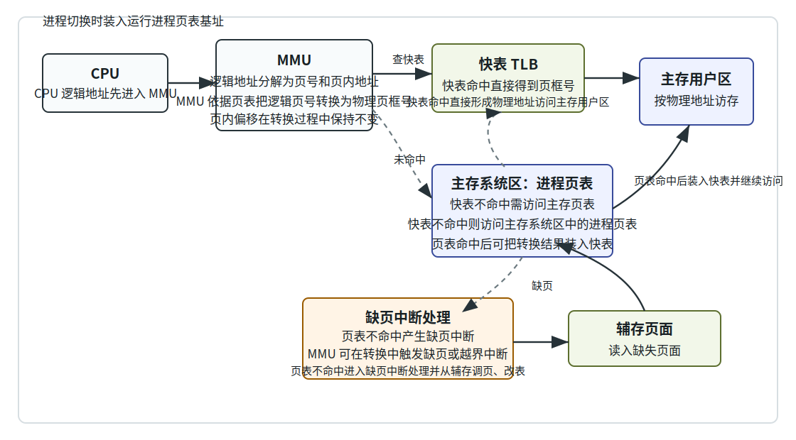
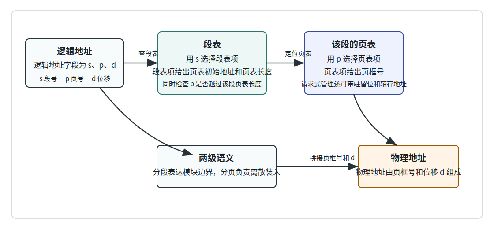

# 第 14 章：虚拟存储与请求分页

## 学习目标

- 用部分装入、部分对换和局部性解释虚拟存储器为什么能让进程在实际主存不足时仍然运行。
- 区分虚拟存储与传统交换技术：能说清二者的处理单位、运行条件和用户透明性差别。
- 读懂请求分页的扩展页表，说明驻留标志、页框号、辅存地址、脏位、访问位和锁定位各自服务于哪一步。
- 沿着 MMU、TLB、页表和缺页中断的路径，完整追踪一次逻辑地址访问怎样变成物理地址访问。
- 比较请页式/预调式装入、请页式/预约式清除和页缓冲技术的取舍。
- 用页面大小公式解释页表开销与内部碎片的折中，并说明交换区、锁定页、写时复制和请求段页式虚拟存储的作用。

## 上章回顾

上一章已经把主存管理的基本工具准备好了：分页让作业可以离散地占据页框，页表记录页号到页框号的映射，快表用局部性减少查页表的访存次数；分段则按程序逻辑模块组织地址空间。可是上一章还有一个默认前提：程序要运行，相关内容已经在主存里。本章要松开这个前提。

## 开篇问题

一个程序的地址空间可能有几 GB，物理主存却不一定能同时容纳它；更极端一点，系统里还有许多进程都在等着运行。难道只有等整个程序都装入主存，它才能执行第一条指令吗？如果不是，处理器访问一个还没在主存里的地址时，究竟发生了什么？虚拟存储的核心答案很朴素：先装正在用的部分，没装到的部分等真正访问时再补进来。

## 本章地图

本章讨论虚拟存储：它不是把磁盘伪装成同速主存，而是在页表、MMU 和缺页中断的配合下，把主存与辅存组织成一个更大的地址空间抽象。我们先建立部分装入与局部性的直觉，再进入请求分页：页表为什么要扩展、一次访存如何在快表命中、页表命中和缺页中断之间分岔。随后讨论装入、清除和页缓冲这些运行策略，最后把页面大小、交换区、写时复制以及请求分段、请求段页式放到同一张地图里，看到分页与分段在虚拟存储中的继续合作。

## 正文

### 14.1 虚拟存储先改变装入规则

**虚拟存储器（virtual memory）** 的第一层意思是：程序或数据不必一次全部装入主存。系统只把当前运行所需的部分放进主存，其余部分留在辅存；当进程真正访问到尚未装入的页或段时，再由操作系统把它调入。这个动作对用户程序透明，程序仍然在自己的逻辑地址空间里写地址，不需要知道哪一页此刻在主存、哪一页还在磁盘上。

> **核心判断**：==虚拟存储器使作业所需主存空间可以大于实际内存==，同时提高主存利用率，并让物理主存大小对用户透明。

这件事听起来像魔法，其实依靠的是程序访问的**局部性（locality）**。时间局部性说：刚访问过的内容很可能很快又被访问；空间局部性说：访问某个地址后，附近地址很可能也会被访问。循环体、函数调用栈、顺序数组扫描，都是局部性的日常形态。只要一段时间内活跃页面只是地址空间的一小部分，系统就不必把整个程序都压进主存。

虚拟存储管理要同时解决三类问题：主存和辅存如何统一管理，逻辑地址如何继续转换成物理地址，尚未在主存的部分如何按需装入并在必要时对换出去。表 14-1 把它和上一章讲过的传统交换技术放在一起比较。

| 机制 | 处理单位 | 运行条件 | 主要效果 |
|---|---|---|---|
| 交换技术 | 通常以整个进程或大块进程映像为单位换入换出 | 进程整体太大时，可能无法解除挂起并重新装入 | 缓解多进程争用主存，但仍偏向“整体搬运” |
| 虚拟存储 | 以页或段为单位按需装入、按需对换 | ==进程所需主存容量大于当前空闲量时仍可运行== | 让程序看到更大的可寻址主存抽象 |

> **易错点**：虚拟存储不是“把所有内容都提前换进来”，而是以页或段为单位处理；传统对换更像把进程整体搬进搬出。==虚拟存储的关键是部分装入和部分对换==。

常见虚拟存储管理技术有三类：请求分页式、请求分段式和请求段页式。本章先以请求分页为主线，因为分页已经把地址空间切成等长页面，最适合演示“访问到哪页，才把哪页调入”的运行逻辑。

### 14.2 请求分页把页表变成运行时账本

**请求分页（demand paging）** 是分页式虚拟存储管理的扩展。上一章的分页默认页表项能直接给出页框号；请求分页则要承认另一种状态：这个逻辑页属于进程地址空间，但当前并不在主存。于是页表项不再只是“页号到页框号”的静态映射，而变成运行时账本。

| 字段或标志 | 作用 | 缺页时的意义 |
|---|---|---|
| 驻留标志 | 驻留标志决定页是否在主存 | 若标志显示不在主存，硬件不能直接形成物理地址 |
| 页框号 | 当页面在主存时，给出所在物理页框 | 只有驻留页的页框号才可用于拼接物理地址 |
| 辅存地址 | 不在主存时需要辅存地址支持调页 | 缺页处理程序据此找到页面在交换区或文件中的位置 |
| 状态标志 | 其他标志包括缺页/驻留、脏页、访问、锁定、淘汰等 | 脏位影响是否写回，访问位服务替换判断，锁定位防止关键页被换出 |

这张表的价值在于分清“能不能立刻访问”和“应该怎样补救”。驻留标志回答前者；辅存地址和状态标志回答后者。如果页面在主存，页表项就像普通分页一样给出页框号；如果页面不在主存，页表项就必须保存足够信息，让内核能够把它从辅存调回来。

请求分页的内核工作贯穿进程生命周期。创建进程时，系统建立地址空间和页表，但不必把所有页都装入；调度进程执行时，硬件使用该进程的页表和页表基址；访问缺页时，处理器触发缺页中断，内核选择页框、读入页面并改写页表；进程终止时，系统回收页表、页框和辅存空间。这条线索解释了为什么虚拟存储不是单独一个算法，而是一组硬件与内核路径的配合。

### 14.3 MMU、TLB 与缺页中断：一次访存的分岔

从处理器看，一次访存仍然从逻辑地址开始。**内存管理单元（MMU）** 接收逻辑地址，把它拆成页号和页内地址，用页号查快表或页表，得到页框号后与页内地址拼出物理地址。请求分页只是在这条路径上增加了一个分岔：页表项可能说“这页还不在主存”。

图 14-1 把三种结果放在一张图里。第一种最好：快表命中，MMU 直接得到页框号并访问主存用户区。第二种稍慢：快表不命中，但主存页表命中；系统访问页表后把转换结果装入快表，再继续本次访问。第三种才是请求分页特有的路径：页表项显示页面不在主存，于是产生缺页中断。

> **核心判断**：缺页中断不是程序地址写错的同义词。若访问的页属于进程地址空间但尚未驻留主存，缺页中断就是把页面补入主存的正常机制；若页号越过地址空间范围，才是越界访问。

缺页处理大致可以按六步理解：

1. 处理器发现页表项不驻留，保存现场并转入缺页中断处理程序。
2. 内核检查该地址是否合法；若非法，终止或通知进程。
3. 若合法，找到页面在辅存中的位置。
4. 找到一个可用页框；若没有空闲页框，需要选择旧页淘汰。
5. 从辅存把缺失页面读入页框，必要时等待 I/O 完成。
6. 更新页表和快表相关状态，恢复进程，让原来的指令重新执行。

这里有一个细节很重要：缺页发生在指令访问内存的中途，处理完后通常要<u>重新执行导致缺页的指令</u>。因此硬件和操作系统必须保证缺页处理前后的进程现场一致，不能让一条指令只执行半截。

### 14.4 装入、清除与页缓冲

当系统决定“这页不在主存，要把它调进来”时，还要回答两个策略问题：什么时候装入页面，什么时候把修改过的页面写回辅存。

| 策略 | 做法 | 适合的直觉 |
|---|---|---|
| 请页式调入 | 只有实际访问缺页时才把页面调入 | 不猜测未来，避免提前装入不用的页 |
| 预调式调入 | 根据空间局部性，提前调入可能很快访问的相邻页面 | 顺序访问明显时可减少后续缺页 |
| 请页式清除 | 页面被淘汰且确实需要写回时才清除 | 写回动作少，但淘汰路径可能变慢 |
| 预约式清除 | 提前把脏页写回辅存，使页面以后更容易被淘汰 | 平滑 I/O 压力，但可能写回后来又被修改的页 |

装入策略的风险在于猜测。预调式调入猜对了，后面的访问更顺；猜错了，主存和 I/O 都被无用页面占用。清除策略的风险在于时机。请页式清除把写回拖到不得不做时，容易让一次缺页处理变长；预约式清除提前写回，换来更从容的淘汰路径。

**页缓冲（page buffering）** 进一步把“淘汰”和“立即写回”拆开。被淘汰的页面不一定马上彻底失去价值：未修改页面可以进入非修改页面队列，必要时很快重新利用；修改页面可以进入修改页面队列，由后台逐步写回。这样一来，清除操作和替换操作不必总是成对出现。

> **思维停顿**：页缓冲体现的是一种很常见的操作系统设计：把前台路径上的急事变少，把可延后的 I/O 放到后台批量处理。文件系统的延迟写、设备管理中的缓冲，也有类似味道。

### 14.5 请求分页与主存映射文件怎样接上

上一章讲主存映射文件时，我们说进程可以像访问内存一样访问文件内容。现在可以把这句话补完整：映射区的某个地址第一次被访问时，如果对应页面尚未驻留，MMU 会走到缺页路径；缺页处理程序根据页表或相关映射结构找到文件中的页面，把它读入页框，再让原来的访存继续执行。

如果映射页被写过，页表中的脏位会记录“主存副本已经不同于后备存储”。之后系统可以在换出、解除映射或同步时把它写回。这样，主存映射文件并不是绕过虚拟存储，而是把文件页纳入同一套缺页、驻留、脏页和写回机制。

> **核心判断**：主存映射文件能“像内存一样访问”，靠的不是文件突然变成主存，而是虚拟地址、页表、缺页中断和后备存储之间的协作。

这个连接也解释了为什么请求分页页表需要辅存地址：普通匿名页面的后备位置可能在交换区，文件映射页面的后备位置则来自文件。对 MMU 来说，它只需要知道当前页是否驻留；对内核来说，不同后备来源决定了缺页时从哪里读、脏页最终写回哪里。

### 14.6 页面大小、交换区与写时复制

页面大小不是越小越精细就越好，也不是越大越省事就越好。页小，内部碎片少，但页表项更多、页表开销更大，I/O 次数也可能增加；页大，页表变小、一次读写更多连续数据，但最后一页装不满的浪费更大，也可能把短期不用的内容一起拖进主存。

一个常见的页面大小估计把两类开销压成一条公式：

$$
f(p)=se/p+p/2
$$

| 符号 | 含义 |
|---|---|
| `p` | 页面大小 |
| `s` | 进程平均大小或被估计的地址空间规模 |
| `e` | 每个页表项的大小 |
| `se/p` | 页表开销随页变大而下降 |
| `p/2` | 平均内部碎片随页变大而上升 |

> **核心判断**：页面并不是越大越好，也不是越小越好；最佳页面大小在二者权衡处取得。

因此，常见最佳页面尺寸往往落在一个工程区间内，课件给出的范围是 ==512B 到 8KB==。真实系统还会把磁盘 I/O 粒度、缓存层次、TLB 覆盖范围和硬件页大小一起纳入考虑，但考试里最常见的判断仍是这一对拉扯：页表开销随页变大而下降，内部碎片随页变大而上升。

页面被淘汰后放到哪里？通常需要**交换区（swap area）** 或交换文件保存被换出的匿名页面。若页面对应文件映射，后备位置可能是原文件；若页面是进程堆栈、堆等匿名内容，就需要交换空间承接。还有一种页面不能随意换出：正在参与 I/O 的主存页需要被<u>锁定</u>，否则设备还没读写完，页面就被替换给别的用途，I/O 结果会落到错误对象上。

**写时复制（copy-on-write, COW）** 则是在页面级优化复制开销。父子进程刚创建时，许多页面内容相同，系统不必立刻复制整份内存，而是让双方页表先指向同一批只读页框；直到某一方真的写入，才触发保护异常，复制出自己的页面并恢复写权限。它利用的仍然是虚拟存储的基本能力：页表可以表达共享、权限和按需分配。

### 14.7 从请求分页到请求分段、请求段页式

请求分页按页处理虚拟存储，适合主存利用和等长块管理；请求分段则保留分段的程序逻辑视角。表 14-4 把三种技术放在一起，重点看它们的单位和触发动作。

| 技术 | 虚拟存储单位 | 触发事件 | 管理动作 |
|---|---|---|---|
| 请求分页 | 页面 | 访问的页不在主存 | 根据页表和辅存地址调页，更新页表项 |
| 请求分段 | 请求分段以段为虚拟存储单位 | 访问不在主存的段会触发装入流程 | 装入后需要更新相应管理表项 |
| 请求段页式 | 先按段表达逻辑模块，再把每段划分为页面 | 访问某段内某页且页面不驻留 | 先查段表定位该段页表，再查页表完成调页和地址转换 |

请求分段的优点是模块边界清楚，适合共享和保护；代价是段长不等，装入和分配仍要面对可变长度空间的问题。请求段页式把两条路线接起来：程序员或编译系统看到的是段，系统内部按页调入和分配。

图 14-2 中，逻辑地址不再只是页号和位移，而是 `s, p, d` 三段：`s` 选段表项，段表项给出该段页表的初始地址和页表长度；`p` 在该页表中选页表项，得到页框号；最后用页框号和位移 `d` 形成物理地址。与单纯分页相比，它多了一次段表层次；与单纯分段相比，它把每个段内部又交给分页处理。

> **易错点**：请求段页式不是“分段和分页二选一”。它用分段表达模块，用分页管理每个段内部的实际装入和页框分配。

## 例题讲解

**例 1：判断一次访存会怎样处理。** 某进程访问逻辑地址 `A`，MMU 拆出的页号为 5、页内位移为 120。快表中没有页 5；主存页表中页 5 的驻留标志为 0，辅存地址有效。问这次访问属于哪条路径？

快表不命中并不等于缺页，它只说明不能从快表直接得到页框号；接下来要查主存页表。页表项的驻留标志为 0，才说明页 5 当前不在主存，因此硬件产生缺页中断。内核检查地址合法后，根据辅存地址找到页面，选择页框读入，更新页表和快表，最后让原访存指令重新执行。页内位移 120 在整个过程中保持不变，改变的是“页 5 对应哪个页框”。

**例 2：页面大小权衡。** 假设某系统估计 `s = 1MB`，页表项大小 `e = 4B`。若只看公式 `f(p)=se/p+p/2`，页面从 1KB 增加到 4KB 时，两项开销怎样变化？

当 `p = 1KB` 时，页表开销项约为 `1MB * 4B / 1KB = 4096B`，内部碎片项约为 `512B`。当 `p = 4KB` 时，页表开销项降为约 `1024B`，内部碎片项升为约 `2048B`。所以页面变大并不是单向变好：页表更省，但内部碎片更多。实际选择要看二者总和以及 I/O、TLB 等工程因素。

## 常见误区

- 把虚拟存储理解成“磁盘和主存一样快”。虚拟存储只是提供更大的地址空间抽象，缺页时仍要付出磁盘或后备存储 I/O 代价。
- 把缺页中断当成程序错误。合法地址的缺页是请求分页的正常路径；越界访问才是地址非法。
- 以为快表不命中就是缺页。快表不命中后还要查主存页表，只有页表项显示页面不驻留时才会缺页。
- 忽略页内位移。请求分页中，页号可能通过页表转换成页框号，==页内位移在转换前后保持不变==。
- 认为页面越小越好。页面小会降低内部碎片，但会增加页表规模和管理开销。
- 忘记锁定 I/O 页面。正在被设备读写的页面若被替换，I/O 可能写入错误页框。

## 本章小结

虚拟存储把“程序必须全部在主存里才能运行”的前提改成了“当前需要的部分在主存里即可”。局部性使这种做法有现实基础，页表、MMU、TLB 和缺页中断使它能被硬件和内核共同执行。请求分页把页表扩展为运行时账本：驻留标志决定能否直接访存，辅存地址支持缺页调入，脏位、访问位和锁定位服务于写回、替换和 I/O 安全。页面大小、交换区、页缓冲和写时复制体现了虚拟存储中的工程权衡；请求分段与请求段页式则说明，分页的主存效率和分段的模块表达可以继续结合。

## 关键术语

**虚拟存储器（virtual memory）** 通过地址转换、部分装入和部分对换，让进程看到比实际物理主存更大的地址空间抽象。

**部分装入（partial loading）** 只把当前运行所需的程序或数据部分放入主存，其余部分保留在辅存。

**部分对换（partial swapping）** 以页或段为单位在主存与辅存之间换入换出，而不是总以整个进程为单位搬运。

**局部性（locality）** 程序在一段时间内倾向于反复访问少数地址及其附近地址的性质，包括时间局部性和空间局部性。

**请求分页（demand paging）** 只在页面被访问且不在主存时才动态装入页面的分页式虚拟存储技术。

**缺页中断（page fault）** 处理器访问合法但未驻留主存的页面时触发的异常，用于转入内核完成调页。

**扩展页表（extended page table）** 在页框号之外加入驻留标志、辅存地址、脏位、访问位、锁定位等状态信息的页表组织。

**页面装入策略（page fetch policy）** 决定页面何时调入主存的策略，典型方式包括请页式调入和预调式调入。

**页面清除策略（page cleaning policy）** 决定修改页何时写回辅存的策略，典型方式包括请页式清除和预约式清除。

**页缓冲（page buffering）** 用修改页面队列和非修改页面队列缓冲被淘汰页面，使替换与写回不必总是同步发生。

**交换区（swap area）** 用于保存被换出匿名页面的磁盘区域或交换文件。

**写时复制（copy-on-write, COW）** 多个地址空间先共享只读页面，直到某方写入时才复制页面的优化技术。

**请求分段（demand segmentation）** 以段为虚拟存储单位，在访问不驻留段时触发装入并更新管理表项的技术。

**请求段页式虚拟存储（demand segmented paging）** 先按段组织逻辑地址，再把每段分页管理的虚拟存储方式。

## 练习与解答

1. 为什么局部性是虚拟存储可行的基础？

   **解答**：虚拟存储只把当前需要的部分装入主存。如果程序访问在短时间内分散到整个地址空间，系统会频繁缺页，I/O 开销压倒计算；局部性说明程序通常集中访问少数页面及其附近页面，因此部分装入也能支撑连续执行。

2. “快表不命中会产生缺页中断”这句话对吗？

   **解答**：不对。快表不命中后还要查主存页表。若页表项显示页面在主存，只是把转换结果装入快表并继续访问；只有页表项显示页面不驻留时，才产生缺页中断。

3. 请求分页页表为什么必须保存辅存地址？

   **解答**：当驻留标志显示页面不在主存时，系统不能从页框号形成物理地址，而要由缺页处理程序把页面调入。辅存地址告诉内核该页在交换区或文件后备存储中的位置，是完成调页的依据。

4. 页面大小变大时，页表开销和内部碎片通常怎样变化？

   **解答**：页面变大后，同样大小的地址空间需要的页数减少，页表项减少，所以页表开销下降；但最后一页平均浪费空间增加，内部碎片上升。页面大小选择是在两者之间折中。

5. 请求段页式虚拟存储的一次地址转换为什么要先查段表再查页表？

   **解答**：逻辑地址先用段号 `s` 找到对应段，段表项给出该段页表的初始地址和页表长度；再用页号 `p` 在该段页表中查页表项，得到页框号；最后把页框号和位移 `d` 组成物理地址。

## 覆盖记录

- OSPPT-CH05-VIRTUAL-MEMORY-FOUNDATIONS
- OSPPT-CH05-DEMAND-PAGING-MECHANISM
- OSPPT-CH05-PAGE-SIZE-SWAP-COW-SEGMENTED-VIRTUAL
