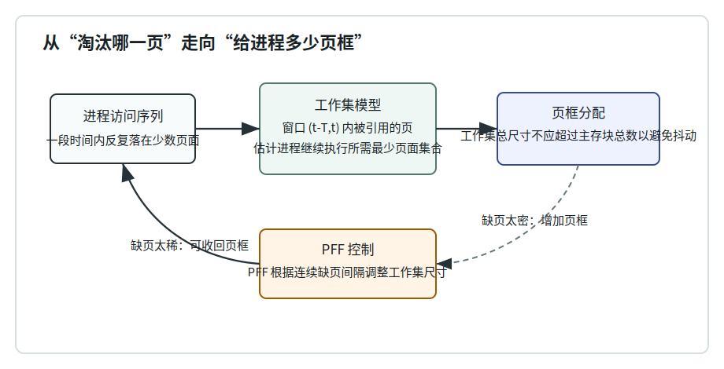
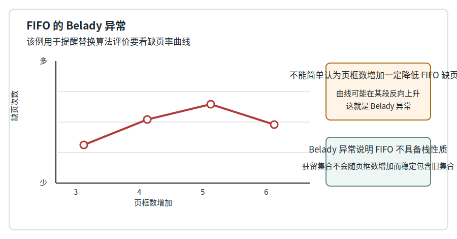
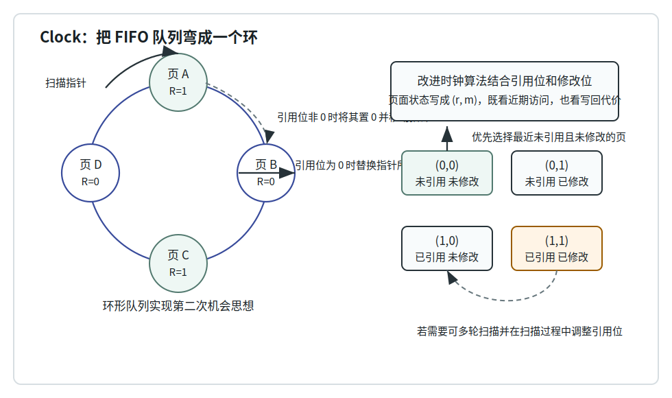

# 第 15 章：页框分配与页面置换

## 学习目标

- 解释页框分配为什么是在“让更多进程驻留”和“降低单进程缺页率”之间做权衡。
- 区分固定分配、可变分配、局部置换和全局置换，并说明它们各自影响的是页框数还是淘汰范围。
- 用缺页率公式评价一次访问序列的运行效果，并说出抖动如何把处理器时间耗在页面对换上。
- 比较 OPT、随机、FIFO、第二次机会、Clock、LRU、NFU 和 Aging 的淘汰依据与实现代价。
- 读懂 Belady 异常、LRU 队列变化、Aging 寄存器变化、工作集和 PFF 的示例表。
- 用工作集和缺页频率解释系统如何从“替换哪一页”进一步走向“给进程多少页框”。

## 上章回顾

上一章把虚拟存储的运行路径打通了：进程访问逻辑地址，MMU 查快表和页表；若页不在主存，就触发缺页中断，把页面从辅存调入，再重新执行指令。可是缺页处理里有一步被暂时压缩成了“找一个页框”。本章要把这一步展开：页框从哪里来，满了淘汰谁，淘汰策略又怎样反过来影响整个系统是否抖动。

## 开篇问题

一个请求分页系统里，某进程频繁缺页。最直接的想法是多给它几个页框；但主存总量不变，多给它就意味着其他进程少拿，甚至让能驻留的进程数下降。另一个看似直接的想法是换一个“更聪明”的淘汰算法；可有些算法只能当理论标尺，有些算法实现便宜却会出现反直觉结果。系统到底该先问“给多少页框”，还是先问“淘汰哪一页”？答案是两者缠在一起。

## 本章地图

本章从页框分配开始：固定分配、可变分配决定每个进程手里有多少页框，缺页率和抖动则告诉我们这个决定是否过紧。随后进入局部页面置换，先用 OPT 建立评价上限，再看随机、FIFO、第二次机会、Clock、LRU、NFU 和 Aging 如何在效果与实现代价之间取舍。最后把视野放大到全局置换：工作集模型和 PFF 不只回答“淘汰哪一页”，还试图动态控制每个进程的驻留集合大小，防止系统把大部分时间花在页面对换上。

## 正文

### 15.1 页框分配先决定缺页压力

**页框分配（page frame allocation）** 要回答的问题是：物理主存中有限的页框，按什么规则分给各个进程。这个问题不是简单地“多给就好”。多给某个进程通常会降低它的缺页率，却会减少其他进程或新进程可用的主存；少给则能让更多进程同时驻留，但每个进程可能频繁缺页。

图 15-1 先给出本章的全局视角。访问序列暴露出一段时间内真正活跃的页面集合，页框分配要尽量覆盖这个集合；当缺页过密或过稀时，系统再通过反馈调整页框数。==页框分配需要在主存容纳更多进程和降低单进程缺页率之间权衡==。

按页框数是否随运行变化，分配策略可分为两类。

| 策略 | 页框数何时确定 | 常见方法 | 适用直觉 |
|---|---|---|---|
| 固定分配 | 进程生命周期内页框数固定 | 平均分配、按进程大小比例分配、按优先权分配 | 管理简单，缺页变化不会立刻改变进程页框数 |
| 可变分配 | 运行中随缺页情况调整页框数 | 缺页多时增配，缺页少时回收 | 能响应程序阶段变化，但需要系统持续监控 |

无论采用哪类分配，系统都需要一个评价量。**缺页率（page fault rate）** 把不成功访问次数放进总访问次数里看：

$$
f = \frac{F}{A} = \frac{F}{S + F}
$$

| 符号 | 含义 |
|---|---|
| `S` | 成功访问次数，也就是访问页已在主存的次数 |
| `F` | 不成功访问次数，也就是发生缺页中断的次数 |
| `A = S + F` | 总访问次数 |
| `f` | 缺页率，用来衡量请求分页运行时缺页压力 |

缺页率不是由单一因素决定的。页面替换算法、主存页框数、页面大小和程序特性都会影响它：算法决定淘汰对象，页框数决定驻留余量，页面大小影响一次调入的覆盖范围和内部碎片，程序局部性则决定活跃页面是否稳定。

> **核心判断**：影响缺页中断率的因素包括页面替换算法、主存页框数、页面大小和程序特性；只盯着其中一个因素，很容易误判系统瓶颈。

### 15.2 页面置换：主存满时的选择题

**页面置换（page replacement）** 发生在主存已满而又必须装入新页时。缺页处理程序需要选择一个已在主存的旧页，把它淘汰出去，为新页腾出页框。若旧页被修改过，还要先写回辅存；若旧页未修改，直接覆盖即可。

> **核心判断**：页面替换是在主存已满而需装入新页时淘汰旧页；抖动是处理器大量时间用于页面对换而非计算。

置换策略有两个边界要分清。第一，**局部置换（local replacement）** 只在发生缺页的进程自己的页框中挑牺牲页；它不直接抢别的进程页框，便于控制单个进程的行为。第二，**全局置换（global replacement）** 可以在所有进程的驻留页中选择，甚至调整进程之间的页框占有量；它更灵活，也更容易造成进程之间互相影响。

| 维度 | 局部置换 | 全局置换 |
|---|---|---|
| 淘汰范围 | 当前缺页进程自己的驻留页 | 系统内多个进程的驻留页 |
| 与页框分配的关系 | 页框数通常由分配策略先定好 | 淘汰结果可能改变进程页框数 |
| 优点 | 行为相对隔离，分析单个进程较清楚 | 能把页框转给更需要的进程 |
| 风险 | 给得太少时再聪明也会频繁缺页 | 一个进程的压力可能传导给其他进程 |

抖动（thrashing）是最坏的信号：系统看似一直很忙，磁盘 I/O 和缺页中断不断发生，但用户计算推进很少。它通常说明活跃进程的工作页面总需求已经超过主存能稳定承载的范围，单纯换一个局部淘汰规则未必能救回来。

### 15.3 FIFO、第二次机会与 Clock

先看最容易实现的一组算法。**随机页面置换（random replacement）** 由随机数决定淘汰页，实现很简单，但不利用程序局部性，效率通常不高。**FIFO 页面置换（first-in, first-out replacement）** 总是淘汰最先调入主存、驻留时间最长的页面。它也简单，却把“来得早”误当成“以后不用”，因此对非线性访问序列表现不好。

FIFO 最著名的陷阱是 Belady 异常。

图 15-2 不是要记某条具体曲线，而是要记住评价方法：该例用于提醒替换算法评价要看缺页率曲线。更多页框通常有帮助，但对 FIFO 不能机械套用这个直觉。

> **易错点**：不能简单认为页框数增加一定降低 FIFO 缺页数；Belady 异常说明 FIFO 不具备栈性质。

**第二次机会算法（second-chance replacement）** 是对 FIFO 的温和修正。它仍按 FIFO 顺序扫描页面，但给最近被访问过的页一次机会：如果页面引用位为 1，就把引用位清 0，并把它当作刚重新排到队尾；如果引用位为 0，就说明最近没被访问，可以淘汰。

**Clock 算法（clock replacement）** 把第二次机会算法的队列实现成环形队列，用一个指针沿环扫描，避免频繁移动队列元素。

图 15-3 的左半部分保留了 Clock 的动作：引用位为 0 时替换指针所指页面；引用位非 0 时将其置 0 并移动指针；环形队列实现第二次机会思想。右半部分则引出改进 Clock：它不只问“最近有没有访问”，还问“淘汰是否需要写回”。

改进 Clock 把引用位 `r` 和修改位 `m` 组合成四种状态，以减少写回代价。

| 状态 | 替换优先级 | 含义 |
|---|---|---|
| `(0,0)` | 最高 | 优先选择最近未引用且未修改的页，淘汰后不必写回 |
| `(0,1)` | 次高 | 最近未引用但已修改，能淘汰但要写回 |
| `(1,0)` | 较低 | 最近引用过但未修改，扫描时可清引用位 |
| `(1,1)` | 最低 | 最近引用过且已修改，既可能还会用，又有写回代价 |

若第一轮找不到理想状态，算法可以继续扫描；若需要可多轮扫描并在扫描过程中调整引用位。这样做比普通 Clock 多看了一个修改位，换来的是尽量少把脏页写回磁盘。

### 15.4 LRU 与近似 LRU

**最佳页面置换（optimal replacement, OPT）** 淘汰未来不再访问、或最久以后才会访问的页。它也常被称作 Belady 最优算法。问题是操作系统无法预知真实未来，所以 OPT 更像评价基准：如果某个实际算法离 OPT 很远，就说明还有改进空间；但不能把 OPT 当作可直接实现的内核策略。

**LRU 页面置换（least recently used replacement）** 换了一个可观察的近似：既然未来不可知，就用过去一段时间的访问情况估计未来，淘汰最近较久未被访问的页面。LRU 通常缺页率较低，但精确实现代价高：系统必须维护每页最近访问时间或精确访问顺序。

于是出现了一批近似方法。**NFU（not frequently used）** 为每页维护计数器，每次时钟中断把 R 位加到计数器中，缺页时淘汰计数最低的页。它利用了访问频率，却容易让很久以前热过的页长期占优势。**Aging 算法** 在 NFU 的基础上加入时间衰减：每个页面维护多位寄存器，周期性右移，并把当前 R 位注入最高位。

| 动作 | 寄存器变化 | 替换含义 |
|---|---|---|
| 每个时钟周期记录页面 R 位 | 若本周期访问过，R 位为 1；否则为 0 | 每个时钟周期记录页面 R 位 |
| 周期到来时更新寄存器 | 寄存器随时间右移并注入新引用位 | 越新的访问越靠高位，越旧的访问逐步衰减 |
| 缺页时比较寄存器数值 | 数值较小的页面更接近长期未使用 | 选择数值较小者，软件方式近似 LRU |

这一组算法可以放在同一张比较表中看。

| 算法 | 淘汰依据 | 优点 | 代价或风险 |
|---|---|---|---|
| OPT | 未来最久不用或不再访问 | 理论最优，可作评价基准 | 需要预知未来，实际不可直接实现 |
| 随机 | 随机数选页 | 实现最简单 | 不利用局部性，效率低 |
| FIFO | 最早调入主存 | 实现简单 | 可能出现 Belady 异常 |
| 第二次机会 | FIFO 加引用位 | 给近期访问页一次机会 | 仍保留 FIFO 的大框架 |
| Clock | 环形队列扫描引用位 | 第二次机会的高效实现 | 指针扫描可能跨多页 |
| 改进 Clock | 引用位加修改位 | 尽量少写回脏页 | 状态判断和多轮扫描更复杂 |
| LRU | 最近最久未访问 | 缺页率通常较低 | 精确实现代价高 |
| NFU / Aging | 计数或衰减寄存器 | 软件近似 LRU | 近似效果依赖采样周期和位宽 |

> **思维停顿**：替换算法并不是越“聪明”越无条件更好。它必须在缺页率、硬件支持、维护开销和写回代价之间一起算账。

### 15.5 从局部最佳到全局控制

局部算法回答的是：在一个进程已有的页框里，谁最适合被淘汰。可如果这个进程本来只拿到 2 个页框，而它当前活跃集合有 6 页，再好的局部算法也只能在频繁缺页中挣扎。全局页面置换把问题向外推一步：系统可以从所有驻留页中挑牺牲页，或把页框从一个进程转给另一个进程。

**全局最佳替换** 延续 OPT 的思想：缺页时装入新页，并检查内存中所有页面在未来时间间隔内的引用情况，选择最合适的页面移出。和局部 OPT 一样，它主要是理论标尺，不是现实内核能完整执行的预言术。

更实用的方向是估计每个进程的活跃页集合。**工作集（working set）** 是在物理存储器中保证进程可继续执行所需的最少页面集合。若所有活跃进程的工作集总尺寸超过主存块总数，系统就容易进入抖动：每个进程刚拿到的页很快又被别人挤掉，处理器时间被缺页和页面对换吞掉。

**工作集置换（working-set replacement）** 在缺页时检查时间窗口 `(t-T,t)`，移出窗口内未被引用的页。这里的 `T` 是窗口长度：太小会误把马上还要用的页排除出工作集，太大又会让工作集膨胀，降低主存并发容纳能力。

**缺页频率替换（page fault frequency replacement, PFF）** 不直接维护完整工作集，而是观察连续两次缺页之间的时间间隔：缺页太频繁，说明页框可能不够；很久不缺页，说明页框可能偏多。它本质上是用缺页节奏调整进程工作集尺寸。

| 算法 | 参数 | 输入或进出记录 | 读表方法 |
|---|---|---|---|
| 全局最佳替换例 | 窗口参数 T=3 | 访问序列为 P4,P3,P3,P4,P2,P3,P5,P3,P5,P1,P4；被移出页包括 P4、P2、P3、P5、P1 | 按未来窗口检查所有驻留页，将未来不再用或最晚用的页移出 |
| 工作集替换例 | 工作集窗口为 (t-T,t)，T=3 | In 记录包括 P3、P2、P5、P1、P4；Out 记录包括 P5、P1、P4、P2 | 每个时刻只保留窗口内被引用过的页，窗口外未引用页可移出 |
| PFF 替换例 | T=2 | PFF 根据连续缺页间隔调整工作集尺寸；In 记录包括 P3、P2、P5、P1、P4；Out 记录包括 P1、P2、P5、P4 | 缺页间隔短说明页框偏少，间隔长说明可收回一部分页面 |

这张表的三个例子都在讲同一件事：页面进出不再只由单页“年龄”决定，而是由窗口、缺页间隔和进程整体活跃集合共同决定。局部置换像在已有房间里整理座位；工作集和 PFF 则在决定一个进程到底该占几把椅子。

## 例题讲解

**例 1：LRU 队列变化。** 有 3 个页框，访问序列为 `4, 3, 0, 4, 1, 1, 2`。用队列左侧表示最近最久未使用，右侧表示最近刚使用。

| 访问 | 结果 | 最近使用队列 |
|---|---|---|
| 4 | 缺页，装入 4 | 4 |
| 3 | 缺页，装入 3 | 4, 3 |
| 0 | 缺页，装入 0 | 4, 3, 0 |
| 4 | 命中，把 4 移到最近使用端 | 3, 0, 4；淘汰队列按最近访问情况更新 |
| 1 | 缺页，访问 1 时淘汰页面 3 | 0, 4, 1 |
| 1 | 命中，队列不变或刷新到最近使用端 | 0, 4, 1 |
| 2 | 缺页，访问 2 时淘汰页面 0 | 4, 1, 2 |

这个例子的关键不是背答案，而是每次命中后也要更新“最近使用”顺序。若只在缺页时更新队列，后面的淘汰对象就会错。

**例 2：缺页率计算。** 某进程一段时间内成功访问 920 次，缺页 80 次。求缺页率，并解释这个数能说明什么。

总访问次数 `A = S + F = 920 + 80 = 1000`，所以：

$$
f = \frac{F}{A} = \frac{80}{1000} = 0.08
$$

| 符号 | 含义 |
|---|---|
| `S = 920` | 成功访问次数 |
| `F = 80` | 不成功访问次数，也就是缺页次数 |
| `A = 1000` | 总访问次数 |
| `f = 0.08` | 每 100 次访问约有 8 次缺页 |

这个数说明缺页压力不低，但不能单独判断原因。还要结合页框数、页面大小、替换算法和程序访问特性分析。

## 常见误区

- 把页框分配和页面置换混成一个问题。页框分配决定一个进程能占多少页框，页面置换决定主存满时淘汰哪一页；两者相互影响，但不是同一个动作。
- 以为页面置换只在“页表查不到页号”时发生。请求分页中的页属于地址空间但尚未驻留主存，主存满时才需要置换；非法页号是越界问题，不是正常置换。
- 看到页框数增加就断言缺页数一定减少。对 FIFO 来说，Belady 异常已经说明这种判断不可靠。
- 把 OPT 当成可实现算法。OPT 需要未来访问序列，只能作为评价基准。
- 认为 LRU 一定值得精确实现。LRU 缺页率好，但精确维护最近访问顺序的硬件或软件成本可能太高，所以系统常用 Clock、NFU、Aging 等近似算法。
- 只优化单个进程的淘汰规则而忽略抖动。若工作集总尺寸超过主存块总数，系统层面的页框控制比局部淘汰细节更关键。

## 本章小结

页框分配和页面置换共同决定请求分页系统的运行质量。页框分配先决定每个进程的驻留余量，缺页率把访问成功与缺页中断放到同一个比例里，抖动则提醒我们主存压力已经影响处理器有效计算。局部置换算法从随机、FIFO 走向 Clock、LRU 和 Aging，本质是在实现代价与局部性利用之间折中；Belady 异常说明简单算法可能出现反直觉结果。全局置换、工作集和 PFF 则把视野扩大到进程整体：系统不仅要挑出牺牲页，还要让各进程获得与当前活跃集合相匹配的页框数。

## 关键术语

**页框分配（page frame allocation）** 操作系统把有限物理页框分给各个进程的策略，影响进程并发数和缺页率。

**固定分配（fixed allocation）** 进程生命周期内页框数固定的分配方式，可按平均、比例或优先权分配。

**可变分配（variable allocation）** 运行中根据缺页情况动态调整进程页框数的分配方式。

**页面置换（page replacement）** 主存已满而需要调入新页时，选择旧页淘汰以腾出页框的机制。

**缺页率（page fault rate）** 缺页次数占总访问次数的比例，常写作 `f = F / (S + F)`。

**抖动（thrashing）** 系统大量时间用于缺页处理和页面对换，真正计算推进很少的状态。

**最佳页面置换（optimal replacement, OPT）** 淘汰未来不再访问或最久以后才访问的页，通常作为理论评价基准。

**Belady 异常（Belady's anomaly）** 某些算法中页框数增加反而导致缺页次数增加的现象，典型出现在 FIFO 中。

**FIFO 页面置换（FIFO replacement）** 淘汰最早调入主存、驻留时间最长的页面。

**第二次机会算法（second-chance replacement）** 在 FIFO 基础上利用引用位，让最近被访问的页面跳过一次淘汰。

**Clock 算法（clock replacement）** 用环形队列和扫描指针实现第二次机会思想的页面置换算法。

**改进 Clock 算法（enhanced clock replacement）** 同时考虑引用位和修改位，优先淘汰最近未引用且未修改的页。

**LRU 页面置换（least recently used replacement）** 淘汰最近最久未被访问的页面，用过去访问近似未来访问。

**NFU 算法（not frequently used）** 用计数器累计页面被引用情况，淘汰计数较低的页面。

**Aging 算法（aging）** 周期性右移引用寄存器并注入 R 位，使旧访问逐渐衰减，以近似 LRU。

**全局页面置换（global page replacement）** 在多个进程的驻留页中选择淘汰对象，并可能改变进程页框占有量。

**工作集（working set）** 一段时间窗口内进程继续执行所需的活跃页面集合。

**工作集置换（working-set replacement）** 根据窗口 `(t-T,t)` 判断页面是否属于工作集，并移出窗口内未被引用的页。

**缺页频率替换（page fault frequency replacement, PFF）** 根据连续缺页之间的时间间隔调整进程工作集尺寸的控制方法。

## 练习与解答

1. 固定分配和可变分配的差别是什么？它们分别更容易暴露什么问题？

   **解答**：固定分配在进程生命周期内页框数不变，管理简单，但若进程进入新的局部性阶段，页框数可能过少或过多。可变分配会根据缺页情况调整页框数，更能适应阶段变化，但需要监控缺页行为，并处理进程之间页框转移的影响。

2. “FIFO 的页框数越多，缺页次数一定越少。”这个判断对吗？

   **解答**：不对。==Belady 异常说明 FIFO 不具备栈性质==，可能出现页框数增加但缺页次数反而增加的访问序列。评价 FIFO 时要看具体缺页率曲线，不能只凭“更多页框”下结论。

3. Clock 算法遇到引用位为 1 的页面时为什么不立刻淘汰？

   **解答**：引用位为 1 说明页面最近被访问过，Clock 给它第二次机会：先把引用位清 0，再移动指针继续扫描。若之后一段时间仍未被访问，它下次遇到时引用位就是 0，才会成为淘汰候选。

4. Aging 算法为什么比普通 NFU 更接近 LRU？

   **解答**：普通 NFU 把历史引用长期累加，旧热点页面可能长期占优势。Aging 每个周期把寄存器右移并注入新 R 位，新访问留在高位，旧访问逐渐衰减；因此数值较小的页面更接近长期未使用，能更好近似 LRU。

5. 工作集和 PFF 怎样帮助系统避免抖动？

   **解答**：工作集估计进程当前继续执行所需的最少页面集合，并要求工作集总尺寸不超过主存块总数；PFF 则用连续缺页间隔判断页框是否偏少或偏多，缺页太密时增加页框，缺页太稀时可回收页框。两者都把问题从单页淘汰扩展到进程驻留集合控制。

## 覆盖记录

- OSPPT-CH05-FRAME-ALLOCATION-REPLACEMENT-METRICS
- OSPPT-CH05-LOCAL-PAGE-REPLACEMENT-ALGORITHMS
- OSPPT-CH05-GLOBAL-WORKING-SET-PFF
