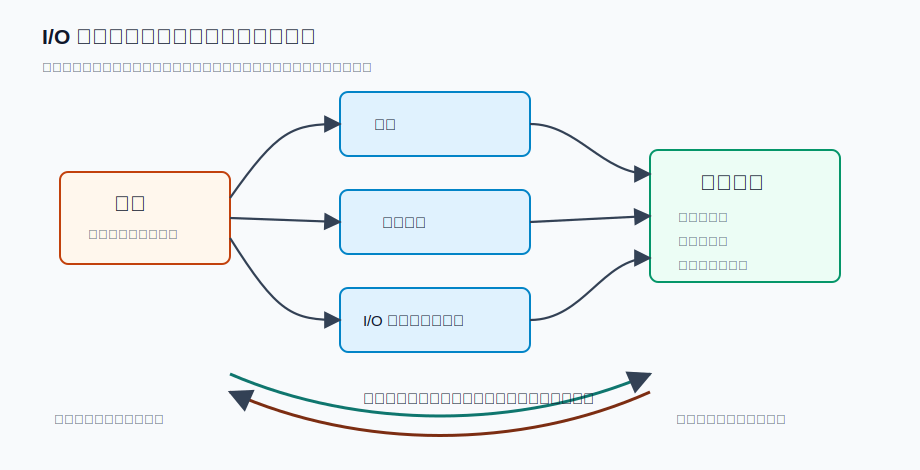
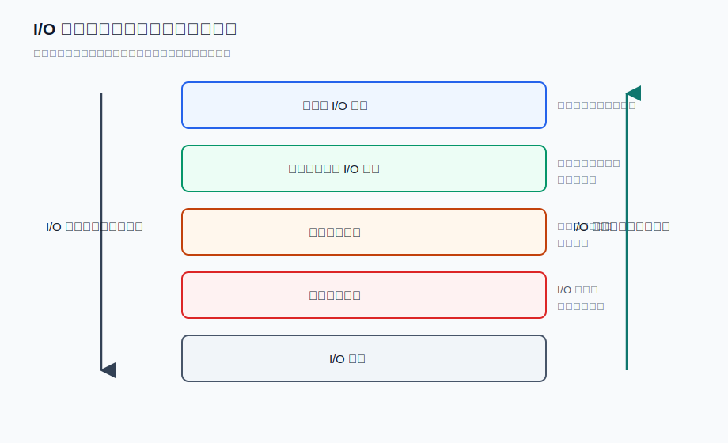
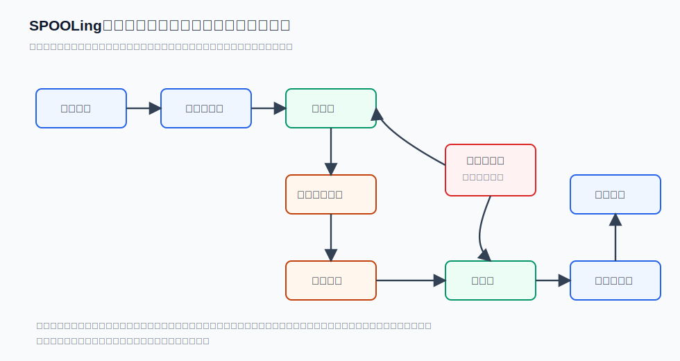

# 第 16 章：I/O 系统与 I/O 软件

## 学习目标

- 说明设备管理为什么要同时追求“方便使用”和“提高外围设备并行性与利用率”。
- 按输入/输出特征、交换单位和存取方式给 I/O 设备分类，并比较询问、中断、DMA、通道四种控制方式的 CPU 参与程度。
- 以打印字符串为例，解释程序控制 I/O、中断驱动 I/O 和 DMA I/O 分别由谁推进数据传输。
- 画出 I/O 软件从用户级软件到硬件的层次，区分设备无关软件、设备驱动程序和中断处理程序的职责边界。
- 说明缓冲技术如何缓解速度差、记录粒度差和中断压力，并比较单缓冲、双缓冲、多缓冲。
- 用假脱机系统结构解释独占设备如何表现出可共享的使用效果。

## 上章回顾

上一章把主存紧张时的页面分配和页面置换讲清楚了：系统通过缺页中断、工作集、PFF 等机制，在 CPU 与主存之间维持一个可运行的驻留集合。现在视线继续往外移。程序不只访问主存，还要读磁盘、敲键盘、打屏幕、打印文件；这些设备速度差异巨大、接口各不相同，有的还天然只能独占使用。操作系统必须把这种混乱收进一个可管理的 I/O 子系统。

## 开篇问题

一个用户程序调用 `write` 打印一段字符串。字符串在用户空间，打印机在机箱外，打印速度比 CPU 慢得多；如果 CPU 每送一个字符都原地等待打印机准备好，整个系统会被一台慢设备拖住。可如果让打印机自己工作，谁来保护用户数据，谁来知道它何时完成，谁来把多个进程的打印请求排好队？设备管理的核心问题就藏在这里：外设慢、杂、常常独占，而操作系统要把它们包装成统一、可靠、尽量并行的服务。

## 本章地图

本章沿着一次 `write` 请求往下走。先看外设为什么难管：它们慢、杂，而且不少设备天然独占；再看操作系统怎样让 CPU 从“亲自等设备”逐步退到“启动后等通知”。随后我们用同一个打印请求观察三种推进方式：程序控制 I/O、中断驱动 I/O 和 DMA。这个请求不是凭空完成的，它会穿过用户级 I/O 软件、设备无关层、驱动程序、中断处理程序和硬件。最后，缓冲解释“慢”怎样被吸收，假脱机解释“独占”怎样被包装成排队服务。读完整章，应该能用一句话复述：用户程序发出 `write`，内核把请求拆给 I/O 软件栈，设备和控制器推进传输，再由中断、缓冲和后台队列把完成结果接回来。

## 正文

### 16.1 设备管理从速度差和异构性开始

用户程序想打印字符串时，最朴素的想法是“把数据写到打印机”。问题在于，打印机不是主存里的一个普通变量：它有自己的控制器和状态位，速度比 CPU 慢几个数量级，还可能一次只能服务一个输出流。如果每个用户程序都直接读写硬件寄存器，系统既无法保护设备，也无法协调多个进程的请求，更无法在设备出错或完成时可靠地收尾。

**设备管理（device management）** 正是为了解决这个问题。按管理对象看，外围设备大体可分为存储型设备和输入输出型设备；按操作系统的目标看，设备管理既要让用户方便地使用设备，也要尽量提高外围设备的并行性和利用率。这里的“方便”不是把设备细节藏起来就结束了，还包括命名、保护、错误处理和统一接口；“利用率”也不是让设备永远忙，而是在 CPU、主存和外设之间减少无谓等待。

设备管理面对的矛盾可以先压缩成三类。第一是 <u>速度差</u>：CPU 可以很快发出请求，设备却慢慢工作。第二是 <u>接口异构</u>：键盘、打印机、磁盘、显示器的控制方式和数据单位都不同。第三是 <u>独占性</u>：有些设备一次只能给一个请求真实使用。外围设备中断处理、缓冲区管理、设备登记与分配/去配、设备驱动调度、虚拟设备及其实现，都围绕这三类矛盾展开。

图 16-1 不是硬件清单，而是一条请求路径：用户数据在主存中，真实动作发生在外围设备上，中间必须经过接口电路、控制部件、通道和管理软件的配合。I/O 设备及其接口电路、控制部件、通道属于硬件侧，管理软件属于软件侧；主存与外围设备之间既有输入方向，也有输出方向。==I/O 系统由硬件连接和管理软件共同构成==。

I/O 设备还可以从几个角度分类：

| 分类角度 | 类型 | 例子与判断重点 |
|---|---|---|
| 输入/输出特征 | 输入型、输出型、存储型 | 键盘偏输入，显示器和打印机偏输出，磁盘属于存储型设备 |
| 交换单位 | 字符型设备、块设备 | 字符型设备以字符流推进，块设备以固定大小的数据块交换 |
| 存取方式 | 顺序型、直接型 | 磁带典型顺序访问，磁盘可直接定位到某个块附近 |

分类的意义在于决定后面的管理策略。字符型设备更在意流式推进和中断响应，块设备更在意缓存、调度和成批传输；顺序型设备不能随意跳转，直接型设备则会把“定位成本”变成调度问题。比如打印机通常以字符流输出，管理重点是排队、缓冲和完成通知；磁盘以块为单位交换数据，管理重点会进一步走向块缓存、访问顺序和调度策略。

### 16.2 I/O 控制方式：CPU 参与程度逐步下降

一个 I/O 请求真正执行时，系统首先要回答三个分层问题：谁等设备，谁搬数据，谁通知完成？I/O 控制方式可以按控制器功能强弱以及与 CPU 的联系方式分为询问、中断、DMA 和通道。它们不是四个孤立名词，而是一条清晰的演化线：越往后，设备控制器越能独立完成工作，CPU 越少被慢速外设牵着走。

| 控制方式 | CPU 做什么 | 设备/控制器做什么 | 并行性与代价 |
|---|---|---|---|
| 询问方式 | 反复检查设备状态，状态就绪后由 CPU 传送数据 | 只给出状态和数据寄存器 | CPU 与设备串行工作，效率最低 |
| 中断方式 | 启动 I/O 后转去执行别的程序，设备中断时再进入处理 | 在需要 CPU 响应时发出中断 | CPU 与设备可部分并行，但数据传输仍需 CPU 参与 |
| DMA 方式 | 设置 DMA 控制器，块传输结束后处理中断 | 直接在设备和主存之间按块搬运数据 | 传输过程不占用 CPU 时间，但块间仍需 CPU 干预 |
| 通道方式 | 启动时执行通道相关指令，结束后处理中断 | 通道按通道程序控制一组 I/O 操作 | CPU 只在启动和完成时介入，适合更复杂的 I/O 组织 |

> **核心判断**：四种控制方式的主线是 CPU 参与程度逐步下降，设备与主存、控制器或通道承担越来越多的数据推进工作。

换成更短的记忆方式：询问是 CPU 等设备，中断是设备叫 CPU，DMA 是控制器搬数据，通道是通道组织一组 I/O 操作。询问方式适合极简单、极低速或早期设备控制场景，但会让 CPU 忙等。中断方式适合键盘、串口、打印机这类事件驱动或字符流设备，设备准备好再通知 CPU。DMA 适合磁盘、网卡等成块传输场景，CPU 设置控制器后可以去运行其他进程；限制也要记住，==DMA 传输过程不占用 CPU 时间，但 CPU 仍需在块间进行干预==，并且要负责设置控制器和处理中断。通道方式再进一步，把多个 I/O 命令组织成通道程序，适合大型机或复杂 I/O 子系统。

三个易混判断要在这里立住。==询问方式也称程序直接控制方式，CPU 与 I/O 设备串行工作，效率低==。==中断方式提高并行性，但数据传输时 CPU 仍需参与==。通道方式只在启动时由 CPU 执行相应指令，通道完成后通过中断通知；常见通道可分为字节多路通道、选择通道和数组多路通道。

字节多路通道适合把多个低速字符设备交织起来服务；选择通道一次选择一个高速设备，适合成批传输；数组多路通道则把“多路”和“成批”结合起来，面向多台高速块设备的并发传输。读这些名词时，不必先背定义，先问它们服务的设备是低速字符流，还是高速块传输。

### 16.3 同一个打印请求，三种软件推进方式

I/O 软件的目标可以概括为两个词：高效与通用。高效要求 CPU 不被慢设备白白拖住，通用要求上层程序尽量不关心具体设备差异。为做到这两点，I/O 软件要处理设备独立性、出错处理、同步/异步传输、缓冲、设备分配与去配。下面把这些目标落到同一个场景里：用户程序调用 `write(fd, buf, count)`，希望把用户缓冲区 `buf` 中的一段字符串打印出来。

内核不能让打印机直接读用户空间中的 `buf`。系统调用先把待打印数据从用户空间拷贝到内核缓冲区，形成一份内核可安全访问的数据副本；也就是说，用户空间数据先进入内核缓冲区。接下来，打印控制器逐步把字符送向打印页，但“谁来推进下一步”取决于控制方式。

**程序控制 I/O** 的路径最直白：系统调用一直留在内核里，循环检查打印机状态。每个字符输出前都轮询 READY 状态；一旦设备就绪，字符逐个写入打印机控制器数据寄存器。这个做法容易理解，却把 CPU 绑在慢设备旁边，系统调用要等到字符基本送完才返回。

**中断驱动 I/O** 把等待拆开。系统调用拷贝数据、初始化状态，启动第一个字符后就让出 CPU；课件伪代码中的说法是“左栏系统调用启动首字符输出后调度其他进程”。之后，每次打印机需要继续服务时产生中断；未完成时中断处理把下一个字符写入数据寄存器并更新计数和指针，直到“右栏中断处理在 count 为 0 时唤醒用户进程”。于是等待设备的长时间空档被调度器拿去运行其他进程。

**DMA I/O** 再往前走一步。系统调用拷贝或固定好数据后设置 DMA 控制器，系统调用设置 DMA 控制器后 CPU 可调度其他进程；随后的整块传输由 DMA 控制器推进。DMA 完成后由控制器中断处理唤醒用户进程，CPU 主要在设置和完成通知处介入。

把这三种方式放进同一条请求路径，可以先抓住三个关键动作：

1. 系统调用先把待打印数据从用户空间拷贝到内核缓冲区。
2. 每个字符输出前都轮询 READY 状态。
3. 系统调用设置 DMA 控制器后 CPU 可调度其他进程。

| 方式 | 启动者 | 数据推进者 | CPU 等待方式 | 完成通知 |
|---|---|---|---|---|
| 程序控制 I/O | 用户空间数据先进入内核缓冲区；系统调用先把待打印数据从用户空间拷贝到内核缓冲区 | CPU 轮询 READY，并把字符逐个写入打印机控制器数据寄存器；打印控制器逐步把字符送向打印页 | CPU 基本原地等待，每个字符输出前都轮询 READY 状态 | 循环结束后系统调用返回 |
| 中断驱动 I/O | 左栏系统调用启动首字符输出后调度其他进程 | 未完成时中断处理把下一个字符写入数据寄存器并更新计数和指针 | CPU 在字符间隙运行其他进程，设备用中断叫回 CPU | 右栏中断处理在 count 为 0 时唤醒用户进程 |
| DMA I/O | 系统调用设置 DMA 控制器后 CPU 可调度其他进程 | DMA 控制器直接在主存和设备之间推进块传输 | CPU 不参与块内传输，只在设置和完成处介入 | DMA 完成后由控制器中断处理唤醒用户进程 |

这张表不是替代讲解，而是把同一个打印请求压缩成四个问题：谁启动、谁搬数据、CPU 怎么等待、谁通知完成。程序控制 I/O 的循环最直观，也最浪费 CPU；中断驱动把“等待设备”换成“设备准备好再叫 CPU”；DMA 则把一整块数据的传输交给控制器。

> **易错点**：中断和 DMA 都会用到中断，但含义不同。中断驱动 I/O 用中断推进后续字符传输；DMA 主要用中断报告一块数据已经传完。

### 16.4 I/O 软件层次：把差异压到下层

刚才的打印请求，其实穿过了下面这些层。如果每个用户程序都直接处理 READY 位、数据寄存器和具体设备错误，I/O 编程会变得不可维护。操作系统通常把 I/O 软件分成层次，让上层看到统一接口，让下层处理具体设备差异。

图 16-2 的阅读顺序是双向的：I/O 请求沿层次向下传递，逐步接近硬件；I/O 应答沿层次向上返回，逐步恢复成上层能理解的结果。层次结构的好处不是把代码画得整齐，而是把职责边界固定下来。

| 层次 | 打印请求中的动作 | 主要职责 |
|---|---|---|
| 用户级 I/O 软件 | `printf` 格式化字符串，库函数或用户进程把它包装成 `write` 请求 | 以库函数或独立用户进程形式存在，完成调用、格式化和设备虚拟化 |
| 设备无关 I/O 软件 | 检查设备名、权限和阻塞语义，安排内核缓冲区，必要时参与设备分配 | 设备无关软件负责命名、保护、阻塞、缓冲和分配，并统一驱动接口、处理块大小和错误报告 |
| 设备驱动程序 | 把“打印这些字符”翻译成控制器命令，设置或访问设备寄存器并检查设备状态 | 驱动最了解具体控制器寄存器和命令格式；课件表述为“设备驱动程序建立设备寄存器并检查状态”，更准确地说，是设置或访问设备寄存器并检查状态 |
| 中断处理程序 | 打印机发出完成或就绪中断后，确认中断、推进下一个字符或唤醒等待者 | 中断处理程序在 I/O 结束时唤醒驱动程序，通常还要保护现场、准备运行环境并中断返回 |
| I/O 硬件 | 打印控制器接收数据，打印设备真正把字符打到纸面或输出介质上 | 硬件只理解寄存器、控制命令和数据传输 |

**设备驱动程序（device driver）** 是抽象请求和设备动作之间的翻译器。上层说“读这块数据”或“写这些字符”，驱动要把它翻成设备控制器理解的寄存器设置、状态检查和启动命令。**设备无关 I/O 软件（device-independent I/O software）** 则在驱动之上统一命名、保护、缓冲、分配和错误报告，让不同设备尽量共享一套上层语义。

> **核心判断**：设备无关软件处理共性，设备驱动程序处理具体控制器差异，中断处理程序只走短路径完成唤醒和返回。

用户空间 I/O 软件也不只是“调用系统调用”。库函数会把 `printf` 这样的格式化请求整理成写请求；独立用户进程则常用于假脱机系统，把真实设备服务放到后台慢慢完成。这样一来，上层程序获得的是稳定接口，下层系统保留的是对硬件差异的控制力。

### 16.5 缓冲技术：给速度差一段弹性空间

打印请求已经穿过软件层次，接下来要处理速度差。**缓冲技术（buffering）** 解决的第一类矛盾是速度不匹配：CPU 和主存很快，外围设备很慢；如果两端必须一步一等，快的一端会长期空转。第二类矛盾是记录粒度不一致：应用程序关心逻辑记录，设备常按物理记录或块传输。第三类收益是减少 I/O 中断次数，并放宽对中断响应时间的要求。

| 缓冲方式 | 数据路径 | 效果 |
|---|---|---|
| 无缓冲 | 设备和用户空间直接同步等待，数据到达和用户处理强绑定 | 简单，但速度差会直接暴露给进程 |
| 单缓冲 | 缓冲区位于内核空间时可先吸收设备数据，再复制到用户空间 | 设备可先把数据交给内核，用户稍后再取，等待被部分解耦 |
| 双缓冲 | 双缓冲允许两个缓冲区轮流服务数据流，一个承接设备数据，一个供用户或内核处理 | 输入和处理可交叠，也称缓冲交换 |
| 多缓冲 | 多个缓冲区组成可共享的缓冲池 | 更适合多个设备或多个请求共享缓冲资源 |

单缓冲像是在慢设备和快进程之间放了一个临时托盘；双缓冲则有两个托盘轮流工作，一个接收设备数据，另一个被系统处理或交给用户。多缓冲进一步把托盘组织成共享池，适合系统中同时有多条 I/O 流的场景。

把双缓冲走一遍会更清楚。第一步，设备把新数据写入缓冲 A；与此同时，系统或用户进程处理缓冲 B 中上一轮留下的数据。第二步，A 写满或 B 处理完后，两者交换角色：设备改写缓冲 B，系统处理缓冲 A。第三步，这种交换不断重复，输入和处理就在两个缓冲之间形成重叠。对输出方向也类似：一个缓冲被设备慢慢取走，另一个缓冲由内核提前准备下一批数据。

> **核心判断**：缓冲不是提高设备物理速度，而是改变等待的排列方式，让设备传输、内核处理和用户进程推进尽量重叠。

缓冲也会带来代价。缓冲区占用内存，数据可能多一次拷贝，缓冲池还要管理空闲与占用状态。判断一项缓冲设计是否合适，不能只看“有没有缓冲”，还要看它减少了多少等待、中断和粒度转换成本。

### 16.6 设备分配与假脱机：把独占设备变成共享服务

缓冲解决了“慢”的一部分问题，但还没有解决“独占”。打印机这类设备一次只能真实打印一个输出流；如果哪个进程直接占着打印机直到所有内容打完，其他进程只能长时间等待，甚至会把设备分配问题变成资源竞争问题。

设备按使用特性可以分为独占设备、共享设备和虚拟设备。**独占设备（dedicated device）** 一次只能给一个进程使用，通常采用静态分配；**共享设备（shared device）** 可以被多个进程交替或同时使用，通常无需预先独占分配；**虚拟设备（virtual device）** 则用软件把一类物理设备模拟成另一类可管理的设备形态。

| 设备类型 | 分配直觉 | 常见策略 |
|---|---|---|
| 独占设备 | 使用期间不能被别人插入 | 运行前或使用前分配，用完去配 |
| 共享设备 | 多个请求可以排队或交错服务 | 通常不需要长期独占，可按先来先服务或优先级高者先服务 |
| 虚拟设备 | 真实设备被软件包装成另一种使用效果 | 通过假脱机等机制把独占使用改造成共享效果 |

假脱机的英文全称常被解释为 simultaneous peripheral operation on-line。它可以理解成“缓冲 + 队列 + 后台服务”三件事合在一起：用磁盘井保存请求，用后台程序慢慢服务真实设备，用队列调度多个进程的请求。它的核心不是一个缩写，而是一种转化：用磁盘上的输入井、输出井和后台程序缓冲真实设备，把原本需要独占等待的设备操作变成可排队、可调度的作业流。

图 16-3 中，输入设备经预输入程序把作业信息放入输入井；作业调度程序选择作业进入运行；运行结果经输出井和缓输出程序送往输出设备；井管理程序协调输入井、输出井与运行作业之间的数据。==假脱机让独占设备呈现共享效果==。

打印机是假脱机最经典的例子。一个进程提交打印内容到输出井后，可以较快返回；缓输出程序再按队列从输出井中取任务，把数据慢慢送给真实打印机；打印机按后台服务的节奏真实输出。多个进程并不直接占有打印机，而是把输出内容提交到输出井；后台缓输出程序按一定策略慢慢送往打印机。用户进程看起来很快“完成了打印请求”，真实打印则在后台继续进行。这样做既协调了处理器与外围设备速度，也降低了独占设备带来的排队阻塞。

> **常见误区**：假脱机不是普通缓存。缓存主要保存数据副本以加速访问；假脱机还改变了设备使用方式，把独占设备虚拟成可排队、可共享的服务。

## 例题讲解

**例 1：比较三种打印实现。** 某系统要打印用户空间中的一段字符串，问程序控制 I/O、中断驱动 I/O 和 DMA I/O 在 CPU 占用上有什么差别。

| 实现方式 | 启动后 CPU 是否原地等待 | 数据主要由谁推进 | 结论 |
|---|---|---|---|
| 程序控制 I/O | 是。系统调用循环查询 READY | CPU 逐字符写数据寄存器 | 简单但浪费 CPU |
| 中断驱动 I/O | 否。启动首字符后可调度其他进程 | CPU 在每次中断中继续送字符 | 避免忙等，但传输仍分次占用 CPU |
| DMA I/O | 否。设置控制器后可运行其他进程 | DMA 控制器成块搬运数据 | CPU 参与最少，但仍负责设置和完成处理 |

所以，三者不是“会不会用中断”的区别，而是 CPU 参与数据推进的程度不同。程序控制 I/O 中，系统调用先把字符串拷到内核缓冲区，然后对每个字符反复查询 READY 状态，设备准备好后再写数据寄存器。中断驱动 I/O 中，系统调用启动首字符后可调用调度程序；每次打印机准备好或完成一个字符时，用中断处理程序继续送下一个字符。DMA I/O 中，系统调用设置 DMA 控制器后即可调度其他进程，成块传输由 DMA 控制器完成，结束时用中断唤醒用户进程。因此三者的 CPU 参与程度依次降低。

**例 2：判断假脱机的作用。** 多个进程同时请求打印，系统没有让它们直接竞争打印机，而是把输出内容先写入输出井，再由缓输出程序送给打印机。这个机制解决了什么问题？

它把独占打印机前面的长等待改造成磁盘上的排队请求。进程提交输出后不必长期占住真实打印机，后台程序按顺序把输出井中的内容送到打印机。这样既让独占设备呈现共享效果，也协调了 CPU 与慢速打印设备之间的速度差。

**例 3：层次归责题。** 一次打印请求中，系统发现用户没有写该设备的权限、驱动需要设置打印机数据寄存器、打印机完成后需要唤醒等待进程，这三件事分别属于哪一层？

权限检查属于设备无关 I/O 软件，因为命名、保护和统一阻塞语义应由跨设备的共性层处理。设置打印机数据寄存器属于设备驱动程序，因为它直接面对具体控制器。完成后唤醒等待者与中断处理路径有关：中断处理程序确认设备完成并唤醒驱动或等待进程，让请求的应答沿层次向上返回。

## 常见误区

- 把 I/O 系统理解成“外设本身”。I/O 系统同时包含 I/O 设备及接口电路、控制部件、通道和管理软件。
- 以为用了中断就不需要 CPU 传数据。中断方式让 CPU 不必忙等，但数据传输时 CPU 仍需参与；DMA 才把块传输过程交给控制器。
- 把 DMA 理解成 CPU 完全不管。DMA 传输过程不占用 CPU 时间，但 CPU 仍要负责设置控制器，并在块间或完成时处理中断。
- 把设备驱动程序和设备无关软件混在一起。设备无关软件处理命名、保护、缓冲和分配等共性；驱动程序处理具体设备寄存器、状态和命令。
- 以为缓冲一定提升设备速度。缓冲改善的是等待组织和并发机会，设备物理速度并没有改变。
- 把假脱机当成单纯的磁盘缓存。假脱机的重点是用输入井、输出井和后台程序把独占设备包装成可共享服务。

## 本章小结

设备管理面对的是慢速、异构、常常独占的外围设备。一次 `write` 请求从用户程序进入内核后，先被设备无关软件检查、命名和缓冲，再交给驱动程序设置设备，随后由询问、中断、DMA 或通道等方式推进真实传输。I/O 软件通过层次结构把共性留给设备无关层，把具体寄存器和状态交给驱动，把完成通知压到中断处理程序中。缓冲技术给速度差和记录粒度差留下弹性空间，假脱机则进一步把独占设备转换成可排队、可调度、可共享的服务。整章贯穿的主线是：操作系统不消除硬件差异，而是把差异组织在合适的层次里，让一个普通 `write` 请求能够可靠地穿过复杂 I/O 系统。

## 关键术语

**设备管理（device management）** 操作系统对外围设备、中断、缓冲、分配、驱动调度和虚拟设备等机制的统一管理。

**I/O 系统（I/O system）** 由 I/O 设备及接口电路、控制部件、通道和管理软件共同组成的输入输出子系统。

**询问方式（polling）** CPU 反复查询设备状态并在就绪后亲自传送数据的 I/O 控制方式。

**中断驱动 I/O（interrupt-driven I/O）** CPU 启动 I/O 后转去执行其他工作，设备通过中断请求 CPU 继续处理的控制方式。

**DMA（direct memory access）** 设备控制器直接在主存和外设之间成块传送数据、结束后中断 CPU 的控制方式。

**通道（channel）** 能执行通道程序并控制一组 I/O 操作的专用部件，用于减少 CPU 对复杂 I/O 的直接参与。

**设备无关 I/O 软件（device-independent I/O software）** 位于驱动程序之上的 I/O 软件层，统一处理命名、保护、阻塞、缓冲、分配和错误报告等共性问题。

**设备驱动程序（device driver）** 直接控制具体 I/O 设备，把抽象读写请求转换成设备寄存器、状态检查和控制命令的软件。

**缓冲技术（buffering）** 在数据生产者和消费者之间设置缓冲区，以缓解速度差、记录粒度差和中断压力的技术。

**虚拟设备（virtual device）** 由软件模拟出的设备使用形态，使一类物理设备呈现另一类设备的管理效果。

**假脱机系统（simultaneous peripheral operation on-line）** 通过输入井、输出井和后台程序协调处理器与外围设备速度，并把独占设备改造成可共享服务的技术。

## 练习与解答

1. 为什么说询问、中断、DMA、通道四种方式的差别核心在 CPU 参与程度？

   **解答**：询问方式中 CPU 反复检查状态并逐字传输；中断方式中 CPU 可在设备工作时执行其他进程，但每次传输仍需 CPU 响应；DMA 方式中成块传输由 DMA 控制器完成，CPU 只负责设置和完成处理；通道方式中 CPU 主要负责启动和接收完成中断，复杂 I/O 操作由通道推进。

2. 一个用户程序调用 `write(fd, buf, count)` 打印字符串。请按顺序说明这个请求从用户缓冲区到设备完成大致经过哪些阶段。

   **解答**：用户级 I/O 软件或库函数发出 `write`；系统调用进入内核；设备无关层检查设备名、权限、阻塞语义并安排内核缓冲区；数据从用户缓冲区复制到内核缓冲区；驱动程序设置或访问打印机控制器寄存器并启动设备；后续传输可由 CPU 轮询、中断处理程序或 DMA 控制器推进；设备完成后通过中断路径唤醒等待者，请求结果沿层次返回。

3. 设备无关 I/O 软件和设备驱动程序分别应处理什么？

   **解答**：设备无关 I/O 软件处理命名、保护、阻塞、缓冲、设备分配、状态跟踪和错误报告等跨设备共性，并统一驱动接口。设备驱动程序直接面对具体控制器，把抽象读写请求翻译成寄存器设置、状态检查和设备命令，并等待中断处理程序唤醒。

4. 某系统中，设备正在向缓冲 A 写入数据，用户进程正在处理缓冲 B。下一轮两者交换角色。这是什么缓冲方式？它比单缓冲多解决了什么？

   **解答**：这是双缓冲。它让设备输入和用户/系统处理分别落在两个缓冲区上，A、B 轮流交换角色，因此设备传输和数据处理可以重叠；单缓冲更容易出现设备写入和用户取走互相等待。

5. 假脱机为什么能把独占设备改造成共享使用的效果？

   **解答**：进程不直接长期占有真实设备，而是把输入或输出请求交给输入井、输出井等磁盘队列。预输入程序、缓输出程序和井管理程序在后台与真实设备交互，多个进程的请求可以排队调度，所以独占设备对上层表现为可共享服务。

6. 中断驱动 I/O 和 DMA 的共同点与差异是什么？

   **解答**：共同点是二者都允许 CPU 在设备工作期间运行其他进程，也都会用中断报告某些进展或完成事件。差异在于，中断驱动 I/O 的数据传输仍由 CPU 在中断处理中分次推进；DMA 的块内数据传输由 DMA 控制器直接在主存和设备之间完成，CPU 主要负责设置控制器和处理完成中断。

## 覆盖记录

- OSPPT-CH06-DEVICE-MANAGEMENT-OVERVIEW
- OSPPT-CH06-IO-SYSTEM-CONTROL-MODES
- OSPPT-CH06-IO-SOFTWARE-GOALS-IMPLEMENTATIONS
- OSPPT-CH06-IO-SOFTWARE-LAYERS-DRIVERS
- OSPPT-CH06-BUFFERING-TECHNIQUES
- OSPPT-CH06-DEVICE-ALLOCATION-SPOOLING
