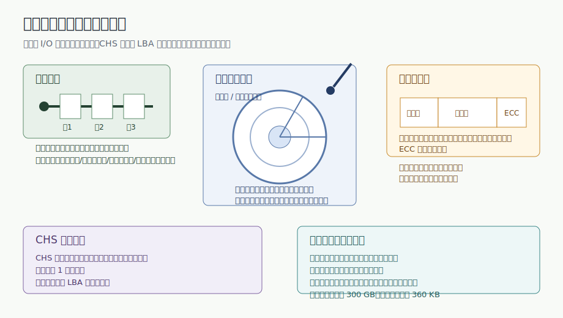
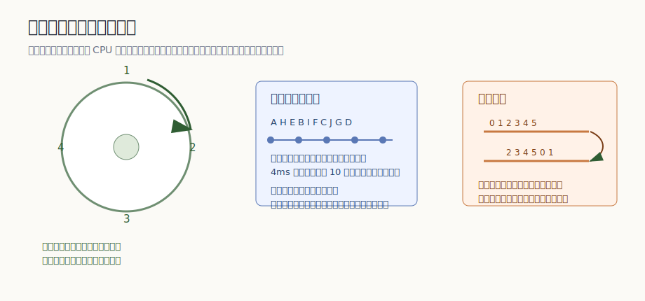
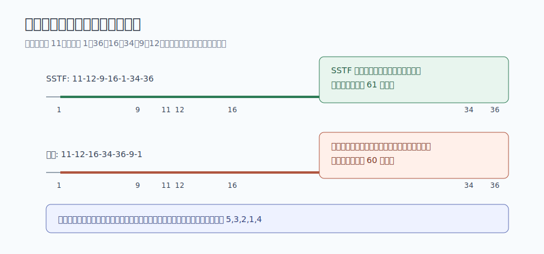
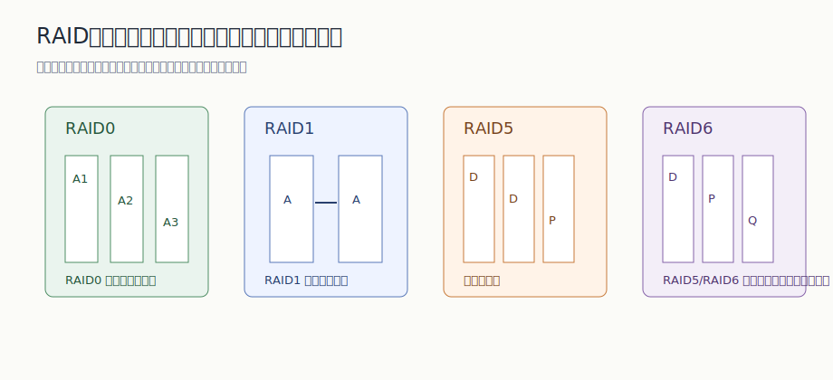

# 第 17 章：磁盘存储与驱动调度

## 学习目标

- 说明驱动调度为什么要同时关注请求次序、信息排列和存储分配方法。
- 用磁道、柱面、扇区、CHS 与 LBA 解释磁盘请求如何定位到物理记录。
- 根据一圈旋转时间、处理时间和当前读位置，判断循环排序、优化分布、扇区交错和柱面斜进的作用。
- 给定磁头当前位置和柱面请求序列，按 SSTF、电梯调度等算法写出访问顺序并计算移动柱面数。
- 比较 RAID0、RAID1、带校验 RAID 与提前读、延迟写、虚拟盘等 I/O 加速方法的取舍。

## 上章回顾

上一章把 I/O 请求从用户进程一路带到了设备驱动程序：请求向下经过设备无关软件、驱动程序和中断处理程序，应答再向上返回。缓冲、DMA 与假脱机解决的是 CPU、内存和外设之间的速度差与独占问题。现在我们把镜头再往设备内部推进一步：当外设本身是磁盘时，一次 I/O 的代价还取决于磁头要移动到哪里、盘面转到哪里，以及数据被怎样排布在介质上。

## 开篇问题

有 6 个磁盘请求等待服务：柱面 1、36、16、34、9、12，当前磁头在 11 号柱面。如果按到达顺序处理，磁头可能来回奔波；如果总是找最近的柱面，又可能让远处请求等很久。更麻烦的是，即使磁头到了正确柱面，目标扇区也未必正好转到磁头下面。磁盘调度为什么不能照搬 CPU 调度？答案藏在磁盘的物理结构里。

## 本章地图

本章先建立驱动调度的目标：在多个进程同时请求辅助存储器 I/O 时，选择更好的访问次序，减少总服务时间并提高系统效率。随后我们进入磁盘的物理语言：顺序设备、磁道、柱面、扇区、CHS 与 LBA。理解位置之后，再看两类优化：一类围绕旋转等待，把记录和扇区排在更合适的位置；另一类围绕移动臂寻道，在多个柱面请求之间选择服务次序。最后讨论 RAID 和提前读、延迟写、虚拟盘这些更高层的磁盘 I/O 加速方法。

## 正文

### 17.1 驱动调度为什么和普通排队不一样

**驱动调度（drive scheduling）** 是指多个进程请求辅助存储器 I/O 时，系统选择一个较优访问次序。它的目标不是让某个请求看起来“最先被照顾”，而是减少访问总服务时间、提高设备利用率和系统吞吐。

在处理器调度中，我们关心周转时间、响应时间、公平性和优先级；在磁盘调度中，公平性仍然重要，但一个额外事实改变了问题的形状：服务一个请求的成本与它的物理位置有关。两个逻辑上相邻到达的请求，如果落在相距很远的柱面上，磁头移动会很贵；两个柱面相同的请求，如果扇区顺序不合适，也可能白等一圈。

因此，辅助存储器的存取访问速度主要受三类因素影响。

| 影响因素 | 影响方式 | 本章对应问题 |
|---|---|---|
| 调度算法 | 改变多个请求的服务次序 | 先服务最近柱面、沿一个方向扫描，还是按到达顺序服务？ |
| 信息在设备上的排列方式 | 改变目标记录转到磁头下的时刻 | 记录要不要交错、斜进、复制或重排？ |
| 存储空间分配方法 | 改变逻辑记录落到哪些物理位置 | 文件和块的分配若过于分散，会放大寻道与旋转等待。 |

> **核心判断**：驱动调度的效率不是单纯由“谁先来”决定，而是由请求次序、数据物理排列和设备结构共同决定。

讨论算法之前，必须先把设备结构分清。顺序存取设备像磁带，访问某块记录时要沿着介质位置前进；随机或直接存取设备像磁盘，可以先定位到某个物理地址，再读写指定扇区。调度策略依赖这个差别：顺序设备的核心是沿介质次序移动，磁盘的核心则是同时处理寻道和旋转。

### 17.2 先看物理结构：位置决定时间

顺序存取设备的典型代表是磁带机。磁带容量大、稳定可靠、卷可装卸且便于保存，物理块长变化范围较大，常用于存档和备份。它的代价也很直观：要访问后面的块，必须先经过前面的介质位置。

随机存取磁盘则把数据放在盘片表面。一个盘面上磁头扫过的圆形轨迹叫 **磁道（track）**；多个盘面在同一磁头位置下对应的磁道合在一起叫 **柱面（cylinder）**；磁道再被切成若干 **扇区（sector）**。一次磁盘访问通常要先让移动臂把磁头移到目标柱面，再等待盘面旋转到目标扇区，最后传输数据。

图 17-1 把本节几个容易散掉的细节放在一起：顺序设备依赖介质位置；磁盘用磁道、柱面和扇区定位；扇区本身还包括前导码、数据块和错误校验码；坏扇区可通过备用区域隐藏。

| 对象 | 要点 | 考点 |
|---|---|---|
| 顺序存取设备 | 顺序设备严格依赖信息物理位置定位和读写 | 磁带机存在磁头正走/反走、正读/反读、正写/反写和倒带等操作 |
| 磁道 | 磁道是在一个盘面上读写磁头的轨迹 | 磁道是单个盘面的轨迹，不是多盘面合在一起的概念。 |
| 柱面 | 柱面由同一磁头位置下所有盘片的磁道组成 | 移动臂定位到柱面后，切换磁头可访问同柱面的不同盘面。 |
| 盘片几何 | 每磁道等扇区数会让外圈线密度低于内圈 | 每磁道等密度可提高外圈容量利用 |
| 扇区结构 | 前导码用于识别扇区开始位置并记录柱面号、扇区号 | ECC 用于错误校验 |
| 坏扇区处理 | 坏扇区可被重映射到替换扇区 | 备用扇区用于隐藏物理坏块 |
| CHS | CHS 访问物理记录需要柱面号、磁头号、扇区号 | 扇区号从 1 开始编号 |
| LBA | 现代磁盘支持 LBA 逻辑块寻址 | LBA 把复杂几何隐藏为线性逻辑块号。 |
| 参数比较 | 软盘与硬盘可从几何参数和时间参数两类维度比较 | 硬盘示例容量约 300 GB，软盘示例容量 360 KB |

传统 BIOS Int 13 读扇区调用就是 CHS 视角的典型接口：`AH=02H` 表示读扇区，`AL` 给出扇区数，`DL` 是驱动器号，`DH` 是磁头号，`CH` 保存柱面低 8 位，`CL` 同时保存起始扇区和柱面高 2 位，`ES:BX` 指向缓冲区地址。它把磁盘访问暴露成“柱面、磁头、扇区”三维定位。

$$
CHS_{max} = (2^6 - 1) \times 2^{10} \times 2^8 \times 512B \approx 8064MB
$$

| 符号 | 含义 |
|---|---|
| `2^6 - 1` | 扇区字段有 6 位，但扇区号从 1 开始编号，所以可表示 1 到 63。 |
| `2^10` | 柱面号共 10 位。 |
| `2^8` | 磁头号共 8 位。 |
| `512B` | 传统扇区数据块示例大小。 |

> **常见误区**：CHS 传统模式用柱面号、磁头号和扇区号定位物理记录；它不是现代磁盘对外暴露的唯一语言，现代磁盘通常支持 LBA 逻辑块寻址。

有了这些结构，后面的调度问题就不再抽象。磁头要移动，盘面要旋转，控制器要处理，坏扇区可能被重映射；一次“读一个块”的成本，实际上由一串物理动作叠加而成。

### 17.3 旋转等待：让数据在正确时刻转到磁头下

先假设移动臂已经在正确柱面上，只剩盘面旋转。此时优化的重点不是“离哪个柱面近”，而是“目标记录什么时候转到磁头下面”。旋转型存储设备常见的访问优化方法包括 **循环排序**、**优化分布** 和 **交替地址**，它们都在利用同一个事实：盘面持续旋转，处理记录也需要时间。

图 17-2 左侧是循环排序，中间是记录优化分布和扇区交错，右侧是柱面斜进。它们看起来像三种技巧，本质上都是让“下一个要读的数据”在系统准备好时正好到达磁头下。

| 方法 | 时间关系 | 代价或效果 |
|---|---|---|
| 循环排序 | 当前读位置会改变最优读取顺序 | 旋转等待可由请求重排显著减少 |
| 优化分布 | 逻辑记录排列应考虑读出后的处理时间 | 4ms 处理时间对应 10 块磁道上的两个块间隔 |
| 扇区交错 | 扇区读出后校验会消耗时间 | 增加扇区间隔可减少错过下一个连续扇区的风险 |
| 柱面斜进 | 柱面切换时磁头臂移动会消耗时间 | 斜进通过编号偏移保持连续扇区读取 |

做这类题可以按四步走：

1. 确认当前读位置和一圈旋转时间。
2. 估算处理或校验会让盘面转过几个块。
3. 按旋转到达顺序重排请求或记录位置。
4. 在跨柱面连续读时加入柱面斜进偏移。

循环排序的例子很小，但很能说明问题。某磁道有 4 个记录，一圈 20ms。若请求为 `4, 3, 2, 1`，按这个顺序等待读取可能需要 60ms；若按盘面旋转顺序 `1, 2, 3, 4` 读取，可降为 30ms；若当前读位置已经在 3 之后，顺势按 `4, 1, 2, 3` 读取，甚至可以压到 20ms。==当前读位置会改变最优读取顺序==，这也是磁盘调度和普通队列最不同的地方。

优化分布则把处理时间纳入布局。假设一条磁道有 10 个块，存放 A 到 J 十个逻辑记录，一圈 20ms，每读出一个记录后处理 4ms。4ms 正好相当于盘面转过两个块，如果把逻辑上相邻的记录挨着放，处理完 A 时 B 已经转过去了；更合理的排列会在 A 之后空出相应间隔，让 B 在处理完成后抵达。扇区交错也是这个思路，只是它给校验和控制器处理留时间。

交替地址再激进一些：把数据冗余放在多个位置，提高读到它的机会。这会消耗更多存储空间，还会带来一致性问题，因此更适合总是读出使用的数据记录。它和 RAID 的冗余都用“多放一份”换速度或可靠性，但交替地址更偏向单设备内部的访问位置优化。

### 17.4 移动臂调度：先减少寻道，再照顾公平

移动臂磁盘比固定头磁盘多了一个主要成本：寻道。磁头臂从一个柱面移到另一个柱面需要时间，而且远距离移动通常更贵。常见调度算法包括先来先服务、最短查找时间优先、电梯、扫描、分步扫描和循环扫描。

**先来先服务（FCFS）** 最公平也最简单，但不看物理距离，可能让磁头在盘面两端来回移动。**最短查找时间优先（SSTF）** 每次选择离当前磁头最近的请求，平均寻道距离通常更短，却可能让远处请求长期等待。**电梯调度** 则借用电梯运行的直觉：保持当前方向服务请求，走到一端后再反向。扫描、分步扫描和循环扫描都是围绕这个方向性继续细化的变体。

图 17-3 用同一组请求比较 SSTF 和电梯调度。注意它不是在比较“谁一定更优”，而是在提醒：一个算法压缩局部距离，另一个算法用方向性换取更稳定的等待边界。

| 算法或例题 | 访问顺序 | 移动量或答案 |
|---|---|---|
| SSTF | 11-12-9-16-1-34-36 | SSTF 每步选择离当前磁头最近的请求；例题总移动量为 61 个柱面 |
| 电梯调度 | 11-12-16-34-36-9-1 | 电梯算法保持当前方向服务，走到一端后再反向；例题总移动量为 60 个柱面 |
| 综合调度 | 5,3,2,1,4 | 综合例题同时考虑柱面移动、磁头切换和扇区循环排序；课件给出的访问顺序为 5,3,2,1,4 |

移动臂题的计算顺序可以固定下来：

1. 先按柱面距离处理寻道成本。
2. 再在同柱面内比较磁头号和扇区到达顺序。
3. 最后累加移动距离或写出访问顺序。

我们用开篇的请求序列算一遍。当前柱面为 11，请求为 `1, 36, 16, 34, 9, 12`。SSTF 的第一步选 12，因为它离 11 最近；接着离 12 最近的是 9，再到 16、1、34、36。总移动量为 `|12-11| + |9-12| + |16-9| + |1-16| + |34-1| + |36-34| = 61` 个柱面。若采用电梯调度，并假设移动臂正向编号大的柱面移动，则顺序为 `11-12-16-34-36-9-1`，总移动量为 60 个柱面。

> **易错点**：SSTF 看“下一步最近”，电梯调度看“当前方向”。不要因为某个例子的总移动量接近，就把两者规则混在一起。

Linux 2.4 的电梯调度体现了工程系统的折中：它会合并相同或相邻扇区请求，减少重复移动；也会考虑等待时间，避免请求长期饿死。但它仍有局限，例如不区分读写请求，远距离请求可能延迟很久。调度算法因此不是单纯追求最短移动距离，而是在吞吐、延迟、公平和实现开销之间折中。

### 17.5 RAID 与磁盘 I/O 加速

到目前为止，我们主要在单个磁盘内部减少寻道和旋转等待。另一条路线是把多个磁盘组织起来，让它们并行工作，并用冗余提高可靠性。**RAID（redundant array of independent disks）** 用一组小容量、独立且可并行工作的磁盘驱动器组成阵列，代替单一大容量磁盘。

| 层级 | 组织方式 | 关注点 |
|---|---|---|
| RAID0 | 数据条带化分布到多块磁盘 | RAID0 重在条带化性能 |
| RAID1 | 每份数据保存在镜像磁盘上 | RAID1 重在镜像冗余 |
| RAID2/RAID3/RAID4 | 用专门校验或按位/按块组织校验信息 | 通过校验换取一定容错，但校验盘可能成为瓶颈。 |
| RAID5/RAID6 | 校验信息分布到多个磁盘，RAID6 允许更强故障容忍 | RAID5/RAID6 体现分布式校验与更强容错 |

> **核心判断**：RAID 不是“磁盘越多越安全”的笼统说法；不同层级在条带化性能、镜像冗余、校验开销和容错能力之间做不同取舍。

还有三种常见方法经常和 RAID 一起出现。**提前读（read ahead）** 根据局部性提前把后续块读入缓冲，适合顺序访问明显的场景。**延迟写（delayed write）** 先把写请求留在缓冲区，稍后合并或批量写回，能减少实际写盘次数，但掉电或崩溃时需要一致性保护。**虚拟盘（RAM disk）** 用内存模拟磁盘接口，速度快，但容量受内存限制，断电后数据通常不能保留。

这三者分别抓住不同层次的时间差：提前读把未来可能需要的数据先搬近，延迟写把多次小写合成更少的大写，虚拟盘干脆把慢设备接口背后的介质换成内存。它们不替代调度算法，而是和调度、缓冲、文件系统策略一起减少 I/O 等待。

## 例题讲解

**例 1：旋转等待下的循环排序。** 某磁道有 4 个记录，一圈 20ms。请求顺序为 `4, 3, 2, 1`，若机械地按请求顺序等待读取，课件给出的时间为 60ms；按自然旋转顺序 `1, 2, 3, 4` 可降为 30ms。若当前位置已经在记录 3 后面，下一次最先到达的是 4，因此按 `4, 1, 2, 3` 服务可达到 20ms。

这个例子要记住的不是三个数字本身，而是判断方法：先看当前位置，再看盘面转动方向，最后按“最早转到磁头下”的次序安排请求。普通队列只看到达顺序；旋转型设备还要看当前相位。

**例 2：SSTF 与电梯调度。** 当前磁头在 11 号柱面，请求为 `1, 36, 16, 34, 9, 12`。

SSTF 的服务顺序为 `11-12-9-16-1-34-36`。移动量为 `1 + 3 + 7 + 15 + 33 + 2 = 61` 个柱面。每一步都选离当前柱面最近的请求。

若移动臂正向编号大的柱面移动，电梯调度顺序为 `11-12-16-34-36-9-1`。移动量为 `1 + 4 + 18 + 2 + 27 + 8 = 60` 个柱面。它先服务当前方向上的请求，到高端后再反向，不会因为某个低端请求暂时很近就提前掉头。

**例 3：综合访问顺序。** 某题给出 5 个请求，当前磁头臂在 1 号柱面，请求信息为：请求 1 在柱面 7、磁头 2、扇区 8；请求 2 在柱面 7、磁头 2、扇区 5；请求 3 在柱面 7、磁头 1、扇区 2；请求 4 在柱面 30、磁头 5、扇区 3；请求 5 在柱面 3、磁头 6、扇区 6。课件给出的调度顺序为 `5, 3, 2, 1, 4`。

这类题不能只看柱面。先从 1 号柱面靠近 3 号柱面的请求 5；到达 7 号柱面后，请求 3、2、1 还要按磁头和扇区到达顺序安排；最后才去 30 号柱面的请求 4。它同时考寻道、磁头切换和旋转等待。

## 常见误区

- 把驱动调度理解成简单排队。磁盘服务时间与物理位置相关，调度算法、信息排列和空间分配都会影响访问速度。
- 把磁道和柱面混用。磁道属于一个盘面；柱面是同一磁头位置下多个盘面的磁道集合。
- 忘记 CHS 中扇区号从 1 开始编号。计算传统 CHS 容量上限时，扇区字段 6 位对应的是 1 到 63，而不是 0 到 63。
- 只按柱面距离做综合题。同一柱面内还可能需要考虑磁头号、扇区循环排序和当前旋转位置。
- 把 SSTF 当成“总是最优”。SSTF 局部上选最近请求，可能造成远处请求长期等待；电梯调度牺牲一点局部贪心，换取方向性和公平边界。
- 以为 RAID0 也提供冗余。RAID0 重在条带化性能，本身不提供镜像或校验容错。

## 本章小结

磁盘调度的核心是把逻辑请求放回物理设备中看：磁头要寻道，盘面要旋转，控制器和 CPU 要处理，数据布局也会改变等待时间。顺序存取设备依赖介质位置，随机存取磁盘则用磁道、柱面、扇区、CHS 或 LBA 描述位置。旋转优化通过循环排序、优化分布、扇区交错和柱面斜进减少错过目标扇区的等待；移动臂调度通过 SSTF、电梯和扫描类算法减少寻道并维持公平。RAID、提前读、延迟写和虚拟盘把优化提高到多磁盘、缓冲和内存层次，与底层调度一起缩短 I/O 路径。

## 关键术语

**驱动调度（drive scheduling）** 多个进程请求辅助存储器 I/O 时，系统选择访问次序以减少服务时间、提高效率的机制。

**顺序存取设备（sequential access device）** 访问记录时严格依赖介质物理位置次序的设备，典型代表是磁带。

**随机存取磁盘（random access disk）** 能通过物理地址定位到指定记录并直接访问的磁盘设备。

**磁道（track）** 一个盘面上读写磁头扫过的圆形轨迹。

**柱面（cylinder）** 同一磁头位置下所有盘片上的磁道集合。

**扇区（sector）** 磁道上的基本读写单位，通常由前导码、数据块和错误校验码组成。

**CHS（cylinder-head-sector）** 用柱面号、磁头号和扇区号定位物理记录的传统磁盘寻址方式。

**LBA（logical block addressing）** 把磁盘对外表示为线性逻辑块号的寻址方式，隐藏底层几何细节。

**循环排序（cyclic ordering）** 根据当前旋转位置重排请求，使目标记录按到达磁头的时刻被读取。

**优化分布（optimized distribution）** 根据读出后的处理时间安排逻辑记录的物理位置，避免处理完后错过下一个记录。

**扇区交错（sector interleaving）** 在逻辑连续扇区之间留出物理间隔，为校验或控制器处理争取时间。

**柱面斜进（cylinder skew）** 相邻柱面的扇区编号相对偏移，以抵消磁头臂移动带来的时间消耗。

**最短查找时间优先（shortest seek time first, SSTF）** 每次选择离当前磁头最近的请求，以减少局部寻道距离的调度算法。

**电梯调度（elevator scheduling）** 移动臂保持当前方向服务请求，到达一端后再反向的磁盘调度算法。

**RAID（redundant array of independent disks）** 用多块独立磁盘组成阵列，通过并行和冗余提高性能与可靠性的技术。

**提前读（read ahead）** 根据访问局部性预先读取后续数据块，以减少未来等待。

**延迟写（delayed write）** 暂缓写盘并在缓冲中合并写请求，以减少实际磁盘写次数。

**虚拟盘（RAM disk）** 用内存模拟磁盘设备接口，以容量和持久性为代价换取高速访问。

## 练习与解答

1. 为什么磁盘调度不能只按请求到达顺序处理？

   **解答**：因为磁盘请求的服务时间与物理位置相关。柱面距离会影响寻道时间，扇区相位会影响旋转等待，信息排列还会影响连续读取效率。按到达顺序可能让磁头在远距离之间来回移动，也可能在同一柱面内反复错过目标扇区。

2. 某磁道有 10 个块，一圈 20ms，读出一个记录后处理 4ms。为什么逻辑相邻记录不宜简单挨着放？

   **解答**：一圈 20ms、10 个块，盘面转过一个块约 2ms。处理 4ms 时盘面已经转过两个块，如果下一个逻辑记录紧挨着当前记录，处理完时它已经转过磁头。更合适的分布应留出约两个块的间隔，让处理完成后下一个记录正好到达。

3. 当前磁头在 11 号柱面，请求为 `1, 36, 16, 34, 9, 12`。按 SSTF 的访问顺序和总移动量是多少？

   **解答**：SSTF 每步选择离当前磁头最近的请求，顺序为 `11-12-9-16-1-34-36`。总移动量为 `1 + 3 + 7 + 15 + 33 + 2 = 61` 个柱面。

4. RAID0 和 RAID1 的核心差别是什么？

   **解答**：RAID0 把数据条带化分布到多块磁盘，主要提高并行读写性能，但本身不提供冗余。RAID1 把同一份数据镜像到另一块磁盘，核心是冗余和可靠性，空间开销更高。

## 覆盖记录

- OSPPT-CH06-DRIVE-SCHEDULING-FOUNDATIONS
- OSPPT-CH06-STORAGE-PHYSICAL-STRUCTURES
- OSPPT-CH06-ROTATIONAL-ACCESS-OPTIMIZATION
- OSPPT-CH06-DISK-ARM-SCHEDULING-ALGORITHMS
- OSPPT-CH06-RAID-DISK-IO-OPTIMIZATIONS
